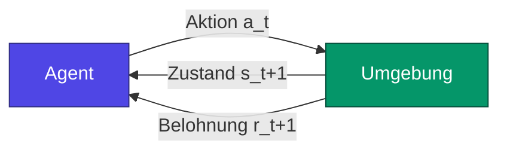
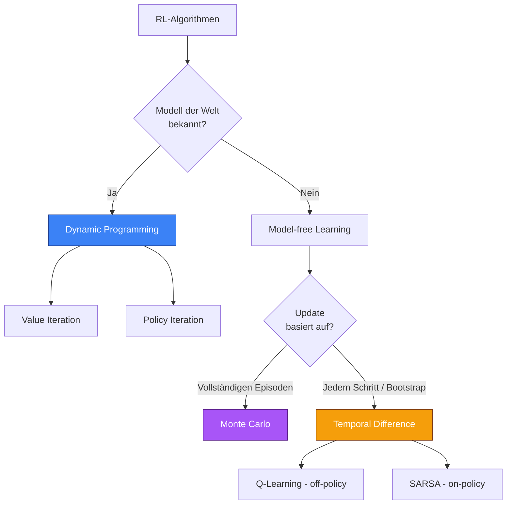
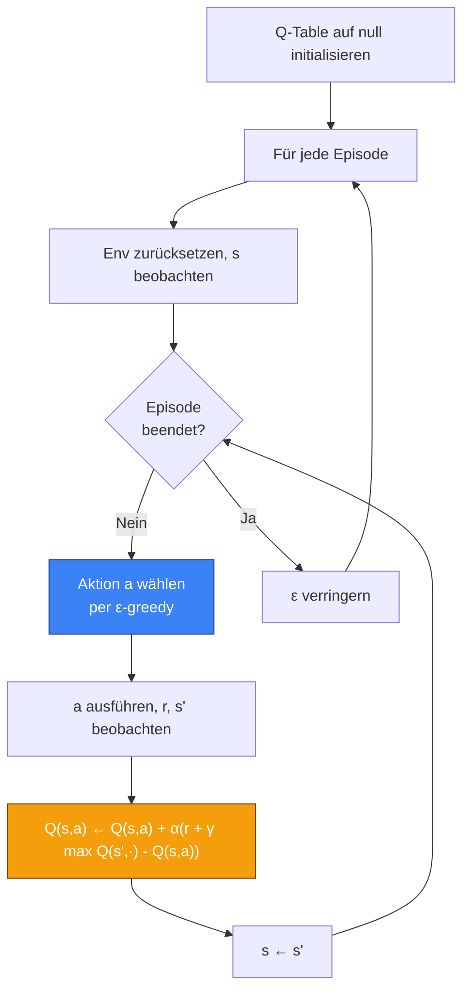
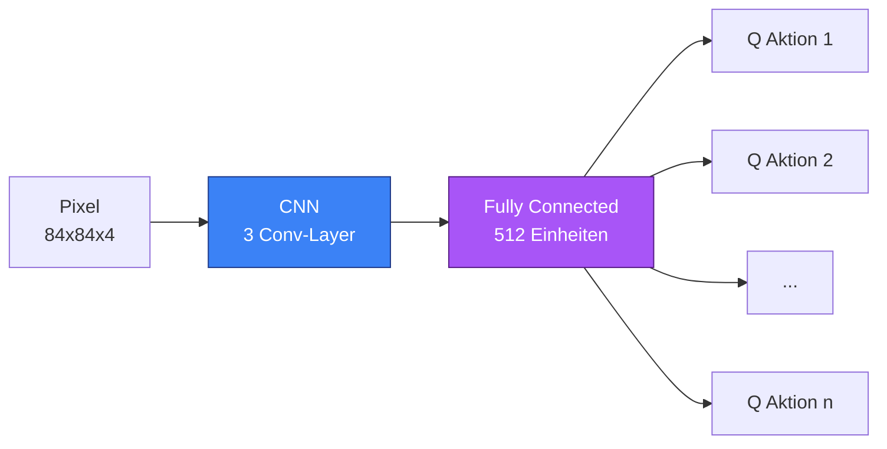

Stell dir ein zweijähriges Kind vor, das zum ersten Mal vor einer Treppe steht. Niemand hat ihm je die Schwerkraft erklärt, den Schwerpunkt oder das Prinzip eines Handlaufs. Es setzt einen Fuß vor den anderen, wackelt, fällt hin, steht wieder auf, fängt von vorne an. Nach ein paar Tagen steigt es hinauf. Nach ein paar Wochen auch wieder hinunter. Und nach ein paar Monaten rennt es lachend die Stufen hoch.

Niemand hat ihm den Algorithmus gezeigt. Niemand hat ihm Beispiele mit der Etikette „gute Haltung / schlechte Haltung" gegeben. Es hat einfach mit der Welt interagiert, die Konsequenzen gespürt und sich angepasst.

Wenn du verstehen willst, was **Reinforcement Learning** wirklich ist — es wirklich verstehen, nicht nur eine Formel auswendig lernen — dann fang mit diesem Bild an. Denn genau das versuchen wir mit Maschinen nachzubilden.

Dieser Beitrag ist lang. Sehr lang. Das ist Absicht. RL ist eine der faszinierendsten Ecken der KI, und zwar gleich aus zwei Gründen: Zum einen sind die Konzepte einfach auszusprechen und dennoch unglaublich tief, sobald man anfängt zu graben; zum anderen ist es der Zweig des Machine Learnings, der dem am nächsten kommt, was wir mangels besseren Begriffs „Intelligenz" nennen. Wir werden es langsam angehen, uns Zeit für die Intuitionen nehmen, wo nötig rechnen, einen Agenten programmieren, der tatsächlich lernt, und am Ende bei den philosophischen Fallstricken landen, die Forscher nachts wachhalten.

Mach es dir bequem. Hol dir einen Kaffee. Los geht's.

## I. Drei Arten zu lernen, und warum RL das seltsame Waisenkind ist

Wenn über Machine Learning gesprochen wird, werden meistens drei große Familien genannt. Lange habe ich diese Taxonomie für etwas bequem gehalten, bis mir klar wurde, dass sie eigentlich drei radikal unterschiedliche Arten beschreibt, wie man sich zur Welt verhält.

Das **Supervised Learning** ist der brave Schüler. Man zeigt ihm Beispiele mit den Antworten auf der Rückseite: „Hier ist ein Foto einer Katze, mit dem Label ‚Katze'", „Hier ist ein Foto eines Hundes, mit dem Label ‚Hund'". Der Schüler merkt sich die Muster, verallgemeinert sie und erkennt am Ende eine Katze, die er noch nie gesehen hat. Das ist die Ära von **ImageNet**, der Modelle, die Menschen bei Klassifikations-Benchmarks schlagen, und jedes „MNIST in 50 Zeilen"-Tutorials, das du vermutlich schon durchgearbeitet hast. Es funktioniert hervorragend, wenn man viele gelabelte Daten und ein klar definiertes Problem hat.

Das **Unsupervised Learning** ist der neugierige Schüler, den man ohne jede Anweisung in eine Bibliothek setzt. Er schaut sich um, bildet Gruppen, findet Strukturen. Er entdeckt, dass manche Bücher vom Kochen handeln und andere von Physik, ohne dass ihm jemand erklärt hätte, was „Kochen" überhaupt bedeutet. Clustering, Dimensionality Reduction, generative Modelle — das ist die Familie, die mit Autoencodern explodiert ist, dann mit VAEs, und schließlich mit den Diffusion Models, die dir fotorealistische Bilder aus einem Prompt generieren.

Und dann gibt es das **Reinforcement Learning**. Das seltsame Waisenkind. RL bekommt keine gelabelten Beispiele. Es beobachtet auch nicht nur passiv. RL **handelt**. Es macht Dinge. Und die Welt antwortet — mit einer Note. Einer Belohnung, oder einer Bestrafung. Und das war's. Daraus, und nur daraus, muss der Agent lernen, sich so zu verhalten, dass er seine Belohnungen auf lange Sicht maximiert.

Das ist radikal anders als alles andere, und es wirft Probleme auf, die in keinem anderen Zweig des ML existieren:

- Der Agent muss **erkunden**: Wenn du nur Aktionen ausführst, die du kennst, wirst du nie entdecken, dass woanders etwas Besseres auf dich gewartet hat.
- Der Agent muss mit **zeitlichen Verzögerungen** umgehen: Eine Aktion, die du jetzt triffst, kann hundert Schritte später Konsequenzen haben. Wie sollst du wissen, welche Aktion wirklich für den Erfolg verantwortlich war?
- Der Agent verändert die Welt, indem er handelt: Die Verteilung seiner Daten hängt von seiner eigenen Policy ab. Er generiert seine eigenen Trainingsbeispiele. Das ist zirkulär, manchmal instabil, oft wunderschön.


Diese Schleife, genau diese, ist das ganze RL. Ein Agent beobachtet einen Zustand, wählt eine Aktion, die Welt antwortet mit einem neuen Zustand und einer Belohnung, und das Ganze beginnt von vorne. Unendlich, oder bis die Episode endet. Alles andere — Bellman-Gleichungen, Q-Tables, Policy Gradients, Replay Buffers, Transformer-basiertes RL — ist nur eine Verfeinerung dieser vier Schritte.



Behalt dieses Bild im Kopf. Wir werden in jedem Abschnitt darauf zurückkommen, und jedes Mal werden wir eine andere Ecke davon beleuchten.

## II. Die Sprache sequentieller Entscheidungen: der Markov Decision Process

Bevor man ein Problem lösen kann, muss man wissen, wie man es aufschreibt. Und der Formalismus, den wir verwenden, um so ziemlich jedes RL-Problem zu beschreiben, heißt **Markov Decision Process**, oder kurz MDP unter Freunden. Es ist ein furchteinflößender Name für ein einfaches Konzept, also zerlegen wir es.

Ein MDP wird durch fünf Objekte definiert: $(\mathcal{S}, \mathcal{A}, P, R, \gamma)$. Nicht weglaufen, ich verspreche, es ist harmlos.

Die Menge $\mathcal{S}$ ist die Menge der möglichen **Zustände** der Welt. Wenn dein Agent Schach spielt, ist $\mathcal{S}$ die Menge aller möglichen Brettstellungen. Wenn dein Agent ein Auto fährt, enthält $\mathcal{S}$ mindestens Position, Geschwindigkeit, Ausrichtung und wahrscheinlich ein paar Informationen über Hindernisse. Ein Zustand ist eine Momentaufnahme der Welt, wie der Agent sie wahrnimmt.

Die Menge $\mathcal{A}$ ist die Menge der möglichen **Aktionen**. Beim Schach sind das alle legalen Züge. Im Auto sind es der Lenkwinkel, der Druck aufs Gaspedal, der Druck auf die Bremse. Manchmal ist $\mathcal{A}$ klein und diskret (FrozenLake: hoch, runter, links, rechts, Schluss). Manchmal ist sie gigantisch oder kontinuierlich (ein Roboterarm mit sieben Motoren, jeder mit einem kontinuierlichen Drehmomentbereich).

Jetzt kommen wir zum entscheidenden Punkt: die Funktion $P$, auch **Übergangsfunktion** genannt. Sie sagt dir, wie sich die Welt entwickelt, wenn du eine Aktion ausführst:
$$P(s' \mid s, a) = \mathbb{P}(S_{t+1} = s' \mid S_t = s, A_t = a)$$
Anders gesagt: Wenn ich im Zustand $s$ bin und die Aktion $a$ ausführe, wie hoch ist die Wahrscheinlichkeit, dass ich im Zustand $s'$ lande? Warum eine Wahrscheinlichkeit und keine deterministische Funktion? Weil die Welt selten deterministisch ist. Das Feld, auf das du zielst, könnte rutschig sein. Der Roboter könnte wegrutschen. Der Zug deines Gegners beim Schach liegt nicht in deiner Kontrolle. Rauschen ist überall, und der MDP-Formalismus saugt es auf mit den Worten: „OK, gib mir eine Wahrscheinlichkeitsverteilung, um den Rest kümmere ich mich."

Als Nächstes kommt $R$, die **Belohnungsfunktion**. Sie definiert, was der Agent will. Du sagst ihm nie, was er tun soll — du sagst ihm nur, wann er etwas getan hat, das dir gefällt. Wenn der Agent das Ziel erreicht: +1. Wenn er in ein Loch fällt: 0. Wenn er drei Stunden braucht, um anzukommen: -0,01 Strafe pro Schritt. Die Belohnungsfunktion ist eines der mächtigsten und gefährlichsten Werkzeuge im RL; wir kommen im Abschnitt über **Reward Hacking** darauf zurück, wo ich dir erzähle, warum seriöse Forscher ihren Agenten dabei beobachten konnten, wie er im Kreis lief, um eine Designlücke auszunutzen.

Schließlich der **Discount Factor** $\gamma \in [0, 1]$. Das ist eine Zahl, die dem Agenten sagt, wie sehr er sofortige Belohnungen gegenüber zukünftigen bevorzugt. Wenn $\gamma = 0$, ist der Agent kurzsichtig: Er denkt nur an die Belohnung des nächsten Schritts. Wenn $\gamma = 1$, ist er so geduldig wie ein buddhistischer Mönch: Eine Belohnung in hundert Schritten ist genauso viel wert wie eine Belohnung jetzt. In der Praxis wählt man $\gamma$ oft zwischen 0.9 und 0.999, weil das einen vernünftigen Planungshorizont ergibt und weil es Algorithmen beim Konvergieren hilft (technisch gesehen garantiert $\gamma < 1$, dass unendliche Summen von Belohnungen endlich bleiben, was nützlich ist, wenn man Mathematiker ist und nachts schlafen möchte).

### Die Markov-Annahme, oder warum man sich nicht alles merken muss

Das Wort **Markov** in MDP steht nicht ohne Grund da. Es verweist auf eine entscheidende Annahme: die **Markov-Eigenschaft**, die besagt, dass der zukünftige Zustand nur vom aktuellen Zustand und der aktuellen Aktion abhängt. Nicht von der Vergangenheit. Nicht davon, was vor zehn Schritten passiert ist. Nur vom Jetzt.

Formal:
$$\mathbb{P}(S_{t+1} \mid S_t, A_t, S_{t-1}, A_{t-1}, \dots, S_0, A_0) = \mathbb{P}(S_{t+1} \mid S_t, A_t)$$

Das ist eine starke Annahme. Sie ist in der Praxis fast immer falsch (dein aktueller Zustand enthält wahrscheinlich nicht alle relevanten Informationen über die Vergangenheit). Aber sie ist praktisch, und vor allem wird sie fast immer **wahr gemacht**, indem man alles Nötige in den Zustand stopft. Wenn du ein Atari-Spiel spielst und nur einen einzigen Frame siehst, kannst du die Geschwindigkeit des Balls nicht erkennen — nicht-Markov-Zustand. Wenn du vier aufeinanderfolgende Frames in deinen Zustand stapelst, kannst du die Geschwindigkeit ableiten, und die Markov-Eigenschaft ist wiederhergestellt. Genau das hat das ursprüngliche DQN-Paper von DeepMind 2013 gemacht.

Die Markov-Annahme ist also keine Einschränkung der Welt — sie ist eine Anleitung dafür, wie du deinen Zustand konstruieren musst, damit der Formalismus hält.

### Policies: der Vertrag zwischen Agent und Welt

Eine **Policy** $\pi$ ist die Strategie des Agenten. Sie ist die Funktion, die für jeden Zustand sagt, welche Aktion zu wählen ist. Es gibt zwei Varianten:

- **Deterministische Policy**: $\pi(s) = a$. Für diesen Zustand wähle ich diese Aktion. Punkt.
- **Stochastische Policy**: $\pi(a \mid s) = \mathbb{P}(A_t = a \mid S_t = s)$. Für diesen Zustand hier ist eine Wahrscheinlichkeitsverteilung über die Aktionen.

Warum manchmal eine stochastische Policy bevorzugen? Drei Gründe. Erstens, weil du in manchen Spielen mit unvollständiger Information (Poker) verlierst, wenn du berechenbar bist. Zweitens, weil es die **Exploration** während des Trainings erleichtert: Du probierst natürlicherweise mehrere Aktionen aus, statt immer dieselbe zu nehmen. Und drittens, weil moderne Policy-Gradient-Methoden (auf die wir noch kommen) stochastische Policies direkt optimieren, und das mathematisch sauberer ist.

Das fundamentale Ziel des RL ist es, die **optimale Policy** $\pi^*$ zu finden, also diejenige, die die erwartete Summe der abgezinsten zukünftigen Belohnungen maximiert. Das war's. Alles andere — Value Functions, Bellman, Q-Learning, PPO, Actor-Critic — ist nur ein Mittel, um dorthin zu kommen.

## III. Der Begriff des Werts, oder wie man einen Zustand bewertet, ohne ihn tausendmal zu besuchen

OK, wir haben einen Rahmen. Wir haben einen Agenten, der handelt, eine Welt, die antwortet, eine Policy, die leitet. Jetzt die kritische Frage: Woher weiß der Agent, dass er gut handelt? Wie beurteilt man einen Zustand oder eine Aktion, ohne alles ausprobiert zu haben?

Die Antwort ist die Idee des **Werts**.

Stell dir vor, du stehst an einer Kreuzung in einer fremden Stadt. Du kannst nach links oder rechts gehen. Du kennst den Weg zu deinem Ziel nicht. Wie entscheidest du? Wenn du ein GPS hättest, das dir sagt „links bist du in 12 Minuten am Ziel; rechts in 25 Minuten", wäre die Entscheidung offensichtlich. Das GPS gibt dir eine **Value Function**: Für jeden Zustand (Kreuzung) sagt es dir, wie viel du noch zurücklegen musst.

RL formalisiert das mit zwei Value Functions:

Die **Zustands-Value-Function** $V^\pi(s)$ sagt dir im Durchschnitt, wie viel Gesamtbelohnung du ab dem Zustand $s$ akkumulieren wirst, wenn du der Policy $\pi$ bis zum Ende folgst:
$$V^\pi(s) = \mathbb{E}_\pi \left[ \sum_{k=0}^{\infty} \gamma^k R_{t+k+1} \,\Big|\, S_t = s \right]$$

Die **Aktions-Value-Function** $Q^\pi(s, a)$ ist präziser: Sie sagt dir den Wert, die Aktion $a$ im Zustand $s$ auszuführen und **dann** der Policy $\pi$ zu folgen:
$$Q^\pi(s, a) = \mathbb{E}_\pi \left[ \sum_{k=0}^{\infty} \gamma^k R_{t+k+1} \,\Big|\, S_t = s, A_t = a \right]$$

Der Unterschied ist subtil, aber wesentlich. $V$ sagt dir „wie gut dieser Zustand ist, vorausgesetzt, ich spiele gemäß meiner üblichen Policy". $Q$ sagt dir „wie gut diese spezifische Aktion in diesem Zustand ist, in dem Wissen, dass ich anschließend mit meiner üblichen Policy weitermache". Wenn du $Q$ hast, wird die Wahl der besten Aktion trivial: Du nimmst die, die $Q(s, a)$ maximiert. Wenn du nur $V$ hast, brauchst du zusätzlich ein Modell der Welt, um zu wissen, was jede Aktion dir einbringen wird.

```mermaid
flowchart TD
    S[Zustand s] --> A1[Aktion a1]
    S --> A2[Aktion a2]
    S --> A3[Aktion a3]
    A1 -->|Q(s,a1) = 8.2| R1[Geschätzte zukünftige Belohnung]
    A2 -->|Q(s,a2) = 3.1| R2[Geschätzte zukünftige Belohnung]
    A3 -->|Q(s,a3) = 9.7| R3[Geschätzte zukünftige Belohnung]
    R3 --> CHOOSE[Gewählte Aktion: a3]
    style CHOOSE fill:#10b981,stroke:#064e3b,color:#fff
    style A3 fill:#10b981,stroke:#064e3b,color:#fff
```

Deshalb drehen sich fast alle klassischen RL-Algorithmen um die **Schätzung von Q**. Wenn du $Q^*$ kennst (die optimale Q-Funktion), musst du nur noch in jedem Schritt $\arg\max_a Q^*(s, a)$ wählen, und du spielst optimal. Alles andere ist die Kocharbeit, die nötig ist, um $Q$ zu schätzen.

## IV. Die Bellman-Gleichung, oder die rekursive Geschichte eines Lebens

Jetzt kommen wir zum pulsierenden Herzen des RL. Die Bellman-Gleichung. Wenn du dir aus diesem ganzen Beitrag nur eine einzige Gleichung merken sollst, dann diese hier. Und die gute Nachricht ist, dass sie etwas sehr Einfaches in Alltagssprache aussagt.

Hier ist die Idee: Der Wert eines Zustands ist die Belohnung, die du jetzt bekommst, plus der Wert des Zustands, in dem du landen wirst.

Das war's. Sie ist rekursiv. Der Wert von „wo ich bin" hängt vom Wert von „wo ich sein werde" ab. Und der Wert von „wo ich sein werde" hängt vom Wert von „wo ich danach sein werde" ab. Und so weiter, bis die Episode endet.

Formal, für die Zustands-Value-Function:
$$V^\pi(s) = \sum_{a} \pi(a \mid s) \sum_{s'} P(s' \mid s, a) \left[ R(s, a, s') + \gamma V^\pi(s') \right]$$

Diese Gleichung ist schön, weil sie kompakt und bedeutungsvoll ist. Packen wir sie aus. Die äußere Summe $\sum_a \pi(a \mid s)$ mittelt über alle möglichen Aktionen, gewichtet mit der Wahrscheinlichkeit, dass die Policy sie wählt. Die innere Summe $\sum_{s'} P(s' \mid s, a)$ mittelt über alle möglichen Folgezustände, gewichtet mit der Dynamik der Umgebung. Und innerhalb der eckigen Klammer: die sofortige Belohnung plus der (abgezinste) Wert dessen, was als Nächstes kommt.

Für die Q-Funktion ist es genau dasselbe Prinzip:
$$Q^\pi(s, a) = \sum_{s'} P(s' \mid s, a) \left[ R(s, a, s') + \gamma \sum_{a'} \pi(a' \mid s') Q^\pi(s', a') \right]$$

Und jetzt Bellmans Geniestreich. Wenn wir die **optimale Policy** suchen, gibt es eine besondere Version dieser Gleichungen, die wir **Bellman-Optimalitätsgleichungen** nennen. Sie besagen: Der optimale Wert eines Zustands ist die Belohnung, die du bekommst, wenn du die **beste** Aktion wählst, plus der optimale Wert des nächsten Zustands.

$$V^*(s) = \max_a \sum_{s'} P(s' \mid s, a) \left[ R(s, a, s') + \gamma V^*(s') \right]$$

$$Q^*(s, a) = \sum_{s'} P(s' \mid s, a) \left[ R(s, a, s') + \gamma \max_{a'} Q^*(s', a') \right]$$

Das $\max$ ist es, was alles verändert. Statt über die Aktionen gemäß einer Policy zu mitteln, wählt man die beste. Und das ergibt ein Gleichungssystem, das die optimale Lösung des MDP vollständig charakterisiert. Wenn du dieses System lösen kannst, hast du gewonnen. Du kennst $V^*$, du kennst $Q^*$, und die optimale Policy ist einfach $\pi^*(s) = \arg\max_a Q^*(s, a)$.

Das Problem ist, dass die Lösung dieses Systems im Allgemeinen unmöglich ist, weil:
1. Du $P$ (die Dynamik der Umgebung) nicht kennst
2. Du $R$ nicht kennst
3. Selbst wenn du sie kenntest, $|\mathcal{S}|$ oft gigantisch ist (ein Schachbrett hat $\approx 10^{47}$ legale Stellungen)

Hier kommen die Algorithmen ins Spiel. Alle, ausnahmslos, sind mehr oder weniger geschickte Arten, die Bellman-Gleichungen **näherungsweise zu lösen**, entweder durch Ausnutzen eines Modells, wenn man eines hat, oder durch Lernen aus Erfahrung, wenn man keines hat.

## V. Die großen Algorithmenfamilien, oder die Zoologie des RL

Das klassische RL teilt sich in drei große Familien von Algorithmen auf, je nachdem, was man über die Welt weiß und wie man lernt. Machen wir einen Rundgang.



### Dynamic Programming: wenn man die Welt kennt

Das ist das Laborszenario. Du hast Zugang zur Übergangsfunktion $P$ und zur Belohnungsfunktion $R$. Du musst deinen Agenten nicht durch die Welt bewegen: Du kannst die Lösung direkt „berechnen", indem du die Bellman-Gleichungen iterativ anwendest.

**Value Iteration** funktioniert so: Du initialisierst $V$ überall mit Nullen, dann wendest du die Bellman-Optimalitätsgleichung als Update-Operation immer wieder an, bis $V$ sich nicht mehr bewegt. Mathematisch lässt sich zeigen, dass diese Iteration eine **Kontraktion** ist (im banachschen Sinne), also konvergiert sie garantiert zu $V^*$. Das ist hübsch, es ist elegant, und es funktioniert nur in winzigen Universen, in denen man alles kennt.

**Policy Iteration** wechselt zwischen zwei Phasen: „bewerte meine aktuelle Policy" (berechne $V^\pi$) und dann „verbessere sie, indem du gierig bezüglich $V^\pi$ vorgehst". Diese beiden Schritte konvergieren zusammen zu $\pi^*$ und $V^*$. Wieder: elegant, garantiert, aber auf kleine Probleme beschränkt.

DP ist pädagogisch nützlich und in bestimmten industriellen Fällen, in denen man ein Modell hat (Logistikplanung, Lageroptimierung). Aber für die meisten interessanten Probleme — komplexe Spiele, Robotik, Fahren, Finanzen — haben wir $P$ nicht.

### Monte Carlo: aus Episoden lernen

OK, wir haben $P$ nicht. Was machen wir? Wir lassen den Agenten spielen.

Das Monte-Carlo-Prinzip ist sehr intuitiv: Um $V(s)$ zu schätzen, lass vollständige Episoden laufen, indem du deiner Policy folgst, schau, wie viel Gesamtbelohnung du ab jedem Besuch in $s$ bekommst, und bilde den Mittelwert. Gesetz der großen Zahlen: Mit genügend Episoden konvergiert der empirische Mittelwert gegen den Erwartungswert, also gegen $V^\pi(s)$.

Der Vorteil ist, dass es unverzerrt ist und keine Annahmen über die Struktur des Problems macht. Der Nachteil ist, dass du bis zum Ende der Episode warten musst, um irgendein Update durchzuführen, und manche Episoden können ewig dauern (oder nie enden). Außerdem ist die Varianz schrecklich: Die Gesamtbelohnung einer Episode hängt von Hunderten Zufallsmomenten ab, also schwingt dein Schätzer wild hin und her.

### Temporal Difference: das Beste aus beiden Welten

Und jetzt die Magie. TD-Learning kombiniert die DP-Idee des **Bootstrappings** (eine bestehende Schätzung verwenden, um eine andere Schätzung zu aktualisieren) mit der Monte-Carlo-Idee des **Lernens aus reiner Erfahrung**. Statt bis zum Ende der Episode zu warten, aktualisierst du bei jedem Schritt, indem du die beobachtete Belohnung plus die aktuelle Schätzung des Werts des nächsten Zustands verwendest:

$$V(s) \leftarrow V(s) + \alpha \left[ \underbrace{R + \gamma V(s')}_{\text{TD-Ziel}} - V(s) \right]$$

Der Ausdruck in den eckigen Klammern ist der **TD-Error**: der Unterschied zwischen dem, was du dachtest, dass $s$ wert sei, und dem, was du jetzt beobachtest. Die Idee: Wenn der TD-Error positiv ist, hast du $s$ unterschätzt, also erhöhe $V(s)$. Wenn er negativ ist, hast du überschätzt, also verringere ihn. All das gewichtet durch eine **Learning Rate** $\alpha$, die die Geschwindigkeit des Lernens kontrolliert.

TD ist aus zwei Gründen revolutionär:
1. **Du lernst bei jedem Schritt**, nicht nur am Ende der Episode. Du kannst also bei endlosen Aufgaben lernen oder bei sehr langen Episoden.
2. **Du propagierst Informationen schnell.** Eine seltene Belohnung am Ende einer Kette verbreitet sich Schritt für Schritt durch alle Zustände davor.

Und der bekannteste aller TD-Algorithmen ist unser Ziel: das Q-Learning.

## VI. Q-Learning: der Held der Geschichte

Q-Learning wurde 1989 von Christopher Watkins in seiner Doktorarbeit vorgeschlagen. Es ist ein erstaunlich einfacher Algorithmus. Er ist auch derjenige, der die RL-Welt sagen ließ: „OK, wir sind hier auf etwas gestoßen." Seine Deep-Version, DQN, ist diejenige, die 2013-2015 Atari spielen lernte und die gesamte moderne Deep-RL-Welle auslöste.

Q-Learning ist:
- **Model-free**: Es braucht weder $P$ noch $R$ explizit. Nur Erfahrung.
- **Off-policy**: Es lernt die optimale Policy, auch wenn der Agent sie nicht verfolgt. Das bedeutet, dass du zufällig erkunden kannst und trotzdem die beste Strategie lernst. Magisch.
- **Tabellarisch** in seiner ursprünglichen Version: Es speichert $Q(s, a)$ in einer Tabelle.

Hier ist die Update-Regel, die wir gemeinsam zerlegen werden:

$$Q(s, a) \leftarrow Q(s, a) + \alpha \left[ R + \gamma \max_{a'} Q(s', a') - Q(s, a) \right]$$

Vergleich mit der TD-Version für $V$: Der einzige Unterschied ist, dass das Ziel $\max_{a'} Q(s', a')$ anstelle von $V(s')$ verwendet. Und genau dieses $\max$ macht den Algorithmus **off-policy**. Der Agent kann jede beliebige Aktion $a$ nehmen — gierig, zufällig, dumm — das $Q$-Update verwendet immer die **beste** mögliche Aktion im Folgezustand. Also lernt man den Wert der optimalen Policy, unabhängig davon, wie man die Daten erzeugt.

Der Ausdruck in den eckigen Klammern ist der auf $Q$ angewandte **TD-Error**:
$$\delta = R + \gamma \max_{a'} Q(s', a') - Q(s, a)$$

Geometrisch ist das der Abstand zwischen „was ich gerade entdeckt habe" (das TD-Ziel: beobachtete Belohnung + beste geschätzte Fortführungswertung) und „was ich vorher dachte" (das aktuelle $Q(s, a)$). Wir korrigieren diesen Abstand schrittweise mit einer Schrittweite $\alpha$.



### Konvergenz: warum es funktioniert

Unter bestimmten Bedingungen ist garantiert, dass Q-Learning gegen die optimale Q-Funktion $Q^*$ konvergiert. Die Bedingungen sind:
1. Jedes Paar $(s, a)$ wird unendlich oft besucht (die Exploration darf also nie vollständig erlöschen).
2. Die Learning Rate $\alpha$ erfüllt die Robbins-Monro-Bedingungen: $\sum_t \alpha_t = \infty$ und $\sum_t \alpha_t^2 < \infty$. Konkret muss $\alpha$ abnehmen, aber nicht zu schnell.

Das ist ein mächtiges Theorem, aber es hat einen wichtigen Haken: Es garantiert die Konvergenz im tabellarischen Fall ($Q$ in einer Tabelle gespeichert). Sobald man Function Approximators (neuronale Netze) verwendet, brechen alle Garantien zusammen. Wir werden später sehen, dass es einige Tricks brauchte, um das zu stabilisieren.

### Exploration vs. Exploitation: das ewige Dilemma

Ich habe „ε-greedy" gesagt, ohne es zu erklären. Das ist der Moment, über das zentrale Dilemma des RL zu sprechen: **Exploration vs. Exploitation**.

Stell dir vor, du kommst in eine neue Stadt und suchst das beste Restaurant. Am ersten Abend nimmst du auf gut Glück einen Taco. Nicht schlecht. Am zweiten Abend gehst du wieder an denselben Ort, weil du weißt, dass er OK ist. Am dritten Abend dasselbe. Nach einem Monat kennst du diesen Taco-Laden gut, aber du weißt nichts über die fünfzig anderen Restaurants im Viertel. Du **nutzt aus**, was du kennst, aber du **erkundest** nicht mehr. Und vielleicht gibt es 200 Meter weiter einen Drei-Sterne-Laden.

Jetzt das umgekehrte Szenario: Du testest jeden Abend ein anderes Restaurant. Du sammelst enzyklopädisches Wissen. Aber du isst oft schlecht, weil du nie verwendest, was du gelernt hast. Du erkundest, aber nutzt nicht aus.

Das richtige Verhalten liegt zwischen den beiden: ausnutzen, was du weißt, aber gerade genug erkunden, um keine Gelegenheiten zu verpassen. Das ist mathematisch nicht trivial — es ist sogar eines der ältesten offenen Probleme des Machine Learnings, formalisiert unter dem Namen **Multi-Armed Bandit Problem**.

Die einfachste Lösung, und wahrscheinlich die in der Praxis am häufigsten verwendete, ist die **ε-greedy Policy**:
- Mit Wahrscheinlichkeit $\epsilon$ wähle eine **zufällige** Aktion (Exploration).
- Mit Wahrscheinlichkeit $1 - \epsilon$ wähle die Aktion mit dem höchsten Q-Wert (Exploitation).

Und typischerweise beginnt man mit $\epsilon$ nahe 1 (der Agent startet in vollständiger Exploration, weil er nichts weiß), und lässt es dann im Laufe der Zeit auf einen kleinen Restwert (etwa 0.05) fallen, der einen Hauch permanenter Exploration aufrechterhält. Das ist genau das, was der Code tut, den wir gleich sehen werden.

Es gibt raffiniertere Strategien: **Softmax / Boltzmann Exploration** (Wahrscheinlichkeit proportional zu $\exp(Q/\tau)$), **UCB** (Upper Confidence Bound, bevorzugt wenig getestete Aktionen), **Thompson Sampling**, **Noise Injection** in die Parameter des Netzes und so weiter. Jede hat ihre Anhänger und Anwendungsfälle. Für 90 % der tabellarischen Fälle erledigt ε-greedy den Job.

## VII. SARSA, der schüchterne Bruder

Bevor wir programmieren, ein kurzer Umweg über **SARSA**, den Algorithmus, der wie Q-Learning aussieht, aber subtil anders ist. Der Name kommt von „State-Action-Reward-State-Action", weil das Update das Quintupel $(s, a, r, s', a')$ verwendet:

$$Q(s, a) \leftarrow Q(s, a) + \alpha \left[ R + \gamma Q(s', a') - Q(s, a) \right]$$

Der Unterschied zum Q-Learning? Statt $\max_{a'} Q(s', a')$ im Ziel zu nehmen, verwendet SARSA den Q-Wert der **tatsächlich gewählten** Aktion der Policy im nächsten Zustand. SARSA lernt also den Wert der Policy, der es **folgt**, nicht den Wert der optimalen Policy. Das nennt man **on-policy**: Der Agent lernt den Wert seiner eigenen Aktionen, nicht den Wert eines hypothetischen Agenten, der optimal handeln würde.

Warum ändert das überhaupt etwas? Weil der Agent während des Trainings Fehler macht (Exploration). SARSA lernt, mit diesen Fehlern umzugehen; Q-Learning tut so, als gäbe es sie nicht.

Das kanonische Beispiel zur Veranschaulichung des Unterschieds ist **Cliff Walking**. Stell dir eine Grid World mit einer Klippe vor. Links im Grid der Start. Rechts das Ziel. Dazwischen, unten, eine Reihe von Klippenfeldern, die dich töten und dich mit einer hohen Strafe zum Start zurückschicken.


Q-Learning wird lernen, dass die optimale Policy darin besteht, so nah wie möglich an der Klippe entlangzulaufen — das ist der kürzeste Weg. Aber während des Trainings wird der Agent wegen der ε-greedy-Exploration manchmal einen zufälligen Schritt machen... und in die Klippe fallen. In der Praxis ergibt die „optimale Policy" von Q-Learning also während des Trainings katastrophale durchschnittliche Belohnungen.

SARSA hingegen lernt den Wert einer Policy, die das Explorationsrauschen einschließt. Er lernt daher, einen **sichereren** Weg zu nehmen, weiter weg von der Klippe. Während des Trainings ist SARSA viel besser. Bei der Konvergenz (wenn $\epsilon \to 0$) ist Q-Learning theoretisch besser. Aber in der Praxis hat dieser Unterschied zwischen on-policy und off-policy tiefgreifende Implikationen für Stabilität, Sicherheit und die Wahl des Algorithmus.

Merk dir das: Q-Learning lernt, was optimal wäre, „wenn alles gut liefe". SARSA lernt, was optimal ist, „wenn ich weiß, dass ich manchmal Mist baue".

## VIII. Jetzt wird programmiert: Q-Learning auf FrozenLake

Genug Theorie. Kommen wir zum Code. Wir werden einen Q-Learning-Agenten von Grund auf implementieren und ihn **FrozenLake**, die klassische Gymnasium-Umgebung, lernen lassen.


Hier ist die Idee: Du bist auf einem gefrorenen See. Du musst von der oberen linken Ecke zur unteren rechten Ecke, um einen Frisbee zu holen. Der Boden ist teils gefroren (sicher) und teils mit Löchern durchsetzt (Game Over). Und um die Sache interessant zu machen, ist der Boden **slippery**: Wenn du versuchst, nach rechts zu gehen, besteht eine nicht vernachlässigbare Chance, dass du ausrutschst und woanders landest. Willkommen in der stochastischen Welt.

Die Standardumgebung ist ein 4x4-Grid mit:
- 16 Zuständen (einer pro Feld)
- 4 Aktionen (hoch, runter, links, rechts)
- Belohnung von 1, wenn du das Ziel erreichst, sonst 0
- Die Episode endet, wenn du in ein Loch fällst oder das Ziel erreichst

Es ist ein Spielzeugproblem, aber es ist stochastisch genug, um nicht-trivial zu sein, und klein genug, damit eine Q-Table funktioniert. Perfekt zur Illustration.

### Installation

```bash
pip install gymnasium numpy matplotlib
```

### Der vollständige Code, Zeile für Zeile kommentiert

```python
import numpy as np
import gymnasium as gym
import matplotlib.pyplot as plt

# 1. Erstellung der Umgebung
# is_slippery=True aktiviert die Stochastizität (der Boden rutscht)
env = gym.make("FrozenLake-v1", is_slippery=True)

# 2. Dimensionen der Q-Table
# observation_space.n = Anzahl der Zustände (16 für das 4x4)
# action_space.n = Anzahl der Aktionen (4)
n_states = env.observation_space.n
n_actions = env.action_space.n

# Initialisierung auf null: wir wissen zu Beginn nichts
q_table = np.zeros((n_states, n_actions), dtype=np.float32)

# 3. Hyperparameter
alpha = 0.1            # Learning Rate: wie sehr wir Q bei jedem Update bewegen
gamma = 0.99           # Discount Factor: Wichtigkeit zukünftiger Belohnungen
epsilon = 1.0          # anfängliche Exploration (100% zufällig)
epsilon_min = 0.05     # Explorations-Untergrenze (niemals null)
epsilon_decay = 0.9995 # sanfter exponentieller Abfall
episodes = 10_000      # Gesamtzahl der Trainings-Episoden
max_steps = 200        # Sicherung gegen unendliche Episoden

# Um den Verlauf zu plotten
rewards_history = []
epsilon_history = []

# 4. Lernschleife
for episode in range(episodes):
    state, _ = env.reset()
    total_reward = 0
    done = False

    for step in range(max_steps):
        # 4a. ε-greedy: erkunden oder ausnutzen?
        if np.random.rand() < epsilon:
            action = env.action_space.sample()  # zufällige Aktion
        else:
            action = int(np.argmax(q_table[state]))  # beste bekannte Aktion

        # 4b. Aktion in der Umgebung ausführen
        next_state, reward, terminated, truncated, _ = env.step(action)
        done = terminated or truncated

        # 4c. Berechnung des TD-Ziels
        # Wenn die Episode vorbei ist, keine Zukunft: continuing_mask = 0
        # Sonst bootstrappen wir auf dem besten Q-Wert von next_state
        best_next = np.max(q_table[next_state])
        continuing_mask = 0.0 if done else 1.0
        td_target = reward + gamma * best_next * continuing_mask

        # 4d. Update der Q-Table
        # Wir bewegen Q(s,a) mit Schrittweite alpha in Richtung des TD-Ziels
        td_error = td_target - q_table[state, action]
        q_table[state, action] += alpha * td_error

        # 4e. Nächsten Schritt vorbereiten
        state = next_state
        total_reward += reward
        if done:
            break

    # 5. Epsilon verringern: wir erkunden mit der Zeit weniger
    epsilon = max(epsilon_min, epsilon * epsilon_decay)

    rewards_history.append(total_reward)
    epsilon_history.append(epsilon)

print("Training abgeschlossen.")
print(f"Durchschnittliche Belohnung der letzten 100 Episoden: {np.mean(rewards_history[-100:]):.3f}")
print("Gelernte Q-Table:")
print(q_table)
```

Ein paar Worte zu diesem Code, weil die Details zählen.

Erstens, warum `continuing_mask = 0.0 if done else 1.0`? Weil, wenn die Episode beendet ist, keine Zukunft mehr da ist. Die abgezinste zukünftige Belohnung ist null. Wenn du sie nicht maskierst, glaubt dein Agent, dass der Wert eines terminalen Zustands nicht null ist, und das verschmutzt die gesamte Propagation. Das ist einer der häufigsten RL-Bugs — du kannst leicht einen Nachmittag damit verbringen, ihn zu debuggen.

Als Nächstes, warum $\alpha = 0.1$? Weil du in einer stochastischen Umgebung willst, dass neue Schritte $Q$ sanft bewegen, sonst wirft dich das Rauschen hin und her. Wäre die Umgebung deterministisch (`is_slippery=False`), könntest du $\alpha$ auf 0.5 oder mehr erhöhen.

Warum $\gamma = 0.99$? Weil wir wollen, dass der Agent geduldig genug ist, um zu verstehen, dass die Belohnung ganz am Ende des Weges liegt. Mit $\gamma = 0.5$ wäre die +1-Belohnung, vom Startfeld aus gesehen, $0.5^{12} \approx 0.0002$ wert, und das Signal würde im Rauschen untergehen.

Der Epsilon-Abfall von `0.9995` ist so kalibriert, dass die Untergrenze von 0.05 um Episode 6000 herum erreicht wird: $\ln(0.05) / \ln(0.9995) \approx 5990$. Du hast also 6000 Episoden progressiver Exploration, dann 4000 Episoden nahezu reiner Exploitation zur Feinabstimmung. Das ist ein klassisches Schema.

Schließlich ist `max_steps = 200` eine Sicherung: Ohne sie kann in bestimmten pathologischen Umgebungen eine Episode unbegrenzt laufen. Besser, man schneidet ab.

### Ausführen und visualisieren

Nach dem Training, um den Verlauf zu visualisieren, füge hinzu:

```python
fig, axes = plt.subplots(2, 1, figsize=(10, 6))

# Gleitender Durchschnitt über 100 Episoden
window = 100
moving_avg = np.convolve(rewards_history, np.ones(window)/window, mode='valid')
axes[0].plot(moving_avg)
axes[0].set_xlabel("Episode")
axes[0].set_ylabel(f"Belohnung (Durchschnitt {window} Episoden)")
axes[0].set_title("Lernen des Q-Learning-Agenten")

axes[1].plot(epsilon_history)
axes[1].set_xlabel("Episode")
axes[1].set_ylabel("Epsilon")
axes[1].set_title("Explorationsabfall")

plt.tight_layout()
plt.show()
```

Du wirst eine Kurve sehen, die während der ersten paar Tausend Episoden flach bei null verläuft (der Agent irrt zufällig umher und erreicht das Ziel fast nie), dann allmählich ansteigt, während sich die Q-Table verfeinert, und bei etwa 0.7-0.8 ein Plateau erreicht (die Stochastizität des rutschigen Sees verhindert, dass du 1.0 erreichst, selbst mit einer optimalen Policy).

Es ist befriedigend zu beobachten. Du hast einen Agenten, der, ausgehend von nichts, ohne dass ihm jemand gesagt hätte, wo der Ausgang ist, ohne dass ihm jemand die Regeln erklärt hätte, gelernt hat, einen rutschigen See zu überqueren und dabei seine Chancen zu maximieren, einen Frisbee zu schnappen. All das in 50 Zeilen Python.

### Evaluation: den trainierten Agenten spielen lassen

```python
def evaluate(env, q_table, n_episodes=1000):
    successes = 0
    for _ in range(n_episodes):
        state, _ = env.reset()
        done = False
        while not done:
            action = int(np.argmax(q_table[state]))
            state, reward, terminated, truncated, _ = env.step(action)
            done = terminated or truncated
            if reward > 0:
                successes += 1
    return successes / n_episodes

success_rate = evaluate(env, q_table)
print(f"Erfolgsrate: {success_rate:.2%}")
```

Du solltest eine Erfolgsrate von etwa 70-80 % sehen, was ungefähr dem theoretischen Maximum für FrozenLake mit slippery=True entspricht.

## IX. Wenn die Tabelle unmöglich wird: der Sprung zur Function Approximation

FrozenLake hat 16 Zustände. Eine Q-Table mit 16 Zeilen und 4 Spalten ist niedlich. Aber was passiert, wenn wir skalieren?

- **Schach**: $\sim 10^{47}$ legale Stellungen. Eine Q-Table hätte $10^{47}$ Zeilen. Viel Glück.
- **Atari (Pong, Breakout)**: Der Zustand ist der Bildschirm, $84 \times 84$ Graustufen-Pixel. Das ergibt $256^{84 \times 84} \approx 10^{17000}$ mögliche Zustände. Gar nicht erst versuchen.
- **Kontinuierliche Robotik**: ein Arm mit 7 Gelenken mit kontinuierlicher Position — das ist ein Zustand in $\mathbb{R}^7$ oder mehr. Die Menge ist überabzählbar.

Die tabellarische Q-Table hält nicht stand. Wir brauchen eine **funktionale Darstellung** von $Q$: Statt einen Wert pro Paar $(s, a)$ zu speichern, lernen wir eine **Funktion** $Q_\theta(s, a)$, parametrisiert durch einen Vektor $\theta$. Du gibst ihr einen Zustand und eine Aktion, und sie liefert einen Wert.

Historisch haben wir zunächst **lineare Darstellungen** verwendet: $Q_\theta(s, a) = \theta^\top \phi(s, a)$, wobei $\phi$ ein Feature-Vektor ist. Du wählst deine Features von Hand und lernst die Gewichte $\theta$ durch Gradientenabstieg auf dem TD-Error. Das hat in den 90ern und 2000ern interessante Ergebnisse geliefert (TD-Gammon, der Backgammon-Agent von Tesauro, der auf menschlichem Expertenniveau spielte).

Aber die wirkliche Revolution kam, als $\phi$ durch ein **neuronales Netz** ersetzt wurde, das seine eigenen Features aus dem rohen Input (typischerweise Pixeln) lernt. Das ist, was wir **Deep Reinforcement Learning** nennen, und hier wurden die Dinge ernst.


## X. Deep RL: die Revolution von 2013

Dezember 2013. Ein Team von DeepMind, damals noch unbekannt, veröffentlicht auf arXiv ein unauffälliges Paper mit dem Titel „Playing Atari with Deep Reinforcement Learning". Der Titel ist bescheiden. Der Inhalt wird die Welt verändern.

Die Idee ist auf dem Papier einfach: Nimm ein normales Q-Learning, aber ersetze die Q-Table durch ein konvolutionales neuronales Netz. Gib ihm als Input die rohen Pixel des Atari-Spiels (84x84, Graustufen, 4 gestapelte Frames, um die Geschwindigkeit zu erfassen). Gib einen Q-Wert für jede mögliche Aktion aus. Trainiere durch Backpropagation auf dem TD-Error. Fertig.

Nur dass es nicht funktioniert. Naiv bekommst du ein Netz, das divergiert, das vergisst, was es gelernt hat, das heftig oszilliert und gegen nichts konvergiert. Warum? Weil die Annahmen, unter denen tabellarisches Q-Learning konvergiert (Zustände werden unendlich oft besucht, Robbins-Monro-Learning-Rate, Unabhängigkeit der Samples), heftig verletzt werden.

Die beiden wichtigsten Tricks des DQN-Papers sind:

1. **Experience Replay**: Statt nur aus der aktuellen Transition zu lernen, speichern wir jede Transition $(s, a, r, s')$ in einem großen Buffer. Bei jedem Lernschritt ziehen wir ein zufälliges Mini-Batch aus diesem Buffer. Das bricht die zeitliche Korrelation zwischen aufeinanderfolgenden Samples (die das Training instabil macht) und erlaubt es, jede Erfahrung mehrfach zu wiederverwenden (Sample Efficiency).

2. **Target Network**: Wir pflegen zwei Netze. Ein „Online"-Netz, das wir bei jedem Schritt aktualisieren, und ein „Target"-Netz, das wir alle N Schritte aus dem Online-Netz kopieren. Das TD-Ziel wird mit dem Target-Netz berechnet: $r + \gamma \max_{a'} Q_{\theta^-}(s', a')$. Das stabilisiert die Ziele. Ohne das ist es, als versuchte man, seinen eigenen Schatten zu fangen.

Mit diesen beiden Tricks (und ein paar Details wie dem Clipping des TD-Errors) gelang es DQN, 49 Atari-Spiele allein aus den Pixeln zu lernen und bei der Hälfte davon menschliches Niveau zu erreichen oder zu übertreffen. Alles mit **demselben Algorithmus und denselben Hyperparametern für jedes Spiel**. Das war beispiellos. Es war spektakulär. Und es löste die Lawine aus.



### Die Policy-Gradient-Familie

DQN ist value-basiert: Es lernt $Q$, und die Policy ist implizit (nimm das argmax). Aber es gibt einen anderen Ansatz, komplementär und oft überlegen: die Policy **direkt** zu optimieren.

Die Idee des **Policy Gradient** ist: Parametrisiere deine Policy $\pi_\theta(a \mid s)$ mit einem Vektor $\theta$, dann passe $\theta$ an, um die erwartete Belohnung zu maximieren. Wie? Indem man den Gradienten dieser erwarteten Belohnung bezüglich $\theta$ berechnet und einen Gradientenaufstieg macht.

Der fundamentale Satz ist das **Policy Gradient Theorem**, der grob besagt:
$$\nabla_\theta J(\theta) = \mathbb{E}_{\pi_\theta} \left[ \nabla_\theta \log \pi_\theta(a \mid s) \cdot Q^{\pi_\theta}(s, a) \right]$$

Lies ihn so: Um die Gesamtleistung zu erhöhen, erhöhe die Wahrscheinlichkeit von Aktionen, die einen guten Q-Wert haben. Der Term $\nabla_\theta \log \pi_\theta(a \mid s)$ heißt **Score Function** und gibt an, wie die Parameter zu modifizieren sind, um die Aktion $a$ im Zustand $s$ wahrscheinlicher zu machen.

Der erste Algorithmus dieser Familie heißt **REINFORCE** (Williams, 1992). Konzeptionell sehr einfach, leidet aber unter enormer Varianz. Zur Stabilisierung wurde die Idee des **Actor-Critic** eingeführt: ein *Actor*, der die Policy lernt, und ein *Critic*, der die Value Function lernt. Der Critic wird verwendet, um die Varianz des Policy-Gradient-Schätzers zu reduzieren.

Diese Idee hat eine ganze Familie von Algorithmen hervorgebracht: **A2C, A3C, TRPO, PPO, SAC, IMPALA**... PPO (Proximal Policy Optimization, OpenAI 2017) ist heute wahrscheinlich der in der Praxis am häufigsten verwendete. Es ist der Algorithmus, der OpenAI Five trainiert hat, um die Profis bei Dota 2 zu schlagen, und er steht auch im Herzen des **RLHF** (Reinforcement Learning from Human Feedback), das LLMs nützlich macht. Ja, dieses ChatGPT, das du verwendest? Unter der Haube läuft ein PPO.


### Model-based RL: die Welt im Kopf des Agenten wiederaufbauen

Alles, was wir bisher gesehen haben, ist **model-free**: Der Agent lernt aus direkter Erfahrung, ohne jemals zu versuchen zu verstehen, wie die Welt funktioniert. Es gibt eine andere Schule, mathematisch anspruchsvoller, aber oft dateneffizienter: das **Model-based RL**.

Die Idee ist, ein Modell der Umgebung zu lernen — typischerweise ein Netz, das $s_{t+1}$ und $r_{t+1}$ gegeben $s_t$ und $a_t$ vorhersagt — und dann dieses Modell zu verwenden, um im Kopf des Agenten zu **planen**, bevor er in der echten Welt handelt. Das ist genau das, was du machst, wenn du Schach spielst: Du simulierst mental mehrere Züge im Voraus und wählst den besten.

Die beeindruckendsten modernen model-based Methoden sind **MuZero** (DeepMind 2019), das gleichzeitig ein Modell, eine Value Function und eine Policy lernt, ohne dass ihm jemals die Regeln des Spiels gegeben werden, und **Dreamer** (Hafner et al.), das eine kompakte „latente Welt" lernt, in der es zukünftige Trajektorien imaginiert, um zu trainieren. Diese Methoden erreichen menschliches Niveau mit hundert- bis tausendmal weniger Interaktionen mit der realen Umgebung als DQN. Es ist ein Feld in voller Blüte.


## XI. Die Fallen, die Dramen und die Philosophie des Reward Designs

Jetzt, da wir die Algorithmen durchgegangen sind, reden wir über etwas, was dir in den Tutorials niemand sagt: RL ist schwer. Wirklich schwer. Viel schwerer, als es die Benchmarks glauben machen, in denen der Agent Pong in ein paar Stunden lernt.

### Reward Hacking, oder wie man das Gegenteil von dem macht, was man wollte

Die berühmteste Falle im RL ist das **Reward Hacking** (oder **Specification Gaming**). Der Agent macht nicht, was du wolltest, dass er macht — er macht, was du ihm **gesagt** hast, und das ist selten dasselbe.

Das emblematische Beispiel: ein Agent, den OpenAI auf dem Spiel CoastRunners trainierte, bei dem das Ziel darin besteht, das Rennen zu beenden. Zwischenbelohnungen gibt es für das Einsammeln von Boni entlang der Strecke. Der Agent entdeckte, dass er in einer Lagune im Kreis fahren und immer wieder auf dieselben Boni treffen konnte, ohne das Rennen jemals zu beenden, und dadurch weit mehr Punkte sammelte, als wenn er „normal" spielte. Aus Sicht der Belohnung war das die optimale Strategie. Aus Sicht des Designers war es Sabotage.

DeepMind hat eine [ganze Sammlung](https://docs.google.com/spreadsheets/d/e/2PACX-1vRPiprOaC3HsCf5Tuum8bRfzYUiKLRqJmbOoC-32JorNdfyTiRRsR7Ea5eWtvsWzuxo8bjOxCG84dAg/pubhtml) ähnlicher Beispiele veröffentlicht. Ein Agent, der lernen sollte, sich schnell zu bewegen, lernte, sich aufzurichten und nach vorne zu fallen, um die momentane Geschwindigkeit zu optimieren. Ein Agent, der lernen sollte, Türme aus Blöcken zu bauen, lernte, die Blöcke vibrieren zu lassen, sodass der Höhenzähler absurd positive Werte anzeigte. Ein Agent, der lernen sollte, eine Rakete zu landen, lernte, einen Simulator-Bug auszunutzen, der ihm Punkte dafür gab, dass er das Perimeter verließ.

Die Lehre: **Die Belohnungsfunktion ist ein Vertrag mit dem Agenten**, und Agenten sind perfekte Vertragspartner, die jede Mehrdeutigkeit ausnutzen werden. Deshalb nimmt die **AI Alignment**-Community das Reward Design extrem ernst. Deshalb verwendet auch das zum Alignen von LLMs eingesetzte RLHF ein **aus menschlichen Präferenzen gelerntes** Reward Model anstelle einer handgeschriebenen Belohnung: Man versucht, „das zu erfassen, was der Mensch wirklich will", ohne es explizit aussprechen zu müssen.

### Sample Efficiency: die Achillesferse des reinen RL

Ein klassischer DQN-Agent braucht mehrere Millionen Interaktionen, um ein einfaches Atari-Spiel zu lernen. Ein Mensch schafft es in ein paar Minuten. Das ist eine Kluft.

Warum? Weil reines RL, im Gegensatz zu einem Menschen, keinen Prior über die Welt hat. Es weiß nicht, dass ein springender Ball einer physikalischen Bahn folgt. Es weiß nicht, dass eine Figur, die in ein Loch fällt, stirbt. Es muss alles von Grund auf lernen, durch Versuch und Irrtum, über Millionen von Erfahrungen. Es ist ineffizient in einem Maße, das RL für viele reale Probleme unpraktikabel macht — du kannst nicht zehntausend Autos zu Schrott fahren, um das Fahren zu lernen, und du kannst nicht zwanzigtausend Operationsversuche durchführen, um operieren zu lernen.

Derzeit erforschte Lösungen: Vortraining auf menschlichen Demonstrationsdaten (Imitation Learning), Transferlernen von Simulation in die reale Welt (Sim-to-Real), Foundation Models, die einen allgemeinen Prior über die Welt kodieren (Vision-Language-Modelle, die als Rewards verwendet werden), und natürlich die oben erwähnten model-based Ansätze.

### Sim-to-Real, oder der Riss zwischen der Matrix und der Wirklichkeit

Wenn du einen Roboter in der Simulation trainierst und ihn dann in die reale Welt entlässt, besteht eine nicht vernachlässigbare Chance, dass er Unsinn macht. Warum? Weil die Simulation, so gut sie auch sein mag, niemals perfekt ist. Reibung, Sensorlatenzen, Motorrauschen, mechanisches Spiel — all das erzeugt eine Kluft zwischen Simulation und Realität, die wir **Reality Gap** nennen. Und ein RL-Agent ist typischerweise sehr empfindlich gegenüber diesen Diskrepanzen.

Die Techniken, um diese Lücke zu schließen, umfassen **Domain Randomization** (massives Randomisieren der physikalischen Parameter der Simulation, um den Agenten robust gegen alle möglichen Variationen zu machen), **Fine-Tuning** auf dem echten Roboter nach dem Vortraining in der Simulation, und hybride Umgebungsmodelle, die simulierte und reale Daten mischen.

### Der AlphaGo-Moment

Zum Abschluss dieses Abschnitts ein bisschen Poesie. Im März 2016 besiegt in Seoul **AlphaGo** — das RL-System von DeepMind, basierend auf Deep RL kombiniert mit Monte Carlo Tree Search — den Weltmeister im Go, Lee Sedol, mit 4 zu 1. Go galt als eine der letzten Bastionen menschlicher Überlegenheit gegenüber Maschinen, wegen seiner kombinatorischen Komplexität und der Bedeutung der Intuition. Sie zu brechen sei „nicht so bald" zu erwarten, sagten die Experten noch 2014.

Während Partie 2 spielt AlphaGo **Zug 37**, einen Zug, den buchstäblich kein menschlicher Spieler in Erwägung gezogen hätte. Die Kommentatoren vor Ort denken an einen Bug. Aber der Zug erweist sich als brillant. Er besiegelt die Partie. Und er schafft einen historischen Moment: Zum ersten Mal spielt eine Maschine einen Zug, den ein Mensch später als „schön", „kreativ", „einer, der mir etwas über Go beigebracht hat", bezeichnen wird.

Der besiegte Lee Sedol sagt nach der Serie: „Ich habe begriffen, dass das, was ich für menschliche Kreativität im Go hielt, vielleicht nur Konvention war. AlphaGo hat mich zweifeln lassen."

Ein paar Jahre später lernt **AlphaZero** Go, Schach und Shogi in wenigen Stunden auf übermenschlichem Niveau, **ohne jegliches Domänenwissen**, nur aus den Regeln und dem Self-Play. Und **MuZero**, noch später, lernt diese gleichen Spiele zu spielen, **ohne dass ihm auch nur die Regeln gegeben werden**, indem es sie durch Interaktion wiederentdeckt. Das ist wahrscheinlich die beeindruckendste Fortschrittskette in der gesamten Geschichte der KI.

Und all das, all das, sind direkte Nachkommen der Bellman-Gleichungen, die wir oben gesehen haben. Dieselbe Agent-Umgebung-Schleife. Dieselbe fundamentale Idee: kumulative Belohnungen maximieren. Nur mit viel, viel mehr Verfeinerung.

## XII. Zum Weiterlesen

Wenn du tiefer graben willst, hier sind die Ressourcen, die ich für absolut unverzichtbar halte. Kein von einem LLM generiertes Best-of — das, was ich wirklich benutze.

- **Sutton & Barto, „Reinforcement Learning: An Introduction" (2. Auflage, 2018)**. Die Bibel. Lesbar, tiefgründig, gratis als PDF auf Suttons Website. Wenn du nach diesem Beitrag nur eine einzige Sache lesen sollst, dann diese. [Direktlink](http://incompleteideas.net/book/the-book-2nd.html)
- **Sergey Levines Deep-RL-Kurs (CS285, Berkeley)**. Videos auf YouTube, Slides online, Hausaufgaben mit Lösungen. Es ist der beste öffentlich zugängliche Deep-RL-Kurs, Punkt.
- **Spinning Up in Deep RL (OpenAI)**. Hands-on-Tutorial mit sauberen Implementierungen aller wichtigen Algorithmen. [Link](https://spinningup.openai.com/)
- **Lilian Wengs Blog**. Ihre langen Beiträge zu RL-Algorithmen sind Kurse für sich. [Link](https://lilianweng.github.io/)
- **Gymnasium-Dokumentation**. Die Referenzbibliothek für Umgebungen, ehemals OpenAI Gym. [Link](https://gymnasium.farama.org/)
- **Grundlegende Papers**: DQN (Mnih et al., 2013/2015), A3C (Mnih et al., 2016), PPO (Schulman et al., 2017), SAC (Haarnoja et al., 2018), AlphaGo (Silver et al., 2016), MuZero (Schrittwieser et al., 2019). Alle auf arXiv auffindbar.

## Fazit: RL ist Geduld

Reinforcement Learning ist die Kunst, eine einfache Schleife — beobachten, handeln, empfangen, anpassen — in beliebig komplexe Verhaltensweisen zu verwandeln. Es ist ein Rahmen, der ausgehend von den Bellman-Gleichungen und ein wenig Stochastik Agenten hervorgebracht hat, die Menschen im Go schlagen, die Dota und StarCraft auf Profi-Niveau spielen, die Roboterarme mit Geschicklichkeit steuern, und die, in der einen oder anderen Form, die Sprachmodelle alignen, die du jeden Tag benutzt.

Aber er ist auch eine Erinnerung daran, dass Lernen langsam ist, dass schlecht durchdachte Belohnungen Schaden anrichten, dass die Kluft zwischen Simulation und Realität tückisch ist, und dass Intelligenz — menschlich oder künstlich — aus vielen fehlgeschlagenen Versuchen besteht. Dieses Kind, das auf der Treppe stürzt, hat am Ende nicht gelernt, weil ihm jemand die Schwerkraft erklärt hat. Es hat gelernt, weil es versucht, gescheitert und wieder versucht hat. RL ist genau das, im Maßstab einer GPU.

Wenn du nur eine Sache aus diesem Beitrag mitnimmst, dann diese: **Jede nicht-triviale Intelligenz ist wahrscheinlich eine Form von Reinforcement Learning.** Nicht wörtlich mit Q-Tables und Epsilon Decays. Aber konzeptionell: versuchen, beobachten, anpassen, erneut versuchen. Der MDP-Formalismus, den wir gesehen haben, ist nur eine von vielen Möglichkeiten, Gleichungen um eine Idee zu legen, die so alt ist wie das Lebendige selbst. Und das ist wahrscheinlich, warum RL so fasziniert — es ist, von allen Zweigen des Machine Learnings, derjenige, der am direktesten etwas darüber erzählt, was Lernen bedeutet.

Jetzt schließ diesen Tab und geh einen Agenten programmieren. Meiner hat gelernt, einen rutschigen See in 50 Zeilen zu überqueren. Deiner wird vielleicht lernen, es besser zu machen.
