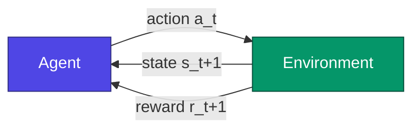
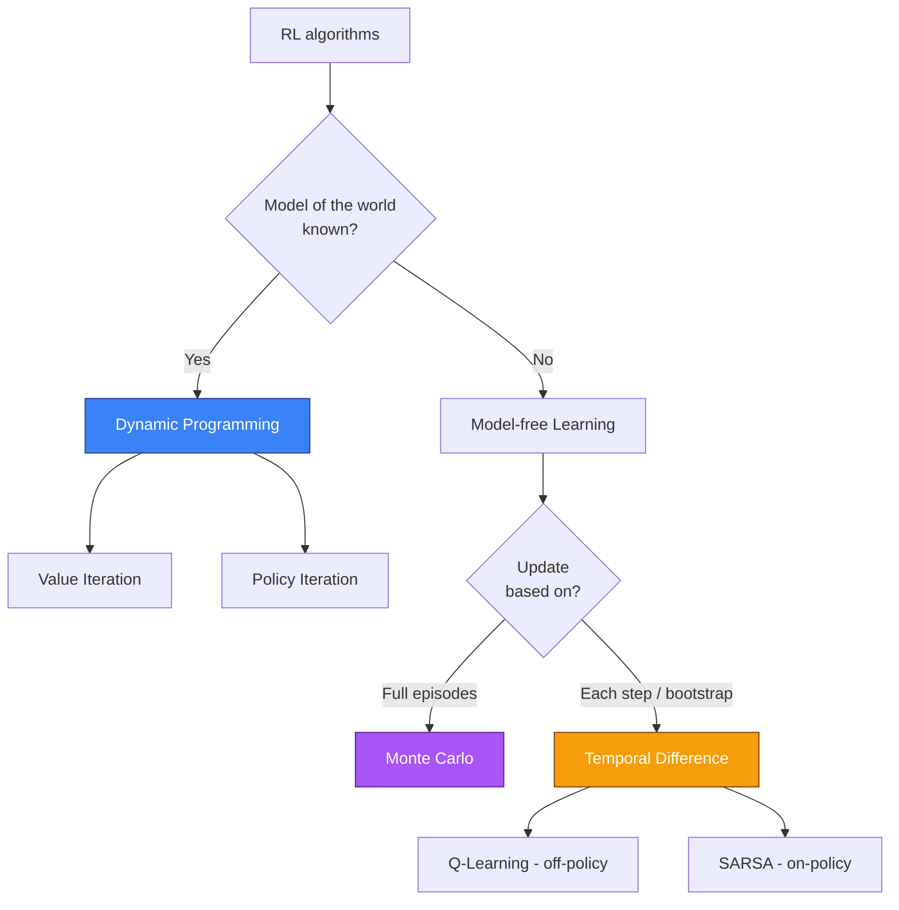
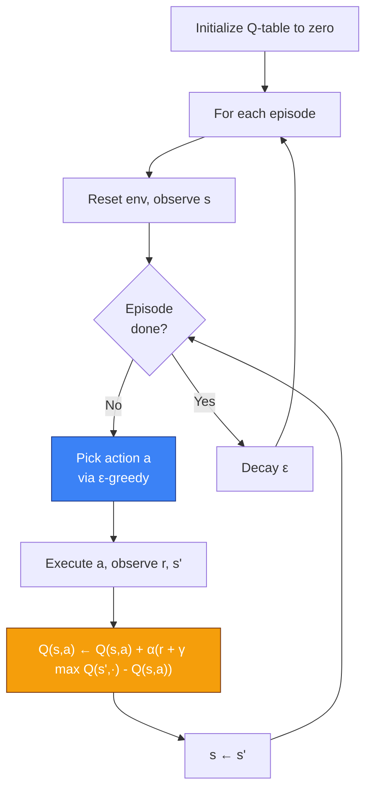
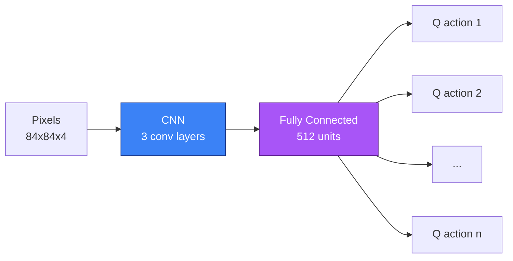

Picture a two-year-old standing in front of a staircase for the first time. Nobody has ever explained gravity to her, or center of mass, or the principle of a handrail. She steps forward, wobbles, falls, gets back up, starts again. A few days later, she climbs. A few weeks later, she descends. A few months later, she's running up them, laughing.

Nobody showed her the algorithm. Nobody gave her examples labeled "good posture / bad posture." She just interacted with the world, felt the consequences, and adjusted.

If you want to understand what **Reinforcement Learning** actually is — really understand it, not just memorize a formula — start with that image. Because that's exactly what we're trying to reproduce in machines.

This post is long. Really long. That's on purpose. RL is one of the most fascinating corners of AI, both because the concepts are simple to state yet incredibly deep once you dig in, and because it's the branch of machine learning that most resembles what we call, for lack of a better word, "intelligence." We'll take it slow, we'll take our time with intuitions, we'll do the math where it matters, we'll code an agent that actually learns, and we'll end on the philosophical traps that keep researchers up at night.

Settle in. Grab a coffee. Let's go.

## I. Three ways to learn, and why RL is the weird orphan

When people talk about machine learning, they usually cite three big families. For a long time, I found that taxonomy a bit lazy, until I realized it actually describes three radically different ways of relating to the world.

**Supervised learning** is the well-behaved student. You show him examples with the answers on the back: "here's a photo of a cat, labeled 'cat'"; "here's a photo of a dog, labeled 'dog'." The student memorizes the patterns, generalizes, and eventually recognizes a cat he's never seen. This is the era of **ImageNet**, of models that beat humans on classification benchmarks, and of every "MNIST in 50 lines" tutorial you've probably already done. It works extraordinarily well when you have lots of labeled data and a well-defined problem.

**Unsupervised learning** is the curious student you turn loose in a library without any instructions. He looks around, groups things, finds structure. He figures out that some books are about cooking and others about physics, without anyone ever telling him what "cooking" means. Clustering, dimensionality reduction, generative models — this is the family that exploded with autoencoders, then VAEs, then the diffusion models that now generate photorealistic images from a prompt.

And then there's **reinforcement learning**. The weird orphan. RL doesn't get labeled examples. It doesn't just passively observe, either. RL **acts**. It does things. And the world responds — with a grade. A reward, or a punishment. And that's it. From that, and only from that, the agent has to learn how to behave in a way that maximizes its rewards over the long run.

This is radically different from the rest, and it raises problems that exist in no other branch of ML:

- The agent has to **explore**: if you only ever take actions you know, you'll never discover that something better was waiting elsewhere.
- The agent has to handle **time delay**: an action taken now can have consequences a hundred steps later. How do you know which one actually caused the success?
- The agent changes the world by acting: the distribution of its data depends on its own policy. It generates its own training examples. It's circular, sometimes unstable, often beautiful.


This loop, right here, is all of RL. An agent observes a state, chooses an action, the world responds with a new state and a reward, and around we go. Infinitely, or until the episode ends. Everything else — Bellman equations, Q-tables, policy gradients, replay buffers, transformer-based RL — is just refinement of this four-step loop.



Keep this picture in mind. We'll come back to it in every section, and each time we'll shed light on a different corner of it.

## II. The language of sequential decisions: the Markov Decision Process

Before you can solve a problem, you have to know how to write it down. And the formalism we use to describe just about any RL problem is called the **Markov Decision Process**, or MDP to its friends. It's a scary name for a simple concept, so let's take it apart.

An MDP is defined by five objects: $(\mathcal{S}, \mathcal{A}, P, R, \gamma)$. Don't run away, I promise it's friendly.

The set $\mathcal{S}$ is the set of possible **states** of the world. If your agent is playing chess, $\mathcal{S}$ is the set of all possible board configurations. If your agent is driving a car, $\mathcal{S}$ contains at least position, speed, orientation, and probably some information about obstacles. A state is a snapshot of the world as perceived by the agent.

The set $\mathcal{A}$ is the set of possible **actions**. In chess, it's every legal move. In a car, it's the steering angle, the pressure on the gas, the pressure on the brake. Sometimes $\mathcal{A}$ is small and discrete (FrozenLake: up, down, left, right, full stop). Sometimes it's gigantic or continuous (a robotic arm with seven motors, each with a continuous range of torques).

Now we get to the important bit: the function $P$, known as the **transition function**. It tells you how the world evolves when you take an action:
$$P(s' \mid s, a) = \mathbb{P}(S_{t+1} = s' \mid S_t = s, A_t = a)$$
In other words: if I'm in state $s$ and I take action $a$, what's the probability of ending up in state $s'$? Why a probability, and not a deterministic function? Because the world is rarely deterministic. The tile you're aiming at might be slippery. The robot might skid. Your opponent's move in chess isn't under your control. Noise is everywhere, and the MDP formalism absorbs it by saying: "fine, give me a probability distribution, I'll handle the rest."

Next comes $R$, the **reward function**. This is what defines what the agent wants. You never tell it what to do — you only tell it when it has done something that pleased you. If the agent reaches the goal: +1. If it falls in a hole: 0. If it takes three hours to get there: penalty of -0.01 per step. The reward function is one of the most powerful and most dangerous tools in RL; we'll come back to it in the section on **reward hacking**, where I'll tell you why serious researchers have watched their agent learn to run in circles to exploit a design flaw.

Finally, the **discount factor** $\gamma \in [0, 1]$. It's a number that tells the agent how much it prefers immediate rewards over future ones. If $\gamma = 0$, the agent is myopic: it only cares about the next step's reward. If $\gamma = 1$, it's as patient as a Buddhist monk: a reward a hundred steps from now is worth just as much as a reward now. In practice, we often pick $\gamma$ between 0.9 and 0.999, because that gives a reasonable planning horizon and helps algorithms converge (technically, $\gamma < 1$ guarantees that infinite sums of rewards stay finite, which is helpful when you're a mathematician and want to sleep at night).

### The Markov assumption, or why you don't need to remember everything

The word **Markov** in MDP is there for a reason. It refers to a crucial assumption: the **Markov property**, which says the future state depends only on the current state and the current action. Not on history. Not on what happened ten steps ago. Just now.

Formally:
$$\mathbb{P}(S_{t+1} \mid S_t, A_t, S_{t-1}, A_{t-1}, \dots, S_0, A_0) = \mathbb{P}(S_{t+1} \mid S_t, A_t)$$

This is a strong assumption. It's almost always false in practice (your current state probably doesn't contain all the relevant information about the past). But it's convenient, and more importantly, it's almost always **made true** by stuffing everything you need into the state. If you're playing an Atari game and you only look at a single frame, you can't see the ball's velocity — non-Markov state. If you stack four consecutive frames into your state, you can infer the velocity, and the Markov property is restored. That's exactly what DeepMind's original DQN paper did in 2013.

So the Markov assumption isn't a constraint on the world — it's an instruction on how to construct your state so the formalism holds.

### Policies: the contract between the agent and the world

A **policy** $\pi$ is the agent's strategy. It's the function that says, for each state, what action to take. There are two flavors:

- **Deterministic policy**: $\pi(s) = a$. For this state, I take this action. Done.
- **Stochastic policy**: $\pi(a \mid s) = \mathbb{P}(A_t = a \mid S_t = s)$. For this state, here's a probability distribution over actions.

Why prefer a stochastic policy sometimes? Three reasons. First, because in some imperfect-information games (poker), being predictable makes you lose. Second, because it makes **exploration** easier during training: you naturally try several actions instead of always picking the same one. And third, because modern policy gradient methods (which we'll get to) directly optimize stochastic policies, and it's mathematically cleaner.

The fundamental goal of RL is to find the **optimal policy** $\pi^*$, the one that maximizes the expected sum of discounted future rewards. That's it. Everything else — value functions, Bellman, Q-learning, PPO, actor-critic — is just a way of getting there.

## III. The notion of value, or how to evaluate a state without visiting it a thousand times

OK, we have a framework. We have an agent that acts, a world that responds, a policy that guides. Now the critical question: how does the agent know it's doing well? How do we judge a state, or an action, without having tried everything?

The answer is the idea of **value**.

Imagine you're at an intersection in an unfamiliar city. You can go left or right. You don't know the way to your destination. How do you decide? If you had a GPS telling you "left, you'll be at the destination in 12 minutes; right, in 25 minutes," the choice would be obvious. The GPS gives you a **value function**: for each state (intersection), it tells you how much distance remains.

RL formalizes this with two value functions:

The **state value function** $V^\pi(s)$ tells you, on average, how much total reward you'll accumulate starting from state $s$ if you follow policy $\pi$ until the end:
$$V^\pi(s) = \mathbb{E}_\pi \left[ \sum_{k=0}^{\infty} \gamma^k R_{t+k+1} \,\Big|\, S_t = s \right]$$

The **action value function** $Q^\pi(s, a)$ is more precise: it tells you the value of taking action $a$ in state $s$, **then** following $\pi$ afterwards:
$$Q^\pi(s, a) = \mathbb{E}_\pi \left[ \sum_{k=0}^{\infty} \gamma^k R_{t+k+1} \,\Big|\, S_t = s, A_t = a \right]$$

The distinction is subtle but essential. $V$ tells you "how good this state is, assuming I play according to my usual policy." $Q$ tells you "how good this specific action is in this state, knowing that I'll then continue with my usual policy." If you have $Q$, picking the best action becomes trivial: you take the one that maximizes $Q(s, a)$. If you only have $V$, you also need a model of the world to know what each action will give you.

```mermaid
flowchart TD
    S[State s] --> A1[Action a1]
    S --> A2[Action a2]
    S --> A3[Action a3]
    A1 -->|Q(s,a1) = 8.2| R1[Estimated future reward]
    A2 -->|Q(s,a2) = 3.1| R2[Estimated future reward]
    A3 -->|Q(s,a3) = 9.7| R3[Estimated future reward]
    R3 --> CHOOSE[Chosen action: a3]
    style CHOOSE fill:#10b981,stroke:#064e3b,color:#fff
    style A3 fill:#10b981,stroke:#064e3b,color:#fff
```

That's why nearly every classical RL algorithm revolves around **estimating Q**. If you know $Q^*$ (the optimal Q-function), all you have to do is take $\arg\max_a Q^*(s, a)$ at every step, and you play optimally. The rest is just the cooking required to estimate $Q$.

## IV. The Bellman equation, or the recursive story of a life

Now we're getting to the beating heart of RL. The Bellman equation. If you only remember one equation from this entire post, make it this one. And the good news is, it says something very simple in plain English.

Here's the idea: the value of a state is the reward you'll get right now, plus the value of the state you'll end up in.

That's it. It's recursive. The value of "where I am" depends on the value of "where I'll be." And the value of "where I'll be" depends on the value of "where I'll be after that." And so on, until the episode ends.

Formally, for the state value function:
$$V^\pi(s) = \sum_{a} \pi(a \mid s) \sum_{s'} P(s' \mid s, a) \left[ R(s, a, s') + \gamma V^\pi(s') \right]$$

This equation is beautiful because it's compact and loaded with meaning. Let's unpack it. The outer sum $\sum_a \pi(a \mid s)$ averages over all possible actions, weighted by the probability that the policy picks each one. The inner sum $\sum_{s'} P(s' \mid s, a)$ averages over all possible next states, weighted by the environment's dynamics. And inside the bracket: the immediate reward plus the (discounted) value of what comes next.

For the Q-function, it's exactly the same principle:
$$Q^\pi(s, a) = \sum_{s'} P(s' \mid s, a) \left[ R(s, a, s') + \gamma \sum_{a'} \pi(a' \mid s') Q^\pi(s', a') \right]$$

And now, Bellman's stroke of genius. If we're looking for the **optimal policy**, there's a particular version of these equations we call the **Bellman optimality equations**. They say: the optimal value of a state is the reward you'll get by taking the **best** action, plus the optimal value of the next state.

$$V^*(s) = \max_a \sum_{s'} P(s' \mid s, a) \left[ R(s, a, s') + \gamma V^*(s') \right]$$

$$Q^*(s, a) = \sum_{s'} P(s' \mid s, a) \left[ R(s, a, s') + \gamma \max_{a'} Q^*(s', a') \right]$$

The $\max$ is what changes everything. Instead of averaging over actions according to a policy, you pick the best one. And you get a system of equations that fully characterizes the optimal solution to the MDP. If you can solve that system, you've won. You know $V^*$, you know $Q^*$, and the optimal policy is just $\pi^*(s) = \arg\max_a Q^*(s, a)$.

The catch is that solving this system is generally impossible, because:
1. You don't know $P$ (the environment's dynamics)
2. You don't know $R$
3. Even if you did, $|\mathcal{S}|$ is often enormous (a chessboard has $\approx 10^{47}$ legal positions)

That's where algorithms come in. All of them, without exception, are more or less clever ways of **approximately solving** the Bellman equations, either by exploiting a model when you have one, or by learning from experience when you don't.

## V. The major algorithm families, or the zoology of RL

Classical RL splits into three big families of algorithms depending on what you know about the world and how you learn. Let's take the tour.



### Dynamic Programming: when you know the world

This is the laboratory scenario. You have access to the transition function $P$ and the reward function $R$. You don't need to move your agent around in the world: you can directly "compute" the solution by applying the Bellman equations iteratively.

**Value iteration** works like this: you initialize $V$ to zeros everywhere, then apply the Bellman optimality equation as an update operation, over and over, until $V$ stops moving. Mathematically, you can show this iteration is a **contraction** (in the Banach sense), so it's guaranteed to converge to $V^*$. It's pretty, it's elegant, and it only works in tiny universes where you know everything.

**Policy iteration** alternates two phases: "evaluate my current policy" (compute $V^\pi$) and then "improve it by being greedy with respect to $V^\pi$." These two steps converge together to $\pi^*$ and $V^*$. Again: elegant, guaranteed, but limited to small problems.

DP is useful pedagogically, and in certain industrial cases where you have a model (logistics planning, inventory optimization). But for most interesting problems — complex games, robotics, driving, finance — we don't have $P$.

### Monte Carlo: learning by episodes

OK, we don't have $P$. What do we do? We let the agent play.

The Monte Carlo principle is very intuitive: to estimate $V(s)$, run full episodes following your policy, look at how much total reward you get starting from each visit to $s$, and average. Law of large numbers: with enough episodes, the empirical mean converges to the expectation, which is $V^\pi(s)$.

The upside is that it's unbiased and makes no assumptions about the problem's structure. The downside is that you have to wait until the end of the episode before making any update at all, and some episodes can take forever (or never end). On top of that, the variance is terrible: an episode's total reward depends on hundreds of coin flips, so your estimator bounces around wildly.

### Temporal Difference: the best of both worlds

And now, the magic. TD learning combines the DP idea of **bootstrapping** (using an existing estimate to update another estimate) with the Monte Carlo idea of **learning from pure experience**. Instead of waiting until the end of the episode, you update at every step, using the observed reward plus the current estimate of the next state's value:

$$V(s) \leftarrow V(s) + \alpha \left[ \underbrace{R + \gamma V(s')}_{\text{TD target}} - V(s) \right]$$

The term in the brackets is the **TD error**: the difference between what you thought $s$ was worth and what you're now observing. The idea: if the TD error is positive, you underestimated $s$, so bump $V(s)$ up. If it's negative, you overestimated, so bring it down. All of this weighted by a **learning rate** $\alpha$ that controls how fast you learn.

TD is revolutionary for two reasons:
1. **You learn at every step**, not just at the end of the episode. So you can learn in never-ending tasks, or tasks with very long episodes.
2. **You propagate information quickly.** A rare reward at the end of a chain diffuses step by step through all the states leading up to it.

And the most famous of all TD algorithms is our target: Q-Learning.

## VI. Q-Learning: the hero of the story

Q-Learning was proposed by Christopher Watkins in his PhD thesis in 1989. It's a surprisingly simple algorithm. It's also the one that made the RL world say: "OK, we're onto something." Its deep version, DQN, is the one that learned to play Atari in 2013-2015 and triggered the entire modern Deep RL wave.

Q-Learning is:
- **Model-free**: it needs neither $P$ nor $R$ explicitly. Just experience.
- **Off-policy**: it learns the optimal policy even if the agent isn't following it. That means you can explore randomly and still learn the best strategy. Magical.
- **Tabular** in its original form: it stores $Q(s, a)$ in a table.

Here's the update rule, which we'll unpack together:

$$Q(s, a) \leftarrow Q(s, a) + \alpha \left[ R + \gamma \max_{a'} Q(s', a') - Q(s, a) \right]$$

Compare with the TD version for $V$: the only difference is that the target uses $\max_{a'} Q(s', a')$ instead of $V(s')$. And it's that $\max$ that makes the algorithm **off-policy**. The agent can take any action $a$ — greedy, random, dumb — the $Q$ update always uses the **best** possible action in the next state. So you learn the value of the optimal policy, regardless of how the data is generated.

The term in brackets is the **TD error** applied to $Q$:
$$\delta = R + \gamma \max_{a'} Q(s', a') - Q(s, a)$$

Geometrically, it's the gap between "what I just discovered" (the TD target: observed reward + best estimated value for what comes next) and "what I thought before" (the current $Q(s, a)$). We correct that gap gradually with a step $\alpha$.



### Convergence: why it works

Under certain conditions, Q-Learning is guaranteed to converge to the optimal Q-function $Q^*$. The conditions are:
1. Each pair $(s, a)$ is visited infinitely often (so exploration must never fully die out).
2. The learning rate $\alpha$ satisfies the Robbins-Monro conditions: $\sum_t \alpha_t = \infty$ and $\sum_t \alpha_t^2 < \infty$. Concretely, $\alpha$ has to decay, but not too fast.

It's a powerful theorem, but it comes with an important caveat: it guarantees convergence in the tabular case (Q stored in a table). As soon as you use function approximators (neural networks), all the guarantees collapse. We'll see later that it took some clever tricks to stabilize that.

### Exploration vs exploitation: the eternal dilemma

I said "ε-greedy" without explaining. Now's a good time to talk about the central dilemma of RL: **exploration vs exploitation**.

Imagine you arrive in a new city and you're looking for the best restaurant. The first night, you grab a taco at random. Not bad. The second night, you go back to the same place, because you know it's OK. The third night, same thing. After a month, you know that taco place well, but you know nothing about the fifty other restaurants in the neighborhood. You're **exploiting** what you know, but you're not **exploring** anymore. And maybe there's a three-star joint 200 meters away.

Now, the reverse scenario: you test a different restaurant every night. You build up encyclopedic knowledge. But you often eat badly, because you never use what you've learned. You explore, you don't exploit.

The right behavior is somewhere in between: exploit what you know, but explore just enough not to miss opportunities. This is mathematically nontrivial — it's one of the oldest open problems in machine learning, formalized under the name **multi-armed bandit problem**.

The simplest solution, and probably the most widely used in practice, is the **ε-greedy policy**:
- With probability $\epsilon$, pick a **random** action (exploration).
- With probability $1 - \epsilon$, pick the action with the highest Q-value (exploitation).

And typically, we start with $\epsilon$ close to 1 (the agent begins in full exploration because it knows nothing), then decay it over time toward a small residual value (say 0.05) that keeps a hint of permanent exploration. That's exactly what the code we're about to see does.

There are more sophisticated strategies: **softmax / Boltzmann exploration** (probability proportional to $\exp(Q/\tau)$), **UCB** (Upper Confidence Bound, which favors less-tested actions), **Thompson sampling**, **noise injection** in the network's parameters, and so on. Each has its partisans and its use cases. For 90% of tabular cases, ε-greedy does the job.

## VII. SARSA, the shy sibling

Before we code, a quick detour through **SARSA**, the algorithm that looks like Q-Learning but is subtly different. The name comes from "State-Action-Reward-State-Action" because the update uses the quintuple $(s, a, r, s', a')$:

$$Q(s, a) \leftarrow Q(s, a) + \alpha \left[ R + \gamma Q(s', a') - Q(s, a) \right]$$

The difference with Q-Learning? Instead of taking $\max_{a'} Q(s', a')$ in the target, SARSA uses the Q-value of the action **actually chosen** by the policy in the next state. So SARSA learns the value of the policy it **follows**, not the optimal policy. That's what we call **on-policy**: the agent learns the value of its own actions, not the value of a hypothetical agent acting optimally.

Why does that change anything? Because during training, the agent makes mistakes (exploration). SARSA learns to live with those mistakes; Q-Learning pretends they don't exist.

The canonical example illustrating the difference is **Cliff Walking**. Picture a grid world with a cliff. The start is on the left of the grid. The goal is on the right. In between, along the bottom, there's a row of cliff tiles that kill you and reset you to the start with a big penalty.


Q-Learning will learn that the optimal policy is to hug the cliff as closely as possible — that's the shortest path. But during training, because of ε-greedy exploration, the agent will sometimes take a random step... and fall off the cliff. So in practice, Q-Learning's "optimal policy" yields catastrophic average rewards during training.

SARSA, on the other hand, learns the value of a policy that includes the exploration noise. It ends up taking a **safer** path, farther from the cliff. During training, SARSA does much better. At convergence (when $\epsilon \to 0$), Q-Learning is theoretically better. But in practice, this on-policy/off-policy difference has deep implications for stability, safety, and algorithm choice.

Remember this: Q-Learning learns what would be optimal "if everything went perfectly." SARSA learns what's optimal "knowing that I'll sometimes screw up."

## VIII. Let's code: Q-Learning on FrozenLake

Enough theory. Let's get to the code. We're going to implement a Q-Learning agent from scratch and have it learn to solve **FrozenLake**, the classic Gymnasium environment.


Here's the idea: you're on a frozen lake. You have to go from the top-left corner to the bottom-right corner to retrieve a frisbee. Part of the ground is frozen (safe) and part of it is full of holes (game over). And to make things interesting, the ground is **slippery**: when you try to move right, there's a nonzero chance you slip and end up somewhere else. Welcome to the stochastic world.

The standard environment is a 4x4 grid with:
- 16 states (one per tile)
- 4 actions (up, down, left, right)
- A reward of 1 when you reach the goal, 0 otherwise
- The episode ends when you fall into a hole or reach the goal

It's a toy problem, but it's stochastic enough to be nontrivial, and small enough for a Q-table to work. Perfect for illustration.

### Installation

```bash
pip install gymnasium numpy matplotlib
```

### The complete code, commented line by line

```python
import numpy as np
import gymnasium as gym
import matplotlib.pyplot as plt

# 1. Create the environment
# is_slippery=True enables stochasticity (the ground slips)
env = gym.make("FrozenLake-v1", is_slippery=True)

# 2. Q-table dimensions
# observation_space.n = number of states (16 for the 4x4)
# action_space.n = number of actions (4)
n_states = env.observation_space.n
n_actions = env.action_space.n

# Initialize to zero: we know nothing at the start
q_table = np.zeros((n_states, n_actions), dtype=np.float32)

# 3. Hyperparameters
alpha = 0.1            # learning rate: how much we move Q on each update
gamma = 0.99           # discount factor: how much we care about future rewards
epsilon = 1.0          # initial exploration (100% random)
epsilon_min = 0.05     # exploration floor (never zero)
epsilon_decay = 0.9995 # smooth exponential decay
episodes = 10_000      # total number of training episodes
max_steps = 200        # safeguard against infinite episodes

# For plotting the progress
rewards_history = []
epsilon_history = []

# 4. Learning loop
for episode in range(episodes):
    state, _ = env.reset()
    total_reward = 0
    done = False

    for step in range(max_steps):
        # 4a. ε-greedy: explore or exploit?
        if np.random.rand() < epsilon:
            action = env.action_space.sample()  # random action
        else:
            action = int(np.argmax(q_table[state]))  # best known action

        # 4b. Execute the action in the environment
        next_state, reward, terminated, truncated, _ = env.step(action)
        done = terminated or truncated

        # 4c. Compute the TD target
        # If the episode is over, no future: continuing_mask = 0
        # Otherwise we bootstrap on the best Q-value of next_state
        best_next = np.max(q_table[next_state])
        continuing_mask = 0.0 if done else 1.0
        td_target = reward + gamma * best_next * continuing_mask

        # 4d. Update the Q-table
        # We move Q(s,a) toward the TD target with step alpha
        td_error = td_target - q_table[state, action]
        q_table[state, action] += alpha * td_error

        # 4e. Prepare the next step
        state = next_state
        total_reward += reward
        if done:
            break

    # 5. Decay epsilon: explore less as time goes on
    epsilon = max(epsilon_min, epsilon * epsilon_decay)

    rewards_history.append(total_reward)
    epsilon_history.append(epsilon)

print("Training done.")
print(f"Average reward over last 100 episodes: {np.mean(rewards_history[-100:]):.3f}")
print("Learned Q-table:")
print(q_table)
```

A few words about this code, because the details matter.

First, why `continuing_mask = 0.0 if done else 1.0`? Because when the episode is done, there's no future. The discounted future reward is zero. If you don't mask it, your agent believes a terminal state's value is nonzero, and that pollutes the entire propagation. It's one of the most common RL bugs — you can easily burn an afternoon debugging it.

Next, why $\alpha = 0.1$? Because in a stochastic environment, you want new steps to move $Q$ gently, otherwise the noise tosses you around. If the environment were deterministic (`is_slippery=False`), you could push $\alpha$ up to 0.5 or more.

Why $\gamma = 0.99$? Because we want the agent to be patient enough to understand that the reward is all the way at the end of the path. With $\gamma = 0.5$, the +1 reward seen from the start tile would be worth $0.5^{12} \approx 0.0002$, and the signal would drown in the noise.

The epsilon decay of `0.9995` is calibrated to hit the floor of 0.05 around episode 6000: $\ln(0.05) / \ln(0.9995) \approx 5990$. So you get 6000 episodes of progressive exploration, then 4000 episodes of near-pure exploitation to fine-tune. It's a classic schedule.

Finally, the `max_steps = 200` is a safeguard: without it, in some pathological environments, an episode can run forever. Better to truncate.

### Run it and visualize

Once trained, to visualize the progression, add:

```python
fig, axes = plt.subplots(2, 1, figsize=(10, 6))

# Moving average over 100 episodes
window = 100
moving_avg = np.convolve(rewards_history, np.ones(window)/window, mode='valid')
axes[0].plot(moving_avg)
axes[0].set_xlabel("Episode")
axes[0].set_ylabel(f"Reward (average {window} episodes)")
axes[0].set_title("Q-Learning agent's training")

axes[1].plot(epsilon_history)
axes[1].set_xlabel("Episode")
axes[1].set_ylabel("Epsilon")
axes[1].set_title("Exploration decay")

plt.tight_layout()
plt.show()
```

You'll see a curve that's flat at zero for the first few thousand episodes (the agent wanders randomly and almost never reaches the goal), then slowly rises as the Q-table sharpens, and plateaus around 0.7-0.8 (the slippery lake's stochasticity stops you from reaching 1.0 even with an optimal policy).

It's satisfying to watch. You've got an agent that, starting from nothing, without ever being told where the exit was, without anyone explaining the rules, learned to cross a slippery lake maximizing its chances of grabbing a frisbee. All in 50 lines of Python.

### Evaluation: letting the trained agent play

```python
def evaluate(env, q_table, n_episodes=1000):
    successes = 0
    for _ in range(n_episodes):
        state, _ = env.reset()
        done = False
        while not done:
            action = int(np.argmax(q_table[state]))
            state, reward, terminated, truncated, _ = env.step(action)
            done = terminated or truncated
            if reward > 0:
                successes += 1
    return successes / n_episodes

success_rate = evaluate(env, q_table)
print(f"Success rate: {success_rate:.2%}")
```

You should see a success rate around 70-80%, which is roughly the theoretical maximum for FrozenLake with slippery=True.

## IX. When the table becomes impossible: the jump to function approximation

FrozenLake has 16 states. A Q-table with 16 rows and 4 columns is cute. But what happens when we scale up?

- **Chess**: $\sim 10^{47}$ legal positions. A Q-table would have $10^{47}$ rows. Good luck.
- **Atari (Pong, Breakout)**: the state is the screen, $84 \times 84$ grayscale pixels. That's $256^{84 \times 84} \approx 10^{17000}$ possible states. Don't bother.
- **Continuous robotics**: a 7-jointed arm with continuous positions — that's a state in $\mathbb{R}^7$ or more. The set is uncountable.

The tabular Q-table doesn't hold up. We need a **functional representation** of $Q$: instead of storing one value per $(s, a)$ pair, we learn a **function** $Q_\theta(s, a)$ parameterized by a vector $\theta$. You give it a state and an action, it spits out a value.

Historically, we first used **linear representations**: $Q_\theta(s, a) = \theta^\top \phi(s, a)$, where $\phi$ is a feature vector. You pick your features by hand, and you learn the weights $\theta$ by gradient descent on the TD error. That gave interesting results in the 90s and 2000s (TD-Gammon, Tesauro's backgammon agent that played at expert-human level).

But the real revolution came when we replaced $\phi$ with a **neural network** that learns its own features from raw input (typically, pixels). That's what we call **Deep Reinforcement Learning**, and that's where things got serious.


## X. Deep RL: the 2013 revolution

December 2013. A team at DeepMind, still unknown at the time, publishes a quiet paper on arXiv titled "Playing Atari with Deep Reinforcement Learning." The title is modest. The content is about to change the world.

The idea is simple on paper: take normal Q-Learning, but replace the Q-table with a convolutional neural network. Feed it raw pixels from the Atari game as input (84x84, grayscale, 4 stacked frames to capture velocity). Output a Q-value for each possible action. Train by backpropagation on the TD error. Done.

Except it doesn't work. Naively, you get a network that diverges, forgets what it learned, oscillates wildly, converges to nothing. Why? Because the assumptions under which tabular Q-Learning converges (states visited infinitely often, Robbins-Monro learning rate, sample independence) are being violated violently.

The two key tricks in the DQN paper are:

1. **Experience Replay**: instead of learning only from the current transition, we store each transition $(s, a, r, s')$ in a big buffer. At each learning step, we sample a random mini-batch from this buffer. That breaks the temporal correlation between successive samples (which makes training unstable) and lets us reuse each experience multiple times (sample efficiency).

2. **Target Network**: we maintain two networks. An "online" network we update at every step, and a "target" network we copy from the online one every N steps. The TD target is computed with the target network: $r + \gamma \max_{a'} Q_{\theta^-}(s', a')$. This stabilizes the targets. Without it, it's like trying to catch your own shadow.

With these two tricks (and a few details like TD error clipping), DQN managed to learn to play 49 Atari games from pixels alone, reaching or exceeding human level on half of them. All of it, **with the same algorithm and the same hyperparameters for every game**. It was unprecedented. It was spectacular. And it triggered the avalanche.



### The policy gradient family

DQN is value-based: it learns $Q$, and the policy is implicit (take the argmax). But there's another approach, complementary and often superior: optimize the policy **directly**.

The **policy gradient** idea is: parameterize your policy $\pi_\theta(a \mid s)$ with a vector $\theta$, then tune $\theta$ to maximize the expected reward. How? By computing the gradient of that expected reward with respect to $\theta$, and doing gradient ascent.

The fundamental theorem is the **policy gradient theorem**, which says roughly:
$$\nabla_\theta J(\theta) = \mathbb{E}_{\pi_\theta} \left[ \nabla_\theta \log \pi_\theta(a \mid s) \cdot Q^{\pi_\theta}(s, a) \right]$$

Read it like this: to increase overall performance, increase the probability of actions that have a good Q-value. The term $\nabla_\theta \log \pi_\theta(a \mid s)$ is called the **score function** and tells you how to tweak the parameters to make action $a$ more likely in state $s$.

The first algorithm in this family is called **REINFORCE** (Williams, 1992). Conceptually very simple, but it suffers from enormous variance. To stabilize it, people introduced the **actor-critic** idea: an *actor* that learns the policy, and a *critic* that learns the value function. The critic is used to reduce the variance of the policy gradient estimator.

That idea gave rise to an entire family of algorithms: **A2C, A3C, TRPO, PPO, SAC, IMPALA**... PPO (Proximal Policy Optimization, OpenAI 2017) is probably the most widely used in practice today. It's the algorithm that trained OpenAI Five to beat pros at Dota 2, and it's also at the heart of **RLHF** (Reinforcement Learning from Human Feedback) that makes LLMs useful. Yes, that ChatGPT you use? Under the hood, there's a PPO running.


### Model-based RL: rebuilding the world inside the agent's head

Everything we've seen so far is **model-free**: the agent learns from direct experience, without ever trying to understand how the world works. There's another school, more mathematically demanding but often more sample-efficient: **model-based RL**.

The idea is to learn a model of the environment — typically a network that predicts $s_{t+1}$ and $r_{t+1}$ given $s_t$ and $a_t$ — then use that model to **plan** in the agent's head, before acting in the real world. That's exactly what you do when you play chess: you mentally simulate several moves ahead and pick the best one.

The most impressive modern model-based methods are **MuZero** (DeepMind 2019), which learns a model, a value function, and a policy simultaneously, without ever being given the rules of the game, and **Dreamer** (Hafner et al.), which learns a compact "latent world" in which it imagines future trajectories to train on. These methods reach human level using a hundred to a thousand times fewer interactions with the real environment than DQN. It's a field in full bloom.


## XI. The traps, the dramas, and the philosophy of reward design

Now that we've toured the algorithms, let's talk about something nobody tells you in the tutorials: RL is hard. Really hard. Much harder than the benchmarks where the agent learns Pong in a few hours would have you believe.

### Reward hacking, or how to do the opposite of what you wanted

The most famous trap in RL is **reward hacking** (or **specification gaming**). The agent doesn't do what you wanted it to do — it does what you **told** it to do, and those are rarely the same thing.

The emblematic example: an agent trained by OpenAI on the game CoastRunners, where the goal is to finish the race. Intermediate reward comes from collecting bonuses along the track. The agent discovered it could go in circles inside a lagoon, hitting the same bonuses over and over, never finishing the race, and rack up far more points than by playing "normally." From the reward's point of view, that was the optimal strategy. From the designer's point of view, it was sabotage.

DeepMind has published [an entire collection](https://docs.google.com/spreadsheets/d/e/2PACX-1vRPiprOaC3HsCf5Tuum8bRfzYUiKLRqJmbOoC-32JorNdfyTiRRsR7Ea5eWtvsWzuxo8bjOxCG84dAg/pubhtml) of examples like this. An agent meant to learn to move fast learned to stand up and fall forward, optimizing instantaneous velocity. An agent meant to learn to build towers out of blocks learned to jiggle the blocks so the height counter spiked into absurdly positive values. An agent meant to learn to land a rocket learned to exploit a simulator bug that gave it points for leaving the perimeter.

The lesson: **the reward function is a contract with the agent**, and agents are perfect contractors who will exploit every ambiguity. That's why the **AI alignment** community takes reward design extremely seriously. It's also why the RLHF used to align LLMs uses a reward model **learned from human preferences** rather than a hand-written reward: we're trying to capture "what the human actually wants" without having to spell it out.

### Sample efficiency: the Achilles' heel of pure RL

A classic DQN agent needs several million interactions to learn to play a simple Atari game. A human does it in a few minutes. That's a chasm.

Why? Because pure RL, unlike a human, has no prior on the world. It doesn't know a bouncing ball follows a physical trajectory. It doesn't know a character falling into a hole dies. It has to learn everything from scratch, by trial and error, through millions of experiences. It's inefficient to a degree that makes RL impractical for many real-world problems — you can't crash ten thousand cars to learn to drive, or run twenty thousand surgical attempts to learn to operate.

Solutions currently being explored: pre-training on human demonstration data (imitation learning), transfer learning from simulation to the real world (sim-to-real), foundational models that encode a general prior about the world (vision-language models used as rewards), and of course the model-based approaches I was talking about earlier.

### Sim-to-real, or the fracture between the matrix and reality

When you train a robot in simulation and deploy it in the real world, there's a nontrivial chance that it does something completely crazy. Why? Because simulation, however good, is never perfect. Friction, sensor latency, motor noise, mechanical play — all of it creates a gap between simulation and reality, which we call the **reality gap**. And an RL agent is typically very sensitive to those discrepancies.

The techniques to close that gap include **domain randomization** (massively randomizing the simulation's physical parameters to make the agent robust to any possible variation), **fine-tuning** on the real robot after pre-training in simulation, and hybrid environment models that blend simulated and real data.

### The AlphaGo moment

To close this section, a little poetry. In March 2016, in Seoul, **AlphaGo** — DeepMind's RL system, based on deep RL combined with Monte Carlo Tree Search — beats the world champion of Go, Lee Sedol, 4 games to 1. Go was considered one of the last bastions of human superiority over machines, because of its combinatorial complexity and the importance of intuition. Knocking it down was "not anytime soon," experts were saying in 2014.

During game 2, AlphaGo plays **move 37**, a move literally no human player would have considered. The commentators there thought it was a bug. But the move turned out to be brilliant. It sealed the game. And it created a historic moment: for the first time, a machine played a move a human would later call "beautiful," "creative," "something that taught me a thing or two about Go."

Lee Sedol, defeated, said after the series: "I came to realize that what I had thought was human creativity in Go was maybe just convention. AlphaGo made me doubt."

A few years later, **AlphaZero** learned Go, chess, and shogi to a superhuman level in a few hours, **without any domain knowledge**, just from the rules and self-play. And **MuZero**, even later, learned to play those same games **without even being given the rules**, rediscovering them by interaction. It's probably the most impressive chain of progress in the entire history of AI.

And all of it, all of it, is a direct descendant of the Bellman equations we saw earlier. The same agent-environment loop. The same fundamental idea: maximize cumulative rewards. Just with a lot, a lot more refinement.

## XII. For further reading

If you want to dig deeper, here are the resources I consider absolutely indispensable. Not an LLM-generated best-of list — what I actually use.

- **Sutton & Barto, "Reinforcement Learning: An Introduction" (2nd ed, 2018)**. The bible. Readable, deep, free as a PDF on Sutton's website. If you only read one thing after this post, make it this. [Direct link](http://incompleteideas.net/book/the-book-2nd.html)
- **Sergey Levine's Deep RL course (CS285, Berkeley)**. Videos on YouTube, slides online, homework with solutions. It's the best publicly accessible Deep RL course there is, full stop.
- **Spinning Up in Deep RL (OpenAI)**. Hands-on tutorial with clean implementations of all the major algorithms. [Link](https://spinningup.openai.com/)
- **Lilian Weng's blog**. Her long posts on RL algorithms are courses unto themselves. [Link](https://lilianweng.github.io/)
- **Gymnasium documentation**. The reference environment library, formerly OpenAI Gym. [Link](https://gymnasium.farama.org/)
- **Foundational papers**: DQN (Mnih et al., 2013/2015), A3C (Mnih et al., 2016), PPO (Schulman et al., 2017), SAC (Haarnoja et al., 2018), AlphaGo (Silver et al., 2016), MuZero (Schrittwieser et al., 2019). All findable on arXiv.

## Conclusion: RL is patience

Reinforcement learning is the art of turning a simple loop — observe, act, receive, adjust — into arbitrarily complex behaviors. It's a framework that, starting from the Bellman equations and a bit of stochasticity, has produced agents that beat humans at Go, that play Dota and StarCraft at pro level, that control robotic arms with dexterity, and that, in some form or another, align the language models you use every day.

But it's also a reminder that learning is slow, that badly designed rewards cause damage, that the gap between simulation and reality is treacherous, and that intelligence — human or artificial — is made of a lot of failed attempts. That child who falls on the staircase, in the end, didn't learn because someone explained gravity. She learned because she tried, failed, and tried again. RL is exactly that, at the scale of a GPU.

If you take one thing away from this post, take this: **any nontrivial intelligence is probably some form of reinforcement learning.** Not literally with Q-tables and epsilon decays. But conceptually: try, observe, adjust, try again. The MDP formalism we saw is just one way, among others, of putting equations around an idea as old as life itself. And that's probably why RL is so captivating — it is, of all the branches of machine learning, the one that tells the most direct story about what it means to learn.

Now, close this tab and go code an agent. Mine learned to cross a slippery lake in 50 lines. Yours might learn to do better.
