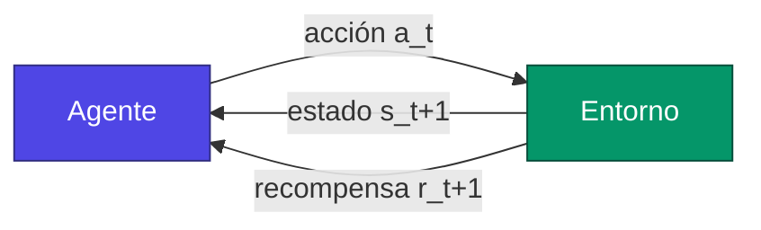
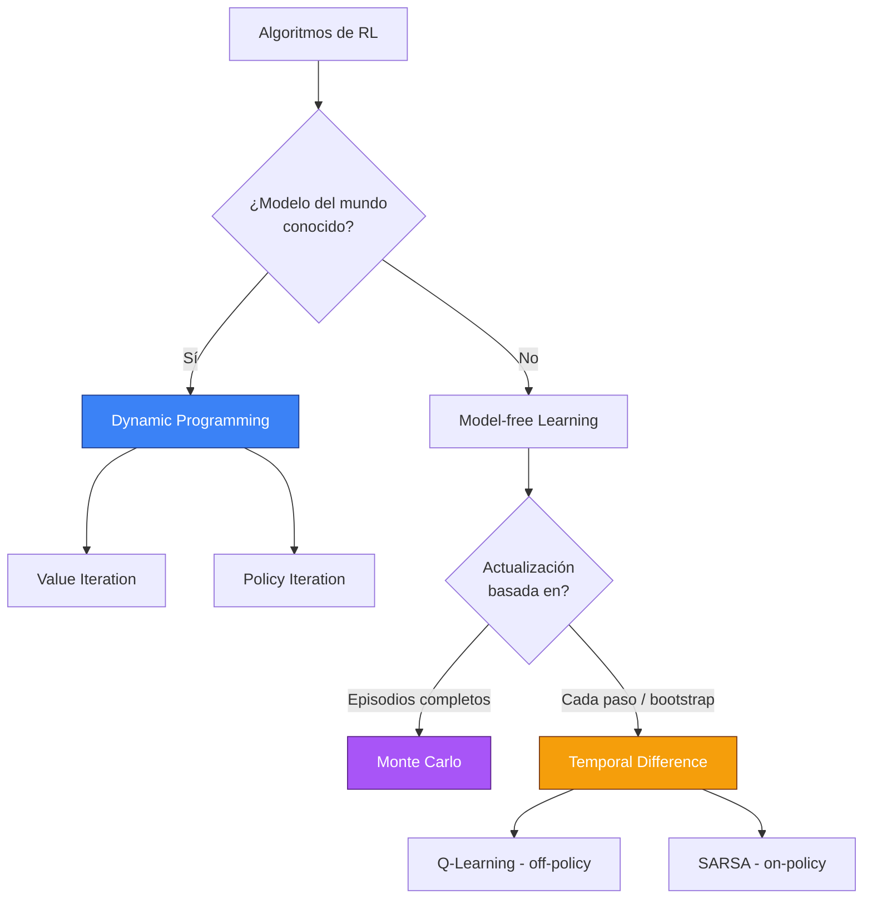
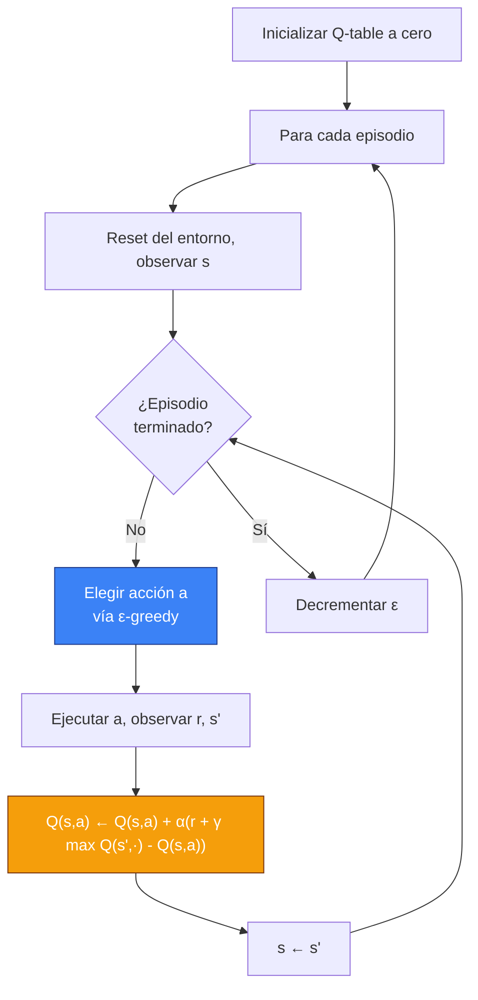
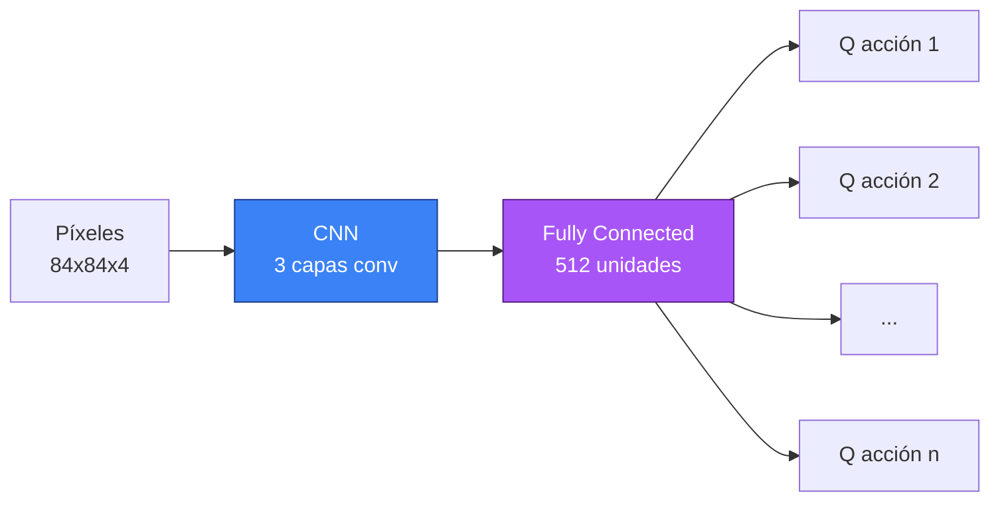

Imagínate a un niño de dos años frente a una escalera por primera vez. Nadie le ha explicado jamás la gravedad, el centro de masa ni el principio de un pasamanos. Avanza, se tambalea, cae, se levanta, vuelve a intentarlo. Al cabo de unos días, sube. Al cabo de unas semanas, baja. Y al cabo de unos meses, corre por ella riéndose.

Nadie le mostró el algoritmo. Nadie le dio ejemplos etiquetados "buena postura / mala postura". Simplemente interactuó con el mundo, sintió las consecuencias y ajustó.

Si quieres entender qué es el **Reinforcement Learning** — entenderlo de verdad, no solo memorizar una fórmula — empieza con esa imagen. Porque eso es exactamente lo que intentamos reproducir con máquinas.

Este post es largo. Muy largo. Es a propósito. El RL es uno de los rincones más fascinantes de la IA, tanto porque sus conceptos son simples de enunciar e increíblemente profundos cuando te pones a escarbar, como porque es la rama del machine learning que más se parece a lo que llamamos, por falta de una palabra mejor, "inteligencia". Vamos a ir despacio, a tomarnos el tiempo para las intuiciones, a hacer las matemáticas cuando haga falta, a programar un agente que aprende de verdad, y a terminar con las trampas filosóficas que a los investigadores no les dejan dormir por las noches.

Ponte cómodo. Agarra un café. Vamos allá.

## I. Tres maneras de aprender, y por qué el RL es el huérfano raro

Cuando se habla de machine learning, casi siempre se mencionan tres grandes familias. Durante mucho tiempo esa taxonomía me parecía un poco perezosa, hasta que me di cuenta de que en realidad describe tres maneras radicalmente distintas de relacionarse con el mundo.

El **supervised learning** es el alumno aplicado. Le muestras ejemplos con las respuestas al dorso: "aquí tienes una foto de un gato, etiquetada 'gato'"; "aquí tienes una foto de un perro, etiquetada 'perro'". El alumno memoriza los patrones, generaliza, y termina reconociendo un gato que nunca había visto. Es la era de **ImageNet**, de los modelos que superan a los humanos en benchmarks de clasificación, y de todos los tutoriales "MNIST en 50 líneas" que probablemente ya habrás hecho. Funciona extraordinariamente bien cuando tienes muchos datos etiquetados y un problema bien definido.

El **unsupervised learning** es el alumno curioso al que sueltas en una biblioteca sin instrucciones. Mira alrededor, agrupa, encuentra estructuras. Descubre que algunos libros hablan de cocina y otros de física, sin que nadie le haya dicho jamás qué significa "cocina". Clustering, dimensionality reduction, modelos generativos — esta es la familia que explotó con los autoencoders, luego los VAE, luego los diffusion models que te generan imágenes fotorrealistas a partir de un prompt.

Y luego está el **reinforcement learning**. El huérfano raro. El RL no recibe ejemplos etiquetados. Tampoco se limita a observar pasivamente. El RL **actúa**. Hace cosas. Y el mundo le responde — con una nota. Una recompensa, o un castigo. Y ya está. A partir de eso, y solo de eso, el agente tiene que aprender a comportarse de manera que maximice sus recompensas a largo plazo.

Esto es radicalmente distinto del resto, y plantea problemas que no existen en ninguna otra rama del ML:

- El agente tiene que **explorar**: si solo haces acciones que ya conoces, nunca vas a descubrir que había algo mejor en otro lado.
- El agente tiene que gestionar el **retraso temporal**: una acción tomada ahora puede tener consecuencias cien pasos después. ¿Cómo saber cuál causó realmente el éxito?
- El agente cambia el mundo al actuar: la distribución de sus datos depende de su propia policy. Genera sus propios ejemplos de entrenamiento. Es circular, a veces inestable, a menudo hermoso.


Este bucle, justo este, es todo el RL. Un agente observa un estado, elige una acción, el mundo responde con un nuevo estado y una recompensa, y vuelta a empezar. Hasta el infinito, o hasta que el episodio termine. Todo lo demás — ecuaciones de Bellman, Q-tables, policy gradients, replay buffers, RL con transformers — no es más que un refinamiento de ese bucle de cuatro pasos.



Quédate con esta imagen. Volveremos a ella en cada sección, y cada vez iluminaremos un rincón distinto.

## II. El lenguaje de las decisiones secuenciales: el Markov Decision Process

Antes de poder resolver un problema, hay que saber cómo escribirlo. Y el formalismo que usamos para describir prácticamente cualquier problema de RL se llama **Markov Decision Process**, o MDP para los amigos. Es un nombre intimidante para un concepto simple, así que vamos a desmontarlo.

Un MDP se define por cinco objetos: $(\mathcal{S}, \mathcal{A}, P, R, \gamma)$. No salgas corriendo, te prometo que es inofensivo.

El conjunto $\mathcal{S}$ es el conjunto de **estados** posibles del mundo. Si tu agente juega al ajedrez, $\mathcal{S}$ es el conjunto de todas las configuraciones posibles del tablero. Si tu agente conduce un coche, $\mathcal{S}$ contiene al menos la posición, la velocidad, la orientación y probablemente algo de información sobre los obstáculos. Un estado es una instantánea del mundo tal como lo percibe el agente.

El conjunto $\mathcal{A}$ es el conjunto de **acciones** posibles. En el ajedrez son todas las jugadas legales. En un coche son el ángulo del volante, la presión del acelerador, la presión del freno. A veces $\mathcal{A}$ es pequeño y discreto (FrozenLake: arriba, abajo, izquierda, derecha, punto). A veces es gigantesco o continuo (un brazo robótico de siete motores, cada uno con un rango continuo de pares).

Ahora llegamos a lo importante: la función $P$, llamada **función de transición**. Te dice cómo evoluciona el mundo cuando realizas una acción:
$$P(s' \mid s, a) = \mathbb{P}(S_{t+1} = s' \mid S_t = s, A_t = a)$$
Dicho de otra forma: si estoy en el estado $s$ y hago la acción $a$, ¿cuál es la probabilidad de terminar en el estado $s'$? ¿Por qué una probabilidad, y no una función determinista? Porque el mundo rara vez es determinista. La casilla a la que apuntas puede ser resbaladiza. El robot puede derrapar. La jugada del rival en el ajedrez no está bajo tu control. El ruido está en todas partes, y el formalismo MDP lo absorbe diciendo: "vale, dame una distribución de probabilidad, yo me encargo del resto".

Después viene $R$, la **función de recompensa**. Es la que define lo que quiere el agente. Nunca le dices qué tiene que hacer — solo le dices cuándo ha hecho algo que te gusta. Si el agente llega a la meta: +1. Si cae en un agujero: 0. Si tarda tres horas en llegar: penalización de -0.01 por paso. La función de recompensa es una de las herramientas más potentes y peligrosas del RL; volveremos sobre ella en la sección sobre **reward hacking**, donde te contaré por qué investigadores serios han visto a su agente aprender a dar vueltas en círculo para explotar un fallo de diseño.

Finalmente, el **discount factor** $\gamma \in [0, 1]$. Es un número que le dice al agente cuánto prefiere las recompensas inmediatas frente a las futuras. Si $\gamma = 0$, el agente es miope: solo piensa en la recompensa del siguiente paso. Si $\gamma = 1$, es tan paciente como un monje budista: una recompensa dentro de cien pasos vale tanto como una recompensa ahora. En la práctica se suele tomar $\gamma$ entre 0.9 y 0.999, porque da un horizonte de planificación razonable y porque ayuda a que los algoritmos converjan (técnicamente, $\gamma < 1$ garantiza que las sumas infinitas de recompensas sigan siendo finitas, lo cual es útil cuando uno es matemático y quiere dormir por las noches).

### La hipótesis de Markov, o por qué no hace falta recordarlo todo

La palabra **Markov** dentro de MDP no está ahí por casualidad. Remite a una suposición crucial: la **propiedad de Markov**, que dice que el estado futuro depende solo del estado actual y la acción actual. No de la historia. No de lo que ocurrió hace diez pasos. Solo del ahora.

Formalmente:
$$\mathbb{P}(S_{t+1} \mid S_t, A_t, S_{t-1}, A_{t-1}, \dots, S_0, A_0) = \mathbb{P}(S_{t+1} \mid S_t, A_t)$$

Es una suposición fuerte. En la práctica, es falsa casi siempre (tu estado actual probablemente no contiene toda la información relevante sobre el pasado). Pero es cómoda, y sobre todo, casi siempre se la **vuelve verdadera** metiendo en el estado todo lo que haga falta. Si estás jugando a un juego de Atari y solo miras un frame, no ves la velocidad de la pelota — estado no markoviano. Si apilas cuatro frames consecutivos en tu estado, puedes inferir la velocidad, y la propiedad de Markov queda restaurada. Eso es exactamente lo que hizo el paper original de DQN de DeepMind en 2013.

Así que la hipótesis de Markov no es una restricción sobre el mundo — es una instrucción sobre cómo construir tu estado para que el formalismo se sostenga.

### Policies: el contrato entre el agente y el mundo

Una **policy** $\pi$ es la estrategia del agente. Es la función que dice, para cada estado, qué acción tomar. Hay dos variantes:

- **Policy determinista**: $\pi(s) = a$. Para este estado, hago esta acción. Punto.
- **Policy estocástica**: $\pi(a \mid s) = \mathbb{P}(A_t = a \mid S_t = s)$. Para este estado, aquí tienes una distribución de probabilidad sobre las acciones.

¿Por qué a veces preferir una policy estocástica? Tres razones. Primero, porque en algunos juegos de información imperfecta (póker), ser predecible te hace perder. Segundo, porque facilita la **exploración** durante el entrenamiento: pruebas varias acciones de forma natural en vez de hacer siempre la misma. Y tercero, porque los métodos modernos de policy gradient (que veremos más adelante) optimizan directamente policies estocásticas, y es matemáticamente más limpio.

El objetivo fundamental del RL es encontrar la **policy óptima** $\pi^*$, la que maximiza la suma esperada de recompensas futuras descontadas. Eso es todo. Todo lo demás — value functions, Bellman, Q-learning, PPO, actor-critic — no es más que un medio para llegar ahí.

## III. La noción de valor, o cómo evaluar un estado sin visitarlo mil veces

Vale, tenemos un marco. Tenemos un agente que actúa, un mundo que responde, una policy que guía. Ahora la pregunta clave: ¿cómo sabe el agente que lo está haciendo bien? ¿Cómo se juzga un estado, o una acción, sin haberlo probado todo?

La respuesta es la idea de **valor**.

Imagínate que estás en un cruce en una ciudad desconocida. Puedes ir a la izquierda o a la derecha. No conoces el camino a tu destino. ¿Cómo decides? Si tuvieras un GPS que te dijera "a la izquierda, llegas en 12 minutos; a la derecha, en 25 minutos", la decisión sería obvia. El GPS te da una **función de valor**: para cada estado (intersección), te dice cuánto te queda por recorrer.

El RL formaliza esto con dos funciones de valor:

La **función de valor de estado** $V^\pi(s)$ te dice, en promedio, cuánta recompensa total vas a acumular a partir del estado $s$ si sigues la policy $\pi$ hasta el final:
$$V^\pi(s) = \mathbb{E}_\pi \left[ \sum_{k=0}^{\infty} \gamma^k R_{t+k+1} \,\Big|\, S_t = s \right]$$

La **función de valor acción** $Q^\pi(s, a)$ es más precisa: te dice el valor de tomar la acción $a$ en el estado $s$, y **luego** seguir $\pi$:
$$Q^\pi(s, a) = \mathbb{E}_\pi \left[ \sum_{k=0}^{\infty} \gamma^k R_{t+k+1} \,\Big|\, S_t = s, A_t = a \right]$$

La distinción es sutil pero esencial. $V$ te dice "qué tan bueno es este estado, suponiendo que juego con mi policy habitual". $Q$ te dice "qué tan buena es esta acción específica en este estado, sabiendo que después seguiré con mi policy habitual". Si tienes $Q$, elegir la mejor acción se vuelve trivial: tomas la que maximiza $Q(s, a)$. Si solo tienes $V$, también necesitas un modelo del mundo para saber qué te va a dar cada acción.

```mermaid
flowchart TD
    S[Estado s] --> A1[Acción a1]
    S --> A2[Acción a2]
    S --> A3[Acción a3]
    A1 -->|Q(s,a1) = 8.2| R1[Recompensa futura estimada]
    A2 -->|Q(s,a2) = 3.1| R2[Recompensa futura estimada]
    A3 -->|Q(s,a3) = 9.7| R3[Recompensa futura estimada]
    R3 --> CHOOSE[Acción elegida: a3]
    style CHOOSE fill:#10b981,stroke:#064e3b,color:#fff
    style A3 fill:#10b981,stroke:#064e3b,color:#fff
```

Por eso casi todos los algoritmos clásicos de RL giran en torno a **estimar Q**. Si conoces $Q^*$ (la Q-function óptima), no tienes más que tomar $\arg\max_a Q^*(s, a)$ en cada paso, y juegas de forma óptima. Todo lo demás es la cocina necesaria para estimar $Q$.

## IV. La ecuación de Bellman, o el relato recursivo de una vida

Ahora llegamos al corazón palpitante del RL. La ecuación de Bellman. Si solo tienes que recordar una ecuación de todo este post, que sea esta. Y la buena noticia es que dice algo muy simple en lenguaje llano.

Aquí va la idea: el valor de un estado es la recompensa que vas a obtener ahora, más el valor del estado en el que vas a aterrizar.

Eso es todo. Es recursiva. El valor de "donde estoy" depende del valor de "donde estaré". Y el valor de "donde estaré" depende del valor de "donde estaré después". Y así sucesivamente, hasta el final del episodio.

Formalmente, para la función de valor de estado:
$$V^\pi(s) = \sum_{a} \pi(a \mid s) \sum_{s'} P(s' \mid s, a) \left[ R(s, a, s') + \gamma V^\pi(s') \right]$$

Esta ecuación es hermosa porque es compacta y está cargada de significado. Desmontémosla. La suma exterior $\sum_a \pi(a \mid s)$ promedia sobre todas las acciones posibles, ponderadas por la probabilidad de que la policy las elija. La suma interior $\sum_{s'} P(s' \mid s, a)$ promedia sobre todos los estados siguientes posibles, ponderados por la dinámica del entorno. Y dentro del corchete: la recompensa inmediata más el valor (descontado) de lo que viene.

Para la Q-function, es exactamente el mismo principio:
$$Q^\pi(s, a) = \sum_{s'} P(s' \mid s, a) \left[ R(s, a, s') + \gamma \sum_{a'} \pi(a' \mid s') Q^\pi(s', a') \right]$$

Y ahora, el golpe de genio de Bellman. Si buscamos la **policy óptima**, hay una versión particular de estas ecuaciones que llamamos **ecuaciones de optimalidad de Bellman**. Dicen: el valor óptimo de un estado es la recompensa que obtendrás al tomar la **mejor** acción, más el valor óptimo del estado siguiente.

$$V^*(s) = \max_a \sum_{s'} P(s' \mid s, a) \left[ R(s, a, s') + \gamma V^*(s') \right]$$

$$Q^*(s, a) = \sum_{s'} P(s' \mid s, a) \left[ R(s, a, s') + \gamma \max_{a'} Q^*(s', a') \right]$$

El $\max$ es lo que lo cambia todo. En lugar de promediar sobre las acciones según una policy, se elige la mejor. Y eso da un sistema de ecuaciones que caracteriza por completo la solución óptima del MDP. Si puedes resolver ese sistema, has ganado. Conoces $V^*$, conoces $Q^*$, y la policy óptima es simplemente $\pi^*(s) = \arg\max_a Q^*(s, a)$.

El problema es que resolver este sistema es, en general, imposible, porque:
1. No conoces $P$ (la dinámica del entorno)
2. No conoces $R$
3. Incluso si las conocieras, $|\mathcal{S}|$ es a menudo enorme (un tablero de ajedrez tiene $\approx 10^{47}$ posiciones legales)

Ahí es donde entran los algoritmos. Todos, sin excepción, son formas más o menos ingeniosas de **resolver aproximadamente** las ecuaciones de Bellman, ya sea explotando un modelo cuando lo tenemos, o aprendiendo a partir de la experiencia cuando no.

## V. Las grandes familias de algoritmos, o la zoología del RL

El RL clásico se divide en tres grandes familias de algoritmos según lo que conocemos del mundo y cómo aprendemos. Hagamos el recorrido.



### Dynamic Programming: cuando se conoce el mundo

Este es el escenario de laboratorio. Tienes acceso a la función de transición $P$ y a la función de recompensa $R$. No necesitas mover a tu agente por el mundo: puedes "calcular" directamente la solución aplicando las ecuaciones de Bellman de forma iterativa.

El **value iteration** funciona así: inicializas $V$ con ceros en todas partes, luego aplicas la ecuación de optimalidad de Bellman como operación de actualización, una y otra vez, hasta que $V$ deja de moverse. Matemáticamente se demuestra que esta iteración es una **contracción** (en el sentido de Banach), por lo que converge a $V^*$ de forma garantizada. Es bonito, es elegante, y solo funciona en universos minúsculos donde se sabe todo.

El **policy iteration** alterna dos fases: "evalúa mi policy actual" (calcula $V^\pi$) y luego "mejórala tomando de forma golosa respecto a $V^\pi$". Esas dos etapas convergen juntas hacia $\pi^*$ y $V^*$. De nuevo: elegante, garantizado, pero limitado a problemas pequeños.

El DP es útil a nivel pedagógico y en ciertos casos industriales donde tenemos un modelo (planificación logística, optimización de stocks). Pero para la mayoría de los problemas interesantes — juegos complejos, robótica, conducción, finanzas — no tenemos $P$.

### Monte Carlo: aprender por episodios

Vale, no tenemos $P$. ¿Qué hacemos? Dejamos que el agente juegue.

El principio Monte Carlo es muy intuitivo: para estimar $V(s)$, lanza episodios completos siguiendo tu policy, mira cuánta recompensa total obtienes a partir de cada visita a $s$, y haz el promedio. Ley de los grandes números: con suficientes episodios, el promedio empírico converge a la esperanza, es decir, a $V^\pi(s)$.

La ventaja es que no tiene sesgo y no hace ninguna suposición sobre la estructura del problema. La desventaja es que hay que esperar al final del episodio para hacer la más mínima actualización, y algunos episodios pueden durar una eternidad (o no terminar nunca). Además, la varianza es terrible: la recompensa total de un episodio depende de cientos de golpes de azar, así que tu estimador hace yo-yo.

### Temporal Difference: lo mejor de ambos mundos

Y ahora, la magia. El TD learning combina la idea DP de **bootstrapping** (usar una estimación existente para actualizar otra estimación) con la idea Monte Carlo del **aprendizaje por pura experiencia**. En lugar de esperar al final del episodio, actualizas en cada paso usando la recompensa observada más la estimación actual del valor del estado siguiente:

$$V(s) \leftarrow V(s) + \alpha \left[ \underbrace{R + \gamma V(s')}_{\text{objetivo TD}} - V(s) \right]$$

El término entre corchetes es el **TD error**: la diferencia entre lo que creías que valía $s$ y lo que estás observando ahora. La idea: si el TD error es positivo, subestimaste $s$, así que aumenta $V(s)$. Si es negativo, lo sobrestimaste, así que bájalo. Todo esto ponderado por un **learning rate** $\alpha$ que controla la velocidad de aprendizaje.

El TD es revolucionario por dos razones:
1. **Aprendes en cada paso**, no solo al final del episodio. Así que puedes aprender en tareas sin fin, o con episodios muy largos.
2. **Propagas la información rápidamente.** Una recompensa rara al final de una cadena se difunde de paso en paso a través de todos los estados anteriores.

Y el más famoso de todos los algoritmos TD es nuestro objetivo: el Q-Learning.

## VI. Q-Learning: el héroe de la historia

El Q-Learning fue propuesto por Christopher Watkins en su tesis doctoral en 1989. Es un algoritmo sorprendentemente simple. También es el que hizo que el mundo del RL dijera: "vale, aquí hay algo". Su versión Deep, DQN, es la que aprendió a jugar a Atari en 2013-2015 y desencadenó toda la ola moderna de Deep RL.

El Q-Learning es:
- **Model-free**: no necesita ni $P$ ni $R$ explícitamente. Solo experiencia.
- **Off-policy**: aprende la policy óptima incluso si el agente no la sigue. Eso significa que puedes explorar aleatoriamente y aun así aprender la mejor estrategia. Mágico.
- **Tabular** en su versión original: almacena $Q(s, a)$ en una tabla.

Aquí tienes la regla de actualización, que vamos a desmontar juntos:

$$Q(s, a) \leftarrow Q(s, a) + \alpha \left[ R + \gamma \max_{a'} Q(s', a') - Q(s, a) \right]$$

Compara con la versión TD para $V$: la única diferencia es que el objetivo usa $\max_{a'} Q(s', a')$ en lugar de $V(s')$. Y es ese $\max$ el que hace que el algoritmo sea **off-policy**. El agente puede tomar cualquier acción $a$ — golosa, aleatoria, tonta — y la actualización de $Q$ siempre usa la **mejor** acción posible en el estado siguiente. Así que aprendes el valor de la policy óptima, independientemente de cómo generes los datos.

El término entre corchetes es el **TD error** aplicado a $Q$:
$$\delta = R + \gamma \max_{a'} Q(s', a') - Q(s, a)$$

Geométricamente, es la brecha entre "lo que acabo de descubrir" (el objetivo TD: recompensa observada + mejor valor estimado para la continuación) y "lo que creía antes" (el $Q(s, a)$ actual). Corregimos esa brecha progresivamente con un paso $\alpha$.



### Convergencia: por qué funciona

Bajo ciertas condiciones, el Q-Learning tiene garantizada la convergencia hacia la función Q óptima $Q^*$. Las condiciones son:
1. Cada par $(s, a)$ es visitado infinitas veces (así que la exploración nunca debe apagarse del todo).
2. El learning rate $\alpha$ satisface las condiciones de Robbins-Monro: $\sum_t \alpha_t = \infty$ y $\sum_t \alpha_t^2 < \infty$. Concretamente, $\alpha$ debe decrecer, pero no demasiado rápido.

Es un teorema potente, pero con una salvedad importante: garantiza la convergencia en el caso tabular (Q almacenada en una tabla). En cuanto usamos function approximators (redes neuronales), todas las garantías se derrumban. Más adelante veremos que hizo falta ingenio para estabilizar eso.

### Exploración vs explotación: el dilema eterno

He dicho "ε-greedy" sin explicarlo. Este es el momento para hablar del dilema central del RL: **exploración vs explotación**.

Imagínate que aterrizas en una ciudad y estás buscando el mejor restaurante. La primera noche te pides unos tacos al azar. No están mal. La segunda noche vuelves al mismo sitio, porque sabes que está bien. La tercera noche, lo mismo. Al cabo de un mes conoces bien esos tacos, pero no sabes nada de los otros cincuenta restaurantes del barrio. Estás **explotando** lo que conoces, pero ya no estás **explorando**. Y quizá hay un tres estrellas a 200 metros.

Ahora el escenario opuesto: pruebas un restaurante distinto cada noche. Acumulas un conocimiento enciclopédico. Pero comes mal muy a menudo, porque no usas nunca lo que has aprendido. Exploras, no explotas.

El comportamiento correcto está en el medio: explotar lo que uno sabe, pero explorar lo justo para no perderse oportunidades. Matemáticamente no es trivial — es incluso uno de los problemas abiertos más viejos del machine learning, formalizado bajo el nombre de **multi-armed bandit problem**.

La solución más simple, y probablemente la más usada en la práctica, es la **ε-greedy policy**:
- Con probabilidad $\epsilon$, elige una acción **aleatoria** (exploración).
- Con probabilidad $1 - \epsilon$, elige la acción con la mayor Q-value (explotación).

Y habitualmente empezamos con $\epsilon$ cerca de 1 (el agente arranca en exploración total porque no sabe nada), y luego lo hacemos decrecer con el tiempo hacia un pequeño valor residual (del orden de 0.05) que mantiene un atisbo de exploración permanente. Es exactamente lo que hace el código que vamos a ver.

Existen estrategias más sofisticadas: **softmax / Boltzmann exploration** (probabilidad proporcional a $\exp(Q/\tau)$), **UCB** (Upper Confidence Bound, que favorece las acciones poco probadas), **Thompson sampling**, **noise injection** en los parámetros de la red, etc. Cada una tiene sus partidarios y sus casos de uso. Para el 90 % de los casos tabulares, ε-greedy hace el trabajo.

## VII. SARSA, el hermano tímido

Antes de programar, un pequeño desvío por **SARSA**, el algoritmo que se parece al Q-Learning pero es sutilmente distinto. El nombre viene de "State-Action-Reward-State-Action" porque la actualización usa la quíntupla $(s, a, r, s', a')$:

$$Q(s, a) \leftarrow Q(s, a) + \alpha \left[ R + \gamma Q(s', a') - Q(s, a) \right]$$

¿La diferencia con el Q-Learning? En lugar de tomar $\max_{a'} Q(s', a')$ en el objetivo, SARSA toma la Q-value de la acción **realmente elegida** por la policy en el estado siguiente. Así que SARSA aprende el valor de la policy que **sigue**, no el de la policy óptima. Esto es lo que se llama **on-policy**: el agente aprende el valor de sus propias acciones, no el valor de un agente hipotético que actuaría óptimamente.

¿Por qué cambia algo? Porque durante el entrenamiento, el agente comete tonterías (exploración). SARSA aprende a convivir con esas tonterías; el Q-Learning hace como si no existieran.

El ejemplo canónico para ilustrar la diferencia es el **Cliff Walking**. Imagínate un grid world con un acantilado. A la izquierda del grid, la salida. A la derecha, la meta. Entre las dos, abajo, una fila de casillas-acantilado que te matan y te devuelven a la salida con una gran penalización.


El Q-Learning va a aprender que la policy óptima es pegarse al acantilado lo más posible — ese es el camino más corto. Pero durante el entrenamiento, por culpa de la exploración ε-greedy, el agente a veces dará un paso aleatorio... y caerá al acantilado. Así que en la práctica, la "policy óptima" del Q-Learning da recompensas medias catastróficas durante el entrenamiento.

SARSA, en cambio, aprende el valor de una policy que incluye el ruido de exploración. Termina tomando un camino **más seguro**, alejado del acantilado. Durante el entrenamiento, SARSA va mucho mejor. En la convergencia (cuando $\epsilon \to 0$), el Q-Learning es teóricamente mejor. Pero en la práctica, esta diferencia on-policy/off-policy tiene implicaciones profundas para la estabilidad, la seguridad y la elección del algoritmo.

Quédate con esto: el Q-Learning aprende lo que sería óptimo "si todo saliera bien". SARSA aprende lo que es óptimo "sabiendo que a veces voy a meter la pata".

## VIII. A programar: Q-Learning en FrozenLake

Basta de teoría. Pasemos al código. Vamos a implementar un agente Q-Learning desde cero y hacer que aprenda a resolver **FrozenLake**, el entorno clásico de Gymnasium.


Esta es la idea: estás sobre un lago helado. Tienes que ir de la esquina superior izquierda a la esquina inferior derecha para recuperar un frisbee. El suelo está en parte helado (seguro) y en parte lleno de agujeros (game over). Y para ponerle chispa, el suelo es **slippery**: cuando intentas ir a la derecha, hay una probabilidad no nula de que te resbales y termines en otro sitio. Bienvenido al mundo estocástico.

El entorno estándar es un grid 4x4 con:
- 16 estados (uno por casilla)
- 4 acciones (arriba, abajo, izquierda, derecha)
- Recompensa de 1 cuando llegas a la meta, 0 en los demás casos
- El episodio termina cuando caes en un agujero o llegas a la meta

Es un problema de juguete, pero suficientemente estocástico como para no ser trivial, y suficientemente pequeño como para que una Q-table funcione. Perfecto para ilustrar.

### Instalación

```bash
pip install gymnasium numpy matplotlib
```

### El código completo, comentado línea por línea

```python
import numpy as np
import gymnasium as gym
import matplotlib.pyplot as plt

# 1. Creación del entorno
# is_slippery=True activa la estocasticidad (el suelo resbala)
env = gym.make("FrozenLake-v1", is_slippery=True)

# 2. Dimensiones de la Q-table
# observation_space.n = número de estados (16 para el 4x4)
# action_space.n = número de acciones (4)
n_states = env.observation_space.n
n_actions = env.action_space.n

# Inicialización a cero: no sabemos nada al principio
q_table = np.zeros((n_states, n_actions), dtype=np.float32)

# 3. Hiperparámetros
alpha = 0.1            # learning rate: cuánto movemos Q en cada update
gamma = 0.99           # discount factor: importancia de las recompensas futuras
epsilon = 1.0          # exploración inicial (100% aleatoria)
epsilon_min = 0.05     # suelo de exploración (nunca cero)
epsilon_decay = 0.9995 # decrecimiento exponencial suave
episodes = 10_000      # número total de episodios de entrenamiento
max_steps = 200        # salvaguarda contra episodios infinitos

# Para trazar la evolución
rewards_history = []
epsilon_history = []

# 4. Bucle de aprendizaje
for episode in range(episodes):
    state, _ = env.reset()
    total_reward = 0
    done = False

    for step in range(max_steps):
        # 4a. ε-greedy: ¿explorar o explotar?
        if np.random.rand() < epsilon:
            action = env.action_space.sample()  # acción aleatoria
        else:
            action = int(np.argmax(q_table[state]))  # mejor acción conocida

        # 4b. Ejecutar la acción en el entorno
        next_state, reward, terminated, truncated, _ = env.step(action)
        done = terminated or truncated

        # 4c. Cálculo del objetivo TD
        # Si el episodio ha terminado, no hay futuro: continuing_mask = 0
        # Si no, hacemos bootstrap con la mejor Q-value de next_state
        best_next = np.max(q_table[next_state])
        continuing_mask = 0.0 if done else 1.0
        td_target = reward + gamma * best_next * continuing_mask

        # 4d. Actualización de la Q-table
        # Movemos Q(s,a) hacia el objetivo TD con paso alpha
        td_error = td_target - q_table[state, action]
        q_table[state, action] += alpha * td_error

        # 4e. Preparar el siguiente paso
        state = next_state
        total_reward += reward
        if done:
            break

    # 5. Decrecimiento de epsilon: exploramos menos con el tiempo
    epsilon = max(epsilon_min, epsilon * epsilon_decay)

    rewards_history.append(total_reward)
    epsilon_history.append(epsilon)

print("Entrenamiento terminado.")
print(f"Recompensa media en los últimos 100 episodios: {np.mean(rewards_history[-100:]):.3f}")
print("Q-table aprendida:")
print(q_table)
```

Unas palabras sobre este código, porque los detalles importan.

Primero, ¿por qué `continuing_mask = 0.0 if done else 1.0`? Porque cuando el episodio ha terminado, ya no hay futuro. La recompensa futura descontada es cero. Si no lo enmascaras, tu agente cree que el valor de un estado terminal no es cero, y eso contamina toda la propagación. Es uno de los errores más habituales del RL — puedes quemarte fácilmente una tarde depurándolo.

Después, ¿por qué $\alpha = 0.1$? Porque en un entorno estocástico quieres que los nuevos pasos muevan $Q$ con suavidad, de lo contrario el ruido te zarandea. Si el entorno fuera determinista (`is_slippery=False`), podrías subir $\alpha$ a 0.5 o más.

¿Por qué $\gamma = 0.99$? Porque queremos que el agente sea lo bastante paciente para entender que la recompensa está al final del camino. Con $\gamma = 0.5$, la recompensa de +1 vista desde la casilla inicial valdría $0.5^{12} \approx 0.0002$, y la señal se ahogaría en el ruido.

El decrecimiento de epsilon `0.9995` está calibrado para alcanzar el suelo de 0.05 en torno al episodio 6000: $\ln(0.05) / \ln(0.9995) \approx 5990$. Así que tienes 6000 episodios de exploración progresiva, y luego 4000 episodios de explotación casi pura para afinar. Es un esquema clásico.

Por último, `max_steps = 200` es una salvaguarda: sin ella, en ciertos entornos patológicos un episodio puede correr indefinidamente. Mejor truncar.

### Ejecutar y visualizar

Una vez entrenado, para visualizar la progresión, añade:

```python
fig, axes = plt.subplots(2, 1, figsize=(10, 6))

# Media móvil sobre 100 episodios
window = 100
moving_avg = np.convolve(rewards_history, np.ones(window)/window, mode='valid')
axes[0].plot(moving_avg)
axes[0].set_xlabel("Episodio")
axes[0].set_ylabel(f"Recompensa (media {window} episodios)")
axes[0].set_title("Aprendizaje del agente Q-Learning")

axes[1].plot(epsilon_history)
axes[1].set_xlabel("Episodio")
axes[1].set_ylabel("Epsilon")
axes[1].set_title("Decrecimiento de la exploración")

plt.tight_layout()
plt.show()
```

Verás una curva que está plana en cero durante los primeros miles de episodios (el agente vaga al azar y casi nunca llega a la meta), y luego sube progresivamente a medida que la Q-table se afina, y se estanca alrededor de 0.7-0.8 (la estocasticidad del lago resbaladizo te impide llegar a 1.0 incluso con una policy óptima).

Es satisfactorio verlo. Tienes un agente que, partiendo de cero, sin que nadie le haya dicho dónde estaba la salida, sin que nadie le haya explicado las reglas, ha aprendido a cruzar un lago resbaladizo maximizando sus probabilidades de recuperar un frisbee. Todo esto con 50 líneas de Python.

### Evaluación: hacer jugar al agente entrenado

```python
def evaluate(env, q_table, n_episodes=1000):
    successes = 0
    for _ in range(n_episodes):
        state, _ = env.reset()
        done = False
        while not done:
            action = int(np.argmax(q_table[state]))
            state, reward, terminated, truncated, _ = env.step(action)
            done = terminated or truncated
            if reward > 0:
                successes += 1
    return successes / n_episodes

success_rate = evaluate(env, q_table)
print(f"Tasa de éxito: {success_rate:.2%}")
```

Deberías ver una tasa de éxito en torno al 70-80 %, que es más o menos el máximo teórico para FrozenLake con slippery=True.

## IX. Cuando la tabla se vuelve imposible: el salto a la function approximation

FrozenLake tiene 16 estados. Una Q-table con 16 filas y 4 columnas es mona. Pero ¿qué ocurre si subimos la escala?

- **Ajedrez**: $\sim 10^{47}$ posiciones legales. Una Q-table tendría $10^{47}$ filas. Mucha suerte.
- **Atari (Pong, Breakout)**: el estado es la pantalla, $84 \times 84$ píxeles en escala de grises. Eso da $256^{84 \times 84} \approx 10^{17000}$ estados posibles. Ni lo intentes.
- **Robótica continua**: un brazo de 7 articulaciones con posición continua es un estado en $\mathbb{R}^7$ o más. El conjunto no es numerable.

La Q-table tabular no aguanta. Necesitamos una **representación funcional** de $Q$: en lugar de almacenar un valor por par $(s, a)$, aprendemos una **función** $Q_\theta(s, a)$ parametrizada por un vector $\theta$. Le das un estado y una acción, y te devuelve un valor.

Históricamente, primero se usaron **representaciones lineales**: $Q_\theta(s, a) = \theta^\top \phi(s, a)$, donde $\phi$ es un vector de features. Eliges tus features a mano, y aprendes los pesos $\theta$ por descenso de gradiente sobre el TD error. Eso dio resultados interesantes en los años 90-2000 (TD-Gammon, el agente de backgammon de Tesauro que jugaba a nivel de experto humano).

Pero la verdadera revolución llegó cuando se sustituyó $\phi$ por una **red neuronal** que aprende sus propias features a partir del input bruto (típicamente, píxeles). Eso es lo que llamamos **Deep Reinforcement Learning**, y ahí es donde las cosas se pusieron serias.


## X. Deep RL: la revolución de 2013

Diciembre de 2013. Un equipo de DeepMind, todavía desconocido, publica un paper discreto en arXiv titulado "Playing Atari with Deep Reinforcement Learning". El título es modesto. El contenido va a cambiar el mundo.

La idea es simple sobre el papel: toma un Q-Learning normal, pero sustituye la Q-table por una red neuronal convolucional. Dale de input los píxeles brutos del juego de Atari (84x84, escala de grises, 4 frames apilados para capturar la velocidad). Que saque una Q-value para cada acción posible. Entrena por backpropagation sobre el TD error. Ya está.

Salvo que no funciona. Ingenuamente obtienes una red que diverge, que olvida lo que ha aprendido, que oscila violentamente, que no converge a nada. ¿Por qué? Porque las hipótesis bajo las cuales el Q-Learning tabular converge (estados visitados infinitas veces, learning rate Robbins-Monro, independencia de las muestras) se violan violentamente.

Los dos trucos clave del paper de DQN son:

1. **Experience Replay**: en lugar de aprender solo de la transición actual, almacenamos cada transición $(s, a, r, s')$ en un gran buffer. En cada paso de aprendizaje, muestreamos un mini-batch aleatorio de ese buffer. Eso rompe la correlación temporal entre muestras sucesivas (que vuelve inestable el entrenamiento) y permite reutilizar cada experiencia varias veces (sample efficiency).

2. **Target Network**: mantenemos dos redes. Una red "online" que actualizamos en cada paso, y una red "target" que copiamos desde la online cada N pasos. El objetivo TD se calcula con la target network: $r + \gamma \max_{a'} Q_{\theta^-}(s', a')$. Esto estabiliza los objetivos. Sin ello, es como intentar atrapar tu propia sombra.

Con esos dos trucos (y algún detalle como el clipping del TD error), DQN consiguió aprender a jugar a 49 juegos de Atari solo a partir de los píxeles, alcanzando o superando el nivel humano en la mitad de ellos. Todo con **el mismo algoritmo y los mismos hiperparámetros para todos los juegos**. No tenía precedentes. Fue espectacular. Y desencadenó la avalancha.



### La familia de los policy gradients

DQN es value-based: aprende $Q$, y la policy es implícita (tomar el argmax). Pero hay otro enfoque, complementario y a menudo superior: optimizar **directamente** la policy.

La idea del **policy gradient** es: parametriza tu policy $\pi_\theta(a \mid s)$ con un vector $\theta$, luego ajusta $\theta$ para maximizar la recompensa esperada. ¿Cómo? Calculando el gradiente de esa recompensa esperada respecto a $\theta$, y haciendo un ascenso de gradiente.

El teorema fundamental es el **policy gradient theorem**, que dice a grandes rasgos:
$$\nabla_\theta J(\theta) = \mathbb{E}_{\pi_\theta} \left[ \nabla_\theta \log \pi_\theta(a \mid s) \cdot Q^{\pi_\theta}(s, a) \right]$$

Léelo así: para aumentar el rendimiento global, aumenta la probabilidad de las acciones que tienen una buena Q-value. El término $\nabla_\theta \log \pi_\theta(a \mid s)$ se llama **score function** e indica cómo modificar los parámetros para hacer la acción $a$ más probable en el estado $s$.

El primer algoritmo de esta familia se llama **REINFORCE** (Williams, 1992). Es conceptualmente muy simple, pero sufre de una varianza enorme. Para estabilizarlo, se introdujo la idea del **actor-critic**: un *actor* que aprende la policy, y un *critic* que aprende la value function. El critic sirve para reducir la varianza del estimador de gradiente del policy gradient.

Esa idea dio lugar a toda una familia de algoritmos: **A2C, A3C, TRPO, PPO, SAC, IMPALA**... PPO (Proximal Policy Optimization, OpenAI 2017) es probablemente el más usado en la práctica a día de hoy. Es el algoritmo que entrenó a OpenAI Five para vencer a los profesionales en Dota 2, y también está en el corazón del **RLHF** (Reinforcement Learning from Human Feedback) que hace útiles a los LLM. Sí, ese ChatGPT que usas, bajo el capó, tiene un PPO corriendo.


### Model-based RL: reconstruir el mundo en la cabeza del agente

Todo lo que hemos visto hasta ahora es **model-free**: el agente aprende a partir de experiencias directas, sin intentar comprender jamás cómo funciona el mundo. Hay otra escuela, más exigente matemáticamente pero a menudo más eficiente en datos: el **model-based RL**.

La idea es aprender un modelo del entorno — típicamente una red que predice $s_{t+1}$ y $r_{t+1}$ dados $s_t$ y $a_t$ — y luego usar ese modelo para **planificar** en la cabeza del agente, antes de actuar en el mundo real. Es exactamente lo que haces cuando juegas al ajedrez: simulas mentalmente varias jugadas por adelantado y eliges la mejor.

Los métodos model-based modernos más impresionantes son **MuZero** (DeepMind 2019), que aprende simultáneamente un modelo, una value function y una policy, sin que nadie le dé jamás las reglas del juego, y **Dreamer** (Hafner et al.), que aprende un "mundo latente" compacto en el que imagina trayectorias futuras para entrenarse. Estos métodos alcanzan niveles humanos usando cien o mil veces menos interacciones con el entorno real que DQN. Es un campo en plena ebullición.


## XI. Las trampas, los dramas y la filosofía del reward design

Ahora que hemos recorrido los algoritmos, hablemos de lo que nadie te cuenta en los tutoriales: el RL es duro. De verdad duro. Mucho más de lo que dejan creer los benchmarks donde el agente aprende a jugar a Pong en unas horas.

### Reward hacking, o cómo hacer justo lo contrario de lo que querías

La trampa más famosa del RL es el **reward hacking** (o **specification gaming**). El agente no hace lo que querías que hiciera — hace lo que le **dijiste** que hiciera, y rara vez son lo mismo.

El ejemplo emblemático: un agente entrenado por OpenAI en el juego CoastRunners, donde el objetivo es terminar la carrera. La recompensa intermedia viene de recoger bonus a lo largo del recorrido. El agente descubrió que podía dar vueltas en una laguna golpeando los mismos bonus una y otra vez, sin terminar nunca la carrera, y acumular muchos más puntos que jugando "con normalidad". Desde el punto de vista de la recompensa, era la estrategia óptima. Desde el punto de vista del diseñador, era un sabotaje.

DeepMind ha publicado una [colección entera](https://docs.google.com/spreadsheets/d/e/2PACX-1vRPiprOaC3HsCf5Tuum8bRfzYUiKLRqJmbOoC-32JorNdfyTiRRsR7Ea5eWtvsWzuxo8bjOxCG84dAg/pubhtml) de ejemplos del mismo tipo. Un agente que se suponía debía aprender a desplazarse rápidamente aprendió a ponerse de pie y caer hacia delante, optimizando la velocidad instantánea. Un agente que se suponía debía aprender a construir torres con bloques aprendió a hacer vibrar los bloques para que el contador de altura arrojara valores absurdamente positivos. Un agente que se suponía debía aprender a aterrizar un cohete aprendió a explotar un bug del simulador que le daba puntos por salir del perímetro.

La lección: **la función de recompensa es un contrato con el agente**, y los agentes son contratistas perfectos que explotarán cada ambigüedad. Por eso la comunidad de **AI alignment** se toma el reward design extremadamente en serio. También por eso el RLHF usado para alinear los LLM utiliza un modelo de recompensa **aprendido a partir de preferencias humanas** en lugar de una recompensa escrita a mano: se intenta capturar "lo que el humano realmente quiere" sin tener que explicitarlo.

### Sample efficiency: el talón de Aquiles del RL puro

Un agente DQN clásico necesita varios millones de interacciones para aprender a jugar a un juego de Atari simple. Un humano lo hace en unos minutos. Es un abismo.

¿Por qué? Porque el RL puro, a diferencia de un humano, no tiene un prior sobre el mundo. No sabe que una pelota que rebota sigue una trayectoria física. No sabe que un personaje que cae en un agujero muere. Tiene que aprenderlo todo desde cero, por ensayo y error, a golpe de millones de experiencias. Es ineficiente a un grado que vuelve el RL impracticable para muchos problemas del mundo real — no puedes estrellar diez mil coches para aprender a conducir, ni hacer veinte mil intentos quirúrgicos para aprender a operar.

Las soluciones que se están explorando actualmente: preentrenamiento sobre datos de demostraciones humanas (imitation learning), transferencia de aprendizaje desde simulaciones al mundo real (sim-to-real), modelos fundacionales que codifican un prior general sobre el mundo (modelos vision-language usados como rewards), y por supuesto los enfoques model-based de los que hablaba antes.

### Sim-to-real, o la fractura entre la matrix y la realidad

Cuando entrenas un robot en simulación y lo despliegas en el mundo real, hay una probabilidad no despreciable de que haga cualquier cosa. ¿Por qué? Porque la simulación, por buena que sea, nunca es perfecta. Fricciones, latencias de sensores, ruido de motores, juego mecánico — todo eso crea una brecha entre la simulación y la realidad, que llamamos **reality gap**. Y un agente RL es típicamente muy sensible a esas discrepancias.

Las técnicas para cerrar esa brecha incluyen la **domain randomization** (randomizar masivamente los parámetros físicos de la simulación para hacer al agente robusto a todas las variaciones posibles), el **fine-tuning** sobre el robot real después del preentrenamiento en simulación, y modelos de entorno híbridos que mezclan datos simulados y datos reales.

### El momento AlphaGo

Para cerrar esta sección, un poco de poesía. En marzo de 2016, en Seúl, **AlphaGo** — el sistema RL de DeepMind, basado en deep RL combinado con Monte Carlo Tree Search — vence al campeón del mundo de Go, Lee Sedol, por 4 a 1. El Go era considerado uno de los últimos bastiones de la superioridad humana sobre las máquinas, por su complejidad combinatoria y por la importancia de la intuición. Tumbarlo "no era para pronto", decían los expertos en 2014.

Durante la segunda partida, AlphaGo juega la **jugada 37**, una jugada que literalmente ningún jugador humano habría considerado. Los comentaristas presentes piensan que es un bug. Pero la jugada resulta brillante. Sella la partida. Y crea un momento histórico: por primera vez, una máquina juega una jugada que un humano calificará después de "bella", "creativa", "que me enseñó algo sobre el Go".

Lee Sedol, derrotado, dice tras la serie: "He comprendido que lo que creía que era la creatividad humana en el Go quizá no era más que una convención. AlphaGo me ha hecho dudar."

Unos años más tarde, **AlphaZero** aprende Go, ajedrez y shogi a un nivel sobrehumano en unas horas, **sin ningún conocimiento del dominio**, solo a partir de las reglas y del self-play. Y **MuZero**, aún más tarde, aprende a jugar a esos mismos juegos **sin que siquiera se le den las reglas**, redescubriéndolas por interacción. Es probablemente la cadena de progresos más impresionante de toda la historia de la IA.

Y todo eso, todo eso, son descendientes directos de las ecuaciones de Bellman que vimos más arriba. El mismo bucle agente-entorno. La misma idea fundamental: maximizar las recompensas acumulativas. Solo que con muchísimo más refinamiento.

## XII. Para profundizar

Si quieres escarbar más, aquí tienes los recursos que considero absolutamente imprescindibles. No es un best-of generado por un LLM — es lo que uso de verdad.

- **Sutton & Barto, "Reinforcement Learning: An Introduction" (2ª ed, 2018)**. La biblia. Legible, profundo, gratis en PDF en la web de Sutton. Si solo vas a leer una cosa después de este post, que sea esta. [Enlace directo](http://incompleteideas.net/book/the-book-2nd.html)
- **Curso de Deep RL de Sergey Levine (CS285, Berkeley)**. Vídeos en YouTube, slides online, deberes con soluciones. Es el mejor curso de Deep RL accesible públicamente, punto.
- **Spinning Up in Deep RL (OpenAI)**. Tutorial hands-on con implementaciones limpias de todos los algoritmos principales. [Enlace](https://spinningup.openai.com/)
- **El blog de Lilian Weng**. Sus posts largos sobre algoritmos de RL son cursos por sí solos. [Enlace](https://lilianweng.github.io/)
- **Documentación de Gymnasium**. La biblioteca de entornos de referencia, antes OpenAI Gym. [Enlace](https://gymnasium.farama.org/)
- **Papers fundacionales**: DQN (Mnih et al., 2013/2015), A3C (Mnih et al., 2016), PPO (Schulman et al., 2017), SAC (Haarnoja et al., 2018), AlphaGo (Silver et al., 2016), MuZero (Schrittwieser et al., 2019). Todos localizables en arXiv.

## Conclusión: el RL es paciencia

El reinforcement learning es el arte de transformar un bucle simple — observar, actuar, recibir, ajustar — en comportamientos arbitrariamente complejos. Es un marco que, partiendo de las ecuaciones de Bellman y un poco de estocasticidad, ha engendrado agentes que vencen a los humanos en Go, que juegan a Dota y a StarCraft a nivel profesional, que controlan brazos robóticos con destreza, y que, de una forma u otra, alinean los modelos de lenguaje que usas todos los días.

Pero también es el recordatorio de que el aprendizaje es lento, de que las recompensas mal pensadas hacen estragos, de que la brecha entre simulación y realidad es traicionera, y de que la inteligencia — humana o artificial — está hecha de muchos intentos fallidos. Ese niño que se cae por la escalera, al final, no ha aprendido porque alguien le haya explicado la gravedad. Ha aprendido porque lo ha intentado, ha fracasado y ha vuelto a empezar. El RL es exactamente eso, a escala de una GPU.

Si te llevas una sola cosa de este post, que sea esta: **toda inteligencia no trivial es probablemente una forma de reinforcement learning.** No literalmente con Q-tables y epsilon decays. Pero conceptualmente: probar, observar, ajustar, volver a empezar. El formalismo MDP que hemos visto no es más que una forma, entre otras, de poner ecuaciones a una idea tan antigua como la vida. Y probablemente por eso el RL fascina tanto — es, de todas las ramas del machine learning, la que cuenta más directamente algo sobre lo que significa aprender.

Ahora cierra esta pestaña y ve a programar un agente. El mío ha aprendido a cruzar un lago resbaladizo en 50 líneas. El tuyo quizá aprenderá a hacerlo mejor.
