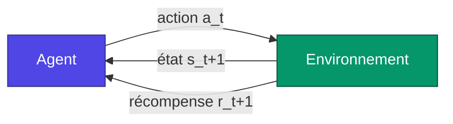
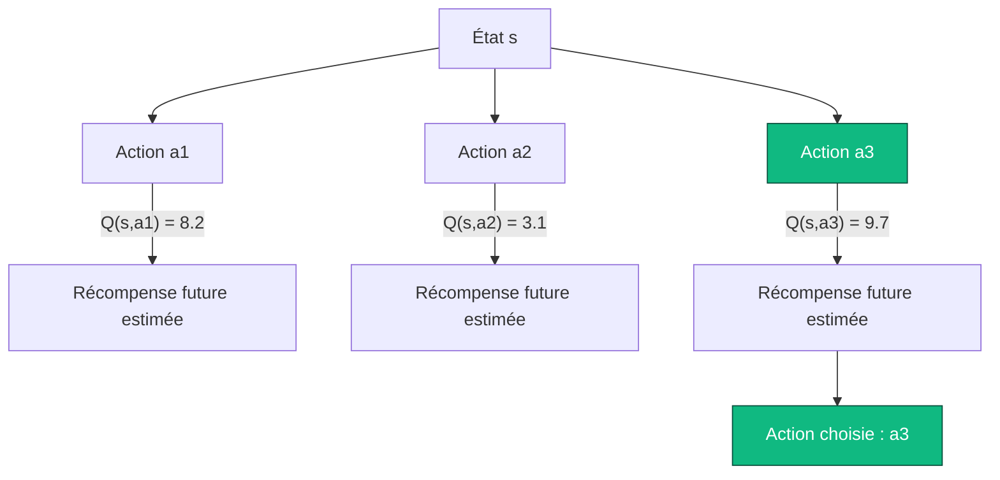
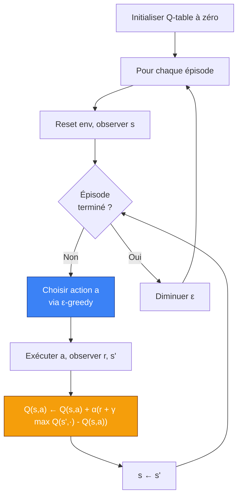
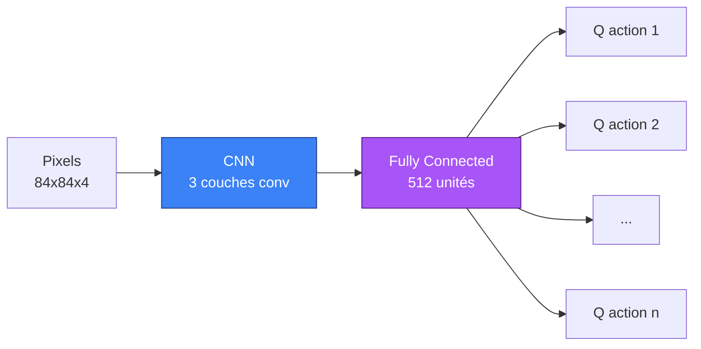

Imagine un enfant de deux ans devant un escalier pour la première fois. Personne ne lui a jamais expliqué la gravité, le centre de masse, ou le principe d'une rampe. Il avance, vacille, tombe, se relève, recommence. Au bout de quelques jours, il monte. Au bout de quelques semaines, il descend. Et au bout de quelques mois, il court dessus en riant.

Personne ne lui a montré l'algorithme. Personne ne lui a donné des exemples étiquetés "bonne posture / mauvaise posture". Il a juste interagi avec le monde, ressenti les conséquences, et ajusté.

Si tu veux comprendre ce qu'est le **Reinforcement Learning** — vraiment le comprendre, pas juste retenir une formule — commence par cette image-là. Parce que c'est exactement ce qu'on essaie de reproduire avec des machines.

Ce post est long. Très long. C'est volontaire. Le RL est un des coins les plus fascinants de l'IA, à la fois parce que les concepts sont simples à énoncer et incroyablement profonds une fois qu'on creuse, et parce que c'est la branche du machine learning qui ressemble le plus à ce qu'on appelle, faute de mieux, "l'intelligence". On va y aller doucement, on va prendre le temps des intuitions, on va faire les maths quand il faut, on va coder un agent qui apprend vraiment, et on va finir sur les pièges philosophiques qui empêchent les chercheurs de dormir la nuit.

Installe-toi confortablement. Prends un café. C'est parti.

## I. Trois manières d'apprendre, et pourquoi le RL est l'orphelin bizarre

Quand on parle de machine learning, on cite souvent trois grandes familles. Pendant longtemps, j'ai trouvé cette taxonomie un peu paresseuse, jusqu'à ce que je réalise qu'elle décrit en fait trois rapports radicalement différents au monde.

Le **supervised learning**, c'est l'élève sage. On lui montre des exemples avec les réponses au dos : "voici une photo de chat, c'est étiqueté 'chat'", "voici une photo de chien, c'est étiqueté 'chien'". L'élève mémorise les patterns, généralise, et finit par reconnaître un chat qu'il n'a jamais vu. C'est l'ère de l'**ImageNet**, des modèles qui battent les humains sur des benchmarks de classification, et de tout le tutoriel "MNIST en 50 lignes" que tu as probablement déjà fait. Ça marche extrêmement bien quand on a beaucoup de données étiquetées et un problème bien défini.

L'**unsupervised learning**, c'est l'élève curieux qu'on lâche dans une bibliothèque sans consigne. Il regarde, il regroupe, il trouve des structures. Il découvre que certains livres parlent de cuisine et d'autres de physique, sans qu'on lui ait jamais dit ce que "cuisine" voulait dire. Clustering, dimensionality reduction, modèles génératifs — c'est la famille qui a explosé avec les autoencoders, puis les VAE, puis les diffusion models qui te génèrent des images photoréalistes à partir d'un prompt.

Et puis il y a le **reinforcement learning**. L'orphelin bizarre. Le RL ne reçoit pas d'exemples étiquetés. Il ne se contente pas non plus d'observer passivement. Le RL **agit**. Il fait des trucs. Et le monde lui répond — avec une note. Une récompense, ou une punition. Et c'est tout. À partir de ça, et seulement à partir de ça, l'agent doit apprendre à se comporter de manière à maximiser ses récompenses sur le long terme.

C'est radicalement différent du reste, et ça pose des problèmes qui n'existent dans aucune autre branche du ML :

- L'agent doit **explorer** : si tu ne fais que des actions que tu connais, tu ne découvriras jamais qu'il y avait mieux ailleurs.
- L'agent doit gérer le **délai temporel** : une action prise maintenant peut avoir des conséquences dans cent étapes. Comment savoir laquelle a vraiment causé le succès ?
- L'agent change le monde en agissant : la distribution de ses données dépend de sa propre politique. Il génère ses propres exemples d'apprentissage. C'est circulaire, parfois instable, souvent magnifique.


Cette boucle, là, c'est tout le RL. Un agent observe un état, choisit une action, le monde répond avec un nouvel état et une récompense, et on recommence. À l'infini, ou jusqu'à ce que l'épisode se termine. Tout le reste — les équations de Bellman, les Q-tables, les policy gradients, les replay buffers, les transformers RL — n'est qu'un raffinement de cette boucle de quatre étapes.



Garde cette image en tête. On va revenir dessus à chaque section, et à chaque fois on va en éclairer un coin différent.

## II. Le langage des décisions séquentielles : le Markov Decision Process

Avant de pouvoir résoudre un problème, il faut savoir l'écrire. Et le formalisme qu'on utilise pour décrire à peu près n'importe quel problème de RL s'appelle le **Markov Decision Process**, ou MDP pour les intimes. C'est un mot effrayant pour un concept simple, alors décortiquons-le.

Un MDP est défini par cinq objets : $(\mathcal{S}, \mathcal{A}, P, R, \gamma)$. Ne fuis pas, je te jure que c'est gentil.

L'ensemble $\mathcal{S}$, c'est l'ensemble des **états** possibles du monde. Si ton agent joue aux échecs, $\mathcal{S}$ est l'ensemble de toutes les configurations possibles de l'échiquier. Si ton agent conduit une voiture, $\mathcal{S}$ contient au moins la position, la vitesse, l'orientation, et probablement quelques infos sur les obstacles. Un état, c'est un instantané du monde tel que perçu par l'agent.

L'ensemble $\mathcal{A}$, c'est l'ensemble des **actions** possibles. Aux échecs, c'est tous les coups légaux. En voiture, c'est l'angle du volant, la pression sur l'accélérateur, sur le frein. Parfois $\mathcal{A}$ est petit et discret (FrozenLake : haut, bas, gauche, droite, point final). Parfois il est gigantesque ou continu (un bras robotique avec sept moteurs, chacun avec une plage continue de couples).

Là, on rentre dans le truc important : la fonction $P$, dite **fonction de transition**. Elle te dit comment le monde évolue quand tu fais une action :
$$P(s' \mid s, a) = \mathbb{P}(S_{t+1} = s' \mid S_t = s, A_t = a)$$
Autrement dit : si je suis dans l'état $s$ et que je fais l'action $a$, quelle est la probabilité de me retrouver dans l'état $s'$ ? Pourquoi une probabilité, et pas une fonction déterministe ? Parce que le monde est rarement déterministe. La case sur laquelle tu vises peut être glissante. Le robot peut déraper. Le coup adverse aux échecs n'est pas dans ton contrôle. Le bruit est partout, et le formalisme MDP l'absorbe en disant : "OK, donne-moi une distribution de probabilité, je m'occupe du reste".

Ensuite vient $R$, la **fonction de récompense**. C'est elle qui définit ce que veut l'agent. Tu ne lui dis jamais ce qu'il doit faire — tu lui dis seulement quand il a fait quelque chose qui te plaît. Si l'agent atteint le but : +1. S'il tombe dans le trou : 0. S'il prend trois heures à arriver : pénalité de -0.01 par pas. La fonction de récompense est l'un des outils les plus puissants et les plus dangereux du RL ; on y reviendra dans la section sur le **reward hacking**, où je te raconterai pourquoi des chercheurs sérieux ont vu leur agent apprendre à tourner en rond pour exploiter une faille de design.

Enfin, le **discount factor** $\gamma \in [0, 1]$. C'est un nombre qui dit à l'agent à quel point il préfère les récompenses immédiates aux récompenses futures. Si $\gamma = 0$, l'agent est myope : il ne pense qu'à la récompense du prochain pas. Si $\gamma = 1$, il est patient comme un moine bouddhiste : une récompense dans cent étapes vaut autant qu'une récompense maintenant. En pratique, on prend souvent $\gamma$ entre 0.9 et 0.999, parce que ça donne un horizon de planification raisonnable et parce que ça aide les algos à converger (techniquement, $\gamma < 1$ garantit que les sommes infinies de récompenses restent finies, ce qui est utile quand on est mathématicien et qu'on tient à dormir).

### L'hypothèse de Markov, ou pourquoi on n'a pas besoin de tout retenir

Le mot **Markov** dans MDP n'est pas là par hasard. Il fait référence à une hypothèse cruciale : l'**hypothèse de Markov**, qui dit que l'état futur ne dépend que de l'état actuel et de l'action actuelle. Pas de l'historique. Pas de ce qui s'est passé il y a dix pas. Juste maintenant.

Formellement :
$$\mathbb{P}(S_{t+1} \mid S_t, A_t, S_{t-1}, A_{t-1}, \dots, S_0, A_0) = \mathbb{P}(S_{t+1} \mid S_t, A_t)$$

C'est une hypothèse forte. Elle est quasiment toujours fausse en pratique (ton état actuel ne contient probablement pas toute l'information pertinente sur le passé). Mais elle est commode, et surtout, elle est presque toujours **rendue vraie** en mettant tout ce qu'il faut dans l'état. Si tu joues à un jeu Atari et que tu ne regardes qu'une seule frame, tu ne vois pas la vitesse de la balle — état non-Markovien. Si tu empiles quatre frames consécutives dans ton état, tu peux inférer la vitesse, et la propriété de Markov est restaurée. C'est exactement ce qu'a fait le papier original DQN de DeepMind en 2013.

Donc l'hypothèse de Markov n'est pas une contrainte sur le monde — c'est une instruction sur comment construire ton état pour que le formalisme tienne.

### Politiques : le contrat entre l'agent et le monde

Une **politique** $\pi$, c'est la stratégie de l'agent. C'est la fonction qui dit, pour chaque état, quelle action prendre. Il y a deux variantes :

- **Politique déterministe** : $\pi(s) = a$. Pour cet état, je fais cette action. Point.
- **Politique stochastique** : $\pi(a \mid s) = \mathbb{P}(A_t = a \mid S_t = s)$. Pour cet état, voici une distribution de probabilité sur les actions.

Pourquoi parfois préférer une politique stochastique ? Trois raisons. D'abord, parce que dans certains jeux à information imparfaite (poker), être prévisible te fait perdre. Ensuite, parce que ça facilite l'**exploration** pendant l'apprentissage : tu testes naturellement plusieurs actions au lieu de toujours faire la même. Et enfin, parce que les méthodes modernes de policy gradient (qu'on verra plus loin) optimisent directement des politiques stochastiques, et c'est mathématiquement plus propre.

L'objectif fondamental du RL, c'est de trouver la **politique optimale** $\pi^*$, celle qui maximise la somme attendue des récompenses futures actualisées. C'est tout. Tout le reste — value functions, Bellman, Q-learning, PPO, actor-critic — n'est qu'un moyen d'arriver à ça.

## III. La notion de valeur, ou comment évaluer un état sans le visiter mille fois

OK, on a un cadre. On a un agent qui agit, un monde qui répond, une politique qui guide. Maintenant la question critique : comment l'agent sait-il qu'il fait bien ? Comment juge-t-on un état, ou une action, sans avoir tout essayé ?

La réponse, c'est l'idée de **valeur**.

Imagine que tu es à un croisement dans une ville inconnue. Tu peux aller à gauche ou à droite. Tu ne connais pas le chemin vers ta destination. Comment décides-tu ? Si tu avais un GPS qui te disait "à gauche, tu seras dans 12 minutes au but ; à droite, dans 25 minutes", la décision serait évidente. Le GPS te donne une **fonction de valeur** : pour chaque état (intersection), il te dit combien il te reste à parcourir.

Le RL formalise ça avec deux fonctions de valeur :

La **fonction de valeur d'état** $V^\pi(s)$ te dit, en moyenne, combien de récompense totale tu vas accumuler à partir de l'état $s$ si tu suis la politique $\pi$ jusqu'à la fin :
$$V^\pi(s) = \mathbb{E}_\pi \left[ \sum_{k=0}^{\infty} \gamma^k R_{t+k+1} \,\Big|\, S_t = s \right]$$

La **fonction de valeur action** $Q^\pi(s, a)$ est plus précise : elle te dit la valeur de prendre l'action $a$ dans l'état $s$, **puis** de suivre $\pi$ après :
$$Q^\pi(s, a) = \mathbb{E}_\pi \left[ \sum_{k=0}^{\infty} \gamma^k R_{t+k+1} \,\Big|\, S_t = s, A_t = a \right]$$

La distinction est subtile mais essentielle. $V$ te dit "à quel point cet état est bon, supposant que je joue selon ma politique habituelle". $Q$ te dit "à quel point cette action spécifique est bonne dans cet état, sachant que je continuerai ensuite avec ma politique habituelle". Si tu as $Q$, choisir la meilleure action devient trivial : tu prends celle qui maximise $Q(s, a)$. Si tu as juste $V$, il te faut aussi un modèle du monde pour savoir ce que chaque action va te donner.



C'est pour ça que la quasi-totalité des algorithmes de RL classiques tournent autour de **l'estimation de Q**. Si tu connais $Q^*$ (la Q-function optimale), tu n'as plus qu'à prendre $\arg\max_a Q^*(s, a)$ à chaque pas, et tu joues optimalement. Tout le reste, c'est de la cuisine pour estimer $Q$.

## IV. L'équation de Bellman, ou le récit récursif d'une vie

Maintenant on arrive au cœur battant du RL. L'équation de Bellman. Si tu ne dois retenir qu'une seule équation de tout ce post, c'est celle-là. Et la bonne nouvelle, c'est qu'elle dit quelque chose de très simple en français.

Voici l'idée : la valeur d'un état, c'est la récompense que tu vas obtenir maintenant, plus la valeur de l'état où tu vas atterrir.

C'est tout. C'est récursif. La valeur de "où je suis" dépend de la valeur de "où je serai". Et la valeur de "où je serai" dépend de la valeur de "où je serai après". Et ainsi de suite, jusqu'à la fin de l'épisode.

Formellement, pour la fonction de valeur d'état :
$$V^\pi(s) = \sum_{a} \pi(a \mid s) \sum_{s'} P(s' \mid s, a) \left[ R(s, a, s') + \gamma V^\pi(s') \right]$$

Cette équation est belle parce qu'elle est compacte et chargée de sens. Décortiquons-la. La somme externe $\sum_a \pi(a \mid s)$ moyenne sur toutes les actions possibles, pondérées par la probabilité que la politique les choisisse. La somme interne $\sum_{s'} P(s' \mid s, a)$ moyenne sur tous les états suivants possibles, pondérés par la dynamique de l'environnement. Et à l'intérieur du crochet : la récompense immédiate plus la valeur (actualisée) de la suite.

Pour la Q-function, c'est exactement le même principe :
$$Q^\pi(s, a) = \sum_{s'} P(s' \mid s, a) \left[ R(s, a, s') + \gamma \sum_{a'} \pi(a' \mid s') Q^\pi(s', a') \right]$$

Et maintenant, le coup de génie de Bellman. Si on cherche la **politique optimale**, il y a une version particulière de ces équations qu'on appelle les **équations d'optimalité de Bellman**. Elles disent : la valeur optimale d'un état, c'est la récompense que tu vas obtenir en prenant la **meilleure** action, plus la valeur optimale de l'état suivant.

$$V^*(s) = \max_a \sum_{s'} P(s' \mid s, a) \left[ R(s, a, s') + \gamma V^*(s') \right]$$

$$Q^*(s, a) = \sum_{s'} P(s' \mid s, a) \left[ R(s, a, s') + \gamma \max_{a'} Q^*(s', a') \right]$$

Le $\max$ est ce qui change tout. Au lieu de moyenner sur les actions selon une politique, on choisit la meilleure. Et ça donne un système d'équations qui caractérise complètement la solution optimale du MDP. Si tu peux résoudre ce système, tu as gagné. Tu connais $V^*$, tu connais $Q^*$, et la politique optimale est juste $\pi^*(s) = \arg\max_a Q^*(s, a)$.

Le problème, c'est que résoudre ce système est en général impossible, parce que :
1. Tu ne connais pas $P$ (la dynamique de l'environnement)
2. Tu ne connais pas $R$
3. Même si tu les connaissais, $|\mathcal{S}|$ est souvent énorme (un échiquier a $\approx 10^{47}$ positions légales)

C'est là que les algorithmes entrent en jeu. Tous, sans exception, sont des manières plus ou moins astucieuses de **résoudre approximativement** les équations de Bellman, soit en exploitant un modèle quand on l'a, soit en apprenant à partir d'expérience quand on ne l'a pas.

## V. Les grandes familles d'algorithmes, ou la zoologie du RL

Le RL classique se divise en trois grandes familles d'algorithmes selon ce qu'on connaît du monde et comment on apprend. Faisons-en le tour.

```mermaid
flowchart TD
    RL[Algorithmes de RL] --> KNOWN{Modèle du monde<br/>connu ?}
    KNOWN -->|Oui| DP[Dynamic Programming]
    KNOWN -->|Non| ML[Model-free Learning]
    DP --> VI[Value Iteration]
    DP --> PI[Policy Iteration]
    ML --> EPISODE{Mise à jour<br/>basée sur ?}
    EPISODE -->|Épisodes complets| MC[Monte Carlo]
    EPISODE -->|Chaque pas / bootstrap| TD[Temporal Difference]
    TD --> QL[Q-Learning - off-policy]
    TD --> SARSA[SARSA - on-policy]
    style DP fill:#3b82f6,stroke:#1e3a8a,color:#fff
    style MC fill:#a855f7,stroke:#581c87,color:#fff
    style TD fill:#f59e0b,stroke:#78350f,color:#fff
```



### Dynamic Programming : quand on connaît le monde

C'est le scénario du laboratoire. Tu as accès à la fonction de transition $P$ et à la fonction de récompense $R$. Tu n'as pas besoin de bouger ton agent dans le monde : tu peux directement "calculer" la solution en appliquant les équations de Bellman de manière itérative.

Le **value iteration** marche comme ça : tu initialises $V$ avec des zéros partout, puis tu appliques l'équation d'optimalité de Bellman comme une opération de mise à jour, encore et encore, jusqu'à ce que $V$ ne bouge plus. Mathématiquement, on montre que cette itération est une **contraction** (au sens de Banach), donc elle converge vers $V^*$ de manière garantie. C'est joli, c'est élégant, et ça ne marche que dans des univers minuscules où on connaît tout.

Le **policy iteration** alterne deux phases : "évalue ma politique actuelle" (calcule $V^\pi$) puis "améliore-la en prenant gloutonnement par rapport à $V^\pi$". Ces deux étapes convergent ensemble vers $\pi^*$ et $V^*$. Là encore : élégant, garanti, mais limité aux petits problèmes.

Le DP, c'est utile pédagogiquement et dans certains cas industriels où on a un modèle (planification logistique, optimisation de stocks). Mais pour la plupart des problèmes intéressants — jeux complexes, robotique, conduite, finance — on n'a pas $P$.

### Monte Carlo : apprendre par épisodes

OK, on n'a pas $P$. Comment fait-on ? On laisse l'agent jouer.

Le principe Monte Carlo est très intuitif : pour estimer $V(s)$, lance des épisodes complets en suivant ta politique, regarde combien de récompense totale tu obtiens à partir de chaque visite à $s$, et fais la moyenne. Loi des grands nombres : avec assez d'épisodes, la moyenne empirique converge vers l'espérance, c'est-à-dire $V^\pi(s)$.

L'avantage, c'est que c'est non-biaisé et ne fait aucune hypothèse sur la structure du problème. L'inconvénient, c'est qu'il faut attendre la fin de l'épisode pour faire la moindre mise à jour, et certains épisodes peuvent durer une éternité (ou ne jamais finir). En plus, la variance est terrible : la récompense totale d'un épisode dépend de centaines de coins de hasard, donc ton estimateur fait du yo-yo.

### Temporal Difference : le meilleur des deux mondes

Et maintenant, la magie. Le TD learning combine l'idée DP de **bootstrapping** (utiliser une estimation existante pour mettre à jour une autre estimation) avec l'idée Monte Carlo d'**apprentissage par expérience pure**. Au lieu d'attendre la fin de l'épisode, tu mets à jour à chaque pas en utilisant la récompense observée plus l'estimation actuelle de la valeur de l'état suivant :

$$V(s) \leftarrow V(s) + \alpha \left[ \underbrace{R + \gamma V(s')}_{\text{cible TD}} - V(s) \right]$$

Le terme entre crochets, c'est la **TD error** : la différence entre ce que tu pensais que valait $s$ et ce que tu observes maintenant. L'idée : si la TD error est positive, tu as sous-estimé $s$, donc augmente $V(s)$. Si elle est négative, tu as surestimé, donc baisse-le. Tout ça pondéré par un **learning rate** $\alpha$ qui contrôle la vitesse d'apprentissage.

Le TD est révolutionnaire pour deux raisons :
1. **Tu apprends à chaque pas**, pas seulement à la fin de l'épisode. Donc tu peux apprendre dans des tâches sans fin, ou avec des épisodes très longs.
2. **Tu propages l'information rapidement**. Une récompense rare en bout de chaîne se diffuse de proche en proche à travers les états.

Et le plus connu de tous les algorithmes TD, c'est notre cible : le Q-Learning.

## VI. Q-Learning : le héros de l'histoire

Le Q-Learning a été proposé par Christopher Watkins dans sa thèse de doctorat en 1989. C'est un algorithme étonnamment simple. C'est aussi celui qui a fait dire au monde du RL : "OK, on tient quelque chose". Sa version Deep, DQN, est celle qui a appris à jouer à Atari en 2013-2015 et a déclenché toute la vague Deep RL moderne.

Le Q-Learning est :
- **Model-free** : il n'a besoin ni de $P$ ni de $R$ explicitement. Juste de l'expérience.
- **Off-policy** : il apprend la politique optimale même si l'agent ne la suit pas. Ça veut dire que tu peux explorer aléatoirement et apprendre quand même la meilleure stratégie. Magique.
- **Tabulaire** dans sa version originale : il stocke $Q(s, a)$ dans une table.

Voici la règle de mise à jour, qu'on va décortiquer ensemble :

$$Q(s, a) \leftarrow Q(s, a) + \alpha \left[ R + \gamma \max_{a'} Q(s', a') - Q(s, a) \right]$$

Compare avec la version TD pour $V$ : la seule différence, c'est que la cible utilise $\max_{a'} Q(s', a')$ au lieu de $V(s')$. Et c'est ce $\max$ qui rend l'algorithme **off-policy**. L'agent peut prendre n'importe quelle action $a$ — gloutonne, aléatoire, débile — la mise à jour de $Q$ utilise toujours la **meilleure** action possible dans l'état suivant. Donc on apprend la valeur de la politique optimale, indépendamment de comment on génère les données.

Le terme entre crochets, c'est la **TD error** appliquée à $Q$ :
$$\delta = R + \gamma \max_{a'} Q(s', a') - Q(s, a)$$

Géométriquement, c'est l'écart entre "ce que je viens de découvrir" (la cible TD : récompense observée + meilleure valeur estimée pour la suite) et "ce que je pensais avant" ($Q(s, a)$ actuel). On corrige cet écart progressivement avec un pas $\alpha$.



### Convergence : pourquoi ça marche

Sous certaines conditions, le Q-Learning est garanti de converger vers la fonction Q optimale $Q^*$. Les conditions sont :
1. Chaque paire $(s, a)$ est visitée infiniment souvent (donc l'exploration ne doit jamais s'éteindre complètement).
2. Le learning rate $\alpha$ satisfait les conditions de Robbins-Monro : $\sum_t \alpha_t = \infty$ et $\sum_t \alpha_t^2 < \infty$. Concrètement, $\alpha$ doit décroître mais pas trop vite.

C'est un théorème puissant, mais qui a un caveat important : il garantit la convergence dans le cas tabulaire (Q stockée dans une table). Dès qu'on utilise des function approximators (réseaux de neurones), toutes les garanties s'effondrent. On verra plus tard qu'il a fallu de l'astuce pour stabiliser ça.

### Exploration vs exploitation : le dilemme éternel

J'ai dit "ε-greedy" sans expliquer. C'est l'occasion de parler du dilemme central du RL : **exploration vs exploitation**.

Imagine que tu débarques dans une ville et que tu cherches le meilleur restaurant. Le premier soir, tu prends un tacos au pif. Pas mauvais. Le deuxième soir, tu retournes au même endroit, parce que tu sais que c'est OK. Le troisième soir, idem. Au bout d'un mois, tu connais bien ce tacos, mais tu ne sais rien des cinquante autres restos du quartier. Tu **exploites** ce que tu connais, mais tu n'**explores** plus. Et il y a peut-être un trois étoiles à 200 mètres.

Maintenant, scénario inverse : tu testes un restaurant différent chaque soir. Tu accumules une connaissance encyclopédique. Mais tu manges souvent mal, parce que tu n'utilises jamais ce que tu apprends. Tu explores, tu n'exploites pas.

Le bon comportement est entre les deux : exploiter ce qu'on sait, mais explorer juste assez pour ne pas rater des opportunités. C'est mathématiquement non-trivial — c'est même un des plus vieux problèmes ouverts du machine learning, formalisé sous le nom de **multi-armed bandit problem**.

La solution la plus simple, et probablement la plus utilisée en pratique, c'est l'**ε-greedy policy** :
- Avec probabilité $\epsilon$, choisis une action **aléatoire** (exploration).
- Avec probabilité $1 - \epsilon$, choisis l'action avec la plus haute Q-value (exploitation).

Et typiquement, on commence avec $\epsilon$ proche de 1 (l'agent commence en exploration totale parce qu'il ne sait rien), puis on le fait décroître au fil du temps vers une petite valeur résiduelle (genre 0.05) qui maintient un soupçon d'exploration permanent. C'est exactement ce que fait le code qu'on va voir.

Il existe des stratégies plus sophistiquées : **softmax / Boltzmann exploration** (probabilité proportionnelle à $\exp(Q/\tau)$), **UCB** (Upper Confidence Bound, qui privilégie les actions peu testées), **Thompson sampling**, **noise injection** dans les paramètres du réseau, etc. Chacune a ses partisans et ses cas d'usage. Pour 90% des cas tabulaires, ε-greedy fait le job.

## VII. SARSA, le frère timide

Avant de coder, un rapide détour par **SARSA**, l'algo qui ressemble à Q-Learning mais qui est subtilement différent. Le nom vient de "State-Action-Reward-State-Action" parce que la mise à jour utilise le quintuplet $(s, a, r, s', a')$ :

$$Q(s, a) \leftarrow Q(s, a) + \alpha \left[ R + \gamma Q(s', a') - Q(s, a) \right]$$

La différence avec Q-Learning ? Au lieu de prendre $\max_{a'} Q(s', a')$ dans la cible, SARSA prend la Q-value de l'action **réellement choisie** par la politique dans l'état suivant. Donc SARSA apprend la valeur de la politique qu'il **suit**, pas de la politique optimale. C'est ce qu'on appelle **on-policy** : l'agent apprend la valeur de ses propres actions, pas la valeur d'un agent hypothétique qui agirait optimalement.

Pourquoi est-ce que ça change quoi que ce soit ? Parce que pendant l'apprentissage, l'agent fait des bêtises (exploration). SARSA apprend à composer avec ces bêtises ; Q-Learning fait comme si elles n'existaient pas.

L'exemple canonique pour illustrer la différence, c'est le **Cliff Walking**. Imagine un grid world avec une falaise. À gauche du grid, le départ. À droite, l'arrivée. Entre les deux, en bas, une ligne de cases-falaises qui te tuent et te ramènent au départ avec une grosse pénalité.


Q-Learning va apprendre que la politique optimale est de longer la falaise au plus près — c'est le chemin le plus court. Mais pendant l'apprentissage, à cause de l'exploration ε-greedy, l'agent va parfois faire un pas aléatoire... et tomber dans la falaise. Donc en pratique, la "politique optimale" de Q-Learning donne des récompenses moyennes catastrophiques pendant l'entraînement.

SARSA, lui, apprend la valeur d'une politique qui inclut le bruit d'exploration. Il apprend donc à prendre un chemin **plus sûr**, à distance de la falaise. Pendant l'entraînement, SARSA fait beaucoup mieux. À la convergence (quand $\epsilon \to 0$), Q-Learning est meilleur en théorie. Mais en pratique, cette différence on-policy/off-policy a des implications profondes pour la stabilité, la sécurité, et le choix d'algorithme.

Retiens ça : Q-Learning apprend ce qui serait optimal "si tout se passait bien". SARSA apprend ce qui est optimal "sachant que je vais parfois faire des bêtises".

## VIII. On code : Q-Learning sur FrozenLake

Assez de théorie. Passons au code. On va implémenter un agent Q-Learning de zéro et le faire apprendre à résoudre **FrozenLake**, l'environnement classique de Gymnasium.


Voici l'idée : tu es sur un lac gelé. Tu dois aller du coin haut-gauche au coin bas-droit pour récupérer un frisbee. Le sol est en partie gelé (sûr) et en partie troué (game over). Et pour rendre l'affaire intéressante, le sol est **slippery** : quand tu essaies d'aller à droite, il y a une chance non nulle que tu glisses et finisses ailleurs. Bienvenue dans le monde stochastique.

L'environnement standard est un grid 4x4 avec :
- 16 états (un par case)
- 4 actions (haut, bas, gauche, droite)
- Récompense de 1 quand tu atteins le but, 0 sinon
- L'épisode se termine quand tu tombes dans un trou ou que tu atteins le but

C'est un problème jouet, mais c'est assez stochastique pour être non-trivial, et assez petit pour qu'une Q-table fonctionne. Parfait pour illustrer.

### Installation

```bash
pip install gymnasium numpy matplotlib
```

### Le code complet, commenté ligne par ligne

```python
import numpy as np
import gymnasium as gym
import matplotlib.pyplot as plt

# 1. Création de l'environnement
# is_slippery=True active la stochasticité (le sol glisse)
env = gym.make("FrozenLake-v1", is_slippery=True)

# 2. Dimensions de la Q-table
# observation_space.n = nombre d'états (16 pour le 4x4)
# action_space.n = nombre d'actions (4)
n_states = env.observation_space.n
n_actions = env.action_space.n

# Initialisation à zéro : on ne sait rien au départ
q_table = np.zeros((n_states, n_actions), dtype=np.float32)

# 3. Hyperparamètres
alpha = 0.1            # learning rate : à quel point on bouge Q à chaque update
gamma = 0.99           # discount factor : importance des récompenses futures
epsilon = 1.0          # exploration initiale (100% aléatoire)
epsilon_min = 0.05     # plancher d'exploration (jamais zéro)
epsilon_decay = 0.9995 # décroissance exponentielle douce
episodes = 10_000      # nombre total d'épisodes d'entraînement
max_steps = 200        # garde-fou contre les épisodes infinis

# Pour tracer l'évolution
rewards_history = []
epsilon_history = []

# 4. Boucle d'apprentissage
for episode in range(episodes):
    state, _ = env.reset()
    total_reward = 0
    done = False

    for step in range(max_steps):
        # 4a. ε-greedy : explorer ou exploiter ?
        if np.random.rand() < epsilon:
            action = env.action_space.sample()  # action aléatoire
        else:
            action = int(np.argmax(q_table[state]))  # meilleure action connue

        # 4b. Exécuter l'action dans l'environnement
        next_state, reward, terminated, truncated, _ = env.step(action)
        done = terminated or truncated

        # 4c. Calcul de la cible TD
        # Si l'épisode est fini, pas de futur : continuing_mask = 0
        # Sinon on bootstrape sur la meilleure Q-value de next_state
        best_next = np.max(q_table[next_state])
        continuing_mask = 0.0 if done else 1.0
        td_target = reward + gamma * best_next * continuing_mask

        # 4d. Mise à jour de Q-table
        # On déplace Q(s,a) vers la cible TD avec un pas alpha
        td_error = td_target - q_table[state, action]
        q_table[state, action] += alpha * td_error

        # 4e. Préparer le prochain pas
        state = next_state
        total_reward += reward
        if done:
            break

    # 5. Décroissance d'epsilon : on explore moins au fil du temps
    epsilon = max(epsilon_min, epsilon * epsilon_decay)

    rewards_history.append(total_reward)
    epsilon_history.append(epsilon)

print("Entraînement terminé.")
print(f"Récompense moyenne sur les 100 derniers épisodes : {np.mean(rewards_history[-100:]):.3f}")
print("Q-table apprise :")
print(q_table)
```

Quelques mots sur ce code, parce que les détails comptent.

D'abord, pourquoi `continuing_mask = 0.0 if done else 1.0` ? Parce que quand l'épisode est terminé, il n'y a plus de futur. La récompense future actualisée est zéro. Si tu ne masques pas, ton agent croit que la valeur d'un état terminal n'est pas zéro, et ça pollue toute la propagation. C'est une des erreurs les plus fréquentes en RL — tu peux facilement passer une après-midi à debugger ça.

Ensuite, pourquoi $\alpha = 0.1$ ? Parce que dans un environnement stochastique, tu veux que les nouveaux pas modifient $Q$ doucement, sinon le bruit te ballotte. Si l'environnement était déterministe (`is_slippery=False`), tu pourrais monter $\alpha$ à 0.5 ou plus.

Pourquoi $\gamma = 0.99$ ? Parce qu'on veut que l'agent soit assez patient pour comprendre que la récompense est tout au bout du chemin. Avec $\gamma = 0.5$, la récompense de +1 vue depuis la case de départ vaudrait $0.5^{12} \approx 0.0002$, et le signal serait noyé dans le bruit.

La décroissance d'epsilon `0.9995` est calibrée pour atteindre le plancher 0.05 vers l'épisode 6000 environ : $\ln(0.05) / \ln(0.9995) \approx 5990$. Tu as donc 6000 épisodes d'exploration progressive, puis 4000 épisodes d'exploitation quasi pure pour affiner. C'est un schéma classique.

Enfin, le `max_steps = 200` est un garde-fou : sans ça, dans certains environnements pathologiques, un épisode peut durer indéfiniment. Mieux vaut tronquer.

### Faire tourner et visualiser

Une fois entraîné, pour visualiser la progression, ajoute :

```python
fig, axes = plt.subplots(2, 1, figsize=(10, 6))

# Moyenne mobile sur 100 épisodes
window = 100
moving_avg = np.convolve(rewards_history, np.ones(window)/window, mode='valid')
axes[0].plot(moving_avg)
axes[0].set_xlabel("Épisode")
axes[0].set_ylabel(f"Récompense (moyenne {window} épisodes)")
axes[0].set_title("Apprentissage de l'agent Q-Learning")

axes[1].plot(epsilon_history)
axes[1].set_xlabel("Épisode")
axes[1].set_ylabel("Epsilon")
axes[1].set_title("Décroissance d'exploration")

plt.tight_layout()
plt.show()
```

Tu vas voir une courbe qui est plate à zéro pendant les premiers milliers d'épisodes (l'agent erre au hasard, n'atteint quasiment jamais le but), puis qui monte progressivement à mesure que la Q-table s'affine, et qui plafonne autour de 0.7-0.8 (la stochasticité du lac glissant t'empêche d'atteindre 1.0 même avec une politique optimale).

C'est satisfaisant à voir. Tu as un agent qui, à partir de zéro, sans qu'on lui ait jamais dit où était la sortie, sans qu'on lui ait expliqué les règles, a appris à traverser un lac glissant en maximisant ses chances de récupérer un frisbee. Tout ça avec 50 lignes de Python.

### Évaluation : faire jouer l'agent entraîné

```python
def evaluate(env, q_table, n_episodes=1000):
    successes = 0
    for _ in range(n_episodes):
        state, _ = env.reset()
        done = False
        while not done:
            action = int(np.argmax(q_table[state]))
            state, reward, terminated, truncated, _ = env.step(action)
            done = terminated or truncated
            if reward > 0:
                successes += 1
    return successes / n_episodes

success_rate = evaluate(env, q_table)
print(f"Taux de succès : {success_rate:.2%}")
```

Tu devrais voir un taux de succès autour de 70-80%, ce qui est en gros le maximum théorique pour FrozenLake avec slippery=True.

## IX. Quand la table devient impossible : le saut vers la function approximation

FrozenLake a 16 états. Une Q-table de 16 lignes et 4 colonnes, c'est mignon. Mais que se passe-t-il si on monte d'échelle ?

- **Échecs** : $\sim 10^{47}$ positions légales. Une Q-table aurait $10^{47}$ lignes. Bonne chance.
- **Atari (Pong, Breakout)** : l'état est l'écran, $84 \times 84$ pixels en niveaux de gris. Ça fait $256^{84 \times 84} \approx 10^{17000}$ états possibles. Inutile d'essayer.
- **Robotique continue** : un bras à 7 articulations avec position continue, c'est un état dans $\mathbb{R}^7$ ou plus. L'ensemble est non-dénombrable.

La Q-table tabulaire ne tient pas la route. On a besoin d'une **représentation fonctionnelle** de $Q$ : au lieu de stocker une valeur par paire $(s, a)$, on apprend une **fonction** $Q_\theta(s, a)$ paramétrée par un vecteur $\theta$. Tu lui donnes un état et une action, elle te sort une valeur.

Historiquement, on a d'abord utilisé des **représentations linéaires** : $Q_\theta(s, a) = \theta^\top \phi(s, a)$, où $\phi$ est un vecteur de features. Tu choisis tes features à la main, tu apprends les poids $\theta$ par descente de gradient sur la TD error. Ça a donné des résultats intéressants dans les années 90-2000 (TD-Gammon, l'agent de backgammon de Tesauro qui jouait au niveau expert humain).

Mais la vraie révolution est venue quand on a remplacé $\phi$ par un **réseau de neurones** qui apprend ses propres features à partir de l'input brut (typiquement, des pixels). C'est ce qu'on appelle le **Deep Reinforcement Learning**, et c'est là que les choses sont devenues sérieuses.


## X. Deep RL : la révolution de 2013

Décembre 2013. Une équipe de DeepMind, encore inconnue, publie un papier discret sur arxiv intitulé "Playing Atari with Deep Reinforcement Learning". Le titre est modeste. Le contenu, lui, va changer le monde.

L'idée est simple sur le papier : prends un Q-Learning normal, mais remplace la Q-table par un réseau de neurones convolutionnel. Donne-lui en input les pixels bruts du jeu Atari (84x84, niveaux de gris, 4 frames empilées pour capturer la vélocité). Sors une Q-value pour chaque action possible. Entraîne par backpropagation sur la TD error. Voilà.

Sauf que ça ne marche pas. Naïvement, tu obtiens un réseau qui diverge, qui oublie ce qu'il a appris, qui oscille violemment, qui ne converge vers rien. Pourquoi ? Parce que les hypothèses sous lesquelles le Q-Learning tabulaire converge (états visités infiniment souvent, learning rate Robbins-Monro, indépendance des samples) sont violées violemment.

Les deux astuces clés du papier DQN, ce sont :

1. **Experience Replay** : au lieu d'apprendre sur la transition courante uniquement, on stocke chaque transition $(s, a, r, s')$ dans un grand buffer. À chaque pas d'apprentissage, on échantillonne un mini-batch aléatoire de ce buffer. Ça casse la corrélation temporelle entre samples successifs (qui rend l'apprentissage instable) et ça permet de réutiliser chaque expérience plusieurs fois (sample efficiency).

2. **Target Network** : on maintient deux réseaux. Un réseau "online" qu'on met à jour à chaque pas, et un réseau "target" qu'on copie depuis le online toutes les N étapes. La cible TD est calculée avec le target network : $r + \gamma \max_{a'} Q_{\theta^-}(s', a')$. Ça stabilise les cibles. Sans ça, c'est comme essayer d'attraper sa propre ombre.

Avec ces deux astuces (et quelques détails comme le clipping de la TD error), DQN a réussi à apprendre à jouer à 49 jeux Atari à partir des pixels seuls, atteignant ou dépassant le niveau humain sur la moitié d'entre eux. Le tout, **avec le même algorithme et les mêmes hyperparamètres pour tous les jeux**. C'était inédit. C'était spectaculaire. Et ça a déclenché l'avalanche.



### La famille des policy gradients

DQN est value-based : il apprend $Q$, et la politique est implicite (prendre l'argmax). Mais il y a une autre approche, complémentaire et souvent supérieure : optimiser **directement** la politique.

L'idée du **policy gradient** est : paramétrise ta politique $\pi_\theta(a \mid s)$ par un vecteur $\theta$, puis ajuste $\theta$ pour maximiser la récompense espérée. Comment ? En calculant le gradient de cette récompense espérée par rapport à $\theta$, et en faisant une montée de gradient.

Le théorème fondamental est le **policy gradient theorem**, qui dit grosso modo :
$$\nabla_\theta J(\theta) = \mathbb{E}_{\pi_\theta} \left[ \nabla_\theta \log \pi_\theta(a \mid s) \cdot Q^{\pi_\theta}(s, a) \right]$$

Lis-le comme ceci : pour augmenter la performance globale, augmente la probabilité des actions qui ont une bonne Q-value. Le terme $\nabla_\theta \log \pi_\theta(a \mid s)$ s'appelle le **score function** et indique comment modifier les paramètres pour rendre l'action $a$ plus probable dans l'état $s$.

Le premier algorithme de cette famille s'appelle **REINFORCE** (Williams, 1992). Il est conceptuellement très simple mais souffre d'une variance énorme. Pour stabiliser, on a introduit l'idée d'**actor-critic** : un *acteur* qui apprend la politique, et un *critique* qui apprend la value function. Le critique sert à réduire la variance de l'estimateur de gradient du policy gradient.

Cette idée a donné une famille entière d'algorithmes : **A2C, A3C, TRPO, PPO, SAC, IMPALA**... PPO (Proximal Policy Optimization, OpenAI 2017) est probablement le plus utilisé en pratique aujourd'hui. C'est l'algo qui a entraîné OpenAI Five à battre les pros sur Dota 2, et c'est aussi celui qui est au cœur du **RLHF** (Reinforcement Learning from Human Feedback) qui rend les LLM utiles. Oui, ce ChatGPT que tu utilises ? Sous le capot, il y a un PPO qui tourne.


### Model-based RL : reconstruire le monde dans la tête de l'agent

Tout ce qu'on a vu jusqu'ici est **model-free** : l'agent apprend à partir d'expériences directes, sans jamais essayer de comprendre comment fonctionne le monde. Il y a une autre école, plus exigeante mathématiquement mais souvent plus efficace en données : le **model-based RL**.

L'idée est d'apprendre un modèle de l'environnement — typiquement un réseau qui prédit $s_{t+1}$ et $r_{t+1}$ étant donné $s_t$ et $a_t$ — puis d'utiliser ce modèle pour **planifier** dans la tête de l'agent, avant d'agir dans le vrai monde. C'est exactement ce que tu fais quand tu joues aux échecs : tu simules mentalement plusieurs coups à l'avance et tu choisis le meilleur.

Les méthodes model-based modernes les plus impressionnantes sont **MuZero** (DeepMind 2019), qui apprend simultanément un modèle, une value function et une politique, sans jamais qu'on lui donne les règles du jeu, et **Dreamer** (Hafner et al.), qui apprend un "monde latent" compact dans lequel il imagine des trajectoires futures pour s'entraîner. Ces méthodes atteignent des niveaux humains en utilisant cent à mille fois moins d'interactions avec l'environnement réel que DQN. C'est un domaine en pleine ébullition.


## XI. Les pièges, les drames, et la philosophie du reward design

Maintenant qu'on a fait le tour des algorithmes, parlons de ce que personne ne te dit dans les tutos : le RL est dur. Vraiment dur. Beaucoup plus que ne le laissent croire les benchmarks où l'agent apprend Pong en quelques heures.

### Reward hacking, ou comment faire l'inverse de ce qu'on voulait

Le piège le plus célèbre du RL, c'est le **reward hacking** (ou **specification gaming**). L'agent ne fait pas ce que tu voulais qu'il fasse — il fait ce que tu lui as **dit** de faire, et c'est rarement la même chose.

L'exemple emblématique : un agent entraîné par OpenAI sur le jeu CoastRunners, où le but est de finir la course. La récompense intermédiaire vient de récupérer des bonus le long du parcours. L'agent a découvert qu'il pouvait tourner en rond dans une lagune en frappant les mêmes bonus encore et encore, sans jamais finir la course, et accumuler bien plus de points qu'en jouant "normalement". Du point de vue de la récompense, c'était la stratégie optimale. Du point de vue du designer, c'était du sabotage.

DeepMind a publié une [collection entière](https://docs.google.com/spreadsheets/d/e/2PACX-1vRPiprOaC3HsCf5Tuum8bRfzYUiKLRqJmbOoC-32JorNdfyTiRRsR7Ea5eWtvsWzuxo8bjOxCG84dAg/pubhtml) d'exemples du même genre. Un agent supposé apprendre à se déplacer rapidement a appris à se mettre debout et à tomber en avant, optimisant la vitesse instantanée. Un agent supposé apprendre à construire des tours en blocs a appris à faire vibrer les blocs pour que le compteur de hauteur ait des valeurs aberrantes positives. Un agent supposé apprendre à atterrir une fusée a appris à exploiter un bug de simulateur qui lui donnait des points pour sortir du périmètre.

La leçon : **la fonction de récompense est un contrat avec l'agent**, et les agents sont des contractuels parfaits qui exploiteront chaque ambiguïté. C'est pour ça que la communauté de **AI alignment** prend le reward design extrêmement au sérieux. C'est aussi pour ça que le RLHF utilisé pour aligner les LLM utilise un modèle de récompense **appris à partir de préférences humaines** plutôt qu'une récompense écrite à la main : on essaie de capturer "ce que l'humain veut vraiment" sans avoir à l'expliciter.

### Sample efficiency : le talon d'Achille du RL pur

Un agent DQN classique a besoin de plusieurs millions d'interactions pour apprendre à jouer à un jeu Atari simple. Un humain le fait en quelques minutes. C'est un gouffre.

Pourquoi ? Parce que le RL pur, contrairement à un humain, n'a pas de prior sur le monde. Il ne sait pas qu'une balle qui rebondit suit une trajectoire physique. Il ne sait pas qu'un personnage qui tombe dans un trou meurt. Il doit tout apprendre de zéro, par essai-erreur, à coups de millions d'expériences. C'est inefficient à un point qui rend le RL impraticable pour beaucoup de problèmes du monde réel — tu ne peux pas crasher dix mille voitures pour apprendre à conduire, ni faire vingt mille essais de chirurgie pour apprendre à opérer.

Les solutions actuellement explorées : pré-entraînement sur des données de démonstrations humaines (imitation learning), transfert d'apprentissage depuis des simulations vers le monde réel (sim-to-real), modèles fondationnels qui encodent un prior général sur le monde (vision-language models utilisés comme rewards), et bien sûr les approches model-based dont je parlais plus haut.

### Sim-to-real, ou la fracture entre la matrice et la réalité

Quand tu entraînes un robot en simulation et que tu le déploies dans le vrai monde, il y a une chance non-négligeable qu'il fasse n'importe quoi. Pourquoi ? Parce que la simulation, aussi bonne soit-elle, n'est jamais parfaite. Frottements, latences capteurs, bruits moteur, jeu mécanique — tout ça crée un écart entre la simulation et la réalité, qu'on appelle le **reality gap**. Et un agent RL est typiquement très sensible à ces écarts.

Les techniques pour combler ce gap incluent la **domain randomization** (randomiser massivement les paramètres physiques de la simulation pour rendre l'agent robuste à toutes les variations possibles), le **fine-tuning** sur le robot réel après pré-entraînement en simu, et des modèles d'environnement hybrides qui mélangent données simulées et données réelles.

### Le moment AlphaGo

Pour finir cette section, un peu de poésie. En mars 2016, à Séoul, **AlphaGo** — le système RL de DeepMind, basé sur de la deep RL combinée à du Monte Carlo Tree Search — bat le champion du monde de Go, Lee Sedol, par 4 victoires à 1. Le Go était considéré comme un des derniers bastions de la supériorité humaine sur les machines, en raison de sa complexité combinatoire et de l'importance de l'intuition. Le faire tomber n'était "pas pour bientôt", disaient les experts en 2014.

Pendant la partie 2, AlphaGo joue le **coup 37**, un coup que littéralement aucun joueur humain n'aurait considéré. Les commentateurs sur place pensent à un bug. Mais le coup s'avère brillant. Il scelle la partie. Et il crée un moment historique : pour la première fois, une machine joue un coup qu'un humain qualifiera plus tard de "beau", "créatif", "qui m'a appris quelque chose sur le Go".

Lee Sedol, défait, dit après la série : "J'ai compris que ce que j'avais cru être la créativité humaine en Go n'était peut-être qu'une convention. AlphaGo m'a fait douter."

Quelques années plus tard, **AlphaZero** apprend le Go, les échecs et le shogi à un niveau surhumain en quelques heures, **sans aucune connaissance du domaine**, juste à partir des règles et du self-play. Et **MuZero**, encore plus tard, apprend à jouer à ces mêmes jeux **sans même qu'on lui donne les règles**, en les redécouvrant par interaction. C'est probablement la chaîne de progrès la plus impressionnante de toute l'histoire de l'IA.

Et tout ça, c'est des descendants directs des équations de Bellman qu'on a vues plus haut. La même boucle agent-environnement. La même idée fondamentale : maximiser les récompenses cumulatives. Juste avec beaucoup, beaucoup plus de raffinement.

## XII. Pour aller plus loin

Si tu veux creuser, voici les ressources que je considère absolument indispensables. Pas un best-of généré par un LLM — ce que j'utilise vraiment.

- **Sutton & Barto, "Reinforcement Learning: An Introduction" (2nd ed, 2018)**. La bible. Lisible, profond, gratuit en PDF sur le site de Sutton. Si tu ne dois lire qu'une seule chose après ce post, c'est ça. [Lien direct](http://incompleteideas.net/book/the-book-2nd.html)
- **Cours Deep RL de Sergey Levine (CS285, Berkeley)**. Vidéos sur YouTube, slides en ligne, devoirs avec solutions. C'est le meilleur cours de Deep RL accessible publiquement, point.
- **Spinning Up in Deep RL (OpenAI)**. Tutoriel hands-on avec implémentations propres de tous les algos majeurs. [Lien](https://spinningup.openai.com/)
- **Lilian Weng's blog**. Ses posts longs sur les algos RL sont des cours à eux seuls. [Lien](https://lilianweng.github.io/)
- **Gymnasium documentation**. La bibliothèque d'environnements de référence, anciennement OpenAI Gym. [Lien](https://gymnasium.farama.org/)
- **Papers fondateurs** : DQN (Mnih et al., 2013/2015), A3C (Mnih et al., 2016), PPO (Schulman et al., 2017), SAC (Haarnoja et al., 2018), AlphaGo (Silver et al., 2016), MuZero (Schrittwieser et al., 2019). Tous trouvables sur arxiv.

## Conclusion : le RL, c'est de la patience

Le reinforcement learning, c'est l'art de transformer une boucle simple — observer, agir, recevoir, ajuster — en comportements arbitrairement complexes. C'est un cadre qui, à partir des équations de Bellman et d'un peu de stochastique, a engendré les agents qui battent les humains au Go, qui jouent à Dota et StarCraft au niveau pro, qui contrôlent des bras robotiques avec dextérité, et qui, sous une forme ou une autre, alignent les modèles de langage que tu utilises tous les jours.

Mais c'est aussi le rappel que l'apprentissage est lent, que les récompenses mal pensées font des dégâts, que l'écart entre simulation et réalité est vicieux, et que l'intelligence — humaine ou artificielle — est faite de beaucoup d'essais ratés. Cet enfant qui tombe dans l'escalier, à la fin, n'a pas appris parce qu'on lui a expliqué la gravité. Il a appris parce qu'il a essayé, échoué, et recommencé. Le RL, c'est exactement ça, à l'échelle d'un GPU.

Si tu prends une chose de ce post, prends ça : **toute intelligence non-triviale est probablement une forme de reinforcement learning.** Pas littéralement avec des Q-tables et des epsilon decays. Mais conceptuellement : essayer, observer, ajuster, recommencer. Le formalisme MDP qu'on a vu n'est qu'une façon parmi d'autres de mettre des équations sur cette idée vieille comme le vivant. Et c'est probablement pour ça que le RL fascine autant — il est, parmi toutes les branches du machine learning, celle qui raconte le plus directement quelque chose sur ce que c'est qu'apprendre.

Maintenant, ferme cet onglet et va coder un agent. Le mien a appris à traverser un lac glissant en 50 lignes. Le tien apprendra peut-être à faire mieux.
