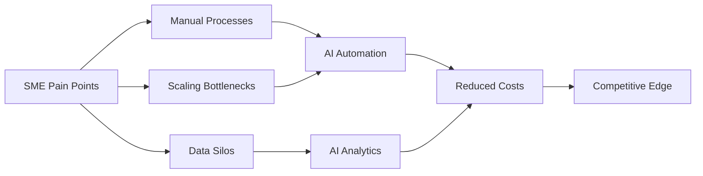
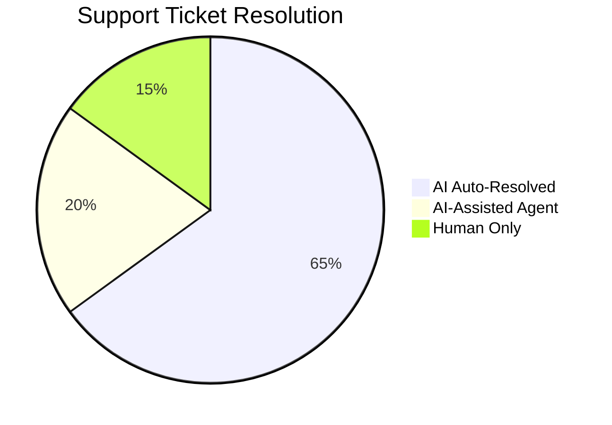
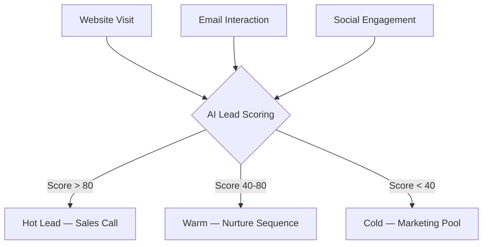
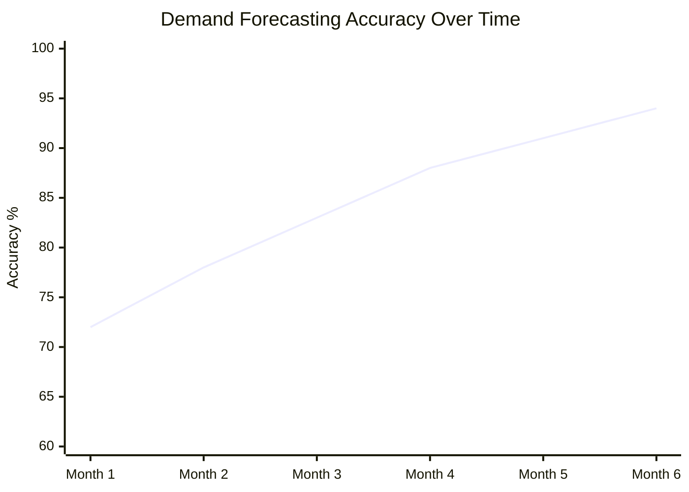
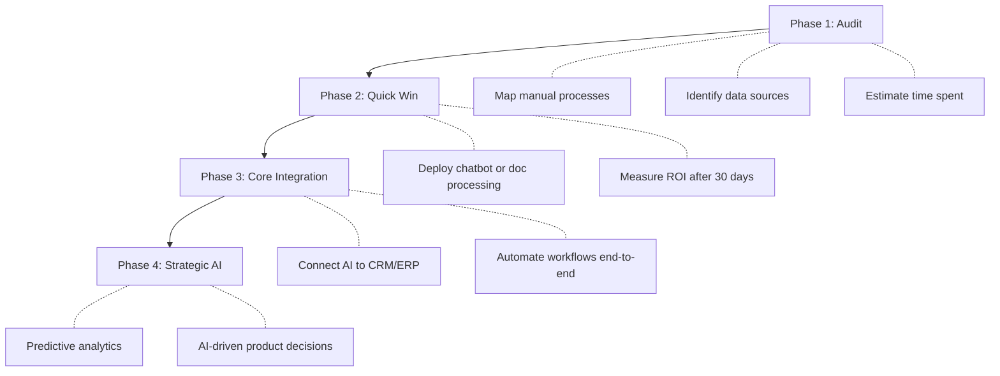
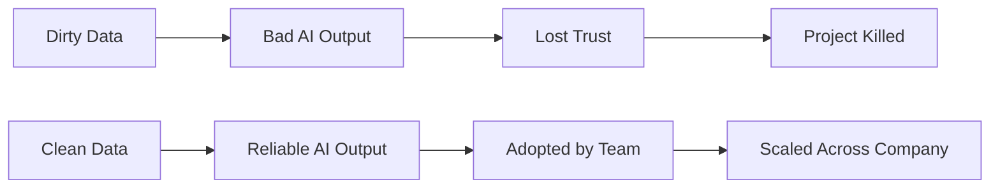
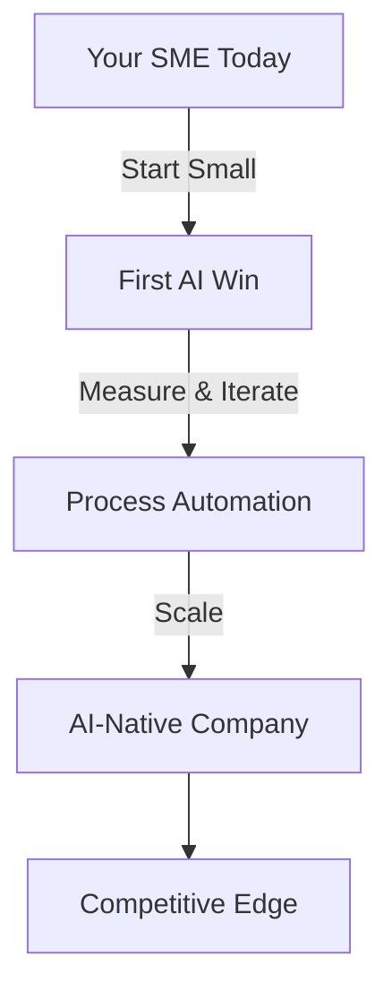

## Die Landschaft hat sich verändert

Jahrelang war KI ein Luxus, der Tech-Giganten mit riesigen R&D-Budgets vorbehalten war. **Diese Ära ist vorbei.** Die Inference-Kosten sind in drei Jahren um das 100-Fache gesunken. Open-Source-Modelle konkurrieren mit proprietären Modellen. Cloud-APIs erlauben dir, pro Request zu zahlen, nicht pro Rechenzentrum.

Das Ergebnis? Ein Logistikunternehmen mit 15 Mitarbeitern kann jetzt automatisieren, wofür früher ein 50-köpfiges Back Office nötig war. Eine lokale E-Commerce-Marke kann personalisierte Marketingkampagnen fahren, die mit Amazon mithalten. Die Frage ist nicht mehr, *ob* KMU KI einführen sollten — sondern *wo man anfängt*.



## Wo KI wirklich ROI generiert

Lassen wir den Hype beiseite. Nicht jede KI-Anwendung ist die Investition wert. Hier liefern KMU konsistent messbare Returns:

### 1. Automatisierung des Customer Support

Der unmittelbarste Gewinn. KI-Chatbots sind erwachsen geworden — Schluss mit frustrierenden Menübäumen, stattdessen echte, hilfreiche Assistenten. Ein gut konfiguriertes LLM-basiertes Support-System kann **60 bis 80 % der Tier-1-Tickets** abwickeln — und Kunden bevorzugen es oft.



**Echte Zahlen von einem SaaS mit 30 Mitarbeitern:**
- Vor KI: 3 Support-Agents, durchschnittliche Reaktionszeit 4 Std.
- Nach KI: 1 Support-Agent + KI, durchschnittliche Reaktionszeit 12 Min.
- Monatliche Einsparungen: ~6.000 €

### 2. Dokumentenverarbeitung & Data Entry

Schadensmeldungen. Rechnungen. Verträge. Compliance-Formulare. Jedes KMU ertrinkt in Dokumenten. Moderne OCR- + LLM-Pipelines können strukturierte Daten aus chaotischen PDFs mit **95 %+ Genauigkeit** extrahieren.

```python
# Example: Invoice processing pipeline
from vision_model import extract_fields

invoice = load_pdf("invoice_2026_march.pdf")
fields = extract_fields(invoice, schema={
    "vendor": str,
    "amount": float,
    "due_date": "date",
    "line_items": [{"description": str, "qty": int, "price": float}]
})
# Automatically enters into accounting software
accounting_api.create_entry(fields)
```

Der ROI ist brutal: Eine Aufgabe, die ein Mensch in 15 Minuten erledigt, schafft die KI in 3 Sekunden. Multipliziere das mit Tausenden von Dokumenten pro Monat.

### 3. Sales Intelligence & Lead Scoring

Die meisten KMU behandeln alle Leads gleich. KI kann Verhaltenssignale analysieren — E-Mail-Öffnungen, Seitenaufrufe, Formular-Einsendungen — und Leads in Echtzeit scoren.



Unternehmen, die Lead Scoring einführen, sehen **eine Verbesserung der Conversion Rate um 30 bis 50 %** — nicht weil KI magisch ist, sondern weil Sales-Mitarbeiter keine Zeit mehr mit kalten Leads verschwenden.

### 4. Bestandsmanagement & Demand Forecasting

Für KMU aus Retail und E-Commerce sind Überbestände und Stockouts Margen-Killer. KI-Time-Series-Modelle, die auf deinen historischen Daten trainiert wurden, können die Nachfrage mit überraschender Genauigkeit vorhersagen.



Das Modell wird besser, je mehr Daten es aufnimmt. Im 6. Monat erreichen die meisten Unternehmen eine Forecasting-Genauigkeit von über 90 %.

## Die Kostenrealität

Reden wir über Geld. KMU haben keine unbegrenzten Budgets, daher hier, was KI 2026 wirklich kostet:

| Lösung | Monatliche Kosten | Setup-Zeit | Zeit bis ROI |
|----------|-------------|--------------|--------------|
| KI-Chatbot (LLM-basiert) | 200-500 € | 1-2 Wochen | 1-2 Monate |
| Dokumentenverarbeitung | 300-800 € | 2-4 Wochen | 2-3 Monate |
| Lead Scoring | 150-400 € | 1-3 Wochen | 2-4 Monate |
| Demand Forecasting | 400-1000 € | 4-8 Wochen | 3-6 Monate |
| Custom-Tools intern | 500-2000 € | 4-12 Wochen | 3-6 Monate |

> **Wichtige Erkenntnis:** Der größte Kostenfaktor ist nicht die KI selbst — es ist die Integrationsarbeit. Kalkuliere 60 % deines KI-Projektbudgets dafür ein, die KI mit deinen bestehenden Systemen zu verbinden.

## Die Implementierungs-Roadmap

Versuch nicht, alles auf einmal zu "AI-ifizieren". Hier ist der bewährte Weg:



### Phase 1: Audit (Woche 1-2)

Bevor du auch nur eine Zeile Code schreibst, mappe deine Prozesse:

- Welche Aufgaben sind **repetitiv und regelbasiert**? → Ideale Kandidaten für KI
- Wo verbringen deine Teams Zeit mit **Data Entry oder Recherche**? → Automatisieren
- Welche Entscheidungen werden **aus dem Bauch heraus statt auf Basis von Daten** getroffen? → KI-Analytics

### Phase 2: Quick Win (Woche 3-6)

Pick dir die niedrig hängende Frucht. Das ist meistens Customer Support oder Dokumentenverarbeitung. Deploy, messen, iterieren.

**Kritische Regel:** Dein erstes KI-Projekt muss innerhalb von 30 Tagen sichtbare Ergebnisse liefern. Wenn nicht, hast du das falsche Problem ausgewählt.

### Phase 3: Core Integration (Monat 2-4)

Verbinde jetzt die KI mit deinen Kernsystemen. Hier entsteht der echte, kumulative Mehrwert:

- KI liest eingehende E-Mails → erstellt Tickets → leitet sie an das richtige Team
- KI verarbeitet Rechnungen → trägt Daten in die Buchhaltung ein → markiert Anomalien
- KI scored Leads → aktualisiert das CRM → löst automatisierte Nurture-Kampagnen aus

### Phase 4: Strategic AI (Monat 4+)

Mit fließenden Daten und automatisierten Prozessen kannst du jetzt **prädiktive Entscheidungen** treffen:

- Wie wird die Nachfrage im nächsten Quartal aussehen?
- Welche Kunden laufen Gefahr abzuwandern (Churn)?
- Wo sollst du dein Marketing-Budget investieren, um den ROI zu maximieren?

## Die häufigsten Stolperfallen

Ich habe genug KI-Projekte scheitern sehen, um die Muster zu kennen:

### 1. Zu groß starten

> „Bauen wir eine Custom-KI, die unser gesamtes Ops-Team ersetzt."

Nein. Starte mit einem Prozess, einem Problem, einem messbaren Ergebnis.

### 2. Datenqualität vernachlässigen

Die KI ist nur so gut wie deine Daten. Wenn dein CRM ein Chaos ist, werden deine KI-Vorhersagen unbrauchbar sein. **Räum zuerst deine Daten auf.**



### 3. Kein Change Management

Das beste KI-System ist nutzlos, wenn dein Team es nicht verwendet. Investiere in Schulungen. Zeig ihnen, wie es *ihre* Arbeit einfacher macht, nicht wie es sie ersetzt.

### 4. Zu viel Customizing

2026 können 80 % der KI-Anforderungen von KMU mit **Off-the-shelf-Tools + leichter Konfiguration** abgedeckt werden. Das Training von Custom-Modellen sollte dein letztes Mittel sein, nicht dein erster Reflex.

## Das Fazit

KI kommt nicht auf KMU zu — sie ist schon da. Die Unternehmen, die im nächsten Jahrzehnt florieren, werden nicht die mit den größten Teams oder den tiefsten Taschen sein. Es werden diejenigen sein, die **gelernt haben, ihre Teams durch Intelligent Automation zu skalieren.**

Das Playbook ist einfach:

1. **Klein anfangen** — wähl einen schmerzhaften manuellen Prozess
2. **Alles messen** — wenn du die Verbesserung nicht quantifizieren kannst, funktioniert es nicht
3. **Schnell iterieren** — KI-Projekte sollten Ergebnisse in Wochen zeigen, nicht in Quartalen
4. **Skalieren, was funktioniert** — verdopple die Einsätze auf Erfolge, beende, was nicht liefert

Die Einstiegshürde war noch nie niedriger. Die einzige Frage ist: **Bewegst du dich schnell genug?**


