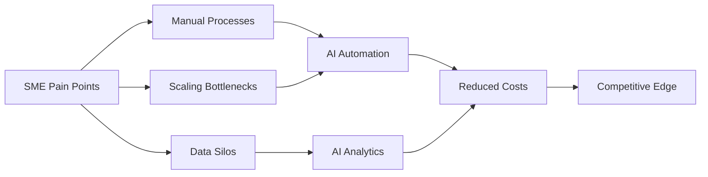
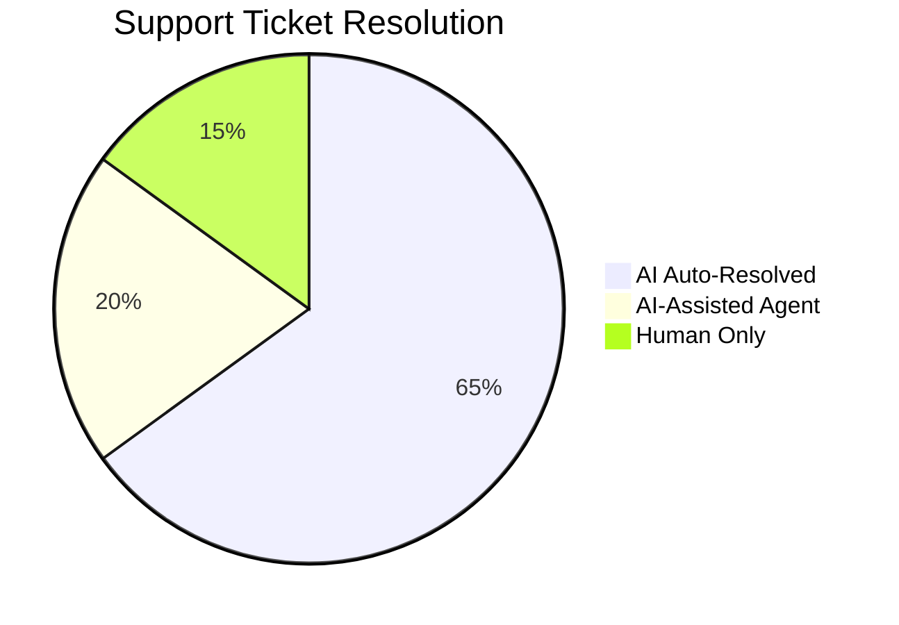
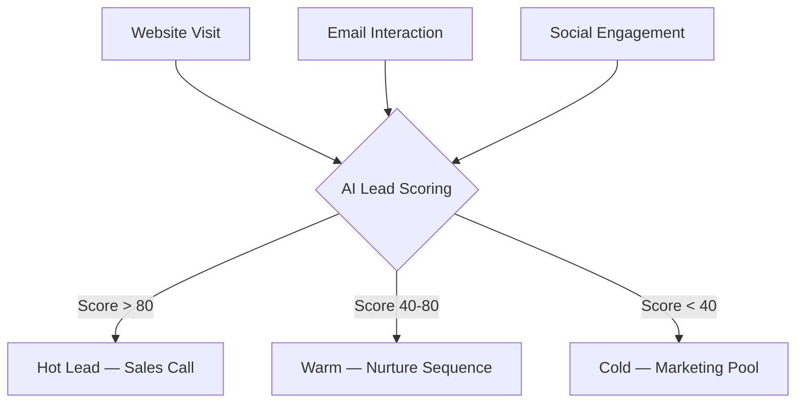
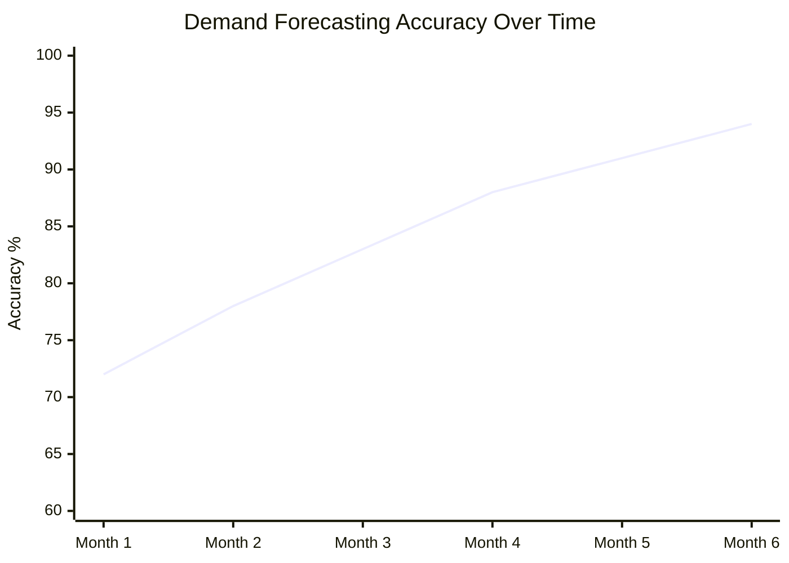
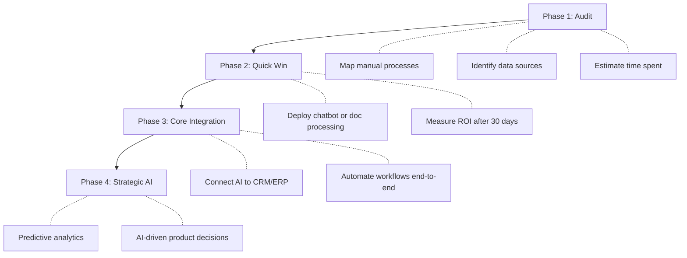
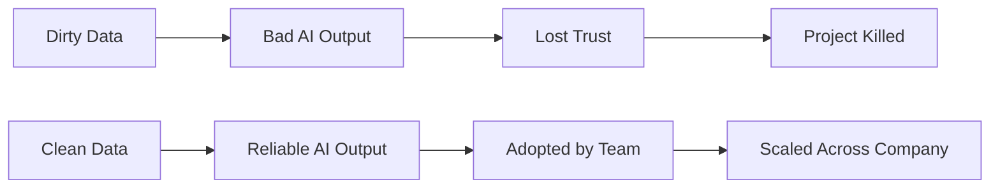
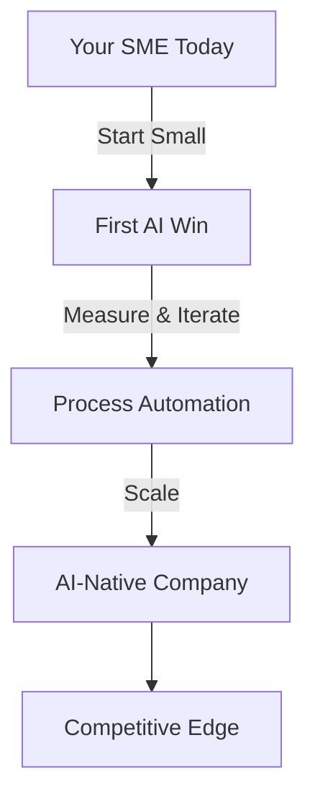

## The Landscape Has Shifted

For years, AI was a luxury reserved for tech giants with massive R&D budgets. **That era is over.** Inference costs have dropped 100x in three years. Open-source models rival proprietary ones. Cloud APIs let you pay per request, not per data center.

The result? A 15-person logistics company can now automate what once required a 50-person back office. A local e-commerce brand can run personalized marketing campaigns that rival Amazon's. The question is no longer *if* SMEs should adopt AI — it's *where to start*.



## Where AI Actually Generates ROI

Let's skip the hype. Not every AI application is worth the investment. Here's where SMEs consistently see measurable returns:

### 1. Customer Support Automation

The most immediate win. AI chatbots have grown up — gone are the frustrating menu trees, replaced by genuinely helpful assistants. A well-configured LLM-powered support system can handle **60 to 80% of tier-1 tickets** — and customers often prefer it.



**Real numbers from a 30-person SaaS:**
- Before AI: 3 support agents, 4h average response time
- After AI: 1 support agent + AI, 12min average response time
- Monthly savings: ~€6,000

### 2. Document Processing & Data Entry

Insurance claims. Invoices. Contracts. Compliance forms. Every SME is drowning in documents. Modern OCR + LLM pipelines can extract structured data from messy PDFs with **95%+ accuracy**.

```python
# Example: Invoice processing pipeline
from vision_model import extract_fields

invoice = load_pdf("invoice_2026_march.pdf")
fields = extract_fields(invoice, schema={
    "vendor": str,
    "amount": float,
    "due_date": "date",
    "line_items": [{"description": str, "qty": int, "price": float}]
})
# Automatically enters into accounting software
accounting_api.create_entry(fields)
```

The ROI is brutal: a task that takes a human 15 minutes takes AI 3 seconds. Multiply by thousands of documents per month.

### 3. Sales Intelligence & Lead Scoring

Most SMEs treat every lead the same way. AI can analyze behavioral signals — email opens, page visits, form fills — and score leads in real time.



Companies that implement lead scoring see **a 30 to 50% improvement in conversion rates** — not because AI is magical, but because sales reps stop wasting time on cold leads.

### 4. Inventory Management & Demand Forecasting

For retail and e-commerce SMEs, overstock and stockouts are margin killers. AI time-series models trained on your historical data can predict demand with surprising accuracy.



The model gets better as it ingests more data. By month 6, most companies reach forecasting accuracy above 90%.

## The Cost Reality

Let's talk money. SMEs don't have unlimited budgets, so here's what AI actually costs in 2026:

| Solution | Monthly Cost | Setup Time | Time to ROI |
|----------|-------------|--------------|--------------|
| AI Chatbot (LLM-based) | €200-500 | 1-2 weeks | 1-2 months |
| Document Processing | €300-800 | 2-4 weeks | 2-3 months |
| Lead Scoring | €150-400 | 1-3 weeks | 2-4 months |
| Demand Forecasting | €400-1000 | 4-8 weeks | 3-6 months |
| Custom Internal Tools | €500-2000 | 4-12 weeks | 3-6 months |

> **Key insight:** The biggest cost isn't the AI itself — it's the integration work. Budget 60% of your AI project for connecting AI to your existing systems.

## The Implementation Roadmap

Don't try to "AI-ify" everything at once. Here's the proven path:



### Phase 1: Audit (Week 1-2)

Before writing a single line of code, map your processes:

- Which tasks are **repetitive and rule-based**? → Ideal AI candidates
- Where do your teams spend time on **data entry or searches**? → Automate them
- Which decisions are made **on gut feeling rather than data**? → AI analytics

### Phase 2: Quick Win (Week 3-6)

Pick the lowest-hanging fruit. It's usually customer support or document processing. Deploy, measure, iterate.

**Critical rule:** Your first AI project must produce visible results within 30 days. If it doesn't, you picked the wrong problem.

### Phase 3: Core Integration (Month 2-4)

Now connect AI to your core systems. This is where real value compounds:

- AI reads incoming emails → creates tickets → routes them to the right team
- AI processes invoices → enters data into accounting → flags anomalies
- AI scores leads → updates CRM → triggers automated nurture campaigns

### Phase 4: Strategic AI (Month 4+)

With data flowing and processes automated, you can now make **predictive decisions**:

- What will demand look like next quarter?
- Which customers are at risk of churning?
- Where should you invest marketing budget to maximize ROI?

## The Common Pitfalls

I've seen enough AI projects fail to know the patterns:

### 1. Going Too Big from the Start

> "Let's build a custom AI that replaces our entire ops team."

No. Start with one process, one problem, one measurable outcome.

### 2. Ignoring Data Quality

AI is only as good as your data. If your CRM is a mess, your AI predictions will be useless. **Clean your data first.**



### 3. No Change Management

The best AI system is useless if your team doesn't use it. Invest in training. Show them how it makes *their* job easier, not how it replaces them.

### 4. Over-Customizing

In 2026, 80% of SME AI needs can be met with **off-the-shelf tools + lightweight configuration**. Training custom models should be your last resort, not your first instinct.

## The Bottom Line

AI isn't coming for SMEs — it's already here. The companies that will thrive in the next decade won't be the ones with the biggest teams or the deepest pockets. They'll be the ones that **learned how to scale their teams through intelligent automation.**

The playbook is simple:

1. **Start small** — pick one painful manual process
2. **Measure everything** — if you can't quantify the improvement, it's not working
3. **Iterate fast** — AI projects should show results in weeks, not quarters
4. **Scale what works** — double down on wins, kill what doesn't deliver

The barrier to entry has never been lower. The only question is: **are you moving fast enough?**


