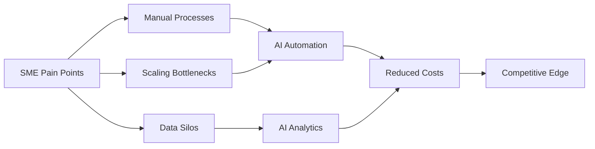
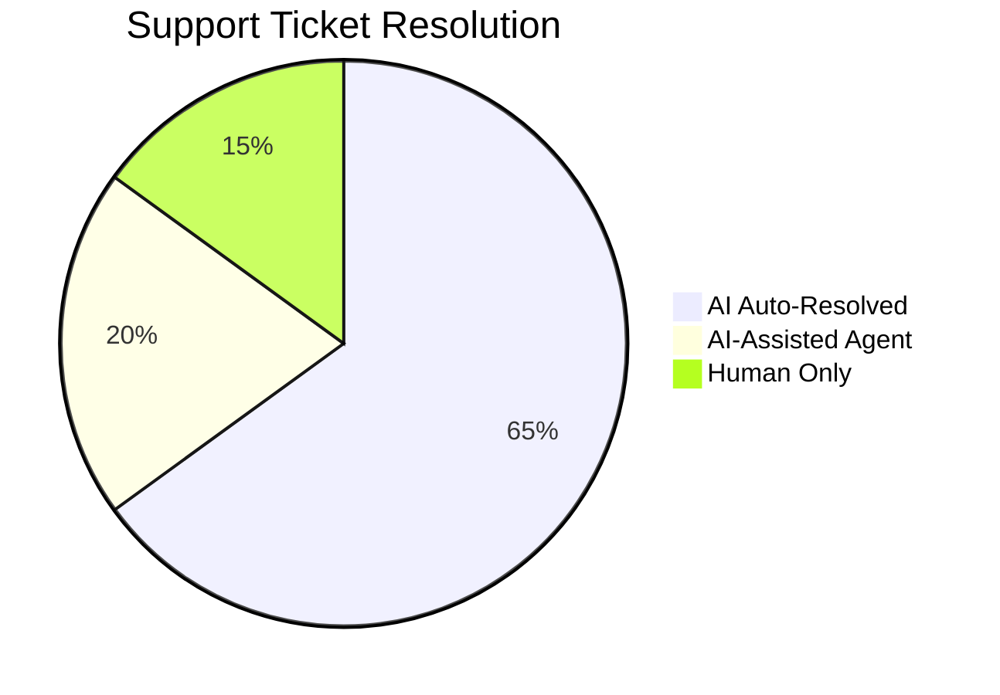
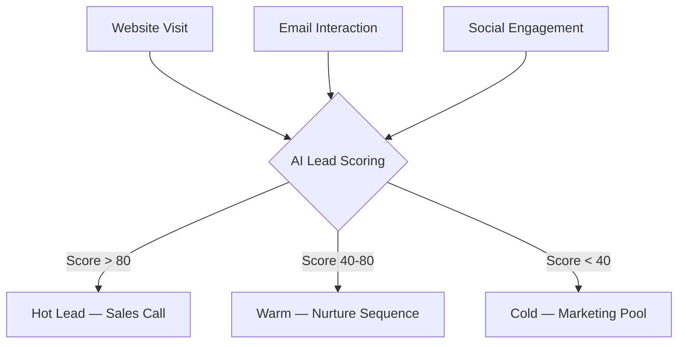
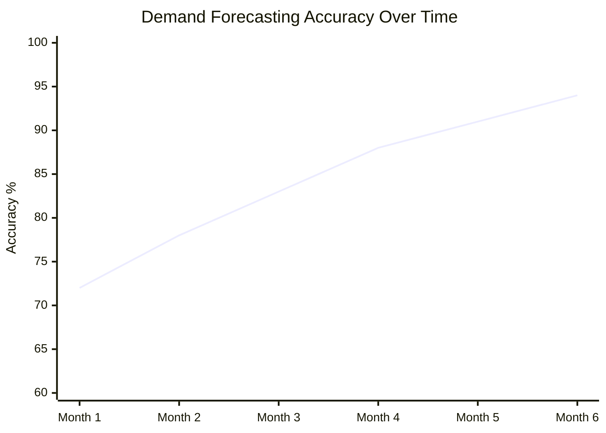
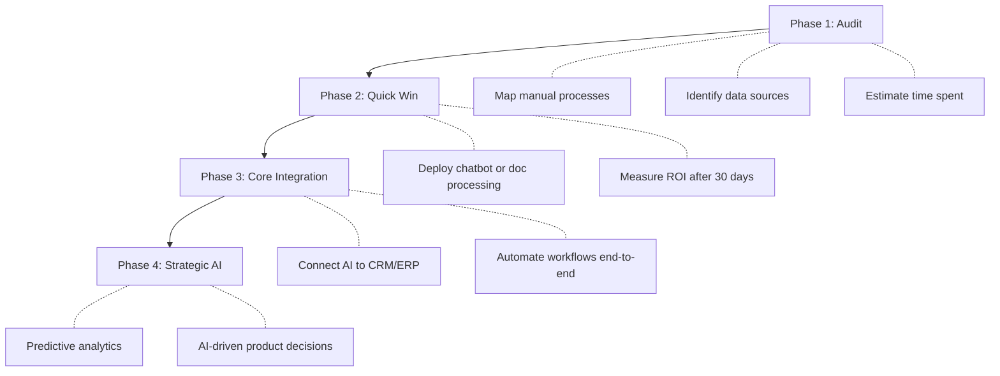
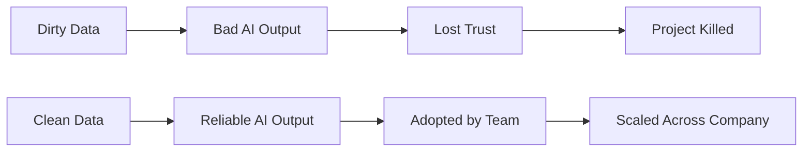
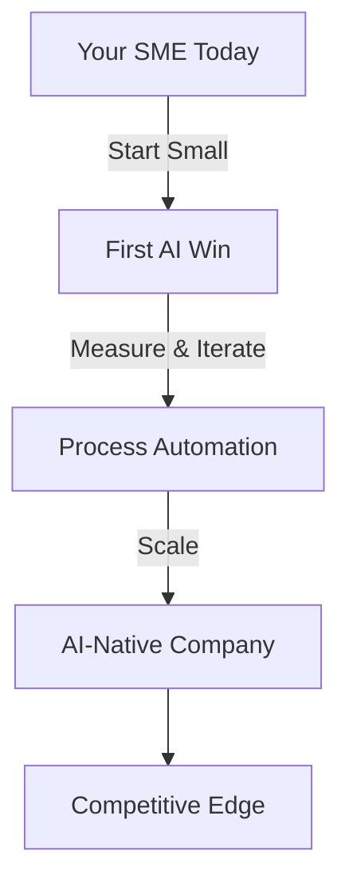

## El Panorama Ha Cambiado

Durante años, la IA fue un lujo reservado a los gigantes tech con presupuestos de R&D colosales. **Esa época ya pasó.** El coste del inference ha caído 100x en tres años. Los modelos open-source compiten con los propietarios. Las Cloud APIs te permiten pagar por request, no por data center.

¿El resultado? Una empresa de logística de 15 personas ahora puede automatizar lo que antes requería un back office de 50 personas. Una marca local de e-commerce puede lanzar campañas de marketing personalizadas que rivalizan con Amazon. La pregunta ya no es *si* las PYMES deben adoptar la IA — es *por dónde empezar*.



## Dónde la IA Genera ROI de Verdad

Dejemos el hype a un lado. No todas las aplicaciones de IA valen la inversión. Aquí es donde las PYMES obtienen retornos medibles de forma consistente:

### 1. Automatización del Customer Support

La victoria más inmediata. Los chatbots de IA han madurado — se acabaron los frustrantes árboles de menús, ahora hay verdaderos asistentes útiles. Un sistema de soporte basado en un LLM bien configurado puede resolver **entre el 60 y el 80 % de los tickets de tier-1** — y los clientes a menudo lo prefieren.



**Cifras reales de un SaaS de 30 personas:**
- Antes de la IA: 3 agentes de soporte, tiempo medio de respuesta 4h
- Después de la IA: 1 agente de soporte + IA, tiempo medio de respuesta 12 min
- Ahorro mensual: ~6.000 €

### 2. Procesamiento de Documentos & Data Entry

Reclamaciones de siniestros. Facturas. Contratos. Formularios de compliance. Cada PYME se ahoga en documentos. Los pipelines modernos de OCR + LLM pueden extraer datos estructurados de PDFs desordenados con una **precisión superior al 95 %**.

```python
# Example: Invoice processing pipeline
from vision_model import extract_fields

invoice = load_pdf("invoice_2026_march.pdf")
fields = extract_fields(invoice, schema={
    "vendor": str,
    "amount": float,
    "due_date": "date",
    "line_items": [{"description": str, "qty": int, "price": float}]
})
# Automatically enters into accounting software
accounting_api.create_entry(fields)
```

El ROI es brutal: una tarea que le lleva 15 minutos a un humano, la IA la hace en 3 segundos. Multiplícalo por miles de documentos al mes.

### 3. Sales Intelligence & Lead Scoring

La mayoría de las PYMES tratan todos los leads de la misma forma. La IA puede analizar señales de comportamiento — aperturas de emails, visitas a páginas, envíos de formularios — y puntuar los leads en tiempo real.



Las empresas que implementan lead scoring ven **una mejora del 30 al 50 % en su tasa de conversión** — no porque la IA sea mágica, sino porque los comerciales dejan de perder tiempo con leads fríos.

### 4. Gestión de Stock & Demand Forecasting

Para las PYMES del retail y el e-commerce, el sobrestock y las roturas de stock son asesinos del margen. Los modelos de IA de time-series entrenados sobre tus datos históricos pueden predecir la demanda con una precisión sorprendente.



El modelo mejora a medida que ingiere más datos. Al 6.º mes, la mayoría de las empresas alcanzan una precisión de forecast superior al 90 %.

## La Realidad de los Costes

Hablemos de dinero. Las PYMES no tienen presupuestos ilimitados, así que esto es lo que realmente cuesta la IA en 2026:

| Solución | Coste Mensual | Tiempo de Setup | Plazo de ROI |
|----------|-------------|--------------|--------------|
| Chatbot de IA (basado en LLM) | 200-500 € | 1-2 semanas | 1-2 meses |
| Procesamiento de Documentos | 300-800 € | 2-4 semanas | 2-3 meses |
| Lead Scoring | 150-400 € | 1-3 semanas | 2-4 meses |
| Demand Forecasting | 400-1000 € | 4-8 semanas | 3-6 meses |
| Tools Internos Custom | 500-2000 € | 4-12 semanas | 3-6 meses |

> **Punto clave:** El mayor coste no es la IA en sí — es el trabajo de integración. Reserva el 60 % del presupuesto de tu proyecto de IA para conectar la IA con tus sistemas existentes.

## La Roadmap de Implementación

No intentes "IA-ificar" todo de golpe. Este es el camino probado:



### Fase 1: Auditoría (Semana 1-2)

Antes de escribir una sola línea de código, mapea tus procesos:

- ¿Qué tareas son **repetitivas y basadas en reglas**? → Candidatas ideales para la IA
- ¿Dónde pasan tus equipos tiempo haciendo **data entry o búsquedas**? → Automatízalo
- ¿Qué decisiones se toman **a golpe de instinto en lugar de basadas en datos**? → AI analytics

### Fase 2: Quick Win (Semana 3-6)

Elige la fruta más fácil de alcanzar. Suele ser el customer support o el procesamiento de documentos. Deploy, mide, itera.

**Regla crítica:** Tu primer proyecto de IA debe producir resultados visibles en 30 días. Si no, has elegido el problema equivocado.

### Fase 3: Core Integration (Mes 2-4)

Ahora conecta la IA con tus sistemas clave. Aquí es donde el valor real se compone:

- La IA lee los emails entrantes → crea tickets → los enruta al equipo correcto
- La IA procesa facturas → introduce los datos en contabilidad → marca anomalías
- La IA puntúa leads → actualiza el CRM → dispara campañas de nurture automatizadas

### Fase 4: Strategic AI (Mes 4+)

Con los datos fluyendo y los procesos automatizados, ahora puedes tomar **decisiones predictivas**:

- ¿Cómo será la demanda el próximo trimestre?
- ¿Qué clientes están en riesgo de churn?
- ¿Dónde invertir el presupuesto de marketing para maximizar el ROI?

## Los Errores Más Comunes

He visto suficientes proyectos de IA fracasar como para conocer los patrones:

### 1. Apuntar Demasiado Alto desde el Principio

> «Construyamos una IA custom que reemplace a todo nuestro equipo de ops.»

No. Empieza con un proceso, un problema, un resultado medible.

### 2. Descuidar la Calidad de los Datos

La IA es tan buena como tus datos. Si tu CRM es un desastre, tus predicciones de IA serán inútiles. **Limpia tus datos primero.**



### 3. Sin Change Management

El mejor sistema de IA es inútil si tu equipo no lo usa. Invierte en formación. Muéstrales cómo hace *su* trabajo más fácil, no cómo los reemplaza.

### 4. Customizar en Exceso

En 2026, el 80 % de las necesidades de IA de las PYMES se pueden cubrir con **herramientas off-the-shelf + una configuración ligera**. Entrenar modelos custom debería ser tu último recurso, no tu primer reflejo.

## La Conclusión

La IA no viene a por las PYMES — ya está aquí. Las empresas que prosperarán en la próxima década no serán las que tengan los equipos más grandes o los bolsillos más profundos. Serán las que **hayan aprendido a multiplicar a sus equipos mediante intelligent automation.**

El playbook es simple:

1. **Empieza pequeño** — elige un proceso manual doloroso
2. **Mide todo** — si no puedes cuantificar la mejora, no está funcionando
3. **Itera rápido** — los proyectos de IA deben mostrar resultados en semanas, no en trimestres
4. **Escala lo que funciona** — dobla la apuesta en los éxitos, mata lo que no entrega

La barrera de entrada nunca ha sido tan baja. La única pregunta es: **¿vas lo suficientemente rápido?**


