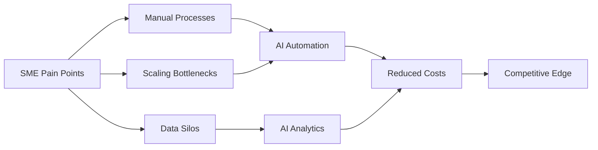
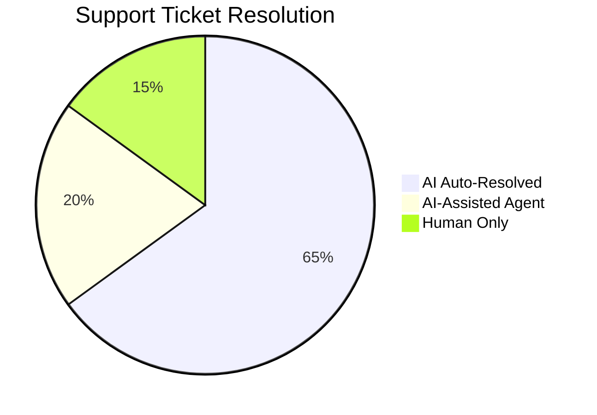
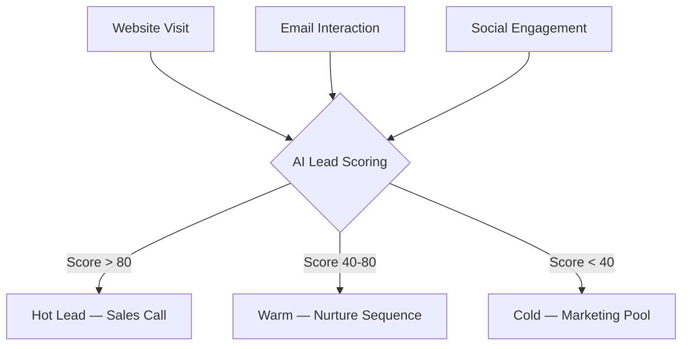
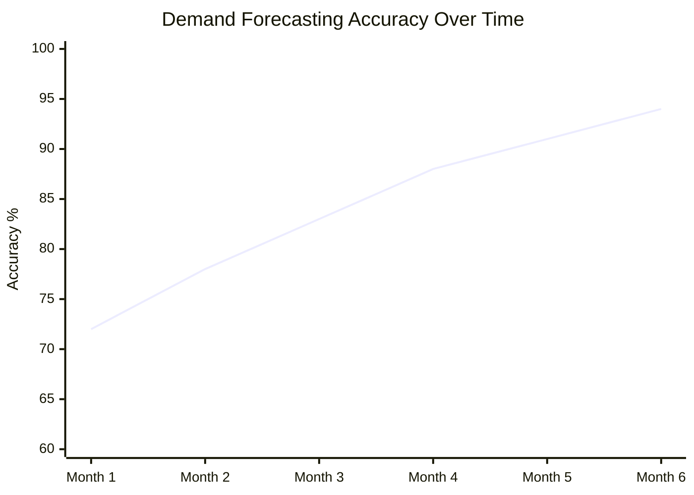
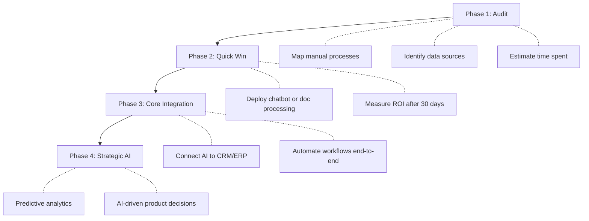
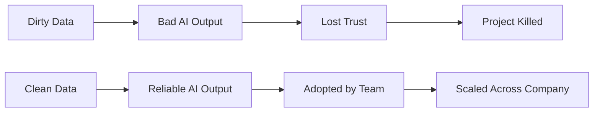
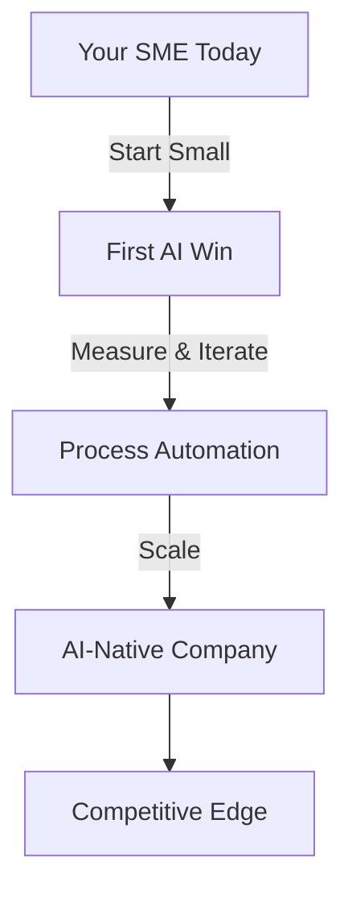

## Le Paysage a Changé

Pendant des années, l'AI était un luxe réservé aux géants de la tech avec des budgets R&D colossaux. **Cette époque est révolue.** Le coût de l'inference a chuté de 100x en trois ans. Les modèles open-source rivalisent avec les modèles propriétaires. Les Cloud APIs permettent de payer à la requête, pas au data center.

Le résultat ? Une entreprise logistique de 15 personnes peut désormais automatiser ce qui nécessitait autrefois un back office de 50 personnes. Une marque e-commerce locale peut lancer des campagnes marketing personnalisées qui rivalisent avec Amazon. La question n'est plus *si* les PME doivent adopter l'AI — c'est *par où commencer*.



## Là Où l'AI Génère Vraiment du ROI

Passons les effets d'annonce. Toutes les applications AI ne valent pas l'investissement. Voici où les PME obtiennent systématiquement des retours mesurables :

### 1. Automatisation du Support Client

Le gain le plus immédiat. Les AI chatbots ont évolué — finis les menus arborescents frustrants, place à de vrais assistants utiles. Un système de support basé sur un LLM bien configuré peut traiter **60 à 80 % des tickets de tier-1** — et les clients le préfèrent souvent.



**Chiffres réels d'une SaaS de 30 personnes :**
- Avant AI : 3 agents support, temps de réponse moyen 4h
- Après AI : 1 agent support + AI, temps de réponse moyen 12min
- Économies mensuelles : ~€6 000

### 2. Traitement de Documents & Data Entry

Déclarations de sinistres. Factures. Contrats. Formulaires de conformité. Chaque PME se noie dans les documents. Les pipelines modernes OCR + LLM peuvent extraire des données structurées depuis des PDFs désordonnés avec une **précision de 95 %+**.

```python
# Example: Invoice processing pipeline
from vision_model import extract_fields

invoice = load_pdf("invoice_2026_march.pdf")
fields = extract_fields(invoice, schema={
    "vendor": str,
    "amount": float,
    "due_date": "date",
    "line_items": [{"description": str, "qty": int, "price": float}]
})
# Automatically enters into accounting software
accounting_api.create_entry(fields)
```

Le ROI est brutal : une tâche qui prend 15 minutes à un humain prend 3 secondes à l'AI. Multipliez par des milliers de documents par mois.

### 3. Sales Intelligence & Lead Scoring

La plupart des PME traitent tous les leads de la même façon. L'AI peut analyser des signaux comportementaux — ouvertures d'emails, visites de pages, remplissages de formulaires — et scorer les leads en temps réel.



Les entreprises qui mettent en place le lead scoring voient **une amélioration de 30 à 50 % de leur taux de conversion** — non pas parce que l'AI est magique, mais parce que les commerciaux arrêtent de perdre du temps sur des leads froids.

### 4. Gestion des Stocks & Demand Forecasting

Pour les PME du retail et de l'e-commerce, le surstock et les ruptures sont des tueurs de marge. Les modèles AI de time-series entraînés sur vos données historiques peuvent prédire la demande avec une précision surprenante.



Le modèle s'améliore au fur et à mesure qu'il ingère des données. Au 6e mois, la plupart des entreprises atteignent une précision de prévision supérieure à 90 %.

## La Réalité des Coûts

Parlons argent. Les PME n'ont pas de budgets illimités, voici donc ce que l'AI coûte réellement en 2026 :

| Solution | Coût Mensuel | Temps de Setup | Délai de ROI |
|----------|-------------|--------------|--------------|
| AI Chatbot (LLM-based) | €200-500 | 1-2 semaines | 1-2 mois |
| Traitement de Documents | €300-800 | 2-4 semaines | 2-3 mois |
| Lead Scoring | €150-400 | 1-3 semaines | 2-4 mois |
| Demand Forecasting | €400-1000 | 4-8 semaines | 3-6 mois |
| Outils Internes Custom | €500-2000 | 4-12 semaines | 3-6 mois |

> **Point clé :** Le coût le plus important n'est pas l'AI elle-même — c'est le travail d'intégration. Prévoyez 60 % du budget de votre projet AI pour connecter l'AI à vos systèmes existants.

## La Roadmap d'Implémentation

N'essayez pas de tout "AI-fier" d'un coup. Voici la voie éprouvée :



### Phase 1 : Audit (Semaine 1-2)

Avant d'écrire la moindre ligne de code, cartographiez vos processus :

- Quelles tâches sont **répétitives et basées sur des règles** ? → Candidats idéaux pour l'AI
- Où vos équipes passent-elles du temps sur de la **data entry ou des recherches** ? → Automatisez
- Quelles décisions sont prises **à l'instinct plutôt que sur la data** ? → AI analytics

### Phase 2 : Quick Win (Semaine 3-6)

Choisissez le fruit le plus accessible. C'est généralement le support client ou le traitement de documents. Déployez, mesurez, itérez.

**Règle critique :** Votre premier projet AI doit produire des résultats visibles en 30 jours. Si ce n'est pas le cas, vous avez choisi le mauvais problème.

### Phase 3 : Core Integration (Mois 2-4)

Connectez maintenant l'AI à vos systèmes clés. C'est là que la vraie valeur se compose :

- L'AI lit les emails entrants → crée des tickets → les achemine vers la bonne équipe
- L'AI traite les factures → saisit les données en comptabilité → signale les anomalies
- L'AI score les leads → met à jour le CRM → déclenche des campagnes de nurture automatisées

### Phase 4 : Strategic AI (Mois 4+)

Avec les données qui circulent et les processus automatisés, vous pouvez désormais prendre des **décisions prédictives** :

- À quoi ressemblera la demande le trimestre prochain ?
- Quels clients risquent de churner ?
- Où investir le budget marketing pour maximiser le ROI ?

## Les Pièges Courants

J'ai vu suffisamment de projets AI échouer pour en connaître les schémas :

### 1. Voir Trop Grand dès le Départ

> « Construisons une AI custom qui remplace toute notre équipe opérationnelle. »

Non. Commencez par un processus, un problème, un résultat mesurable.

### 2. Négliger la Qualité des Données

L'AI n'est aussi bonne que vos données. Si votre CRM est un désordre, vos prédictions AI seront inutilisables. **Nettoyez d'abord vos données.**



### 3. Pas de Change Management

Le meilleur système AI est inutile si votre équipe ne l'utilise pas. Investissez dans la formation. Montrez-leur comment cela rend *leur* travail plus facile, pas comment cela les remplace.

### 4. Trop Customiser

En 2026, 80 % des besoins AI des PME peuvent être satisfaits avec des **outils off-the-shelf + une configuration légère**. L'entraînement de modèles custom doit être votre dernier recours, pas votre premier réflexe.

## La Conclusion

L'AI n'arrive pas pour les PME — elle est déjà là. Les entreprises qui prospéreront dans la prochaine décennie ne seront pas celles avec les plus grandes équipes ou les poches les plus profondes. Ce seront celles qui **auront appris à démultiplier leurs équipes grâce à l'intelligent automation.**

Le playbook est simple :

1. **Commencez petit** — choisissez un processus manuel douloureux
2. **Mesurez tout** — si vous ne pouvez pas quantifier l'amélioration, ça ne fonctionne pas
3. **Itérez vite** — les projets AI doivent montrer des résultats en semaines, pas en trimestres
4. **Scalez ce qui fonctionne** — doublez la mise sur les succès, éliminez ce qui ne délivre pas

La barrière à l'entrée n'a jamais été aussi basse. La seule question est : **avancez-vous assez vite ?**


