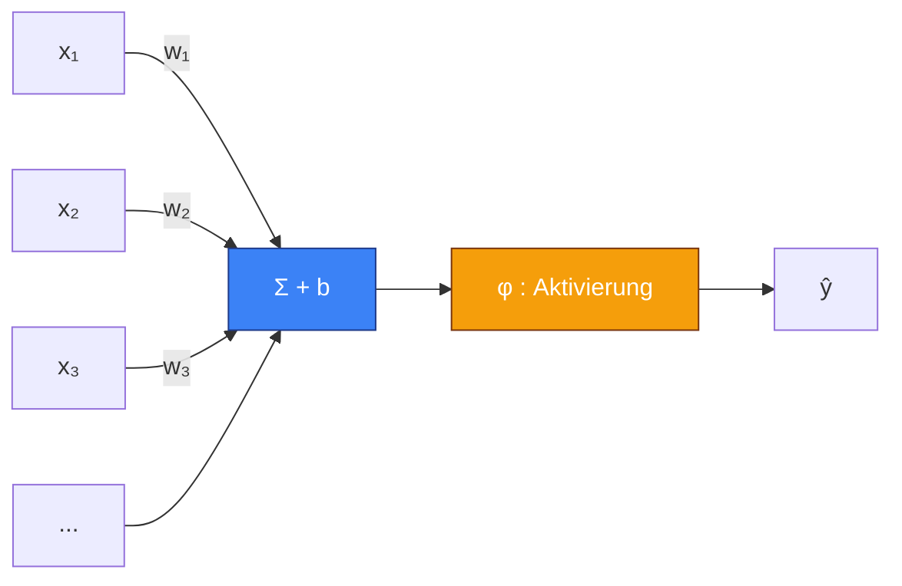
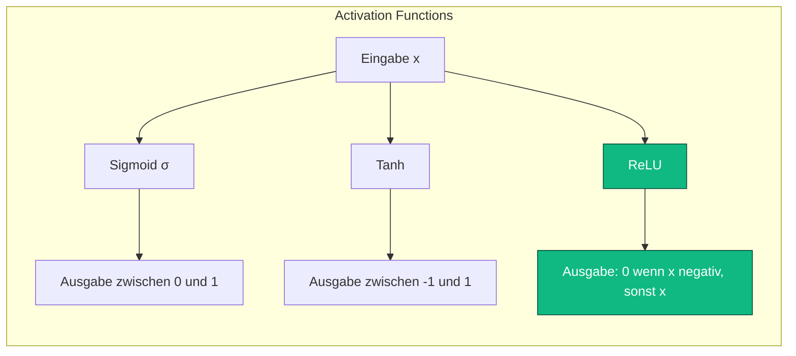
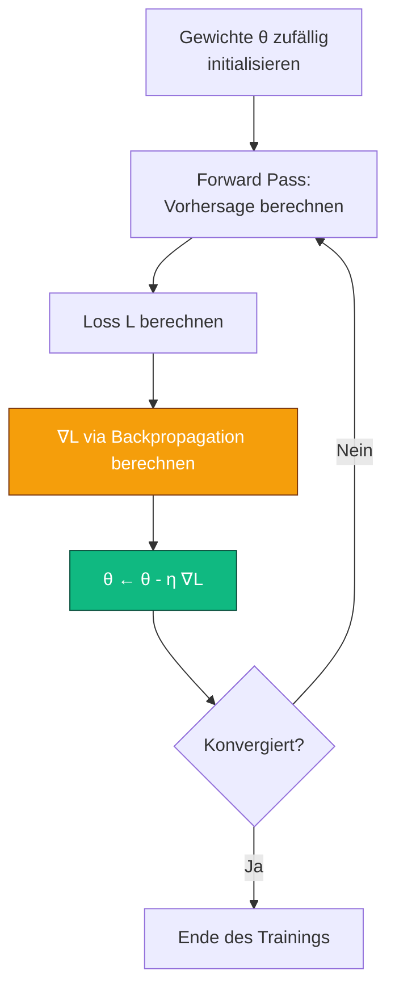

Bevor wir über Agenten sprechen, die durch Versuch und Irrtum lernen, bevor wir über Q-Learning und Bellman-Gleichungen reden, müssen wir über den Grundbaustein sprechen. Den Baustein, den du absolut überall in moderner KI findest. Den, der im Herzen deines ChatGPT steckt, in der Gesichtserkennung deines Handys, im System, das deine Mails in Spam/Nicht-Spam sortiert, und ja, auch in den meisten modernen Reinforcement-Learning-Algorithmen.

Ich rede von **neuronalen Netzen**.

Wenn du meinen Post über [RL](#/post/RL) gelesen hast, weißt du, dass ich gern in Ruhe erkläre. Dieser Post ist das natürliche Prequel. Wir gehen zurück zu den Ursprüngen. Wir verstehen, warum man sie "Neuronen" nennt (Spoiler: das ist ein bisschen geschummelt), wir leiten die Backpropagation von Hand her, wir programmieren ein kleines Netz von Grund auf in numpy, und wir schauen, wie man von einem stinknormalen Modell zu einer Architektur kommt, die Bilder klassifizieren oder Text generieren kann.

Hol dir einen Kaffee. Das sind ungefähr 20 Minuten Lesezeit.

## I. Der Traum: eine Maschine, die von selbst lernt

Gehen wir zurück ins Jahr 1950. Alan Turing veröffentlicht einen berühmten Artikel, *Computing Machinery and Intelligence*, in dem er eine einfache Frage stellt: *"Can machines think?"* Er schlägt einen Test vor — den berühmten Turing-Test — um zu bewerten, ob eine Maschine eine Konversation führen kann, die sich nicht von der eines Menschen unterscheiden lässt. Aber in einem Nebensatz schiebt Turing eine noch provokantere Idee ein: Statt zu versuchen, eine erwachsene Maschine zu programmieren, warum nicht eine Kind-Maschine programmieren und sie **lernen lassen**?

Die Idee ist revolutionär, weil sie komplett umkrempelt, wie man Informatik bis dahin verstand. 1950 bedeutet Programmieren *der Maschine Schritt für Schritt zu sagen, was sie tun soll*. Turing schlägt das Gegenteil vor: *der Maschine zu zeigen, was man will*, und sie herausfinden zu lassen, wie. Das nennt man **Machine Learning**, und der ganze Rest dieser Geschichte folgt aus dieser einen Idee.

Aber da gibt es ein lästiges Detail: Turing sagt nicht, wie man das macht. Wie kann eine Maschine überhaupt lernen? Welcher Mechanismus, welches Substrat, welche Architektur? Dafür müssen wir woanders hinschauen. Wir müssen in die Biologie schauen.

## II. Vom biologischen Neuron zum künstlichen Neuron

Dein Gehirn enthält etwa 86 Milliarden Neuronen. Jedes ist eine kleine Zelle, die im Grunde etwas ziemlich Einfaches tut: Sie empfängt elektrische Signale von anderen Neuronen über ihre Dendriten, integriert sie im Zellkörper, und wenn "genug" angesammeltes Signal da ist, sendet sie selbst ein elektrisches Signal entlang ihres Axons aus, das sich zu anderen Neuronen ausbreitet. Die Verbindungen zwischen Neuronen, die Synapsen, können stärker oder schwächer sein. Und es sind die Stärke dieser Synapsen und die räumliche Organisation des Netzes, die kodieren, was du weißt, woran du dich erinnerst und was du kannst.

Das ist eine karikaturhafte Beschreibung. Echte Neuronen sind unendlich viel komplexer — es gibt Dutzende verschiedener Neurotransmitter, feine zeitliche Dynamiken, subtile elektrochemische Phänomene, Regulationsschleifen auf jeder Ebene. Aber für unsere Zwecke reicht diese Vereinfachung. Das Gehirn ist ein riesiges Netzwerk einfacher Einheiten, die sich aufsummieren und feuern, und dessen Konnektivität Wissen kodiert.

1943 veröffentlichen zwei Forscher — der Neurophysiologe **Warren McCulloch** und der Logiker **Walter Pitts** — ein Paper, das die Grundlagen für alles Weitere legt. Sie schlagen ein radikal vereinfachtes mathematisches Modell des biologischen Neurons vor, das heute als **McCulloch-Pitts-Neuron** bekannt ist. Die Idee: Vergiss die Elektrochemie, vergiss die zeitlichen Feinheiten. Stelle ein Neuron als eine Funktion dar, die mehrere Eingaben nimmt, sie linear kombiniert und 1 oder 0 ausgibt, je nachdem, ob die Summe eine Schwelle überschreitet.

$$\text{sortie} = \begin{cases} 1 & \text{si } \sum_i w_i x_i \geq \theta \\ 0 & \text{sinon} \end{cases}$$

Es ist radikal vereinfacht. Es ist auch mathematisch handhabbar. Und es ist der Grundbaustein für alles, was danach kommt.


Dieses kleine Diagramm fasst das ganze Modell zusammen. Mehrere Eingaben $x_1, x_2, \dots, x_n$ kommen mit Gewichten $w_1, w_2, \dots, w_n$ an. Wir berechnen die gewichtete Summe $\sum_i w_i x_i$, addieren einen Bias $b$ und schicken das Ganze durch eine **Aktivierungsfunktion** $\varphi$, die entscheidet, ob das Neuron "feuert" oder nicht. Die Ausgabe ist $y = \varphi(\sum_i w_i x_i + b)$.

Das ist alles. Was wir im 21. Jahrhundert ein künstliches Neuron nennen, ist *das*. Eine gewichtete Summe, ein Bias, eine Aktivierungsfunktion. Sei nicht enttäuscht, falls dir das zu einfach vorkommt — gerade weil es einfach ist, skaliert es.

## III. Rosenblatt, das Perzeptron und das erste Versprechen

1958 nimmt Frank Rosenblatt, Psychologe und Forscher an der Cornell University, das McCulloch-Pitts-Neuron und fügt eine entscheidende Sache hinzu: einen **Lernalgorithmus**. Er nennt ihn das **Perzeptron**. Die Idee: Die Gewichte $w_i$ werden nicht mehr von Hand verdrahtet — das Perzeptron lernt sie aus Beispielen.

Die Lernregel des Perzeptrons ist entwaffnend einfach. Für jedes Beispiel $(x, y)$ in deinem Trainingsdatensatz (wobei $x$ der Input und $y \in \{0, 1\}$ das erwartete Label ist):

1. Berechne die Vorhersage $\hat{y} = \varphi(w^\top x + b)$.
2. Falls $\hat{y} = y$, tu nichts.
3. Andernfalls aktualisiere die Gewichte: $w \leftarrow w + \eta (y - \hat{y}) x$, wobei $\eta$ eine kleine Learning Rate ist.

Das ist alles. Und Rosenblatt beweist — das ist das **Perceptron Convergence Theorem** —, dass wenn die Daten **linear separierbar** sind (das heißt, es existiert eine Hyperebene, die positive Beispiele perfekt von negativen trennt), dieser Algorithmus in endlich vielen Schritten zu einer Lösung konvergiert, die alle Daten perfekt klassifiziert.

Damals war das eine Bombe. Ein Reporter der New York Times schreibt 1958, das Perzeptron sei "der Embryo eines elektronischen Computers, der laufen, sprechen, sehen, schreiben, sich reproduzieren und sich seiner eigenen Existenz bewusst sein können wird". Rosenblatt selbst spricht von Maschinen, die in naher Zukunft Bücher lesen und Flugzeuge steuern werden. Die Begeisterung ist grenzenlos.



Nur hat Rosenblatt ein Detail ausgelassen: Sein Algorithmus funktioniert nur auf **linear separierbaren** Daten. Und es zeigt sich, dass es ein lächerlich einfaches Problem mit zwei Variablen und vier Punkten gibt, das das Perzeptron nicht lernen kann. Dieses Problem ist die logische **XOR**-Funktion (Exklusiv-Oder).

## IV. XOR, der Winter und der Fall

XOR ist eine Funktion mit zwei Eingaben $x_1, x_2 \in \{0, 1\}$. Ihre Wahrheitstafel:

| $x_1$ | $x_2$ | XOR |
|-------|-------|-----|
| 0 | 0 | 0 |
| 0 | 1 | 1 |
| 1 | 0 | 1 |
| 1 | 1 | 0 |

Versuch mal, diese vier Punkte in einer Ebene einzuzeichnen. $(0,0)$ und $(1,1)$ gehören zur Klasse 0, $(0,1)$ und $(1,0)$ gehören zur Klasse 1. Suche eine Gerade, die die beiden Klassen trennt. Such ruhig in Ruhe.

Es gibt keine. Keine Gerade kann $(0,0)$ und $(1,1)$ auf die eine Seite und $(0,1)$ und $(1,0)$ auf die andere Seite bringen. Das Problem ist nicht linear separierbar. Und damit kann **Rosenblatts Perzeptron XOR per Definition nicht lernen**. Es ist keine Frage der Einstellung, keine Frage der Daten, es ist eine mathematische Unmöglichkeit der Hypothesenklasse.

1969 veröffentlichen zwei große Figuren der klassischen KI — **Marvin Minsky** und **Seymour Papert** — ein Buch (*Perceptrons*), das diese und mehrere weitere Limitierungen formalisiert. Das Buch ist streng, und seine Schlussfolgerungen sind verheerend für das "konnektionistische" Lager: Einfache Perzeptronen sind fundamental begrenzt. Minsky und Papert merken an, dass man theoretisch durch das Stapeln mehrerer Perzeptron-Schichten diese Grenzen überwinden könnte — aber dass niemand weiß, wie man solche Netze trainiert. Sie deuten an, dass es wahrscheinlich unmöglich ist.

Die Folgen für das Feld sind katastrophal. Die Finanzierung verdunstet. Labore schließen. Forscher wenden sich anderen Dingen zu. Das ist der sogenannte **erste KI-Winter**. Fast zwanzig Jahre lang werden neuronale Netze in der Wissenschaft zu einem Tabu-Thema. Daran zu arbeiten bedeutet Karriere-Selbstmord.

Und dann, 1986, ändert sich etwas.

## V. Die Rückkehr: Backpropagation und mehrschichtige Netze

1986 veröffentlicht ein Trio von Forschern — **David Rumelhart**, **Geoffrey Hinton** und **Ronald Williams** — in *Nature* einen Artikel, der das Gesicht des Feldes verändert. Sie entdecken einen Algorithmus wieder und machen ihn bekannt, der **Backpropagation** heißt (der Algorithmus war tatsächlich seit den 60er Jahren in verschiedenen Formen bekannt, aber niemand hatte sein Potenzial wirklich gesehen). Dieser Algorithmus löst genau das Problem, das Minsky und Papert für nahezu unmöglich erklärt hatten: Wie trainiert man ein neuronales Netz mit **mehreren Schichten**?

Die grundlegende Idee ist einfach: Ein mehrschichtiges Netz (oder **MLP**, Multi-Layer Perceptron) wendet eine Folge von Transformationen an. Jede Schicht nimmt die Ausgabe der vorherigen, kombiniert sie linear mit ihren eigenen Gewichten, schickt das Ergebnis durch eine Nichtlinearität und gibt es weiter an die nächste. Mit genügend Schichten und Nichtlinearitäten kann ein solches Netz theoretisch jede messbare Funktion darstellen — das ist der **Universelle Approximationssatz**. XOR zum Beispiel wird trivial mit einem MLP mit einer einzigen versteckten Schicht aus zwei Neuronen.


Hier die Grundstruktur eines MLP. Links die Eingaben (zum Beispiel die Pixel eines Bildes). In der Mitte eine oder mehrere sogenannte "versteckte" Schichten, weil sie weder Eingaben noch Ausgaben sind — sie sind der innere Repräsentationsmechanismus. Rechts die Ausgabeschicht (zum Beispiel zehn Neuronen, wenn du Ziffern von 0 bis 9 klassifizieren willst).

Das große Problem: Wenn du ein Netz mit mehreren Schichten und Tausenden von Parametern hast, kannst du sie nicht von Hand einstellen. Du brauchst einen Algorithmus, der bei einem Vorhersagefehler auf einem Beispiel weiß, wie **jedes Gewicht des Netzes** angepasst werden muss, um diesen Fehler zu reduzieren. Genau das tut die Backpropagation.

Aber bevor wir dahin kommen, brauchen wir einen Umweg über drei Konzepte: Aktivierungsfunktionen, Verlustfunktionen und Gradient Descent.

## VI. Aktivierungsfunktionen, oder warum Nichtlinearitäten essenziell sind

Stell dir einen Moment vor, du stapelst mehrere Schichten **linearer** Transformationen ohne jede Nichtlinearität dazwischen. Jede Schicht berechnet $h_i = W_i h_{i-1} + b_i$. Was passiert? Nun, mathematisch:

$$h_2 = W_2 h_1 + b_2 = W_2 (W_1 x + b_1) + b_2 = (W_2 W_1) x + (W_2 b_1 + b_2)$$

Das ist immer noch eine lineare Transformation mit einer Matrix $W' = W_2 W_1$ und einem Bias $b' = W_2 b_1 + b_2$. Anders gesagt: Tausend lineare Schichten zu stapeln gibt dir genau die gleiche Ausdruckskraft wie eine einzige lineare Schicht. Du hast nichts gewonnen. Du hast im Grunde nichts getan.

Damit die versteckten Schichten etwas bringen, braucht es eine **Nichtlinearität** zwischen jeder Schicht. Das ist die Rolle der Aktivierungsfunktion. Hier die wichtigsten:

**Die Sigmoid** (oder logistische Funktion):
$$\sigma(x) = \frac{1}{1 + e^{-x}}$$
Historisch die meistverwendete. Ihr Vorteil: Sie liefert eine Ausgabe zwischen 0 und 1, interpretierbar als Wahrscheinlichkeit. Ihr großer Nachteil: Sie ist "sättigend" — wenn $|x|$ groß wird, geht die Ableitung $\sigma'(x) = \sigma(x)(1 - \sigma(x))$ gegen null, was das Lernen einfriert. Das ist das berühmte **Vanishing-Gradient**-Problem.

**Der Tangens Hyperbolicus**:
$$\tanh(x) = \frac{e^x - e^{-x}}{e^x + e^{-x}}$$
Cousin der Sigmoid, aber bei null zentriert (seine Ausgabe liegt zwischen -1 und 1). In der Praxis oft etwas besser, aus Gründen der Initialisierung und numerischen Konditionierung. Aber er leidet unter demselben Sättigungsproblem.

**ReLU** (Rectified Linear Unit):
$$\text{ReLU}(x) = \max(0, x)$$
Die Offenbarung der 2010er Jahre. Absolut trivial, überall differenzierbar außer bei null (wir setzen per Konvention 0 oder 1, niemand merkt's), und ihre Ableitung ist auf dem gesamten aktiven Teil gleich 1. Ergebnis: keine Vanishing-Gradients mehr auf der positiven Seite und ein viel schnelleres Training in der Praxis. Nahezu alle modernen Architekturen verwenden ReLU oder eine ihrer Varianten (Leaky ReLU, ELU, GELU).



ReLU wurde zur Standard-Nichtlinearität, nachdem ein Paper von 2011 (Glorot, Bordes, Bengio) gezeigt hatte, dass sie das Training deutlich tieferer Netze erlaubt als Sigmoid oder Tanh. Ohne ReLU wahrscheinlich kein AlexNet, wahrscheinlich kein Deep Learning im großen Stil, wahrscheinlich keine aktuelle Revolution.

## VII. Verlustfunktionen: Wie misst man den Fehler?

Um "lernen" zu können, muss man erstmal messen können, wie sehr man danebenliegt. Das ist die Rolle der **Verlustfunktion** (auch *Loss Function* oder *Cost Function*). Sie ist es, die wir beim Training minimieren wollen.

Die zwei großen Familien, je nach Natur des Problems:

**Für Regression** (man sagt einen kontinuierlichen Wert voraus, etwa den Preis eines Hauses) verwendet man klassischerweise den **Mean Squared Error** (MSE):
$$L_{\text{MSE}} = \frac{1}{N} \sum_{i=1}^{N} (y_i - \hat{y}_i)^2$$
Wir bestrafen das Quadrat der Abweichung zwischen Vorhersage und Wahrheit. Große Fehler werden doppelt bestraft (was je nach Fall Bug oder Feature sein kann). Überall differenzierbar, konvex, und mit einer schönen statistischen Interpretation (äquivalent zu einem Maximum-Likelihood-Schätzer unter der Annahme gaußschen Rauschens).

**Für Klassifikation** (man sagt eine Klasse unter mehreren voraus) verwendet man fast immer die **Cross-Entropy Loss** (oder Log-Loss):
$$L_{\text{CE}} = - \frac{1}{N} \sum_{i=1}^{N} \sum_{k=1}^{K} y_{i,k} \log(\hat{y}_{i,k})$$
wobei $y_{i,k}$ gleich 1 ist, wenn Beispiel $i$ zu Klasse $k$ gehört (und 0 sonst, das ist eine "One-Hot"-Kodierung), und $\hat{y}_{i,k}$ die vom Modell vorhergesagte Wahrscheinlichkeit für diese Klasse ist. Die Cross-Entropy ist minimal, wenn das Modell die ganze Wahrscheinlichkeitsmasse auf die richtige Klasse legt. Sie wird mit einer **Softmax**-Funktion am Ausgang des Netzes kombiniert, die rohe "Logits" in eine Wahrscheinlichkeitsverteilung umwandelt:
$$\text{softmax}(z)_k = \frac{e^{z_k}}{\sum_j e^{z_j}}$$

Die Kombination Softmax + Cross-Entropy ist ein Klassiker unter den Klassikern. Du findest sie in etwa 100% aller auf neuronalen Netzen basierenden Klassifikatoren.

## VIII. Gradient Descent: Wie wir minimieren

Wir haben ein Netz. Wir haben einen Loss. Wie schaffen wir es, die Gewichte so zu verändern, dass der Loss sinkt? Hier kommt **Gradient Descent** ins Spiel.

Die Idee ist geometrisch und sehr intuitiv. Stell dir vor, du stehst mitten in einer Berglandschaft, im dichten Nebel. Du willst ins Tal hinunter. Du siehst keinen Meter weit, aber du kannst die Neigung unter deinen Füßen spüren. Was machst du? Du machst einen kleinen Schritt in die Richtung des steilsten Abstiegs. Dann noch einen. Und noch einen. Und mit etwas Glück landest du in einem Tal.

Mathematisch ist der **Gradient** einer Funktion $L$ bezüglich ihrer Parameter $\theta$ ein Vektor, der in die Richtung des steilsten **Anstiegs** zeigt. Um abzusteigen, nehmen wir also das Gegenteil:
$$\theta \leftarrow \theta - \eta \nabla_\theta L$$
wobei $\eta$ die **Learning Rate** ist — die Schrittweite. Du machst einen kleinen Schritt in die dem Gradienten entgegengesetzte Richtung. Du berechnest den Gradienten neu. Du machst noch einen Schritt. Und so weiter, bis der Loss nicht mehr sinkt.



Die Learning Rate ist der wichtigste Hyperparameter der ganzen Geschichte. Zu groß, und du "springst" über die Täler hinweg und divergierst. Zu klein, und du brauchst eine Ewigkeit zum Konvergieren. Fast alle empirischen Studien zum Training neuronaler Netze zeigen, dass das richtige Einstellen der Learning Rate wichtiger ist als die Wahl der Architektur, des Optimizers oder so ziemlich allem anderen.

## IX. Backpropagation, oder die Kunst, eine gigantische Komposition abzuleiten

Wir haben alles, was wir brauchen, außer das Wichtigste: **Wie berechnet man den Gradienten**? In einem Netz mit zehn Schichten und ein paar Millionen Parametern ist Ableiten von Hand keine Option. Wir brauchen einen systematischen Algorithmus.

Dieser Algorithmus ist die **Backpropagation**. Sein vollständiger Name lautet *Reverse-mode Automatic Differentiation, angewandt auf eine Komposition von Funktionen*, was technischer, aber ehrlicher ist.

Die tiefere Intuition hinter der Backpropagation ist die **Kettenregel** (chain rule). Wenn du eine zusammengesetzte Funktion $f(g(x))$ hast und sie ableiten willst, weißt du, dass:
$$\frac{d f(g(x))}{d x} = \frac{d f}{d g} \cdot \frac{d g}{d x}$$

Das ist die Kettenregel aus der Oberstufe. Jetzt stell dir vor, dein Netz ist eine gigantische Komposition: $L = L(f_n(f_{n-1}(\dots f_1(x))))$. Um $\frac{\partial L}{\partial w}$ zu berechnen, wobei $w$ ein Gewicht aus Schicht $i$ ist, wendest du die Kettenregel entlang des gesamten Pfades an, vom Loss bis zu $w$. Das ist alles.

Der geniale Trick bei der Backpropagation ist, dass sie diese Ableitungen **in umgekehrter Reihenfolge** berechnet, vom Ausgang zum Eingang, und dabei Zwischenergebnisse wiederverwendet. Das ist es, was die Komplexität linear in der Zahl der Parameter macht, statt quadratisch oder schlimmer.

Konkret macht der Algorithmus zwei Durchläufe:

**Forward Pass**: Wir berechnen die Aktivierungen jeder Schicht, vom Eingang zum Ausgang, und speichern alles im Speicher.

**Backward Pass**: Wir berechnen $\delta_n = \frac{\partial L}{\partial z_n}$, wobei $z_n$ die Prä-Nichtlinearitäts-Aktivierung der letzten Schicht ist. Dann propagieren wir zurück: $\delta_{i-1} = (W_i^\top \delta_i) \odot \varphi'(z_{i-1})$, wobei $\odot$ das elementweise Produkt und $\varphi'$ die Ableitung der Aktivierung ist. In jedem Schritt berechnen wir auch die Gradienten bezüglich der Gewichte der aktuellen Schicht: $\frac{\partial L}{\partial W_i} = \delta_i h_{i-1}^\top$.

Wenn dir beim Lesen dieses Absatzes der Kopf schwirrt, ist das normal. Die Backpropagation ist einer der berühmtesten Algorithmen der KI und auch einer der verwirrendsten beim ersten Verstehen. Die gute Nachricht: Heute musst du sie nicht mehr von Hand implementieren. PyTorch, JAX und TensorFlow machen das automatisch für dich, dank einer Technik namens **Autograd** (automatic differentiation). Du definierst deinen Forward Pass in Python, und das Framework berechnet die Gradienten von selbst durch symbolische Manipulation des Berechnungsgraphen.

Aber um wirklich zu verstehen, was passiert, muss man es mindestens einmal von Hand gemacht haben. Das tun wir jetzt.

## X. Implementierung: ein MLP in numpy from scratch

Genug Theorie. Programmieren wir ein kleines neuronales Netz von Grund auf, ohne Framework, nur mit numpy, um Punkte in einer Ebene zu klassifizieren. Wir machen ein "Spielzeug"-Problem: lernen, zwei ineinander verschlungene Spiralen zu trennen, ein klassischer Fall, der mit linearer Regression unlösbar, für ein MLP aber trivial ist.

```python
import numpy as np
import matplotlib.pyplot as plt

# 1. Datengenerierung: zwei ineinander verschlungene Spiralen
np.random.seed(0)
N = 200               # Punkte pro Klasse
K = 2                 # Anzahl Klassen
X = np.zeros((N * K, 2))
y = np.zeros(N * K, dtype=int)
for j in range(K):
    ix = range(N * j, N * (j + 1))
    r = np.linspace(0.0, 1, N)
    t = np.linspace(j * 4, (j + 1) * 4, N) + np.random.randn(N) * 0.2
    X[ix] = np.c_[r * np.sin(t), r * np.cos(t)]
    y[ix] = j

# One-Hot-Encoding der Labels
Y = np.zeros((N * K, K))
Y[np.arange(N * K), y] = 1

# 2. Architektur: 2 -> 16 -> 16 -> 2
input_dim, hidden_dim, output_dim = 2, 16, 2

# Gewichtsinitialisierung (He-Initialisierung, passend zu ReLU)
W1 = np.random.randn(input_dim, hidden_dim) * np.sqrt(2.0 / input_dim)
b1 = np.zeros((1, hidden_dim))
W2 = np.random.randn(hidden_dim, hidden_dim) * np.sqrt(2.0 / hidden_dim)
b2 = np.zeros((1, hidden_dim))
W3 = np.random.randn(hidden_dim, output_dim) * np.sqrt(2.0 / hidden_dim)
b3 = np.zeros((1, output_dim))

# 3. Hilfsfunktionen
def relu(x):
    return np.maximum(0, x)

def softmax(x):
    # Numerisch stabile Version
    x = x - x.max(axis=1, keepdims=True)
    ex = np.exp(x)
    return ex / ex.sum(axis=1, keepdims=True)

# 4. Hyperparameter
lr = 0.05
epochs = 2000
losses = []

# 5. Trainingsschleife
for epoch in range(epochs):
    # Forward Pass
    z1 = X @ W1 + b1
    h1 = relu(z1)
    z2 = h1 @ W2 + b2
    h2 = relu(z2)
    z3 = h2 @ W3 + b3
    probs = softmax(z3)

    # Cross-Entropy Loss
    loss = -np.mean(np.sum(Y * np.log(probs + 1e-12), axis=1))
    losses.append(loss)

    # Backward Pass
    dz3 = (probs - Y) / (N * K)                      # Gradient des Loss bzgl. z3
    dW3 = h2.T @ dz3
    db3 = dz3.sum(axis=0, keepdims=True)

    dh2 = dz3 @ W3.T
    dz2 = dh2 * (z2 > 0)                              # Ableitung von ReLU
    dW2 = h1.T @ dz2
    db2 = dz2.sum(axis=0, keepdims=True)

    dh1 = dz2 @ W2.T
    dz1 = dh1 * (z1 > 0)
    dW1 = X.T @ dz1
    db1 = dz1.sum(axis=0, keepdims=True)

    # Gewichtsupdate (vanilla SGD)
    W3 -= lr * dW3; b3 -= lr * db3
    W2 -= lr * dW2; b2 -= lr * db2
    W1 -= lr * dW1; b1 -= lr * db1

    if epoch % 200 == 0:
        preds = np.argmax(probs, axis=1)
        acc = np.mean(preds == y)
        print(f"Epoch {epoch:4d} | loss {loss:.4f} | acc {acc:.3f}")
```

Dieser Code enthält alles, was wir bisher gesehen haben. Einen expliziten Forward Pass, eine Cross-Entropy Loss und eine von Hand berechnete Backpropagation, bei der die Kettenregel Schicht für Schicht angewendet wird. Kein Framework, keine Magie, nur numpy. Copy-paste, ausführen, und in zwei Sekunden hast du ein Netz, das zwei ineinander verschlungene Spiralen korrekt klassifiziert.

Ein paar Details, die ein Innehalten verdienen. Die **He-Initialisierung** (`np.sqrt(2.0 / input_dim)`) ist die Standardmethode zum Initialisieren der Gewichte bei ReLU — sie ist so kalibriert, dass die Varianz der Aktivierungen über die Schichten hinweg stabil bleibt. Eine naive Initialisierung (etwa Gaußverteilungen mit Standardabweichung 1) liefert typischerweise ein Netz, das nicht konvergiert oder explodiert.

Die **stabile Softmax** (Abziehen des Maximums vor dem Exponenzieren) ist ein essenzieller numerischer Trick. Ohne ihn läuft $e^{z}$ über, sobald deine Logits etwa 700 überschreiten, und du bekommst überall `inf` und `NaN`. Der Trick nutzt die Identität $\text{softmax}(z) = \text{softmax}(z - c)$ für jede Konstante $c$ und wählt $c = \max(z)$, um zu garantieren, dass alle Exponenten negativ oder null sind.

Und schließlich verdient die Art, wie wir `dz3 = (probs - Y) / N` berechnen, ein Wort. Wenn du am Ausgang Softmax mit Cross-Entropy kombinierst, heben sich ihre Ableitungen wunderbar gegenseitig auf, und du erhältst diese ultraeinfache Formel: Der Gradient des Loss bezüglich der Logits ist die Differenz zwischen vorhergesagter und echter Wahrscheinlichkeit. Das ist ein weiterer Grund, warum diese Kombination allgegenwärtig ist: Sie vereinfacht die Gradientenberechnung enorm.

## XI. Die Fallstricke des Trainings

Ein MLP zu programmieren, das läuft, ist eine Sache. Es so zu trainieren, dass es auf einem echten Problem wirklich funktioniert, ist eine andere. Hier sind die wichtigsten Fallstricke, auf die du stoßen wirst.

### Overfitting

Dein Netz hat zu viele Parameter im Verhältnis zu deinen Daten, und statt allgemeine Muster zu lernen, merkt es sich die Beispiele. Das klassische Symptom: Der Training-Loss sinkt schön, aber der Validation-Loss (auf Daten, die das Modell noch nie gesehen hat) steigt wieder an. Das Modell ist auf dem Trainingsdatensatz exzellent geworden und auf allem anderen furchtbar.

Die klassischen Gegenmittel: mehr Daten (immer die beste Lösung), **L2-Regularisierung** (man fügt $\lambda \|W\|^2$ zum Loss hinzu, um große Gewichte zu bestrafen), **Dropout** (bei jedem Training-Pass 10-50% der Neuronen zufällig ausschalten — das zwingt das Netz, nicht von einem einzelnen Neuron abzuhängen) und **Early Stopping** (das Training abbrechen, wenn der Validation-Loss wieder zu steigen beginnt).

### Vanishing und Exploding Gradients

In einem tiefen Netz ist der Gradient ein Produkt zahlreicher Jacobi-Matrizen. Wenn diese Matrizen Singulärwerte kleiner als 1 haben, sinkt der Gradient exponentiell mit der Tiefe, und die ersten Schichten werden nicht mehr trainiert. Das ist der **Vanishing Gradient**. Umgekehrt: Sind die Singulärwerte größer als 1, explodiert der Gradient.

Die Gegenmittel: **ReLU** (dessen Ableitung auf dem aktiven Teil 1 ist, was den Zerfall begrenzt), **spezielle Initialisierungen** (He, Xavier/Glorot), **Batch Normalization** (Aktivierungen auf jeder Schicht normalisieren, um ihre Verteilung unter Kontrolle zu halten) und **Residual Connections** (2015 mit ResNet eingeführt, sie schaffen "Abkürzungen" zwischen weit entfernten Schichten).

### Lokale Minima und Sättel

Traditionell hat man sich Sorgen gemacht, dass Gradient Descent in einem lokalen Minimum steckenbleibt, das kein globales ist. In der Praxis haben Forscher in sehr tiefen und sehr breiten Netzen entdeckt, dass strenge lokale Minima äußerst selten sind — die Loss-Landschaft wird häufiger von **Sattelpunkten** dominiert (Orten, an denen der Gradient null ist, die aber keine Minima sind). Moderne Optimizer wie **Adam** kommen mit Sattelpunkten dank ihrer akkumulierten Momente recht gut zurecht.

### Die Wahl der Learning Rate

Ich hab's schon gesagt, aber es ist so wichtig, dass ich es wiederhole: Die Learning Rate ist Hyperparameter Nummer eins. Moderne Methoden verwenden **Learning Rate Schedules** (die lr im Lauf des Trainings senken), **Warmup** (klein anfangen und hochfahren, besonders bei großen Modellen) und **adaptive Scheduler** wie Cosine Decay. Leslie Smiths Paper *"Cyclical Learning Rates"* ist ein guter Einstieg in das Thema.

### Moderne Optimizer

Reines Gradient Descent (SGD) wird in vielen Fällen verwendet, hat aber Konkurrenz. **SGD mit Momentum** fügt den Updates Trägheit hinzu, um den Pfad zu glätten. **RMSProp** und **Adagrad** passen die Learning Rate pro Parameter an, basierend auf dem Gradientenverlauf. **Adam**, eine Kombination der beiden vorherigen Ideen, ist heute der Default-Optimizer, wenn man sich keine Gedanken machen will. Für sehr große Modelle (LLMs etc.) ist **AdamW** — eine Variante, die die Regularisierung sauber abtrennt — die Referenz.

## XII. Jenseits des MLP: Die Explosion der Architekturen

Das MLP mit seiner Fully-Connected-Struktur ist das universelle Modell. Aber für bestimmte Datentypen ist es ineffizient. Das hat die Erfindung spezialisierter Architekturen motiviert.

### CNNs, oder wie man bei der räumlichen Struktur schummelt

Wenn du ein Bild anschaust, haben zwei benachbarte Pixel viel mehr Wahrscheinlichkeit zusammenzuhängen als zwei weit entfernte. Außerdem sollten eine Katze oben links im Bild und eine Katze in der Mitte vom selben Mechanismus erkannt werden. Diese zwei Beobachtungen — **Lokalität** und **Translationsinvarianz** — sind die Basis der **Convolutional Networks** (CNNs, Convolutional Neural Networks).

Ein CNN ersetzt die Fully-Connected-Schichten durch **Convolution-Schichten**. Statt dass jedes Ausgabeneuron mit allen Eingabepixeln verbunden ist, ist es mit einem kleinen lokalen Fenster verbunden (zum Beispiel 3x3 Pixel), und derselbe Satz von Gewichten (der Filter oder Kernel) wird über das gesamte Bild hinweggeschoben. Ergebnis: viel weniger Parameter und eine Struktur, die die Geometrie des Bildes ausnutzt.


Der **MNIST**-Datensatz (diese handgeschriebenen Ziffern oben) ist das kanonische Beispiel. Vor den CNNs erreichten die besten Modelle etwa 0.7% Fehler. Mit gut eingestellten CNNs (LeNet-5, Yann LeCun, 1998) kommt man auf 0.3%. Mit modernen CNNs und Data Augmentation liegt man unter 0.1%. MNIST wurde so gründlich gelöst, dass er heute als "trauriger" Benchmark gilt — jeder knackt ihn. Aber historisch hat sich auf ihm die konvolutionelle Schule aufgebaut.

### RNNs, für Sequenzen

Wenn deine Daten Sequenzen sind (Text, Audio, Zeitreihen), musst du zeitliche Abhängigkeiten behandeln. **Recurrent Networks** (RNNs) führen eine Schleife ein: In jedem Zeitschritt nimmt das Netz den aktuellen Input **plus** seinen eigenen internen Zustand aus dem vorherigen Schritt. Mathematisch:
$$h_t = \varphi(W_x x_t + W_h h_{t-1} + b)$$

Das funktioniert in der Theorie, leidet aber massiv unter dem Vanishing Gradient bei langen Sequenzen. Die Varianten **LSTM** (Long Short-Term Memory, Hochreiter & Schmidhuber, 1997) und **GRU** (Gated Recurrent Unit) fügen Gatter-Mechanismen hinzu, die es erlauben, Informationen über Hunderte, sogar Tausende von Zeitschritten aufrechtzuerhalten. Während der 2010er Jahre dominierten LSTMs die Verarbeitung natürlicher Sprache.

### Transformer, oder das Ende der RNNs

2017 schlägt ein Paper von Google (*"Attention Is All You Need"*) eine radikal neue Architektur vor: den **Transformer**. Keine Rekurrenz mehr. Stattdessen erlaubt ein sogenannter **Attention**-Mechanismus jedem Token einer Sequenz, simultan alle anderen Tokens "anzuschauen" und zu lernen, welche für seine eigene Repräsentation relevant sind. Attention ist parallelisierbar (was RNNs nicht sind) und erweist sich im Maßstab als massiv effizienter.

Innerhalb weniger Jahre haben Transformer absolut alles verschlungen. Zuerst NLP (BERT, GPT), dann Vision (Vision Transformer), dann Audio (Whisper), dann Biologie (AlphaFold 2), dann Code, dann RL… Heute, 2026, sind fast alle State-of-the-Art-KI-Modelle Transformer, und der Satz "Attention Is All You Need" ist wahrscheinlich die treffendste Prophezeiung in der Geschichte des ML.

## XIII. Die Deep-Learning-Revolution

Aber wie sind wir von "wir wissen seit 1986, wie man kleine Netze trainiert" zu "KI ist überall" gekommen? Warum hat es dreißig Jahre gedauert? Die Antwort lässt sich in drei Zutaten zusammenfassen, die sich Anfang der 2010er Jahre zusammenfügten.

Die erste sind **die Daten**. Vor dem Internet, vor ImageNet, trainierte man auf winzigen Datensätzen (ein paar Zehntausend Beispiele bestenfalls). ImageNet, 2009 von Fei-Fei Li initiiert, enthält 14 Millionen annotierte Bilder. Zum ersten Mal hatte man genug Daten, um tiefe Netze zu füttern, ohne dass sie overfitten.

Die zweite ist **die Compute**. GPUs, ursprünglich für 3D-Rendering in Videospielen entworfen, erwiesen sich als perfekt für die massive Matrixmultiplikation, die ein neuronales Netz ausführt. Eine NVIDIA Tesla GPU der 2010er Jahre bot dutzendfach mehr Rechenleistung als die besten CPUs für diese Art Workload. Und GPUs verdoppelten ihre Kapazität weiterhin alle zwei Jahre, während CPUs stagnierten.

Die dritte ist **der Algorithmus**. ReLU, Dropout, Batch Normalization, saubere Initialisierungen, bessere Bibliotheken. All diese Details, einzeln betrachtet, wirken nebensächlich. Zusammengenommen haben sie es möglich gemacht, Netze zehn- bis hundertmal tiefer zu trainieren als zuvor.

Der entscheidende Moment ist 2012. Der jährliche **ImageNet Large Scale Visual Recognition Challenge** stellt die besten Vision-Systeme der Welt gegeneinander. Bis dahin verwendeten die Gewinner klassische Methoden (SIFT, HOG, SVM) und verbesserten sich jedes Jahr um ein paar Prozent. 2012 reicht ein Team der Universität Toronto unter Geoffrey Hinton ein tiefes Convolutional Network ein, auf zwei GPUs trainiert, das sie **AlexNet** nennen. Das Ergebnis: ein Top-5-Fehler von 15.3% gegenüber 26.2% für den Zweitplatzierten. Eine absolut beispiellose Verbesserung. Die Welt versteht.

Ab diesem Moment beschleunigt sich alles. 2014 werden die Netze tiefer (VGG, GoogLeNet). 2015 werden sie dank Residual Connections noch tiefer (ResNet, 152 Schichten). 2016 schlägt AlphaGo Lee Sedol im Go. 2017 kommen die Transformer. 2020 zeigt GPT-3, dass reine Skalierung ausreicht, um unerwartete emergente Fähigkeiten hervorzubringen. 2022 erscheint ChatGPT, und die breite Öffentlichkeit entdeckt, was die Forschung seit Jahren wusste: Gut trainierte neuronale Netze sind erschreckend gut in fast allem geworden.

## XIV. Und jetzt?

Wir haben die Runde gemacht. Vom McCulloch-Pitts-Neuron zu den Transformern, von Rosenblatt zu Hinton, von unmöglichen XORs zu Modellen, die besser schreiben als wir. Wenn du bis hierher mitgekommen bist, hast du die komplette Landkarte der Konzepte im Kopf, die moderne KI antreiben. Du weißt, was eine Aktivierung ist, du weißt, warum Backpropagation funktioniert, du weißt, warum man ReLU verwendet, du weißt, warum Adam populär wurde, du weißt, was ein CNN und ein Transformer sind. Du kannst ein ML-Paper lesen und das Vokabular verstehen.

Aber dir fehlt noch eine Sache: zu verstehen, wie aus diesen Netzen **Agenten** werden. Wie man von einem Modell, das Bilder klassifiziert oder das nächste Wort vorhersagt, zu einem Modell kommt, das in einer Umgebung **handelt**, das erkundet, scheitert, sich korrigiert, das lernt, ein Spiel zu spielen oder einen Roboterarm zu steuern. Dieser Wechsel — vom passiven Prädiktor zum aktiven Agenten — ist genau das, was ein neuronales Netz in ein Reinforcement-Learning-System verwandelt.

Wenn du es ganz zu Ende gehen willst, die Fortsetzung gibt's [hier](#/post/RL). Wir reden dort über Bellman-Gleichungen, Q-Learning, Exploration vs. Exploitation, Deep RL, AlphaGo und darüber, warum Reinforcement Learning vielleicht die Form des Lernens ist, die dem, was Lernen wirklich ist, am nächsten kommt.

## Weiterführende Literatur

- **Michael Nielsen, "Neural Networks and Deep Learning"**. Ein kostenloses Online-Buch, wunderbar geschrieben, das die gesamte Theorie der MLPs und der Backpropagation mit interaktiven Visualisierungen abdeckt. Wenn du nur ein Buch liest, lies dieses. [Link](http://neuralnetworksanddeeplearning.com/)
- **Goodfellow, Bengio & Courville, "Deep Learning"**. Das Referenzlehrbuch, anspruchsvoller, kostenlos verfügbar. Unverzichtbar, wenn du das Thema ernsthaft angehen willst. [Link](https://www.deeplearningbook.org/)
- **Andrej Karpathy, "Neural Networks: Zero to Hero"**. Eine YouTube-Videoserie, in der Karpathy ein Deep-Learning-Framework von Grund auf in Python baut, von MLPs bis zu einem Mini-GPT. Didaktisch perfekt. Kostenlos.
- **3Blue1Brown, "Neural networks"-Serie**. Wunderschöne animierte Videos, die MLPs und Backpropagation mit seltener visueller Klarheit erklären.
- **Grundlegende Papers**: Rumelhart, Hinton, Williams (1986) für Backpropagation; LeCun et al. (1998) für LeNet; Krizhevsky, Sutskever, Hinton (2012) für AlexNet; He et al. (2015) für ResNet; Vaswani et al. (2017) für den Transformer.

## Fazit

Neuronale Netze sind auf einer gewissen Ebene verblüffend einfach. Gewichtete Summen, Nichtlinearitäten, ein Loss, ein Gradient, und man wiederholt. Keine Magie. Keine versteckte Genialität. Nur lineare Algebra, Differentialrechnung und sehr viele GPUs.

Und doch haben wir mit diesen einfachen Bausteinen die fähigsten Systeme gebaut, die die Menschheit je entworfen hat. Die Systeme, die deine Stimme erkennen, deine Nachrichten übersetzen, Bilder aus Worten generieren, besser Schach spielen als jeder Mensch, die 3D-Struktur von Proteinen auflösen, besser Code schreiben als junior Developer. All das folgt direkt aus den Gleichungen, die wir in diesem Post gesehen haben.

Die Lektion, wenn du eine mitnehmen willst: Komplexität entsteht aus der großflächigen Wiederholung einfacher Dinge. Das Perzeptron von 1958 hat sich in seiner mathematischen Form nicht stark verändert. Was sich verändert hat, ist, dass wir viele davon gestapelt haben, dass wir sie auf viel Daten mit viel Compute trainiert haben, während wir viele kleine Details feinjustiert haben. KI ist keine geniale Idee — es ist eine einfache Idee, der fünfzig Jahre kumulativer Arbeit gewidmet wurden. Und die endlich, vor unseren Augen, Früchte trägt.

Jetzt geh und lies den [Post über RL](#/post/RL). Du hast alle Grundlagen.
