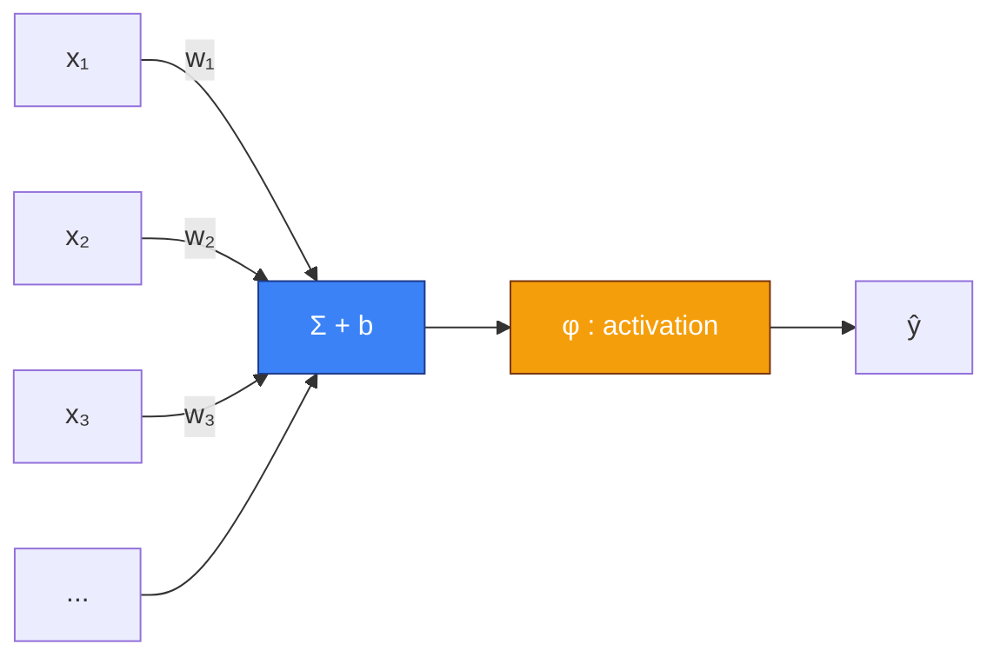
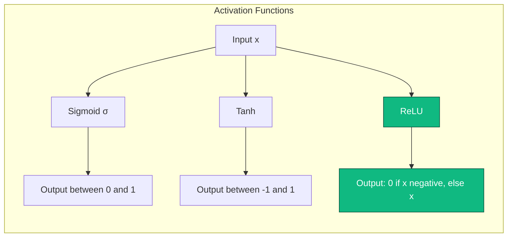
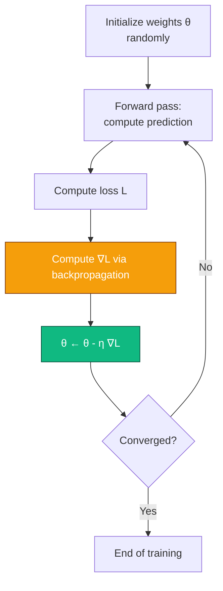

Before we talk about agents learning by trial and error, before we talk about Q-learning and Bellman equations, we need to talk about the building block. The one you'll find absolutely everywhere in modern AI. The one sitting at the heart of your ChatGPT, the face recognition in your phone, the system that sorts your mail into spam/not-spam, and yes, inside most modern reinforcement learning algorithms.

I'm talking about **neural networks**.

If you've read my post on [RL](#/post/RL), you know I like to take my time. This post is the natural prequel. We're going back to the origins. We'll understand why we call them "neurons" (spoiler: it's a bit of a stretch), we'll derive backpropagation by hand, we'll code a small network from scratch in numpy, and we'll see how you go from a dead-simple model to an architecture that can classify images or generate text.

Grab a coffee. This is about 20 minutes of reading.

## I. The dream: a machine that learns on its own

Let's go back to 1950. Alan Turing publishes a famous paper, *Computing Machinery and Intelligence*, in which he asks a simple question: *"Can machines think?"* He proposes a test — the famous Turing test — to evaluate whether a machine can hold a conversation indistinguishable from a human's. But buried in a paragraph, Turing slips in an even more provocative idea: instead of trying to program an adult machine, why not program a child-machine, and **let it learn**?

The idea is revolutionary because it completely flips the way computing had been conceived until then. In 1950, programming means *telling the machine what to do, step by step*. Turing suggests the opposite: *showing the machine what you want*, and letting it figure out how. This is what we call **machine learning**, and the entire rest of this story flows from that single idea.

But there's an annoying detail: Turing doesn't say how to actually do it. How can a machine possibly learn? What mechanism, what substrate, what architecture? For that, we have to look elsewhere. We have to look at biology.

## II. From the biological neuron to the artificial neuron

Your brain contains roughly 86 billion neurons. Each one is a little cell that does, at bottom, something fairly simple: it receives electrical signals from other neurons through its dendrites, integrates them in its cell body, and if there's "enough" accumulated signal, it emits its own electrical signal down its axon, which propagates toward other neurons. The connections between neurons, the synapses, can be stronger or weaker. And it's the strength of these synapses, together with the spatial organization of the network, that encodes what you know, what you remember, and what you're capable of doing.

This is a cartoon description. Real neurons are infinitely more complex — there are dozens of different neurotransmitters, fine-grained temporal dynamics, subtle electrochemical phenomena, regulation loops at every level. But for our purposes, this simplification is enough. The brain is a gigantic network of simple units that add up and fire, and whose connectivity encodes knowledge.

In 1943, two researchers — neurophysiologist **Warren McCulloch** and logician **Walter Pitts** — publish a paper that lays the foundation for everything that follows. They propose a radically simplified mathematical model of the biological neuron, known today as the **McCulloch-Pitts neuron**. The idea: forget electrochemistry, forget temporal subtleties. Represent a neuron as a function that takes several inputs, combines them linearly, and outputs 1 or 0 depending on whether the sum crosses a threshold.

$$\text{sortie} = \begin{cases} 1 & \text{si } \sum_i w_i x_i \geq \theta \\ 0 & \text{sinon} \end{cases}$$

It's radically simplistic. It's also mathematically tractable. And it's the building block for everything that comes next.


This little diagram sums up the whole model. Several inputs $x_1, x_2, \dots, x_n$ arrive with weights $w_1, w_2, \dots, w_n$. We compute the weighted sum $\sum_i w_i x_i$, add a bias $b$, and pass everything through an **activation function** $\varphi$ that decides whether the neuron "fires" or not. The output is $y = \varphi(\sum_i w_i x_i + b)$.

That's it. What we call an artificial neuron, in the 21st century, is *that*. A weighted sum, a bias, an activation function. Don't be disappointed if you find it too simple — it's precisely because it's simple that it works at scale.

## III. Rosenblatt, the Perceptron, and the first promise

In 1958, Frank Rosenblatt, a psychologist and researcher at Cornell, takes the McCulloch-Pitts neuron and adds one crucial thing: a **learning algorithm**. He calls it the **Perceptron**. The idea is that the weights $w_i$ are no longer hand-wired — the Perceptron learns them from examples.

The Perceptron's learning rule is disarmingly simple. For each example $(x, y)$ in your training set (where $x$ is the input and $y \in \{0, 1\}$ is the expected label):

1. Compute the prediction $\hat{y} = \varphi(w^\top x + b)$.
2. If $\hat{y} = y$, do nothing.
3. Otherwise, update the weights: $w \leftarrow w + \eta (y - \hat{y}) x$, where $\eta$ is a small learning rate.

That's it. And Rosenblatt proves — it's the **Perceptron Convergence Theorem** — that if the data is **linearly separable** (meaning there exists a hyperplane that perfectly separates positive examples from negative ones), then this algorithm converges in a finite number of steps to a solution that classifies all the data perfectly.

At the time, it was a bombshell. A New York Times reporter wrote in 1958 that the Perceptron was "the embryo of an electronic computer that will be able to walk, talk, see, write, reproduce itself and be conscious of its existence." Rosenblatt himself talked about machines that would, in the near future, read books and fly airplanes. Enthusiasm was through the roof.



Except Rosenblatt left out one detail: his algorithm only works on **linearly separable** data. And it turns out there's a ridiculously simple problem, with two variables and four points, that the Perceptron cannot learn. That problem is the logical **XOR** (exclusive or) function.

## IV. XOR, the winter, and the fall

XOR is a function with two inputs $x_1, x_2 \in \{0, 1\}$. Its truth table is:

| $x_1$ | $x_2$ | XOR |
|-------|-------|-----|
| 0 | 0 | 0 |
| 0 | 1 | 1 |
| 1 | 0 | 1 |
| 1 | 1 | 0 |

Try plotting these four points on a plane. $(0,0)$ and $(1,1)$ belong to class 0, $(0,1)$ and $(1,0)$ belong to class 1. Look for a line that separates the two classes. Look hard.

There isn't one. No line can put $(0,0)$ and $(1,1)$ on one side and $(0,1)$ and $(1,0)$ on the other. The problem isn't linearly separable. And so, by definition, **Rosenblatt's Perceptron cannot learn XOR**. It's not a question of tuning, it's not a question of data, it's a mathematical impossibility of the hypothesis class.

In 1969, two giants of classical AI — **Marvin Minsky** and **Seymour Papert** — published a book (*Perceptrons*) that formalized this limitation and several others. The book is rigorous, and its conclusions are devastating for the "connectionist" camp: simple perceptrons are fundamentally limited. Minsky and Papert note that, theoretically, by stacking several layers of perceptrons, you could overcome these limitations — but we don't know how to train such networks. They suggest that it's probably impossible.

The book's impact on the field was catastrophic. Funding evaporated. Labs closed. Researchers moved on to other things. This is what we call the **first AI winter**. For nearly twenty years, neural networks became a taboo subject in academia. Working on them was career suicide.

And then, in 1986, something changed.

## V. The comeback: backpropagation and multi-layer networks

In 1986, a trio of researchers — **David Rumelhart**, **Geoffrey Hinton**, and **Ronald Williams** — published a paper in *Nature* that changed the face of the field. They rediscovered and popularized an algorithm called **backpropagation** (the algorithm had actually been known since the 60s in various forms, but nobody had really seen its potential). This algorithm solves precisely the problem Minsky and Papert had declared near-impossible: how do you train a neural network with **multiple layers**?

The fundamental idea is simple: a multi-layer network (or **MLP**, Multi-Layer Perceptron) applies a succession of transformations. Each layer takes the output of the previous one, combines it linearly with its own weights, passes the result through a non-linearity, and hands it off to the next layer. With enough layers and non-linearities, such a network can in theory represent any measurable function — this is the **universal approximation theorem**. XOR, for example, becomes trivial with an MLP that has a single hidden layer of two neurons.


Here's the basic structure of an MLP. On the left, the inputs (for example, the pixels of an image). In the middle, one or more so-called "hidden" layers, because they're neither inputs nor outputs — they're the internal representation machinery. On the right, the output layer (for example, ten neurons if you're classifying digits from 0 to 9).

The big problem is that if you have a network with several layers and thousands of parameters, you can't tune them by hand. You need an algorithm that, given a prediction error on an example, knows how to adjust **every weight in the network** to reduce that error. This is exactly what backpropagation does.

But before we get there, we need a detour through three concepts: activation functions, loss functions, and gradient descent.

## VI. Activation functions, or why non-linearities are essential

Imagine for a moment that you stack several **linear** transformation layers without any non-linearity between them. Each layer computes $h_i = W_i h_{i-1} + b_i$. What happens? Well, mathematically:

$$h_2 = W_2 h_1 + b_2 = W_2 (W_1 x + b_1) + b_2 = (W_2 W_1) x + (W_2 b_1 + b_2)$$

It's still a linear transformation, with a matrix $W' = W_2 W_1$ and a bias $b' = W_2 b_1 + b_2$. Put another way: stacking a thousand linear layers gives you exactly the same expressive power as a single linear layer. You've gained nothing. You've basically done nothing.

For hidden layers to actually add something, you need a **non-linearity** between each layer. That's the role of the activation function. Here are the most important ones:

**The sigmoid** (or logistic function):
$$\sigma(x) = \frac{1}{1 + e^{-x}}$$
Historically the most used. Its advantage is that it produces an output between 0 and 1, interpretable as a probability. Its huge downside is that it's "saturating" — when $|x|$ gets large, the derivative $\sigma'(x) = \sigma(x)(1 - \sigma(x))$ goes to nearly zero, which freezes learning. This is the famous **vanishing gradient** problem.

**The hyperbolic tangent**:
$$\tanh(x) = \frac{e^x - e^{-x}}{e^x + e^{-x}}$$
Cousin of the sigmoid, but centered at zero (its output sits between -1 and 1). Often a bit better in practice, for reasons of initialization and numerical conditioning. But it suffers from the same saturation problem.

**ReLU** (Rectified Linear Unit):
$$\text{ReLU}(x) = \max(0, x)$$
The revelation of the 2010s. Absolutely trivial, differentiable everywhere except at zero (we put 0 or 1 by convention, nobody notices), and its derivative equals 1 on the entire active part. Result: no more vanishing gradient on the positive side, and much faster training in practice. Nearly all modern architectures use ReLU or one of its variants (Leaky ReLU, ELU, GELU).



ReLU became the default non-linearity after a 2011 paper (Glorot, Bordes, Bengio) showed it allowed training much deeper networks than sigmoid or tanh. Without ReLU, probably no AlexNet, probably no large-scale Deep Learning, probably no current revolution.

## VII. Loss functions: how do we measure error?

To be able to "learn," you first need to be able to measure how wrong you are. That's the role of the **loss function** (also called *cost function*). It's what we try to minimize during training.

The two big families, depending on the nature of the problem:

**For regression** (predicting a continuous value, like the price of a house), we classically use **Mean Squared Error** (MSE):
$$L_{\text{MSE}} = \frac{1}{N} \sum_{i=1}^{N} (y_i - \hat{y}_i)^2$$
We penalize the square of the gap between prediction and truth. Big errors are doubly penalized (which can be a bug or a feature depending on the case). It's differentiable everywhere, it's convex, and it has a nice statistical interpretation (it's equivalent to a maximum likelihood estimator under a Gaussian noise assumption).

**For classification** (predicting a class among several), we almost always use the **cross-entropy loss** (or log-loss):
$$L_{\text{CE}} = - \frac{1}{N} \sum_{i=1}^{N} \sum_{k=1}^{K} y_{i,k} \log(\hat{y}_{i,k})$$
where $y_{i,k}$ equals 1 if example $i$ belongs to class $k$ (and 0 otherwise — this is a "one-hot" encoding), and $\hat{y}_{i,k}$ is the probability the model predicts for that class. Cross-entropy is minimal when the model puts all the probability mass on the correct class. It's combined with a **softmax** function at the network output that turns raw "logits" into a probability distribution:
$$\text{softmax}(z)_k = \frac{e^{z_k}}{\sum_j e^{z_j}}$$

The softmax + cross-entropy combo is a classic of classics. You'll find it in about 100% of neural-network-based classifiers.

## VIII. Gradient descent: how we minimize

We have a network. We have a loss. How do we go about tweaking the weights to reduce the loss? That's where **gradient descent** comes in.

The idea is geometric and deeply intuitive. Imagine you're in the middle of a mountainous landscape, in a thick fog. You want to walk down into the valley. You can't see more than a meter in front of you, but you can feel the slope under your feet. What do you do? You take a small step in the steepest downhill direction. Then you do it again. And again. And with a bit of luck, you end up in a valley.

Mathematically, the **gradient** of a function $L$ with respect to its parameters $\theta$ is a vector that points in the direction of steepest **ascent**. To go down, we therefore take its opposite:
$$\theta \leftarrow \theta - \eta \nabla_\theta L$$
where $\eta$ is the **learning rate** — the size of your step. You take a small step in the direction opposite to the gradient. You recompute the gradient. You take another step. And you keep going until the loss stops decreasing.



The learning rate is the single most important hyperparameter in this whole story. Too big, and you "jump" over the valleys and diverge. Too small, and it takes forever to converge. Almost all empirical studies on training neural networks show that tuning the learning rate correctly matters more than choosing the architecture, the optimizer, or pretty much anything else.

## IX. Backpropagation, or the art of differentiating a giant composition

We have everything we need, except the most important thing: **how do we actually compute the gradient**? In a network with ten layers and a few million parameters, differentiating by hand isn't an option. We need a systematic algorithm.

That algorithm is **backpropagation**. Its full name is *reverse-mode automatic differentiation applied to a composition of functions*, which is more technical but more honest.

The deep intuition behind backpropagation is the **chain rule**. If you have a composed function $f(g(x))$ and you want to differentiate it, you know that:
$$\frac{d f(g(x))}{d x} = \frac{d f}{d g} \cdot \frac{d g}{d x}$$

That's the chain rule from high school calculus. Now, imagine your network is a gigantic composition: $L = L(f_n(f_{n-1}(\dots f_1(x))))$. To compute $\frac{\partial L}{\partial w}$ where $w$ is a weight in layer $i$, you apply the chain rule all the way along the path, from the loss down to $w$. That's it.

The stroke of genius in backpropagation is that it computes these derivatives **in reverse order**, from the output back to the input, reusing intermediate calculations. This is what makes the complexity linear in the number of parameters, instead of quadratic or worse.

Concretely, the algorithm runs two passes:

**Forward pass**: we compute the activations of each layer, from input to output, storing everything in memory.

**Backward pass**: we compute $\delta_n = \frac{\partial L}{\partial z_n}$ where $z_n$ is the pre-non-linearity activation of the last layer. Then we backpropagate: $\delta_{i-1} = (W_i^\top \delta_i) \odot \varphi'(z_{i-1})$, where $\odot$ is element-wise product and $\varphi'$ is the derivative of the activation. At each step, we also compute the gradients with respect to the weights of the current layer: $\frac{\partial L}{\partial W_i} = \delta_i h_{i-1}^\top$.

If your head spun reading that paragraph, that's normal. Backpropagation is one of the most famous algorithms in AI and also one of the most disorienting to grasp on first contact. The good news is that today, you don't have to implement it by hand anymore: PyTorch, JAX, and TensorFlow do it for you automatically, thanks to a technique called **autograd** (automatic differentiation). You define your forward pass in Python, and the framework computes the gradients on its own by symbolic manipulation of the computation graph.

But to really understand what's going on, you have to do it by hand at least once. Which is what we're going to do now.

## X. Implementation: an MLP in numpy from scratch

Enough theory. Let's code a small neural network from scratch, without any framework, just numpy, to classify points in a plane. We'll tackle a "toy" problem: learning to separate two intertwined spirals, a classic case that's impossible to solve with linear regression but trivial for an MLP.

```python
import numpy as np
import matplotlib.pyplot as plt

# 1. Data generation: two intertwined spirals
np.random.seed(0)
N = 200               # points per class
K = 2                 # number of classes
X = np.zeros((N * K, 2))
y = np.zeros(N * K, dtype=int)
for j in range(K):
    ix = range(N * j, N * (j + 1))
    r = np.linspace(0.0, 1, N)
    t = np.linspace(j * 4, (j + 1) * 4, N) + np.random.randn(N) * 0.2
    X[ix] = np.c_[r * np.sin(t), r * np.cos(t)]
    y[ix] = j

# One-hot encoding of labels
Y = np.zeros((N * K, K))
Y[np.arange(N * K), y] = 1

# 2. Architecture: 2 -> 16 -> 16 -> 2
input_dim, hidden_dim, output_dim = 2, 16, 2

# Weight initialization (He initialization, suited to ReLU)
W1 = np.random.randn(input_dim, hidden_dim) * np.sqrt(2.0 / input_dim)
b1 = np.zeros((1, hidden_dim))
W2 = np.random.randn(hidden_dim, hidden_dim) * np.sqrt(2.0 / hidden_dim)
b2 = np.zeros((1, hidden_dim))
W3 = np.random.randn(hidden_dim, output_dim) * np.sqrt(2.0 / hidden_dim)
b3 = np.zeros((1, output_dim))

# 3. Helper functions
def relu(x):
    return np.maximum(0, x)

def softmax(x):
    # Numerically stable version
    x = x - x.max(axis=1, keepdims=True)
    ex = np.exp(x)
    return ex / ex.sum(axis=1, keepdims=True)

# 4. Hyperparameters
lr = 0.05
epochs = 2000
losses = []

# 5. Training loop
for epoch in range(epochs):
    # Forward pass
    z1 = X @ W1 + b1
    h1 = relu(z1)
    z2 = h1 @ W2 + b2
    h2 = relu(z2)
    z3 = h2 @ W3 + b3
    probs = softmax(z3)

    # Cross-entropy loss
    loss = -np.mean(np.sum(Y * np.log(probs + 1e-12), axis=1))
    losses.append(loss)

    # Backward pass
    dz3 = (probs - Y) / (N * K)                      # gradient of loss w.r.t. z3
    dW3 = h2.T @ dz3
    db3 = dz3.sum(axis=0, keepdims=True)

    dh2 = dz3 @ W3.T
    dz2 = dh2 * (z2 > 0)                              # ReLU derivative
    dW2 = h1.T @ dz2
    db2 = dz2.sum(axis=0, keepdims=True)

    dh1 = dz2 @ W2.T
    dz1 = dh1 * (z1 > 0)
    dW1 = X.T @ dz1
    db1 = dz1.sum(axis=0, keepdims=True)

    # Weight update (vanilla SGD)
    W3 -= lr * dW3; b3 -= lr * db3
    W2 -= lr * dW2; b2 -= lr * db2
    W1 -= lr * dW1; b1 -= lr * db1

    if epoch % 200 == 0:
        preds = np.argmax(probs, axis=1)
        acc = np.mean(preds == y)
        print(f"Epoch {epoch:4d} | loss {loss:.4f} | acc {acc:.3f}")
```

This code contains everything we've seen so far. An explicit forward pass, a cross-entropy loss, and a backpropagation computed by hand by applying the chain rule layer by layer. No framework, no magic, just numpy. Copy-paste it, run it, and in two seconds you've got a network that correctly classifies two intertwined spirals.

A few details worth pausing on. **He initialization** (`np.sqrt(2.0 / input_dim)`) is the standard method for initializing weights when using ReLU — it's calibrated so that the variance of activations stays stable across layers. Using a naive initialization (for example, Gaussians with standard deviation 1) typically gives you a network that doesn't converge or that blows up.

**Stable softmax** (subtracting the max before the exponential) is an essential numerical hack. Without it, as soon as your logits exceed about 700, $e^{z}$ overflows and you get `inf` and `NaN` everywhere. The trick is to use the identity $\text{softmax}(z) = \text{softmax}(z - c)$ for any constant $c$, and to pick $c = \max(z)$ to guarantee that all exponents are negative or zero.

Finally, the way we compute `dz3 = (probs - Y) / N` deserves a word. When you combine softmax at the output with cross-entropy, their derivatives cancel out beautifully and you end up with this ultra-simple formula: the gradient of the loss with respect to the logits is the difference between the predicted probability and the true probability. It's another reason why this combo is everywhere: it massively simplifies gradient computation.

## XI. The pitfalls of training

Coding an MLP that runs is one thing. Training it so that it actually works on a real problem is another. Here are the main pitfalls you'll run into.

### Overfitting

Your network has too many parameters relative to your data, and instead of learning general patterns, it memorizes the examples. The classic symptom: training loss goes down nicely, but validation loss (on data the model has never seen) goes back up. The model has become excellent on the training set and terrible on everything else.

The classic remedies: more data (always the best solution), **L2 regularization** (add $\lambda \|W\|^2$ to the loss to penalize big weights), **dropout** (randomly zero out 10-50% of neurons on each training pass — this forces the network not to depend on any one neuron), and **early stopping** (stop training when validation loss starts climbing back up).

### Vanishing and exploding gradients

In a deep network, the gradient is a product of many Jacobian matrices. If these matrices have singular values smaller than 1, the gradient decays exponentially with depth and the first layers stop training. This is **vanishing gradient**. Symmetrically, if singular values are larger than 1, the gradient explodes.

The remedies: **ReLU** (whose derivative is 1 on the active side, which limits decay), **specific initializations** (He, Xavier/Glorot), **batch normalization** (normalizing activations at each layer to keep their distribution under control), and **residual connections** (introduced by ResNet in 2015, which create "shortcuts" between distant layers).

### Local minima and saddles

Traditionally, people worried that gradient descent would get stuck in a local minimum that wasn't global. In practice, in very deep and very wide networks, researchers discovered that strict local minima are extraordinarily rare — the loss landscape is more often dominated by **saddle points** (places where the gradient is zero but that aren't minima). Modern optimizers like **Adam** handle saddle points fairly well thanks to their accumulated moments.

### Choosing the learning rate

I've said it already, but it's so important that I'll say it again: the learning rate is hyperparameter number one. Modern methods use **learning rate schedules** (decreasing the lr over training), **warmup** (starting small and ramping up, especially for big models), and **adaptive schedulers** like cosine decay. Leslie Smith's *"Cyclical Learning Rates"* paper is a good entry point on the topic.

### Modern optimizers

Pure gradient descent (SGD) is used in many cases, but it has competitors. **SGD with momentum** adds inertia to updates to smooth the path. **RMSProp** and **Adagrad** adapt the learning rate per-parameter based on gradient history. **Adam**, combining the two previous ideas, is today the default optimizer when you don't want to think too hard. For very large models (LLMs, etc.), **AdamW** — a variant that cleanly separates regularization — is the reference.

## XII. Beyond the MLP: the explosion of architectures

The MLP, with its fully-connected structure, is the universal model. But it's inefficient for certain types of data. That's what motivated the invention of specialized architectures.

### CNNs, or how to cheat on spatial structure

When you look at an image, two adjacent pixels are much more likely to be related than two pixels far apart. Also, a cat in the top-left of the image and a cat in the middle should be recognized by the same mechanism. These two observations — **locality** and **translation invariance** — are the foundation of **convolutional networks** (CNNs, Convolutional Neural Networks).

A CNN replaces fully-connected layers with **convolution** layers. Instead of every output neuron being connected to all input pixels, it's connected to a small local window (3x3 pixels, say), and the **same** set of weights (the filter or kernel) is applied by sliding over the whole image. Result: many fewer parameters, and a structure that exploits the geometry of the image.


The **MNIST** dataset (the handwritten digits above) is the canonical example. Before CNNs, the best models reached about 0.7% error. With well-tuned CNNs (LeNet-5, Yann LeCun, 1998), you get down to 0.3%. With modern CNNs and data augmentation, you're below 0.1%. MNIST has been so thoroughly solved that today it's considered a "sad" benchmark — everyone crushes it. But historically, it's the dataset on which the convolutional school was built.

### RNNs, for sequences

When your data is sequences (text, audio, time series), you have to handle temporal dependencies. **Recurrent networks** (RNNs) introduce a loop: at each time step, the network takes the current input **plus** its own internal state from the previous step. Mathematically:
$$h_t = \varphi(W_x x_t + W_h h_{t-1} + b)$$

It works in theory, but suffers massively from vanishing gradient on long sequences. The **LSTM** (Long Short-Term Memory, Hochreiter & Schmidhuber, 1997) and **GRU** (Gated Recurrent Unit) variants add gating mechanisms that let you keep information across hundreds, even thousands of time steps. Throughout the 2010s, LSTMs dominated natural language processing.

### Transformers, or the end of RNNs

In 2017, a Google paper (*"Attention Is All You Need"*) proposed a radically new architecture: the **Transformer**. There's no recurrence anymore. In its place, an **attention** mechanism lets each token in a sequence "look at" all other tokens simultaneously, and learn which ones are relevant to its own representation. Attention is parallelizable (which RNNs are not), and turns out to be massively more efficient at scale.

Within a few years, Transformers devoured absolutely everything. NLP first (BERT, GPT), then vision (Vision Transformer), then audio (Whisper), then biology (AlphaFold 2), then code, then RL... Today, in 2026, nearly all state-of-the-art AI models are Transformers, and the phrase "Attention Is All You Need" is probably the most accurate prophecy in the history of ML.

## XIII. The Deep Learning revolution

But how did we go from "we've known how to train small networks since 1986" to "AI is everywhere"? Why did it take thirty years? The answer comes down to three ingredients that came together in the early 2010s.

The first is **data**. Before the internet, before ImageNet, we trained on tiny datasets (a few tens of thousands of examples at best). ImageNet, launched by Fei-Fei Li in 2009, contains 14 million annotated images. For the first time, we had enough data to feed deep networks without them overfitting.

The second is **compute**. GPUs, originally designed for 3D rendering in video games, turned out to be perfect for the massive matrix multiplication a neural network does. An NVIDIA Tesla GPU from the 2010s offered tens of times more power than the best CPUs for this kind of workload. And GPUs kept doubling in capacity every two years, while CPUs stagnated.

The third is **the algorithm**. ReLU, dropout, batch normalization, clean initializations, better libraries. Each of these details, in isolation, seems minor. Put together, they made it possible to train networks ten to a hundred times deeper than before.

The decisive moment was 2012. The annual **ImageNet Large Scale Visual Recognition Challenge** pitted the world's best vision systems against each other. Until then, the winners used classical methods (SIFT, HOG, SVM) and improved by a few percent each year. In 2012, a team from the University of Toronto led by Geoffrey Hinton submitted a deep convolutional network trained on two GPUs, which they called **AlexNet**. The result: a top-5 error of 15.3%, against 26.2% for second place. An absolutely unprecedented improvement. The world took notice.

From that moment on, everything accelerated. In 2014, networks got deeper (VGG, GoogLeNet). In 2015, they got even deeper thanks to residual connections (ResNet, 152 layers). In 2016, AlphaGo beat Lee Sedol at Go. In 2017, Transformers arrived. In 2020, GPT-3 showed that raw scale alone was enough to give rise to unexpected emergent capabilities. In 2022, ChatGPT came out and the general public discovered what researchers had known for years: well-trained neural networks had become terrifyingly good at almost everything.

## XIV. And now?

We've covered the ground. From the McCulloch-Pitts neuron to Transformers, from Rosenblatt to Hinton, from impossible XORs to models that write better than we do. If you've followed this far, you now carry in your head the complete map of the concepts that power modern AI. You know what an activation is, you know why backpropagation works, you know why we use ReLU, you know why Adam became popular, you know what a CNN and a Transformer are. You can read an ML paper and understand the vocabulary.

But you're still missing one thing: understanding how these networks become **agents**. How you go from a model that classifies images or predicts the next word to a model that **acts** in an environment, that explores, that fails, that corrects itself, that learns to play a game or pilot a robotic arm. This shift — from passive predictor to active agent — is exactly what turns a neural network into a reinforcement learning system.

If you want to go the whole way, the sequel is [here](#/post/RL). We'll talk about Bellman equations, Q-learning, exploration vs exploitation, Deep RL, AlphaGo, and why reinforcement learning is perhaps the form of learning closest to what learning, really, actually is.

## Further reading

- **Michael Nielsen, "Neural Networks and Deep Learning"**. A free online book, beautifully written, covering the full theory of MLPs and backpropagation with interactive visualizations. If you only read one book, read this one. [Link](http://neuralnetworksanddeeplearning.com/)
- **Goodfellow, Bengio & Courville, "Deep Learning"**. The reference textbook, more demanding, available for free. Essential if you want to get serious about the subject. [Link](https://www.deeplearningbook.org/)
- **Andrej Karpathy, "Neural Networks: Zero to Hero"**. A YouTube video series where Karpathy builds a deep learning framework from scratch, in Python, starting from MLPs all the way to a mini-GPT. Pedagogically perfect. Free.
- **3Blue1Brown, "Neural networks" series**. Gorgeous animated videos that explain MLPs and backpropagation with rare visual clarity.
- **Foundational papers**: Rumelhart, Hinton, Williams (1986) for backpropagation; LeCun et al. (1998) for LeNet; Krizhevsky, Sutskever, Hinton (2012) for AlexNet; He et al. (2015) for ResNet; Vaswani et al. (2017) for the Transformer.

## Conclusion

Neural networks are, at a certain level, disconcertingly simple. Weighted sums, non-linearities, a loss, a gradient, and you repeat. No magic. No hidden genius. Just linear algebra, differential calculus, and a whole lot of GPUs.

And yet, it's with these simple bricks that we've built the most capable systems humanity has ever designed. The systems that recognize your voice, that translate your messages, that generate images from words, that play chess better than any human, that solve the 3D structure of proteins, that write code better than junior developers. All of it flows, directly, from the equations we've seen in this post.

The lesson, if you want to take one: complexity emerges from the large-scale repetition of simple things. The 1958 perceptron hasn't changed much in its mathematical form. What changed is that we stacked a lot of them, trained them on a lot of data, with a lot of compute, tuning a lot of small details. AI isn't one brilliant idea — it's a simple idea to which we've dedicated fifty years of cumulative toil. And which is finally, before our eyes, bearing fruit.

Now, go read the [RL post](#/post/RL). You've got all the foundations.
