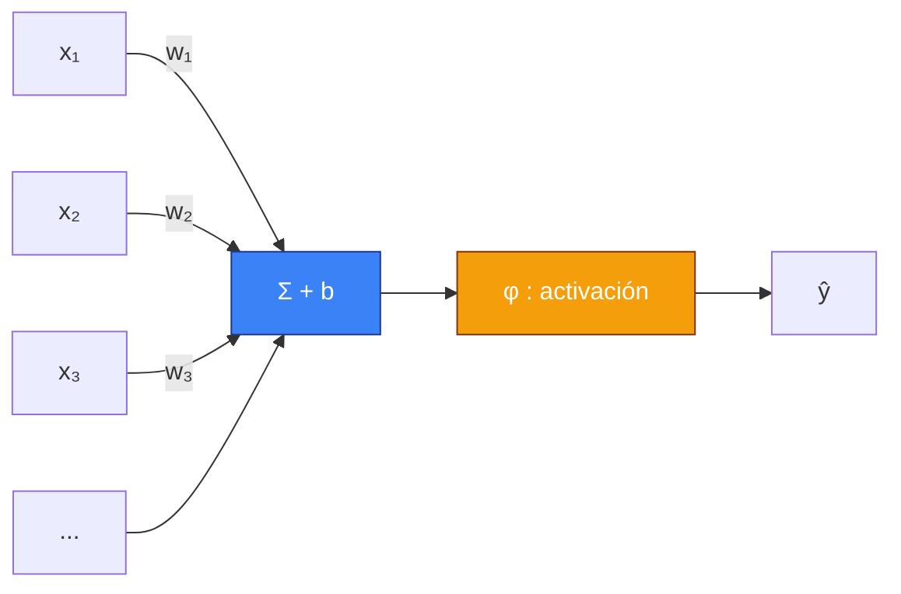
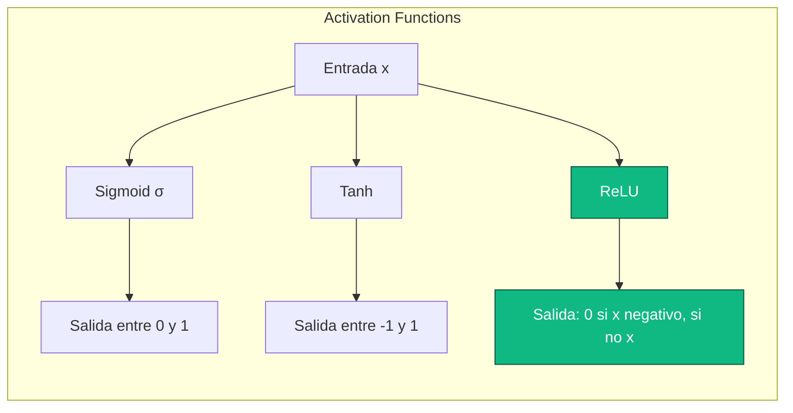
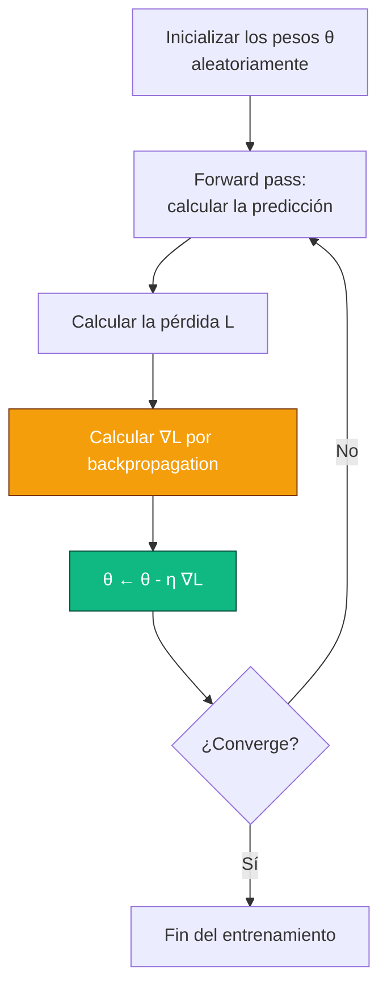

Antes de hablar de agentes que aprenden por ensayo y error, antes de hablar de Q-learning y ecuaciones de Bellman, hay que hablar del ladrillo básico. El que encuentras absolutamente en todos lados en la IA moderna. El que está en el corazón de tu ChatGPT, del reconocimiento facial de tu móvil, del sistema que clasifica tus correos entre spam y no-spam, y sí, en la mayoría de los algoritmos modernos de reinforcement learning.

Estoy hablando de las **redes neuronales**.

Si has leído mi post sobre [RL](#/post/RL), ya sabes que me gusta tomarme mi tiempo. Este post es la precuela natural. Vamos a remontarnos a los orígenes. Vamos a entender por qué las llamamos "neuronas" (spoiler: es un pequeño abuso del lenguaje), vamos a derivar la backpropagation a mano, vamos a programar una pequeña red desde cero en numpy, y vamos a ver cómo se pasa de un modelo muy simple a una arquitectura capaz de clasificar imágenes o generar texto.

Coge un café. Son unos 20 minutos de lectura.

## I. El sueño: una máquina que aprende por sí sola

Volvamos a 1950. Alan Turing publica un artículo famoso, *Computing Machinery and Intelligence*, en el que plantea una pregunta simple: *"Can machines think?"* Propone un test — el famoso test de Turing — para evaluar si una máquina puede mantener una conversación indistinguible de la de un humano. Pero al pasar por un párrafo, Turing desliza una idea aún más provocadora: en lugar de intentar programar una máquina adulta, ¿por qué no programar una máquina-bebé y **hacerla aprender**?

La idea es revolucionaria porque da la vuelta por completo a la manera en que se concebía la informática hasta entonces. En 1950, programar significa *decirle a la máquina qué hacer, paso a paso*. Turing sugiere lo contrario: *mostrarle a la máquina lo que uno quiere* y dejarla encontrar cómo. Eso se llama **machine learning**, y todo el resto de esta historia se desprende de esa idea.

Pero hay un detalle incómodo: Turing no dice cómo hacerlo. ¿Cómo puede aprender una máquina? ¿Qué mecanismo, qué sustrato, qué arquitectura? Para eso hay que mirar a otra parte. Hay que mirar hacia la biología.

## II. De la neurona biológica a la neurona artificial

Tu cerebro contiene aproximadamente 86 mil millones de neuronas. Cada una es una célula pequeña que, en el fondo, hace algo bastante simple: recibe señales eléctricas de otras neuronas a través de sus dendritas, las integra en su cuerpo celular, y si hay "suficiente" señal acumulada, emite a su vez una señal eléctrica a lo largo de su axón, que se propaga hacia otras neuronas. Las conexiones entre neuronas, las sinapsis, pueden ser más o menos fuertes. Y es la intensidad de esas sinapsis, junto con la organización espacial de la red, la que codifica lo que sabes, lo que recuerdas y lo que eres capaz de hacer.

Es una descripción caricaturesca. Las neuronas reales son infinitamente más complejas — hay decenas de neurotransmisores diferentes, dinámicas temporales finas, fenómenos electroquímicos sutiles, bucles de regulación en todos los niveles. Pero para lo que nos ocupa, esta simplificación basta. El cerebro es una red gigantesca de unidades simples que se suman y se disparan, y cuya conectividad codifica el saber.

En 1943, dos investigadores — el neurofisiólogo **Warren McCulloch** y el lógico **Walter Pitts** — publican un paper que va a sentar las bases de todo lo que sigue. Proponen un modelo matemático radicalmente simplificado de la neurona biológica, que hoy llamamos la **neurona de McCulloch-Pitts**. La idea: olvida la electroquímica, olvida las sutilezas temporales. Representa una neurona como una función que toma varias entradas, las combina linealmente y devuelve 1 o 0 según si la suma supera un umbral.

$$\text{sortie} = \begin{cases} 1 & \text{si } \sum_i w_i x_i \geq \theta \\ 0 & \text{sinon} \end{cases}$$

Es radicalmente simplista. También es matemáticamente tratable. Y es el ladrillo básico de todo lo que va a venir.


Este pequeño diagrama resume todo el modelo. Varias entradas $x_1, x_2, \dots, x_n$ llegan con pesos $w_1, w_2, \dots, w_n$. Calculamos la suma ponderada $\sum_i w_i x_i$, le añadimos un sesgo $b$ y pasamos el conjunto a través de una **función de activación** $\varphi$ que decide si la neurona "dispara" o no. La salida es $y = \varphi(\sum_i w_i x_i + b)$.

Eso es todo. Lo que llamamos una neurona artificial, en el siglo XXI, es *eso*. Una suma ponderada, un sesgo, una función de activación. No te decepciones si te parece demasiado simple — es precisamente porque es simple que funciona a gran escala.

## III. Rosenblatt, el Perceptrón y la primera promesa

En 1958, Frank Rosenblatt, psicólogo e investigador en Cornell, toma la neurona de McCulloch-Pitts y añade una cosa crucial: un **algoritmo de aprendizaje**. Lo llama el **Perceptrón**. La idea es que los pesos $w_i$ ya no están cableados a mano — el Perceptrón los aprende a partir de ejemplos.

La regla de aprendizaje del Perceptrón es de una simplicidad desarmante. Para cada ejemplo $(x, y)$ en tu conjunto de entrenamiento (donde $x$ es el input e $y \in \{0, 1\}$ es la etiqueta esperada):

1. Calcula la predicción $\hat{y} = \varphi(w^\top x + b)$.
2. Si $\hat{y} = y$, no hagas nada.
3. Si no, actualiza los pesos: $w \leftarrow w + \eta (y - \hat{y}) x$, donde $\eta$ es un pequeño learning rate.

Eso es todo. Y Rosenblatt demuestra — es el **Perceptron Convergence Theorem** — que si los datos son **linealmente separables** (es decir, existe un hiperplano que separa perfectamente los ejemplos positivos de los negativos), entonces este algoritmo converge en un número finito de pasos hacia una solución que clasifica perfectamente todos los datos.

En aquella época fue una bomba. Un periodista del New York Times escribe en 1958 que el Perceptrón es "el embrión de un ordenador electrónico capaz de caminar, hablar, ver, escribir, reproducirse y ser consciente de su propia existencia". El propio Rosenblatt habla de máquinas que, en un futuro próximo, leerán libros y pilotarán aviones. El entusiasmo está por las nubes.



Solo que Rosenblatt omitió un detalle: su algoritmo solo funciona con datos **linealmente separables**. Y resulta que existe un problema ridículamente simple, con dos variables y cuatro puntos, que el Perceptrón no puede aprender. Ese problema es la función lógica **XOR** (o exclusivo).

## IV. XOR, el invierno y la caída

XOR es una función con dos entradas $x_1, x_2 \in \{0, 1\}$. Su tabla de verdad es:

| $x_1$ | $x_2$ | XOR |
|-------|-------|-----|
| 0 | 0 | 0 |
| 0 | 1 | 1 |
| 1 | 0 | 1 |
| 1 | 1 | 0 |

Intenta dibujar estos cuatro puntos en un plano. $(0,0)$ y $(1,1)$ pertenecen a la clase 0, $(0,1)$ y $(1,0)$ pertenecen a la clase 1. Busca una recta que separe las dos clases. Busca bien.

No hay ninguna. Ninguna recta puede poner $(0,0)$ y $(1,1)$ de un lado y $(0,1)$ y $(1,0)$ del otro. El problema no es linealmente separable. Y por lo tanto, por definición, **el Perceptrón de Rosenblatt no puede aprender XOR**. No es cuestión de ajustes, no es cuestión de datos, es una imposibilidad matemática de la clase de hipótesis.

En 1969, dos grandes figuras de la IA clásica — **Marvin Minsky** y **Seymour Papert** — publican un libro (*Perceptrons*) que formaliza esta limitación y varias otras. El libro es riguroso, y sus conclusiones son devastadoras para el bando "conexionista": los perceptrones simples están fundamentalmente limitados. Minsky y Papert señalan que, teóricamente, apilando varias capas de perceptrones se podrían superar esas limitaciones — pero nadie sabe cómo entrenar tales redes. Sugieren que probablemente sea imposible.

El resultado del libro es catastrófico para el campo. La financiación se evapora. Los laboratorios cierran. Los investigadores pasan a otra cosa. Es lo que se llama el **primer invierno de la IA**. Durante casi veinte años, las redes neuronales se convierten en un tema tabú en el mundo académico. Trabajar en ellas es tirar la carrera a la basura.

Y entonces, en 1986, algo cambia.

## V. El regreso: backpropagation y redes multicapa

En 1986, un trío de investigadores — **David Rumelhart**, **Geoffrey Hinton** y **Ronald Williams** — publican en *Nature* un artículo que cambia la cara del campo. Redescubren y popularizan un algoritmo llamado **backpropagation** (el algoritmo se conocía ya desde los años 60 bajo distintas formas, pero nadie había visto realmente su potencial). Este algoritmo resuelve precisamente el problema que Minsky y Papert habían declarado casi imposible: ¿cómo entrenar una red neuronal de **varias capas**?

La idea fundamental es simple: una red multicapa (o **MLP**, Multi-Layer Perceptron) aplica una sucesión de transformaciones. Cada capa toma la salida de la anterior, la combina linealmente con sus propios pesos, pasa el resultado por una no-linealidad y se lo entrega a la siguiente. Con suficientes capas y no-linealidades, una red así puede en teoría representar cualquier función medible — es el **teorema de aproximación universal**. XOR, por ejemplo, se vuelve trivial con un MLP con una única capa oculta de dos neuronas.


Esta es la estructura básica de un MLP. A la izquierda, las entradas (por ejemplo, los píxeles de una imagen). En el centro, una o más capas llamadas "ocultas", porque no son ni entradas ni salidas — son los mecanismos internos de representación. A la derecha, la capa de salida (por ejemplo, diez neuronas si clasificamos dígitos del 0 al 9).

El gran problema es que si tienes una red con varias capas y miles de parámetros, no puedes ajustarlos a mano. Necesitas un algoritmo que, dado un error de predicción en un ejemplo, sepa cómo ajustar **cada peso de la red** para reducir ese error. Eso es exactamente lo que hace la backpropagation.

Pero antes de llegar ahí, necesitamos un rodeo por tres conceptos: las funciones de activación, las funciones de pérdida y el gradient descent.

## VI. Las funciones de activación, o por qué las no-linealidades son esenciales

Imagina por un momento que apilamos varias capas de transformaciones **lineales** sin ninguna no-linealidad entre ellas. Cada capa hace $h_i = W_i h_{i-1} + b_i$. ¿Qué pasa? Pues matemáticamente:

$$h_2 = W_2 h_1 + b_2 = W_2 (W_1 x + b_1) + b_2 = (W_2 W_1) x + (W_2 b_1 + b_2)$$

Sigue siendo una transformación lineal, con una matriz $W' = W_2 W_1$ y un sesgo $b' = W_2 b_1 + b_2$. Dicho de otra manera: apilar mil capas lineales te da exactamente la misma potencia expresiva que una sola capa lineal. No has ganado nada. Básicamente no has hecho nada.

Para que las capas ocultas aporten algo, hace falta una **no-linealidad** entre cada capa. Ese es el papel de la función de activación. Aquí las más importantes:

**La sigmoide** (o función logística):
$$\sigma(x) = \frac{1}{1 + e^{-x}}$$
Históricamente la más usada. Tiene la ventaja de producir una salida entre 0 y 1, interpretable como una probabilidad. Tiene el enorme defecto de ser "saturante" — cuando $|x|$ se vuelve grande, la derivada $\sigma'(x) = \sigma(x)(1 - \sigma(x))$ se acerca a cero, lo que congela el aprendizaje. Es el famoso problema del **vanishing gradient**.

**La tangente hiperbólica**:
$$\tanh(x) = \frac{e^x - e^{-x}}{e^x + e^{-x}}$$
Prima de la sigmoide, pero centrada en cero (su salida está entre -1 y 1). A menudo un poco mejor en la práctica, por razones de inicialización y condicionamiento numérico. Pero sufre del mismo problema de saturación.

**ReLU** (Rectified Linear Unit):
$$\text{ReLU}(x) = \max(0, x)$$
La revelación de los años 2010. Absolutamente trivial, derivable en todas partes excepto en cero (se pone 0 o 1 por convención, nadie se da cuenta), y su derivada vale 1 en toda la parte activa. Resultado: se acabó el vanishing gradient en el lado positivo y un entrenamiento mucho más rápido en la práctica. Casi todas las arquitecturas modernas usan ReLU o alguna de sus variantes (Leaky ReLU, ELU, GELU).



ReLU se convirtió en la no-linealidad por defecto desde que un paper de 2011 (Glorot, Bordes, Bengio) mostró que permitía entrenar redes mucho más profundas que la sigmoide o la tanh. Sin ReLU, probablemente no habría AlexNet, probablemente no habría Deep Learning a gran escala, probablemente no habría la revolución actual.

## VII. Las funciones de pérdida: ¿cómo medimos el error?

Para poder "aprender", primero hay que poder medir cuánto nos estamos equivocando. Ese es el papel de la **función de pérdida** (o *loss function*, también llamada *cost function*). Es lo que intentamos minimizar durante el entrenamiento.

Las dos grandes familias, según la naturaleza del problema:

**Para regresión** (predecir un valor continuo, como el precio de una casa), se usa clásicamente el **Mean Squared Error** (MSE):
$$L_{\text{MSE}} = \frac{1}{N} \sum_{i=1}^{N} (y_i - \hat{y}_i)^2$$
Penalizamos el cuadrado de la diferencia entre la predicción y la verdad. Los errores grandes se penalizan el doble (que puede ser un bug o una feature según el caso). Es diferenciable en todas partes, es convexa y tiene una bonita interpretación estadística (es equivalente a un estimador de máxima verosimilitud bajo una hipótesis de ruido gaussiano).

**Para clasificación** (predecir una clase entre varias), casi siempre usamos la **cross-entropy loss** (o log-loss):
$$L_{\text{CE}} = - \frac{1}{N} \sum_{i=1}^{N} \sum_{k=1}^{K} y_{i,k} \log(\hat{y}_{i,k})$$
donde $y_{i,k}$ vale 1 si el ejemplo $i$ pertenece a la clase $k$ (y 0 en caso contrario, es una codificación "one-hot"), y $\hat{y}_{i,k}$ es la probabilidad que el modelo predice para esa clase. La cross-entropy es mínima cuando el modelo pone toda la masa de probabilidad en la clase correcta. Se combina con una función **softmax** a la salida de la red que transforma los "logits" crudos en una distribución de probabilidad:
$$\text{softmax}(z)_k = \frac{e^{z_k}}{\sum_j e^{z_j}}$$

La combinación softmax + cross-entropy es un clásico de los clásicos. La encontrarás en más o menos el 100% de los clasificadores basados en redes neuronales.

## VIII. El gradient descent: cómo minimizamos

Tenemos una red. Tenemos una pérdida. ¿Cómo hacemos para modificar los pesos y disminuir la pérdida? Ahí es donde entra en juego el **gradient descent**.

La idea es geométrica y muy intuitiva. Imagina que estás en medio de un paisaje montañoso, en una niebla espesa. Quieres bajar al valle. No ves a más de un metro, pero puedes sentir la pendiente bajo los pies. ¿Qué haces? Das un pequeño paso en la dirección de descenso más pronunciado. Y luego otro. Y otro. Y con un poco de suerte, acabas en un valle.

Matemáticamente, el **gradiente** de una función $L$ respecto a sus parámetros $\theta$ es un vector que apunta en la dirección de **ascenso** más pronunciado. Para bajar, tomamos por tanto el opuesto:
$$\theta \leftarrow \theta - \eta \nabla_\theta L$$
donde $\eta$ es el **learning rate** — el tamaño del paso. Das un pequeño paso en la dirección opuesta al gradiente. Recalculas el gradiente. Das otro paso. Y sigues hasta que la pérdida deja de disminuir.



El learning rate es el hiperparámetro más importante de toda esta historia. Demasiado grande, y "saltas" por encima de los valles y divergen. Demasiado pequeño, y tardas siglos en converger. Casi todos los estudios empíricos sobre el entrenamiento de redes neuronales muestran que ajustar correctamente el learning rate importa más que elegir la arquitectura, el optimizer o prácticamente cualquier otra cosa.

## IX. La backpropagation, o el arte de derivar una composición gigante

Tenemos todo lo que hace falta, salvo lo más importante: **¿cómo calculamos el gradiente?** En una red con diez capas y unos cuantos millones de parámetros, derivar a mano no es una opción. Necesitamos un algoritmo sistemático.

Ese algoritmo es la **backpropagation**. Su nombre completo es *reverse-mode automatic differentiation aplicado a una composición de funciones*, que es más técnico pero más honesto.

La intuición profunda detrás de la backpropagation es la **regla de la cadena** (chain rule). Si tienes una función compuesta $f(g(x))$ y quieres derivarla, sabes que:
$$\frac{d f(g(x))}{d x} = \frac{d f}{d g} \cdot \frac{d g}{d x}$$

Es la regla de la cadena de bachillerato. Ahora, imagina que tu red es una composición gigantesca: $L = L(f_n(f_{n-1}(\dots f_1(x))))$. Para calcular $\frac{\partial L}{\partial w}$ donde $w$ es un peso de la capa $i$, aplicas la regla de la cadena a lo largo de todo el camino, desde la pérdida hasta $w$. Eso es todo.

El golpe de genio de la backpropagation es que calcula esas derivadas **en sentido inverso**, desde la salida hacia la entrada, reutilizando los cálculos intermedios. Es lo que hace que la complejidad sea lineal en el número de parámetros, en lugar de cuadrática o peor.

Concretamente, el algoritmo hace dos pasadas:

**Forward pass**: calculamos las activaciones de cada capa, de la entrada hacia la salida, guardando todo en memoria.

**Backward pass**: calculamos $\delta_n = \frac{\partial L}{\partial z_n}$ donde $z_n$ es la activación pre-no-linealidad de la última capa. Luego retropropagamos: $\delta_{i-1} = (W_i^\top \delta_i) \odot \varphi'(z_{i-1})$, donde $\odot$ es el producto elemento a elemento y $\varphi'$ la derivada de la activación. En cada paso también calculamos los gradientes respecto a los pesos de la capa actual: $\frac{\partial L}{\partial W_i} = \delta_i h_{i-1}^\top$.

Si te ha dado vueltas la cabeza al leer ese párrafo, es normal. La backpropagation es uno de los algoritmos más famosos de la IA y también uno de los más desorientadores de entender a la primera. La buena noticia es que hoy en día ya no necesitas implementarla a mano: PyTorch, JAX y TensorFlow lo hacen por ti automáticamente, gracias a una técnica llamada **autograd** (automatic differentiation). Defines tu forward pass en Python, y el framework calcula los gradientes por sí solo mediante manipulación simbólica del grafo de cómputo.

Pero para entender de verdad lo que está pasando, hay que haberlo hecho a mano al menos una vez. Que es lo que vamos a hacer ahora.

## X. Implementación: un MLP en numpy from scratch

Suficiente teoría. Vamos a programar una pequeña red neuronal desde cero, sin ningún framework, solo con numpy, para clasificar puntos en un plano. Haremos un problema "de juguete": aprender a separar dos espirales entrelazadas, un caso clásico que es imposible resolver con una regresión lineal pero trivial para un MLP.

```python
import numpy as np
import matplotlib.pyplot as plt

# 1. Generación de los datos: dos espirales entrelazadas
np.random.seed(0)
N = 200               # puntos por clase
K = 2                 # número de clases
X = np.zeros((N * K, 2))
y = np.zeros(N * K, dtype=int)
for j in range(K):
    ix = range(N * j, N * (j + 1))
    r = np.linspace(0.0, 1, N)
    t = np.linspace(j * 4, (j + 1) * 4, N) + np.random.randn(N) * 0.2
    X[ix] = np.c_[r * np.sin(t), r * np.cos(t)]
    y[ix] = j

# One-hot encoding de las etiquetas
Y = np.zeros((N * K, K))
Y[np.arange(N * K), y] = 1

# 2. Arquitectura: 2 -> 16 -> 16 -> 2
input_dim, hidden_dim, output_dim = 2, 16, 2

# Inicialización de los pesos (He initialization, adaptada a ReLU)
W1 = np.random.randn(input_dim, hidden_dim) * np.sqrt(2.0 / input_dim)
b1 = np.zeros((1, hidden_dim))
W2 = np.random.randn(hidden_dim, hidden_dim) * np.sqrt(2.0 / hidden_dim)
b2 = np.zeros((1, hidden_dim))
W3 = np.random.randn(hidden_dim, output_dim) * np.sqrt(2.0 / hidden_dim)
b3 = np.zeros((1, output_dim))

# 3. Funciones útiles
def relu(x):
    return np.maximum(0, x)

def softmax(x):
    # Versión numéricamente estable
    x = x - x.max(axis=1, keepdims=True)
    ex = np.exp(x)
    return ex / ex.sum(axis=1, keepdims=True)

# 4. Hiperparámetros
lr = 0.05
epochs = 2000
losses = []

# 5. Bucle de entrenamiento
for epoch in range(epochs):
    # Forward pass
    z1 = X @ W1 + b1
    h1 = relu(z1)
    z2 = h1 @ W2 + b2
    h2 = relu(z2)
    z3 = h2 @ W3 + b3
    probs = softmax(z3)

    # Cross-entropy loss
    loss = -np.mean(np.sum(Y * np.log(probs + 1e-12), axis=1))
    losses.append(loss)

    # Backward pass
    dz3 = (probs - Y) / (N * K)                      # gradiente de la loss respecto a z3
    dW3 = h2.T @ dz3
    db3 = dz3.sum(axis=0, keepdims=True)

    dh2 = dz3 @ W3.T
    dz2 = dh2 * (z2 > 0)                              # derivada de ReLU
    dW2 = h1.T @ dz2
    db2 = dz2.sum(axis=0, keepdims=True)

    dh1 = dz2 @ W2.T
    dz1 = dh1 * (z1 > 0)
    dW1 = X.T @ dz1
    db1 = dz1.sum(axis=0, keepdims=True)

    # Actualización de los pesos (SGD vanilla)
    W3 -= lr * dW3; b3 -= lr * db3
    W2 -= lr * dW2; b2 -= lr * db2
    W1 -= lr * dW1; b1 -= lr * db1

    if epoch % 200 == 0:
        preds = np.argmax(probs, axis=1)
        acc = np.mean(preds == y)
        print(f"Epoch {epoch:4d} | loss {loss:.4f} | acc {acc:.3f}")
```

Este código contiene todo lo que hemos visto hasta ahora. Un forward pass explícito, una loss cross-entropy y una backpropagation calculada a mano aplicando la regla de la cadena capa por capa. Sin framework, sin magia, solo numpy. Lo copias y lo pegas, lo lanzas, y en dos segundos tienes una red que clasifica correctamente dos espirales entrelazadas.

Algunos detalles que merecen que nos detengamos. La **inicialización de He** (`np.sqrt(2.0 / input_dim)`) es el método estándar para inicializar los pesos cuando se usa ReLU — está calibrada para que la varianza de las activaciones se mantenga estable a través de las capas. Usar una inicialización ingenua (por ejemplo, gaussianas con desviación estándar 1) da típicamente una red que no converge o que explota.

La **softmax estable** (restando el máximo antes de la exponencial) es un hack numérico esencial. Sin él, en cuanto tus logits superan los 700 aproximadamente, $e^{z}$ desborda y obtienes `inf` y `NaN` por todos lados. El truco consiste en usar la identidad $\text{softmax}(z) = \text{softmax}(z - c)$ para cualquier constante $c$, y elegir $c = \max(z)$ para garantizar que todos los exponentes sean negativos o nulos.

Por último, la manera en que calculamos `dz3 = (probs - Y) / N` merece una palabra. Cuando combinas softmax a la salida con cross-entropy, sus derivadas se cancelan magníficamente y obtienes esa fórmula ultra-simple: el gradiente de la loss respecto a los logits es la diferencia entre la probabilidad predicha y la probabilidad real. Es una razón más por la que esa combinación es omnipresente: simplifica enormemente el cálculo del gradiente.

## XI. Las trampas del entrenamiento

Programar un MLP que funcione es una cosa. Entrenarlo para que realmente funcione sobre un problema real es otra. Aquí están las principales trampas con las que te vas a encontrar.

### Overfitting

Tu red tiene demasiados parámetros para los datos que tienes, y en lugar de aprender los patrones generales, memoriza los ejemplos. El síntoma clásico: la loss de entrenamiento baja bonito, pero la loss de validación (sobre datos que el modelo nunca ha visto) vuelve a subir. El modelo se ha vuelto excelente en el conjunto de entrenamiento y pésimo en todo lo demás.

Los remedios clásicos: más datos (siempre la mejor solución), **regularización L2** (añadir $\lambda \|W\|^2$ a la loss para penalizar los pesos grandes), **dropout** (apagar aleatoriamente entre un 10 y un 50% de las neuronas en cada pasada de entrenamiento — eso obliga a la red a no depender de una neurona en particular) y **early stopping** (parar el entrenamiento cuando la loss de validación empieza a subir).

### Vanishing y exploding gradients

En una red profunda, el gradiente es un producto de numerosas matrices jacobianas. Si esas matrices tienen valores singulares menores que 1, el gradiente decrece exponencialmente con la profundidad y las primeras capas dejan de entrenarse. Es el **vanishing gradient**. Simétricamente, si los valores singulares son mayores que 1, el gradiente explota.

Los remedios: **ReLU** (cuya derivada vale 1 en la parte activa, lo que limita el decrecimiento), **inicializaciones específicas** (He, Xavier/Glorot), **batch normalization** (normalizar las activaciones en cada capa para mantener su distribución controlada) y **conexiones residuales** (introducidas por ResNet en 2015, que crean "atajos" entre capas lejanas).

### Mínimos locales y sillas

Tradicionalmente nos preocupaba que el gradient descent se quedara atascado en un mínimo local que no fuera global. En la práctica, en redes muy profundas y muy anchas, los investigadores descubrieron que los mínimos locales estrictos son extremadamente raros — el paisaje de la loss está más a menudo dominado por **puntos de silla** (lugares donde el gradiente es nulo pero que no son mínimos). Los optimizers modernos como **Adam** gestionan bastante bien los puntos de silla gracias a sus momentos acumulados.

### La elección del learning rate

Ya lo he dicho, pero es tan importante que lo repito: el learning rate es el hiperparámetro número uno. Los métodos modernos usan **learning rate schedules** (disminuir el lr a lo largo del entrenamiento), **warmup** (empezar pequeño y subir, sobre todo para los modelos grandes) y **schedulers adaptativos** como el cosine decay. El artículo *"Cyclical Learning Rates"* de Leslie Smith es una buena entrada al tema.

### Los optimizers modernos

El gradient descent puro (SGD) se usa en muchos casos, pero tiene competidores. **SGD con momentum** añade una inercia a las actualizaciones para suavizar el camino. **RMSProp** y **Adagrad** adaptan el learning rate por parámetro según el historial de gradientes. **Adam**, combinación de las dos ideas anteriores, es hoy el optimizer por defecto cuando no quieres complicarte la vida. Para modelos muy grandes (LLM, etc.), **AdamW** — una variante que separa limpiamente la regularización — es la referencia.

## XII. Más allá del MLP: la explosión de las arquitecturas

El MLP, con su estructura fully-connected, es el modelo universal. Pero es ineficiente para ciertos tipos de datos. Eso es lo que motivó la invención de arquitecturas especializadas.

### Las CNN, o cómo hacer trampa con la estructura espacial

Cuando miras una imagen, dos píxeles adyacentes tienen muchísimas más probabilidades de estar relacionados que dos píxeles muy alejados. Además, un gato arriba a la izquierda de la imagen y un gato en el centro deberían ser reconocidos por el mismo mecanismo. Estas dos observaciones — **localidad** e **invariancia por traslación** — están en la base de las **redes convolucionales** (CNN, Convolutional Neural Networks).

Una CNN reemplaza las capas fully-connected por capas **de convolución**. En lugar de que cada neurona de salida esté conectada a todos los píxeles de entrada, está conectada a una pequeña ventana local (por ejemplo 3x3 píxeles), y el **mismo** conjunto de pesos (el filtro o kernel) se aplica deslizándolo por toda la imagen. Resultado: muchos menos parámetros y una estructura que aprovecha la geometría de la imagen.


El dataset **MNIST** (estos dígitos manuscritos de arriba) es el ejemplo canónico. Antes de las CNN, los mejores modelos alcanzaban alrededor de un 0.7% de error. Con CNN bien ajustadas (LeNet-5, Yann LeCun, 1998), se baja al 0.3%. Con CNN modernas y data augmentation, se está por debajo del 0.1%. MNIST ha sido resuelto tan sólidamente que hoy se considera un benchmark "triste" — todo el mundo lo hace funcionar. Pero históricamente, es sobre él que se construyó la escuela convolucional.

### Las RNN, para secuencias

Cuando tus datos son secuencias (texto, audio, series temporales), hay que gestionar las dependencias temporales. Las **redes recurrentes** (RNN) introducen un bucle: en cada paso de tiempo, la red toma el input actual **más** su propio estado interno del paso anterior. Matemáticamente:
$$h_t = \varphi(W_x x_t + W_h h_{t-1} + b)$$

Funciona en teoría, pero sufre masivamente del vanishing gradient en secuencias largas. Las variantes **LSTM** (Long Short-Term Memory, Hochreiter & Schmidhuber, 1997) y **GRU** (Gated Recurrent Unit) añaden mecanismos de puertas que permiten mantener información a lo largo de cientos, incluso miles de pasos de tiempo. Durante los años 2010, LSTM dominó el procesamiento del lenguaje natural.

### Los Transformers, o el fin de las RNN

En 2017, un paper de Google (*"Attention Is All You Need"*) propone una arquitectura radicalmente nueva: el **Transformer**. Ya no hay recurrencia. En su lugar, un mecanismo llamado de **atención** permite a cada token de una secuencia "mirar" a todos los demás tokens simultáneamente y aprender cuáles son relevantes para su propia representación. La atención es paralelizable (cosa que las RNN no son) y resulta ser masivamente más eficiente a escala.

En pocos años, los Transformers han devorado absolutamente todo. NLP primero (BERT, GPT), luego la visión (Vision Transformer), luego el audio (Whisper), luego la biología (AlphaFold 2), luego el código, luego el RL... Hoy, en 2026, casi todos los modelos de IA de vanguardia son Transformers, y la frase "Attention Is All You Need" es probablemente la profecía más exacta de la historia del ML.

## XIII. La revolución del Deep Learning

¿Pero cómo hemos pasado de "sabemos entrenar redes pequeñas desde 1986" a "la IA está en todas partes"? ¿Por qué ha tardado treinta años? La respuesta se resume en tres ingredientes que se juntaron a principios de los años 2010.

El primero son **los datos**. Antes de Internet, antes de ImageNet, se entrenaba sobre datasets minúsculos (unas pocas decenas de miles de ejemplos como mucho). ImageNet, lanzado por Fei-Fei Li en 2009, contiene 14 millones de imágenes anotadas. Por primera vez, había suficientes datos para alimentar redes profundas sin que hicieran overfitting.

El segundo es **el compute**. Las GPU, inicialmente diseñadas para el renderizado 3D en los videojuegos, resultaron ser perfectas para la multiplicación matricial masiva que hace una red neuronal. Una GPU NVIDIA Tesla de los años 2010 ofrecía decenas de veces más potencia que las mejores CPU para este tipo de workload. Y las GPU han seguido duplicando su capacidad cada dos años, mientras que las CPU se estancaban.

El tercero es **el algoritmo**. ReLU, dropout, batch normalization, inicializaciones limpias, mejores librerías. Todos estos detalles, tomados aisladamente, parecen menores. Puestos juntos, han hecho posible entrenar redes de diez a cien veces más profundas que antes.

El momento decisivo es 2012. La competición anual **ImageNet Large Scale Visual Recognition Challenge** enfrenta a los mejores sistemas de visión del mundo. Hasta entonces, los vencedores usaban métodos clásicos (SIFT, HOG, SVM) y mejoraban unos pocos puntos porcentuales cada año. En 2012, un equipo de la Universidad de Toronto dirigido por Geoffrey Hinton presenta una red convolucional profunda entrenada en dos GPU, a la que llaman **AlexNet**. El resultado: un error top-5 del 15.3%, frente al 26.2% del segundo. Una mejora absolutamente sin precedentes. El mundo lo entiende.

A partir de ese momento, todo se acelera. En 2014, las redes son más profundas (VGG, GoogLeNet). En 2015, son aún más profundas gracias a las conexiones residuales (ResNet, 152 capas). En 2016, AlphaGo vence a Lee Sedol al Go. En 2017, aparecen los Transformers. En 2020, GPT-3 muestra que la escala pura es suficiente para dar capacidades emergentes inesperadas. En 2022, sale ChatGPT y el gran público descubre lo que la investigación ya sabía desde hacía años: las redes neuronales bien entrenadas se han vuelto aterradoramente buenas en casi todo.

## XIV. ¿Y ahora?

Hemos hecho la ronda. Desde la neurona de McCulloch-Pitts hasta los Transformers, de Rosenblatt a Hinton, de los XOR imposibles a los modelos que escriben mejor que nosotros. Si has seguido hasta aquí, tienes en la cabeza el mapa completo de los conceptos que animan la IA moderna. Sabes lo que es una activación, sabes por qué funciona la backpropagation, sabes por qué usamos ReLU, sabes por qué Adam se volvió popular, sabes lo que son una CNN y un Transformer. Puedes leer un paper de ML y entender el vocabulario.

Pero aún te falta una cosa: entender cómo estas redes se convierten en **agentes**. Cómo se pasa de un modelo que clasifica imágenes o predice la siguiente palabra a un modelo que **actúa** en un entorno, que explora, que falla, que se corrige, que aprende a jugar a un juego o a pilotar un brazo robótico. Este salto — del predictor pasivo al agente activo — es precisamente lo que transforma una red neuronal en un sistema de reinforcement learning.

Si quieres ir hasta el final, la continuación está [aquí](#/post/RL). Hablamos de ecuaciones de Bellman, de Q-learning, de exploración vs explotación, de Deep RL, de AlphaGo, y de por qué el reinforcement learning es quizá la forma de aprendizaje más cercana a lo que es, de verdad, aprender.

## Para ir más lejos

- **Michael Nielsen, "Neural Networks and Deep Learning"**. Un libro online gratuito, soberbiamente escrito, que cubre toda la teoría de los MLP y de la backpropagation con visualizaciones interactivas. Si solo tienes que leer un libro, lee este. [Enlace](http://neuralnetworksanddeeplearning.com/)
- **Goodfellow, Bengio & Courville, "Deep Learning"**. El manual de referencia, más exigente, disponible gratuitamente. Indispensable si quieres tomarte el tema en serio. [Enlace](https://www.deeplearningbook.org/)
- **Andrej Karpathy, "Neural Networks: Zero to Hero"**. Una serie de vídeos de YouTube en los que Karpathy construye un framework de deep learning desde cero, en Python, partiendo de los MLP hasta un mini-GPT. Pedagógicamente perfecto. Gratis.
- **3Blue1Brown, serie "Neural networks"**. Vídeos animados magníficos que explican los MLP y la backpropagation con una claridad visual poco frecuente.
- **Papers fundacionales**: Rumelhart, Hinton, Williams (1986) para la backpropagation; LeCun et al. (1998) para LeNet; Krizhevsky, Sutskever, Hinton (2012) para AlexNet; He et al. (2015) para ResNet; Vaswani et al. (2017) para el Transformer.

## Conclusión

Las redes neuronales son, a cierto nivel, de una simplicidad desconcertante. Sumas ponderadas, no-linealidades, una pérdida, un gradiente, y se repite. Sin magia. Sin genio oculto. Solo álgebra lineal, cálculo diferencial y muchas GPU.

Y sin embargo, es con estos ladrillos simples con los que hemos construido los sistemas más capaces que la humanidad jamás haya concebido. Los sistemas que reconocen tu voz, que traducen tus mensajes, que generan imágenes a partir de palabras, que juegan al ajedrez mejor que cualquier humano, que resuelven la estructura 3D de las proteínas, que escriben código mejor que los desarrolladores junior. Todo eso se desprende, directamente, de las ecuaciones que hemos visto en este post.

La lección, si quieres sacar una: la complejidad emerge de la repetición a gran escala de cosas simples. El perceptrón de 1958 no ha cambiado mucho en su forma matemática. Lo que ha cambiado es que hemos apilado muchos, que los hemos entrenado sobre muchos datos, con mucho compute, ajustando muchos pequeños detalles. La IA no es una idea genial — es una idea simple a la que hemos dedicado cincuenta años de trabajo acumulado. Y que por fin, ante nuestros ojos, está dando sus frutos.

Ahora, ve a leer el [post sobre RL](#/post/RL). Tienes todas las bases.
