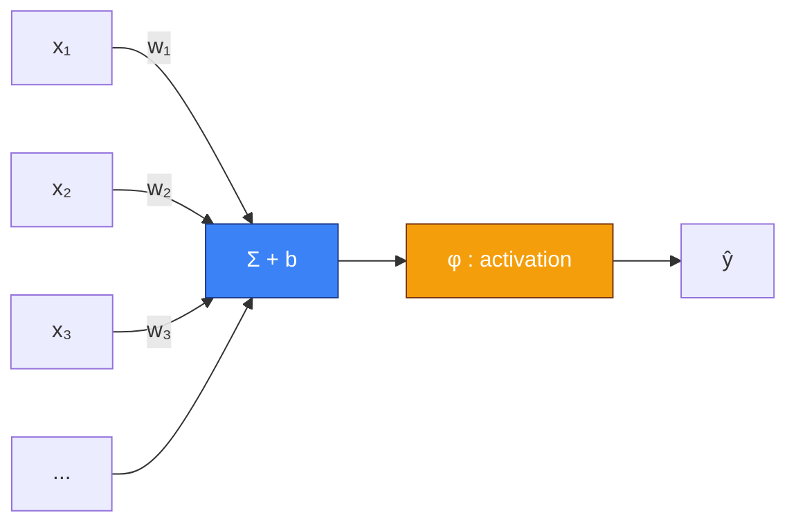
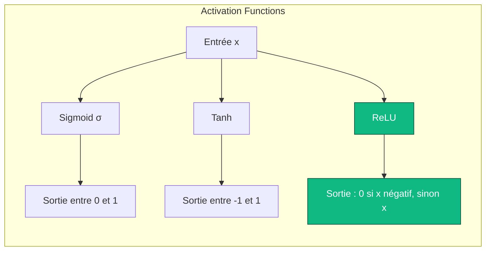
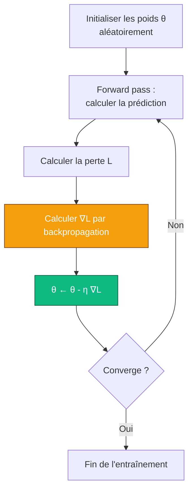

Avant de parler d'agents qui apprennent par essai-erreur, avant de parler de Q-learning et d'équations de Bellman, il faut parler de la brique de base. Celle qu'on retrouve absolument partout en IA moderne. Celle qui est au cœur de ton ChatGPT, de la reconnaissance de visages de ton téléphone, du système qui trie tes mails en spam/non-spam, et oui, dans la majorité des algos de reinforcement learning modernes.

Je parle des **réseaux de neurones**.

Si tu as déjà lu mon post sur le [RL](#/post/RL), tu sais que j'aime bien prendre le temps. Ce post est la préquel naturelle. On va remonter aux origines. On va comprendre pourquoi on appelle ça "neurones" (spoiler : c'est un peu un abus de langage), on va dériver la backpropagation à la main, on va coder un petit réseau de zéro en numpy, et on va voir comment on passe d'un modèle tout bête à une architecture capable de classer des images ou de générer du texte.

Prends un café. C'est parti pour environ 20 minutes de lecture.

## I. Le rêve : une machine qui apprend toute seule

Revenons en 1950. Alan Turing publie un article célèbre, *Computing Machinery and Intelligence*, dans lequel il pose une question simple : *"Can machines think ?"* Il propose un test — le fameux Turing test — pour évaluer si une machine peut tenir une conversation indiscernable de celle d'un humain. Mais au détour d'un paragraphe, Turing glisse une idée encore plus provocante : au lieu d'essayer de programmer une machine adulte, pourquoi ne pas programmer une machine-bébé, et **la faire apprendre** ?

L'idée est révolutionnaire parce qu'elle renverse complètement la manière dont on concevait l'informatique jusque-là. En 1950, programmer veut dire *dire à la machine quoi faire, étape par étape*. Turing suggère l'inverse : *montrer à la machine ce qu'on veut*, et la laisser trouver comment. Ça s'appelle le **machine learning**, et toute la suite de cette histoire découle de cette idée-là.

Mais il y a un détail gênant : Turing ne dit pas comment faire. Comment est-ce qu'une machine peut bien apprendre ? Quel mécanisme, quel substrat, quelle architecture ? Pour ça, il faut regarder ailleurs. Il faut regarder du côté de la biologie.

## II. Du neurone biologique au neurone artificiel

Ton cerveau contient environ 86 milliards de neurones. Chacun est une petite cellule qui fait, au fond, une chose assez simple : il reçoit des signaux électriques d'autres neurones à travers ses dendrites, les intègre dans son corps cellulaire, et s'il y a "assez" de signal accumulé, il émet à son tour un signal électrique le long de son axone, qui se propage vers d'autres neurones. Les connexions entre neurones, les synapses, peuvent être plus ou moins fortes. Et c'est l'intensité de ces synapses, ainsi que l'organisation spatiale du réseau, qui encode ce que tu sais, ce dont tu te souviens, et ce que tu es capable de faire.

C'est une description caricaturale. Les vrais neurones sont infiniment plus complexes — il y a des dizaines de neurotransmetteurs différents, des temporalités fines, des phénomènes électrochimiques subtils, des boucles de régulation à tous les étages. Mais pour notre propos, cette simplification suffit. Le cerveau est un réseau gigantesque d'unités simples qui s'additionnent et se déclenchent, et dont la connectivité encode le savoir.

En 1943, deux chercheurs — le neurophysiologiste **Warren McCulloch** et le logicien **Walter Pitts** — publient un papier qui va poser les bases de tout ce qui suit. Ils proposent un modèle mathématique radicalement simplifié du neurone biologique, qu'on appelle aujourd'hui le **neurone de McCulloch-Pitts**. L'idée : oublie l'électrochimie, oublie les subtilités temporelles. Représente un neurone comme une fonction qui prend plusieurs entrées, les combine linéairement, et sort 1 ou 0 selon si la somme dépasse un seuil.

$$\text{sortie} = \begin{cases} 1 & \text{si } \sum_i w_i x_i \geq \theta \\ 0 & \text{sinon} \end{cases}$$

C'est radicalement simpliste. C'est aussi mathématiquement tractable. Et c'est la brique de base de tout ce qui va suivre.


Ce petit diagramme résume tout le modèle. Plusieurs entrées $x_1, x_2, \dots, x_n$ arrivent avec des poids $w_1, w_2, \dots, w_n$. On calcule la somme pondérée $\sum_i w_i x_i$, on y ajoute un biais $b$, et on passe le tout à travers une **fonction d'activation** $\varphi$ qui décide si le neurone "tire" ou non. La sortie est $y = \varphi(\sum_i w_i x_i + b)$.

C'est tout. Ce qu'on appelle un neurone artificiel, au XXIe siècle, c'est *ça*. Une somme pondérée, un biais, une fonction d'activation. Ne sois pas déçu si tu trouves ça trop simple — c'est précisément parce que c'est simple que ça marche à grande échelle.

## III. Rosenblatt, le Perceptron, et la première promesse

En 1958, Frank Rosenblatt, psychologue et chercheur à Cornell, prend le neurone de McCulloch-Pitts et ajoute une chose cruciale : un **algorithme d'apprentissage**. Il l'appelle le **Perceptron**. L'idée est que les poids $w_i$ ne sont plus câblés à la main — le Perceptron les apprend à partir d'exemples.

La règle d'apprentissage du Perceptron est d'une simplicité désarmante. Pour chaque exemple $(x, y)$ dans ton jeu d'entraînement (où $x$ est l'input et $y \in \{0, 1\}$ est le label attendu) :

1. Calcule la prédiction $\hat{y} = \varphi(w^\top x + b)$.
2. Si $\hat{y} = y$, ne fais rien.
3. Sinon, mets à jour les poids : $w \leftarrow w + \eta (y - \hat{y}) x$, où $\eta$ est un petit learning rate.

C'est tout. Et Rosenblatt démontre — c'est le **Perceptron Convergence Theorem** — que si les données sont **linéairement séparables** (c'est-à-dire qu'il existe un hyperplan qui sépare parfaitement les exemples positifs des négatifs), alors cet algorithme converge en un nombre fini d'étapes vers une solution qui classe parfaitement toutes les données.

À l'époque, c'est une bombe. Un journaliste du New York Times écrit en 1958 que le Perceptron est "l'embryon d'un ordinateur électronique capable de marcher, parler, voir, écrire, se reproduire et être conscient de sa propre existence". Rosenblatt lui-même parle de machines qui, dans un futur proche, liront des livres et piloteront des avions. L'enthousiasme est à son comble.



Sauf que Rosenblatt a omis un détail : son algorithme ne marche que sur des données **linéairement séparables**. Et il se trouve qu'il existe un problème ridiculement simple, à deux variables et quatre points, que le Perceptron ne peut pas apprendre. Ce problème, c'est la fonction logique **XOR** (ou exclusif).

## IV. XOR, l'hiver et la chute

Le XOR est une fonction à deux entrées $x_1, x_2 \in \{0, 1\}$. Sa table de vérité est :

| $x_1$ | $x_2$ | XOR |
|-------|-------|-----|
| 0 | 0 | 0 |
| 0 | 1 | 1 |
| 1 | 0 | 1 |
| 1 | 1 | 0 |

Essaie de tracer ces quatre points sur un plan. $(0,0)$ et $(1,1)$ appartiennent à la classe 0, $(0,1)$ et $(1,0)$ appartiennent à la classe 1. Cherche une droite qui sépare les deux classes. Cherche bien.

Il n'y en a pas. Aucune droite ne peut mettre $(0,0)$ et $(1,1)$ d'un côté et $(0,1)$ et $(1,0)$ de l'autre. Le problème n'est pas linéairement séparable. Et donc, par définition, **le Perceptron de Rosenblatt ne peut pas apprendre XOR**. Ce n'est pas une question de réglage, ce n'est pas une question de données, c'est une impossibilité mathématique de la classe d'hypothèses.

En 1969, deux grandes figures de l'IA classique — **Marvin Minsky** et **Seymour Papert** — publient un livre (*Perceptrons*) qui formalise cette limitation et plusieurs autres. Le livre est rigoureux, et ses conclusions sont dévastatrices pour le camp "connexionniste" : les perceptrons simples sont fondamentalement limités. Minsky et Papert notent que, théoriquement, en empilant plusieurs couches de perceptrons, on pourrait surmonter ces limitations — mais qu'on ne sait pas comment entraîner de tels réseaux. Ils suggèrent que c'est probablement impossible.

Le résultat du livre est catastrophique pour le domaine. Le financement s'évapore. Les labos se ferment. Les chercheurs passent à autre chose. C'est ce qu'on appelle le **premier hiver de l'IA**. Pendant presque vingt ans, les réseaux de neurones deviennent un sujet tabou dans le milieu académique. Travailler dessus, c'est du gaspillage de carrière.

Et puis, en 1986, quelque chose change.

## V. Le retour : backpropagation et réseaux multi-couches

En 1986, un trio de chercheurs — **David Rumelhart**, **Geoffrey Hinton** et **Ronald Williams** — publient dans *Nature* un article qui change la face du domaine. Ils redécouvrent et popularisent un algorithme qu'on appelle la **backpropagation** (l'algorithme était en fait connu depuis les années 60 sous diverses formes, mais personne n'avait vraiment vu son potentiel). Cet algorithme résout précisément le problème que Minsky et Papert avaient déclaré quasi-impossible : comment entraîner un réseau de neurones à **plusieurs couches** ?

L'idée fondamentale est simple : un réseau multi-couches (ou **MLP**, Multi-Layer Perceptron) applique une succession de transformations. Chaque couche prend la sortie de la précédente, la combine linéairement avec ses propres poids, passe le résultat à travers une non-linéarité, et transmet à la suivante. Avec suffisamment de couches et de non-linéarités, un tel réseau peut en théorie représenter n'importe quelle fonction mesurable — c'est le **théorème d'approximation universelle**. Le XOR, par exemple, devient trivial avec un MLP à une seule couche cachée de deux neurones.


Voilà la structure de base d'un MLP. À gauche, les entrées (par exemple, les pixels d'une image). Au milieu, une ou plusieurs couches dites "cachées", parce qu'elles ne sont ni des entrées ni des sorties — elles sont les mécanismes internes de représentation. À droite, la couche de sortie (par exemple, dix neurones si on classe des chiffres de 0 à 9).

Le gros problème, c'est que si tu as un réseau avec plusieurs couches et des milliers de paramètres, tu ne peux pas les régler à la main. Tu as besoin d'un algorithme qui, étant donné une erreur de prédiction sur un exemple, sache comment ajuster **chaque poids du réseau** pour réduire cette erreur. C'est exactement ce que fait la backpropagation.

Mais avant d'y arriver, il nous faut un détour par trois concepts : les fonctions d'activation, les fonctions de perte, et la descente de gradient.

## VI. Les fonctions d'activation, ou pourquoi les non-linéarités sont essentielles

Imagine un instant qu'on empile plusieurs couches de transformations **linéaires** sans aucune non-linéarité entre elles. Chaque couche fait $h_i = W_i h_{i-1} + b_i$. Que se passe-t-il ? Eh bien, mathématiquement :

$$h_2 = W_2 h_1 + b_2 = W_2 (W_1 x + b_1) + b_2 = (W_2 W_1) x + (W_2 b_1 + b_2)$$

C'est encore une transformation linéaire, avec une matrice $W' = W_2 W_1$ et un biais $b' = W_2 b_1 + b_2$. Autrement dit : empiler mille couches linéaires te donne exactement la même puissance expressive qu'une seule couche linéaire. Tu n'as rien gagné. Tu n'as juste rien fait.

Pour que les couches cachées apportent quelque chose, il faut une **non-linéarité** entre chaque couche. C'est le rôle de la fonction d'activation. Voici les plus importantes :

**La sigmoïde** (ou fonction logistique) :
$$\sigma(x) = \frac{1}{1 + e^{-x}}$$
Historiquement la plus utilisée. Elle a l'avantage de produire une sortie entre 0 et 1, interprétable comme une probabilité. Elle a l'énorme défaut d'être "saturante" — quand $|x|$ devient grand, la dérivée $\sigma'(x) = \sigma(x)(1 - \sigma(x))$ devient proche de zéro, ce qui gèle l'apprentissage. C'est le fameux problème du **vanishing gradient**.

**La tangente hyperbolique** :
$$\tanh(x) = \frac{e^x - e^{-x}}{e^x + e^{-x}}$$
Cousine de la sigmoïde, mais centrée en zéro (sa sortie est entre -1 et 1). Souvent un peu meilleure en pratique, pour des raisons d'initialisation et de conditionnement numérique. Mais elle souffre du même problème de saturation.

**ReLU** (Rectified Linear Unit) :
$$\text{ReLU}(x) = \max(0, x)$$
La révélation des années 2010. Absolument triviale, dérivable partout sauf en zéro (on met 0 ou 1 par convention, personne ne s'en rend compte), et sa dérivée vaut 1 sur toute la partie active. Résultat : plus de vanishing gradient côté positif, et un entraînement beaucoup plus rapide en pratique. La quasi-totalité des architectures modernes utilisent ReLU ou une de ses variantes (Leaky ReLU, ELU, GELU).



ReLU est devenue la non-linéarité par défaut depuis qu'un papier de 2011 (Glorot, Bordes, Bengio) a montré qu'elle permettait d'entraîner des réseaux beaucoup plus profonds que sigmoïde ou tanh. Sans ReLU, probablement pas d'AlexNet, probablement pas de Deep Learning à grande échelle, probablement pas la révolution actuelle.

## VII. Les fonctions de perte : comment mesure-t-on l'erreur ?

Pour pouvoir "apprendre", il faut d'abord pouvoir mesurer à quel point on se trompe. C'est le rôle de la **fonction de perte** (ou *loss function*, aussi appelée *cost function*). C'est elle qu'on cherche à minimiser pendant l'entraînement.

Les deux grandes familles, selon la nature du problème :

**Pour la régression** (on prédit une valeur continue, comme le prix d'une maison), on utilise classiquement la **Mean Squared Error** (MSE) :
$$L_{\text{MSE}} = \frac{1}{N} \sum_{i=1}^{N} (y_i - \hat{y}_i)^2$$
On pénalise le carré de l'écart entre la prédiction et la vérité. Les grosses erreurs sont doublement pénalisées (ce qui peut être un bug ou une feature selon le cas). C'est différentiable partout, c'est convexe, et ça a une belle interprétation statistique (c'est équivalent à un estimateur du maximum de vraisemblance sous une hypothèse de bruit gaussien).

**Pour la classification** (on prédit une classe parmi plusieurs), on utilise presque toujours la **cross-entropy loss** (ou log-loss) :
$$L_{\text{CE}} = - \frac{1}{N} \sum_{i=1}^{N} \sum_{k=1}^{K} y_{i,k} \log(\hat{y}_{i,k})$$
où $y_{i,k}$ vaut 1 si l'exemple $i$ appartient à la classe $k$ (et 0 sinon, c'est un encodage "one-hot"), et $\hat{y}_{i,k}$ est la probabilité prédite par le modèle pour cette classe. La cross-entropy est minimale quand le modèle met toute la masse de probabilité sur la bonne classe. Elle est combinée avec une fonction **softmax** en sortie du réseau qui transforme les "logits" bruts en distribution de probabilité :
$$\text{softmax}(z)_k = \frac{e^{z_k}}{\sum_j e^{z_j}}$$

La combinaison softmax + cross-entropy est un classique du classique. Tu la retrouveras dans environ 100% des classificateurs basés sur des réseaux de neurones.

## VIII. La descente de gradient : comment on minimise

On a un réseau. On a une perte. Comment fait-on pour modifier les poids afin de diminuer la perte ? C'est là qu'intervient la **descente de gradient**.

L'idée est géométrique et très intuitive. Imagine que tu es au milieu d'un paysage montagneux, dans un brouillard épais. Tu veux descendre dans la vallée. Tu ne vois rien à plus d'un mètre, mais tu peux sentir la pente sous tes pieds. Que fais-tu ? Tu fais un petit pas dans la direction de la descente la plus abrupte. Puis tu recommences. Et tu recommences. Et avec un peu de chance, tu finis dans une vallée.

Mathématiquement, le **gradient** d'une fonction $L$ par rapport à ses paramètres $\theta$ est un vecteur qui pointe dans la direction de **montée** la plus abrupte. Pour descendre, on prend donc l'opposé :
$$\theta \leftarrow \theta - \eta \nabla_\theta L$$
où $\eta$ est le **learning rate** — la taille du pas. Tu fais un petit pas dans la direction opposée au gradient. Tu recalcules le gradient. Tu refais un pas. Et tu continues jusqu'à ce que la perte ne diminue plus.



Le learning rate est l'hyperparamètre le plus important de toute cette histoire. Trop grand, et tu "sautes" par-dessus les vallées et tu diverges. Trop petit, et tu mets des siècles à converger. La quasi-totalité des études empiriques sur l'entraînement de réseaux de neurones montrent que régler correctement le learning rate est plus important que choisir l'architecture, l'optimizer, ou à peu près tout le reste.

## IX. La backpropagation, ou l'art de dériver une composition géante

On a tout ce qu'il faut, sauf le plus important : **comment calcule-t-on le gradient** ? Dans un réseau avec dix couches et quelques millions de paramètres, dériver à la main n'est pas une option. On a besoin d'un algorithme systématique.

Cet algorithme, c'est la **backpropagation**. Son nom complet est *reverse-mode automatic differentiation appliqué à une composition de fonctions*, ce qui est plus technique mais plus honnête.

L'intuition profonde derrière la backpropagation, c'est la **règle de chaîne** (chain rule). Si tu as une fonction composée $f(g(x))$ et que tu veux la dériver, tu sais que :
$$\frac{d f(g(x))}{d x} = \frac{d f}{d g} \cdot \frac{d g}{d x}$$

C'est la règle de chaîne de terminale. Maintenant, imagine que ton réseau est une composition gigantesque : $L = L(f_n(f_{n-1}(\dots f_1(x))))$. Pour calculer $\frac{\partial L}{\partial w}$ où $w$ est un poids de la couche $i$, tu appliques la règle de chaîne tout le long du chemin, de la perte jusqu'à $w$. C'est tout.

Le coup de génie de la backpropagation, c'est qu'elle calcule ces dérivées **en sens inverse**, de la sortie vers l'entrée, en réutilisant les calculs intermédiaires. C'est ce qui rend la complexité linéaire dans le nombre de paramètres, au lieu d'être quadratique ou pire.

Concrètement, l'algorithme fait deux passes :

**Forward pass** : on calcule les activations de chaque couche, de l'entrée vers la sortie, en stockant tout en mémoire.

**Backward pass** : on calcule $\delta_n = \frac{\partial L}{\partial z_n}$ où $z_n$ est l'activation pré-non-linéarité de la dernière couche. Puis on rétro-propage : $\delta_{i-1} = (W_i^\top \delta_i) \odot \varphi'(z_{i-1})$, où $\odot$ est le produit élément par élément et $\varphi'$ la dérivée de l'activation. À chaque étape, on calcule aussi les gradients par rapport aux poids de la couche courante : $\frac{\partial L}{\partial W_i} = \delta_i h_{i-1}^\top$.

Si tu as eu la tête qui tourne à lire ce paragraphe, c'est normal. La backpropagation est l'un des algorithmes les plus célèbres de l'IA et aussi l'un des plus désorientants à comprendre du premier coup. La bonne nouvelle, c'est qu'aujourd'hui, tu n'as plus besoin de l'implémenter à la main : PyTorch, JAX et TensorFlow font ça pour toi automatiquement, grâce à une technique qu'on appelle **autograd** (automatic differentiation). Tu définis ton forward pass en Python, et le framework calcule les gradients tout seul par manipulation symbolique du graphe de calcul.

Mais pour vraiment comprendre ce qui se passe, il faut au moins l'avoir fait une fois à la main. Ce qu'on va faire maintenant.

## X. Implémentation : un MLP en numpy from scratch

Assez de théorie. Codons un petit réseau de neurones de zéro, sans aucun framework, juste avec numpy, pour classer des points dans un plan. On va faire un problème "jouet" : apprendre à séparer deux spirales entrelacées, un cas classique qui est impossible à résoudre avec une régression linéaire mais trivial pour un MLP.

```python
import numpy as np
import matplotlib.pyplot as plt

# 1. Génération des données : deux spirales entrelacées
np.random.seed(0)
N = 200               # points par classe
K = 2                 # nombre de classes
X = np.zeros((N * K, 2))
y = np.zeros(N * K, dtype=int)
for j in range(K):
    ix = range(N * j, N * (j + 1))
    r = np.linspace(0.0, 1, N)
    t = np.linspace(j * 4, (j + 1) * 4, N) + np.random.randn(N) * 0.2
    X[ix] = np.c_[r * np.sin(t), r * np.cos(t)]
    y[ix] = j

# One-hot encoding des labels
Y = np.zeros((N * K, K))
Y[np.arange(N * K), y] = 1

# 2. Architecture : 2 -> 16 -> 16 -> 2
input_dim, hidden_dim, output_dim = 2, 16, 2

# Initialisation des poids (He initialization, adaptée à ReLU)
W1 = np.random.randn(input_dim, hidden_dim) * np.sqrt(2.0 / input_dim)
b1 = np.zeros((1, hidden_dim))
W2 = np.random.randn(hidden_dim, hidden_dim) * np.sqrt(2.0 / hidden_dim)
b2 = np.zeros((1, hidden_dim))
W3 = np.random.randn(hidden_dim, output_dim) * np.sqrt(2.0 / hidden_dim)
b3 = np.zeros((1, output_dim))

# 3. Fonctions utiles
def relu(x):
    return np.maximum(0, x)

def softmax(x):
    # Version stable numériquement
    x = x - x.max(axis=1, keepdims=True)
    ex = np.exp(x)
    return ex / ex.sum(axis=1, keepdims=True)

# 4. Hyperparamètres
lr = 0.05
epochs = 2000
losses = []

# 5. Boucle d'entraînement
for epoch in range(epochs):
    # Forward pass
    z1 = X @ W1 + b1
    h1 = relu(z1)
    z2 = h1 @ W2 + b2
    h2 = relu(z2)
    z3 = h2 @ W3 + b3
    probs = softmax(z3)

    # Cross-entropy loss
    loss = -np.mean(np.sum(Y * np.log(probs + 1e-12), axis=1))
    losses.append(loss)

    # Backward pass
    dz3 = (probs - Y) / (N * K)                      # gradient de la loss par rapport à z3
    dW3 = h2.T @ dz3
    db3 = dz3.sum(axis=0, keepdims=True)

    dh2 = dz3 @ W3.T
    dz2 = dh2 * (z2 > 0)                              # dérivée de ReLU
    dW2 = h1.T @ dz2
    db2 = dz2.sum(axis=0, keepdims=True)

    dh1 = dz2 @ W2.T
    dz1 = dh1 * (z1 > 0)
    dW1 = X.T @ dz1
    db1 = dz1.sum(axis=0, keepdims=True)

    # Mise à jour des poids (SGD vanille)
    W3 -= lr * dW3; b3 -= lr * db3
    W2 -= lr * dW2; b2 -= lr * db2
    W1 -= lr * dW1; b1 -= lr * db1

    if epoch % 200 == 0:
        preds = np.argmax(probs, axis=1)
        acc = np.mean(preds == y)
        print(f"Epoch {epoch:4d} | loss {loss:.4f} | acc {acc:.3f}")
```

Ce code contient tout ce qu'on a vu jusqu'ici. Un forward pass explicite, une perte cross-entropy, et une backpropagation calculée à la main en appliquant la règle de chaîne couche par couche. Pas de framework, pas de magie, juste du numpy. Tu le copies-colles, tu le lances, et en deux secondes tu as un réseau qui classe correctement deux spirales entrelacées.

Quelques détails qui méritent qu'on s'y arrête. L'**initialisation de He** (`np.sqrt(2.0 / input_dim)`) est la méthode standard pour initialiser les poids quand on utilise ReLU — elle est calibrée pour que la variance des activations reste stable à travers les couches. Utiliser une initialisation naïve (par exemple, des gaussiennes avec écart-type 1) donne typiquement un réseau qui ne converge pas ou qui explose.

La **softmax stable** (en soustrayant le max avant l'exponentielle) est un hack numérique essentiel. Sans ça, dès que tes logits dépassent 700 environ, $e^{z}$ déborde et tu obtiens des `inf` et des `NaN` partout. L'astuce consiste à utiliser l'identité $\text{softmax}(z) = \text{softmax}(z - c)$ pour n'importe quelle constante $c$, et à choisir $c = \max(z)$ pour garantir que tous les exposants sont négatifs ou nuls.

Enfin, la manière dont on calcule `dz3 = (probs - Y) / N` mérite un mot. Quand tu combines softmax en sortie avec cross-entropy, leurs dérivées s'annulent magnifiquement et tu obtiens cette formule ultra-simple : le gradient de la loss par rapport aux logits, c'est la différence entre la probabilité prédite et la vraie probabilité. C'est une raison supplémentaire pour laquelle cette combinaison est omniprésente : elle simplifie énormément le calcul du gradient.

## XI. Les pièges de l'entraînement

Coder un MLP qui tourne est une chose. L'entraîner pour qu'il marche vraiment sur un vrai problème en est une autre. Voici les principaux pièges que tu vas rencontrer.

### Overfitting

Ton réseau a trop de paramètres par rapport à tes données, et au lieu d'apprendre les patterns généraux, il mémorise les exemples. Le symptôme classique : la perte d'entraînement descend joliment, mais la perte de validation (sur des données que le modèle n'a jamais vues) remonte. Le modèle est devenu excellent pour le jeu d'entraînement et terrible pour tout le reste.

Les remèdes classiques : plus de données (toujours la meilleure solution), **régularisation L2** (ajouter $\lambda \|W\|^2$ à la loss pour pénaliser les gros poids), **dropout** (couper aléatoirement 10-50% des neurones à chaque passe d'entraînement — ça force le réseau à ne pas dépendre d'un neurone en particulier), et **early stopping** (arrêter l'entraînement quand la perte de validation commence à remonter).

### Vanishing et exploding gradients

Dans un réseau profond, le gradient est un produit de nombreuses matrices jacobiennes. Si ces matrices ont des valeurs singulières plus petites que 1, le gradient décroît exponentiellement en profondeur et les premières couches ne s'entraînent plus. C'est le **vanishing gradient**. Symétriquement, si les valeurs singulières sont plus grandes que 1, le gradient explose.

Les remèdes : **ReLU** (qui a une dérivée de 1 sur la partie active, ce qui limite la décroissance), **initialisations spécifiques** (He, Xavier/Glorot), **batch normalization** (normaliser les activations à chaque couche pour garder leur distribution contrôlée), et **connexions résiduelles** (introduites par ResNet en 2015, qui créent des "raccourcis" entre couches lointaines).

### Local minima et selles

Traditionnellement, on s'inquiétait que la descente de gradient se coince dans un minimum local qui ne soit pas global. En pratique, dans les réseaux très profonds et très larges, les chercheurs ont découvert que les minima locaux stricts sont extrêmement rares — le paysage de la perte est plus souvent dominé par des **points de selle** (des endroits où le gradient est nul mais qui ne sont pas des minima). Les optimizers modernes comme **Adam** gèrent assez bien les points de selle grâce à leurs moments accumulés.

### Le choix du learning rate

Je l'ai déjà dit, mais c'est tellement important que je le répète : le learning rate est l'hyperparamètre numéro un. Les méthodes modernes utilisent des **learning rate schedules** (diminuer le lr au fil de l'entraînement), des **warmup** (commencer petit et monter, surtout pour les gros modèles), et des **schedulers adaptatifs** comme le cosine decay. L'article *"Cyclical Learning Rates"* de Leslie Smith est une bonne entrée dans le sujet.

### Les optimizers modernes

La descente de gradient pure (SGD) est utilisée dans beaucoup de cas, mais elle a des concurrents. **SGD avec momentum** ajoute une inertie aux mises à jour pour lisser le chemin. **RMSProp** et **Adagrad** adaptent le learning rate par paramètre selon l'historique des gradients. **Adam**, combinaison des deux idées précédentes, est aujourd'hui l'optimizer par défaut quand on ne veut pas se prendre la tête. Pour les très gros modèles (LLM, etc.), **AdamW** — une variante qui sépare proprement la régularisation — est la référence.

## XII. Au-delà du MLP : l'explosion des architectures

Le MLP, avec sa structure fully-connected, est le modèle universel. Mais il est inefficace pour certains types de données. C'est ce qui a motivé l'invention d'architectures spécialisées.

### Les CNN, ou comment tricher sur la structure spatiale

Quand tu regardes une image, deux pixels adjacents sont beaucoup plus susceptibles d'être liés que deux pixels très éloignés. De plus, un chat en haut à gauche de l'image et un chat au milieu devraient être reconnus par le même mécanisme. Ces deux observations — **localité** et **invariance par translation** — sont à la base des **réseaux convolutionnels** (CNN, Convolutional Neural Networks).

Un CNN remplace les couches fully-connected par des couches **de convolution**. Au lieu que chaque neurone de sortie soit connecté à tous les pixels d'entrée, il est connecté à une petite fenêtre locale (par exemple 3x3 pixels), et le **même** ensemble de poids (le filtre ou le kernel) est appliqué en glissant sur toute l'image. Résultat : beaucoup moins de paramètres, et une structure qui exploite la géométrie de l'image.


Le dataset **MNIST** (ces chiffres manuscrits ci-dessus) est l'exemple canonique. Avant les CNN, les meilleurs modèles atteignaient environ 0.7% d'erreur. Avec des CNN bien réglés (LeNet-5, Yann LeCun, 1998), on descend à 0.3%. Avec des CNN modernes et du data augmentation, on est en dessous de 0.1%. MNIST a été tellement solidement résolu qu'il est aujourd'hui considéré comme un benchmark "triste" — tout le monde le fait marcher. Mais historiquement, c'est sur lui que s'est construite l'école convolutionnelle.

### Les RNN, pour les séquences

Quand tes données sont des séquences (texte, audio, séries temporelles), il faut gérer les dépendances temporelles. Les **réseaux récurrents** (RNN) introduisent une boucle : à chaque pas de temps, le réseau prend l'input courant **plus** son propre état interne du pas précédent. Mathématiquement :
$$h_t = \varphi(W_x x_t + W_h h_{t-1} + b)$$

Ça marche en théorie, mais souffre massivement du vanishing gradient sur des séquences longues. Les variantes **LSTM** (Long Short-Term Memory, Hochreiter & Schmidhuber, 1997) et **GRU** (Gated Recurrent Unit) ajoutent des mécanismes de portes qui permettent de maintenir des informations sur des centaines, voire des milliers de pas de temps. Pendant les années 2010, LSTM a dominé le traitement du langage naturel.

### Les Transformers, ou la fin des RNN

En 2017, un papier de Google (*"Attention Is All You Need"*) propose une architecture radicalement nouvelle : le **Transformer**. Il n'y a plus de récurrence. À la place, un mécanisme dit d'**attention** permet à chaque token d'une séquence de "regarder" tous les autres tokens simultanément, et d'apprendre lesquels sont pertinents pour sa propre représentation. L'attention est parallélisable (ce que les RNN ne sont pas), et se révèle massivement plus efficace à échelle.

En quelques années, les Transformers ont dévoré absolument tout. NLP d'abord (BERT, GPT), puis la vision (Vision Transformer), puis le son (Whisper), puis la biologie (AlphaFold 2), puis le code, puis le RL... Aujourd'hui, en 2026, la quasi-totalité des modèles d'IA de pointe sont des Transformers, et la phrase "Attention Is All You Need" est probablement la prophétie la plus exacte de l'histoire du ML.

## XIII. La révolution Deep Learning

Mais comment est-on passé de "on sait entraîner des petits réseaux depuis 1986" à "l'IA est partout" ? Pourquoi ça a pris trente ans ? La réponse tient en trois ingrédients qui se sont assemblés au début des années 2010.

Le premier, c'est **les données**. Avant Internet, avant ImageNet, on s'entraînait sur des jeux de données minuscules (quelques dizaines de milliers d'exemples au mieux). ImageNet, lancé par Fei-Fei Li en 2009, contient 14 millions d'images annotées. Pour la première fois, on a eu assez de données pour faire déborder les réseaux profonds sans qu'ils overfit.

Le second, c'est **le compute**. Les GPU, initialement conçus pour le rendu 3D dans les jeux vidéo, se sont révélés parfaits pour la multiplication matricielle massive que fait un réseau de neurones. Un GPU NVIDIA Tesla des années 2010 offrait des dizaines de fois plus de puissance que les meilleurs CPU pour ce type de workload. Et les GPU ont continué à doubler en capacité tous les deux ans, alors que les CPU stagnaient.

Le troisième, c'est **l'algorithme**. ReLU, dropout, batch normalization, des initialisations propres, de meilleures librairies. Tous ces détails, pris isolément, semblent mineurs. Mis ensemble, ils ont rendu possible l'entraînement de réseaux dix à cent fois plus profonds qu'avant.

Le moment décisif, c'est 2012. La compétition annuelle **ImageNet Large Scale Visual Recognition Challenge** oppose les meilleurs systèmes de vision du monde. Jusque-là, les vainqueurs utilisaient des méthodes classiques (SIFT, HOG, SVM) et amélioraient de quelques pourcents chaque année. En 2012, une équipe de l'université de Toronto menée par Geoffrey Hinton soumet un réseau convolutionnel profond entraîné sur deux GPU, qu'ils appellent **AlexNet**. Le résultat : une erreur top-5 de 15.3%, contre 26.2% pour le second. Une amélioration absolument sans précédent. Le monde comprend.

À partir de ce moment, tout s'accélère. En 2014, les réseaux sont plus profonds (VGG, GoogLeNet). En 2015, ils sont encore plus profonds grâce aux connexions résiduelles (ResNet, 152 couches). En 2016, AlphaGo bat Lee Sedol au Go. En 2017, les Transformers débarquent. En 2020, GPT-3 montre que l'échelle pure suffit à donner des capacités émergentes inattendues. En 2022, ChatGPT sort et le grand public découvre ce que la recherche savait depuis des années : les réseaux de neurones bien entraînés sont devenus terrifiamment bons à presque tout.

## XIV. Et maintenant ?

On a fait le tour. Du neurone de McCulloch-Pitts aux Transformers, de Rosenblatt à Hinton, des XOR impossibles aux modèles qui écrivent mieux que nous. Si tu as suivi jusqu'ici, tu as dans la tête la cartographie complète des concepts qui animent l'IA moderne. Tu sais ce qu'est une activation, tu sais pourquoi la backpropagation marche, tu sais pourquoi on utilise ReLU, tu sais pourquoi Adam est devenu populaire, tu sais ce qu'est un CNN et un Transformer. Tu peux lire un papier de ML et comprendre le vocabulaire.

Mais il te manque encore une chose : comprendre comment ces réseaux deviennent des **agents**. Comment on passe d'un modèle qui classe des images ou prédit le prochain mot à un modèle qui **agit** dans un environnement, qui explore, qui échoue, qui se corrige, qui apprend à jouer à un jeu ou à piloter un bras robotique. Cette bascule — du prédicteur passif à l'agent actif — est précisément ce qui transforme un réseau de neurones en système de reinforcement learning.

Si tu veux aller jusqu'au bout, la suite est [ici](#/post/RL). On y parle d'équations de Bellman, de Q-learning, d'exploration vs exploitation, de Deep RL, d'AlphaGo, et de pourquoi le reinforcement learning est peut-être la forme d'apprentissage la plus proche de ce que c'est, vraiment, qu'apprendre.

## Pour aller plus loin

- **Michael Nielsen, "Neural Networks and Deep Learning"**. Un livre en ligne gratuit, superbement écrit, qui couvre toute la théorie des MLP et de la backpropagation avec des visualisations interactives. Si tu n'as qu'un livre à lire, c'est celui-là. [Lien](http://neuralnetworksanddeeplearning.com/)
- **Goodfellow, Bengio & Courville, "Deep Learning"**. Le manuel de référence, plus exigeant, disponible gratuitement. Indispensable si tu veux sérieuser le sujet. [Lien](https://www.deeplearningbook.org/)
- **Andrej Karpathy, "Neural Networks: Zero to Hero"**. Une série de vidéos YouTube où Karpathy construit un framework de deep learning de zéro, en Python, en partant des MLP jusqu'à un mini-GPT. Pédagogiquement parfait. Gratuit.
- **3Blue1Brown, "Neural networks" series**. Des vidéos animées magnifiques qui expliquent les MLP et la backpropagation avec une clarté visuelle rare.
- **Papers fondateurs** : Rumelhart, Hinton, Williams (1986) pour la backpropagation ; LeCun et al. (1998) pour LeNet ; Krizhevsky, Sutskever, Hinton (2012) pour AlexNet ; He et al. (2015) pour ResNet ; Vaswani et al. (2017) pour le Transformer.

## Conclusion

Les réseaux de neurones sont, à un certain niveau, d'une simplicité déconcertante. Des sommes pondérées, des non-linéarités, une perte, un gradient, et on répète. Pas de magie. Pas de génie caché. Juste de l'algèbre linéaire, du calcul différentiel, et beaucoup de GPU.

Et pourtant, c'est avec ces briques simples qu'on a construit les systèmes les plus capables que l'humanité ait jamais conçus. Les systèmes qui reconnaissent ta voix, qui traduisent tes messages, qui génèrent des images à partir de mots, qui jouent aux échecs mieux que n'importe quel humain, qui résolvent la structure 3D de protéines, qui écrivent du code mieux que des développeurs juniors. Tout ça découle, directement, des équations qu'on a vues dans ce post.

La leçon, si tu veux en prendre une : la complexité émerge de la répétition à grande échelle de choses simples. Le perceptron de 1958 n'a pas beaucoup changé dans sa forme mathématique. Ce qui a changé, c'est qu'on en a empilé beaucoup, qu'on les a entraînés sur beaucoup de données, avec beaucoup de compute, en réglant beaucoup de petits détails. L'IA n'est pas une idée géniale — c'est une idée simple à laquelle on a dédié cinquante ans de labeur cumulatif. Et qui est enfin, sous nos yeux, en train de porter ses fruits.

Maintenant, va lire le [post sur le RL](#/post/RL). Tu as toutes les bases.
