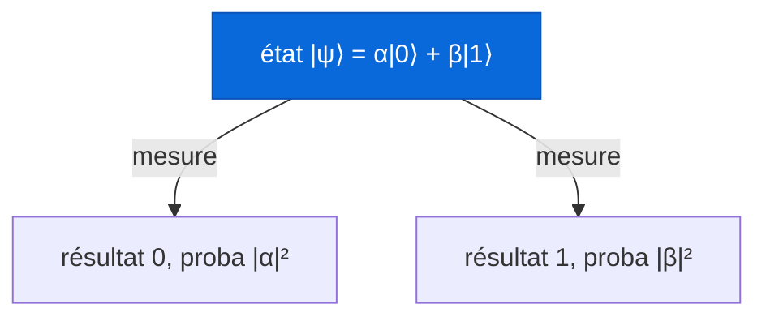
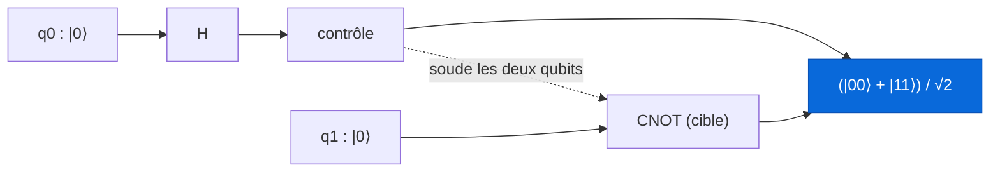

Pose une pièce de monnaie sur la tranche et fais-la tourner sur une table. Pendant qu'elle tourne, si je te demande "elle est sur pile ou sur face ?", tu me réponds, avec raison, que la question n'a pas de sens. Elle n'est ni l'un ni l'autre. Elle est dans un entre-deux flou, une toupie de possibilités, et ce n'est qu'au moment ou tu poses ta main dessus, ou elle s'effondre à plat, qu'elle choisit. Pile. Ou face. Jamais avant.

Garde cette pièce qui tourne en tête. Parce que c'est l'image la plus proche que ton intuition classique puisse produire d'un **qubit**, la brique de base d'un ordinateur quantique. C'est une bonne image. Elle est aussi trompeuse sur un point crucial, et tout l'intérêt du calcul quantique se cache précisément dans ce que la pièce qui tourne n'arrive pas à capturer. On va y venir doucement.

Ce post est long. C'est fait exprès. Le quantique est un de ces sujets ou chaque phrase de vulgarisation qu'on t'a servie cache une demi-vérité qu'il faut désamorcer une par une, et je préfère prendre le temps de le faire proprement plutôt que de te laisser avec les mêmes images fausses que tout le monde. Je suis étudiant, pas chercheur en physique quantique : ce que tu vas lire, c'est ma tentative d'expliquer clairement ce que j'ai vraiment fini par comprendre, avec les mots que j'aurais aimé qu'on me donne au début. On reste au niveau de l'exposition. Pas de correction d'erreurs topologique, pas de théorie de la complexité rigoureuse. On veut comprendre ce qu'est cette machine, les maths minimales qui la font tourner, et par ou commencer.

Prends un café. On y va.

Et avant même de commencer, débarrassons-nous de la pire phrase du domaine, celle que tu as forcément entendue : "un ordinateur quantique teste toutes les réponses en même temps". Elle est fausse. Ou au mieux, tellement trompeuse qu'elle te fera te planter sur tout le reste. On va voir pourquoi, et surtout ce qui se passe réellement à la place.

## I. Le bit, le qubit, et le mensonge qu'on te raconte

Commençons par le solide, le connu, la machine sur laquelle tu lis ces lignes. Un ordinateur classique manipule des **bits**. Un bit, c'est une petite case qui contient soit 0, soit 1. Toujours l'un des deux. Si tu regardes dedans à n'importe quel instant, tu trouves une valeur nette, tranchée. Toute l'informatique que tu connais, des vidéos de chats aux modèles de langage, c'est des milliards de ces cases qu'on bascule très vite entre 0 et 1. C'est propre, c'est déterministe, c'est notre pièce posée à plat.

Un ordinateur quantique manipule des **qubits**. Et un qubit, avant qu'on le regarde, n'est pas obligé de choisir. Il peut être en **superposition** : un mélange de 0 et de 1. Notre pièce qui tourne.

Là, premier piège, et c'est le plus important de tout le post. Superposition ne veut pas dire "le qubit est 0 et 1 à la fois, comme s'il vivait dans deux univers parallèles". Ça veut dire que son état est décrit par une combinaison des deux possibilités, ou chacune est pondérée par un nombre qu'on appelle une **amplitude**. Et ces amplitudes, retiens bien ça, ne sont pas des probabilités ordinaires. Elles peuvent être négatives. Elles peuvent même être complexes, au sens des nombres complexes. Une probabilité classique, ça va de 0 à 1 et ça ne fait que s'additionner. Une amplitude, elle, peut valoir moins quelque chose, et deux amplitudes peuvent donc **s'annuler**. Cette bizarrerie a l'air d'un détail technique. C'est en réalité toute la source de la puissance. On y reviendra, longuement, parce que c'est le coeur battant du domaine.

Quand tu **mesures** un qubit, la superposition s'effondre. Tu poses ta main sur la pièce. Tu obtiens 0 ou 1, net, avec une probabilité qui dépend des amplitudes. Et tu ne vois jamais l'amplitude elle-même. Jamais. Tu vois toujours un bon vieux résultat classique. C'est frustrant, et c'est fondamental : la nature te laisse manipuler ces amplitudes riches et étranges dans le noir, mais au moment de regarder, elle ne te rend qu'un pile ou face.

## II. Les maths minimales, ou comment écrire une hésitation

Pour parler proprement de tout ça, il faut un tout petit peu de notation. Ne fuis pas, je te jure que c'est gentil, et que ça tient en une poignée de symboles.

Les physiciens écrivent l'état d'un qubit avec la **notation de Dirac**, dite bra-ket. On note les deux états de base entre une barre et un chevron : $|0\rangle$ et $|1\rangle$. Ce sont juste des noms chics pour le 0 et le 1 classiques. Un qubit quelconque, notre pièce qui tourne, s'écrit alors comme une combinaison des deux :

$$|\psi\rangle = \alpha\,|0\rangle + \beta\,|1\rangle$$

Ici $\alpha$ et $\beta$ sont les fameuses amplitudes, deux nombres complexes. Et $|\psi\rangle$, prononcé "psi", c'est littéralement un **vecteur** dans un espace à deux dimensions. Si ça t'aide, imagine $|0\rangle$ et $|1\rangle$ comme les deux axes d'un repère, et $|\psi\rangle$ comme une flèche qui pointe quelque part entre les deux. Plus la flèche penche vers $|0\rangle$, plus tu as de chances de mesurer 0.

La règle qui relie tout ça à ce que tu observes porte un nom, la **règle de Born**, et elle est d'une simplicité désarmante : la probabilité de mesurer 0 vaut $|\alpha|^2$, celle de mesurer 1 vaut $|\beta|^2$. Tu prends l'amplitude, tu la mets au carré (en module), et tu obtiens la probabilité. Comme il faut bien qu'un résultat sorte, ces deux probabilités doivent sommer à 1 :

$$|\alpha|^2 + |\beta|^2 = 1$$

C'est la **condition de normalisation**, et géométriquement elle dit quelque chose de joli : un état quantique est toujours un vecteur de longueur 1. Une flèche qui peut tourner dans tous les sens, mais dont le bout reste sur une sphère. Retiens cette phrase, elle revient partout : un qubit, c'est un vecteur unitaire dans un espace à deux dimensions complexe.



Un exemple, pour que ça devienne concret. L'état

$$|\psi\rangle = \frac{1}{\sqrt{2}}\,|0\rangle + \frac{1}{\sqrt{2}}\,|1\rangle$$

a une amplitude $\frac{1}{\sqrt{2}}$ sur chaque possibilité. Au carré, ça fait $\frac{1}{2}$ de chaque coté. Donc à la mesure : cinquante pour cent 0, cinquante pour cent 1. Une pièce quantique parfaitement équilibrée, qui tourne pile au milieu. On verra dans une minute qu'on la fabrique avec une seule opération.

### La sphère de Bloch, ou la latitude d'une hésitation

Un qubit vit dans un espace complexe, difficile à dessiner tel quel. Mais en tenant compte de la normalisation et du fait qu'une phase globale ne change rien d'observable, on peut représenter n'importe quel état d'un qubit comme un simple **point sur la surface d'une sphère**. Ça s'appelle la **sphère de Bloch**, et c'est de loin l'image mentale la plus utile de tout le domaine.


*Le pôle nord, c'est $|0\rangle$. Le pôle sud, c'est $|1\rangle$. Tout le reste de la surface, ce sont les superpositions. Sur l'équateur, par exemple, on trouve les états parfaitement 50/50 comme celui d'au-dessus. (Schéma : Wikimedia Commons.)*

Deux angles suffisent à repérer le point, exactement comme la latitude et la longitude repèrent une ville sur Terre :

$$|\psi\rangle = \cos\!\frac{\theta}{2}\,|0\rangle + e^{i\varphi}\sin\!\frac{\theta}{2}\,|1\rangle$$

L'angle $\theta$ te dit à quelle hauteur tu es entre le nord et le sud, donc le dosage entre 0 et 1. L'angle $\varphi$ te dit ou tu es autour de l'équateur : c'est la fameuse **phase**. Cette phase, prise toute seule, ne change rien aux probabilités de mesure, ce qui la fait passer pour un détail inutile. Ce serait une grave erreur. Dès qu'on combinera des qubits, c'est elle qui portera toute la magie. Note-la dans un coin.

## III. Les portes quantiques, ou faire danser une amplitude

En informatique classique, on transforme les bits avec des portes logiques : AND, OR, NOT. En quantique, on transforme les qubits avec des **portes quantiques**. Et comme un état est un vecteur, une porte, c'est simplement une **matrice** qui agit dessus. Pas n'importe quelle matrice : une matrice **unitaire**, ce qui est le mot savant pour dire "qui préserve la longueur des vecteurs". Logique, puisque nos flèches doivent rester de longueur 1. Ça a une conséquence surprenante et profonde : toute porte quantique est **réversible**. On peut toujours revenir en arrière, défaire l'opération. Le AND classique, lui, jette de l'information à la poubelle et ne se remonte pas. Le quantique, non.

Voici les trois portes à connaître pour un seul qubit.

La porte **X**, c'est le NOT quantique. Elle échange $|0\rangle$ et $|1\rangle$, elle retourne la pièce :

$$X = \begin{pmatrix} 0 & 1 \\ 1 & 0 \end{pmatrix}$$

La porte **Z** laisse $|0\rangle$ tranquille mais colle un signe moins devant l'amplitude de $|1\rangle$. Elle ne touche pas aux probabilités, elle touche à la phase. Garde ça en tête, ce signe moins va bientôt tout faire basculer :

$$Z = \begin{pmatrix} 1 & 0 \\ 0 & -1 \end{pmatrix}$$

Et la star du spectacle, la porte de **Hadamard**, notée $H$, celle qui fabrique la superposition à partir d'un état net :

$$H = \frac{1}{\sqrt{2}}\begin{pmatrix} 1 & 1 \\ 1 & -1 \end{pmatrix}$$

Applique $H$ à $|0\rangle$, une pièce à plat sur face, et tu obtiens exactement notre pièce qui tourne au milieu :

$$H\,|0\rangle = \frac{1}{\sqrt{2}}\,|0\rangle + \frac{1}{\sqrt{2}}\,|1\rangle$$

Voilà. Mettre un qubit en superposition, c'est une seule porte. Une lettre. $H$.

### Et maintenant, le plus beau

On arrive au moment que je trouve, honnêtement, le plus beau de tout le domaine. Reprends $H|0\rangle$, notre superposition 50/50. Applique $H$ une deuxième fois. Naïvement, tu te dis qu'appliquer une opération "qui rend flou" deux fois de suite devrait rendre encore plus flou. Faux. Tu retombes **exactement** sur $|0\rangle$. Toujours. À tous les coups. Avec une certitude absolue.

$$H\,(H\,|0\rangle) = |0\rangle$$

Comment est-ce possible ? Parce que $H$ envoie $|1\rangle$ sur $\frac{1}{\sqrt{2}}|0\rangle - \frac{1}{\sqrt{2}}|1\rangle$, avec un signe **moins**, celui de la porte Z tout à l'heure. Quand tu recombines les deux chemins, les amplitudes qui pointent vers $|1\rangle$ se retrouvent l'une positive, l'autre négative, et elles s'annulent. Pendant ce temps, les amplitudes vers $|0\rangle$ s'additionnent. Résultat : le $|1\rangle$ disparaît, le $|0\rangle$ ressort à coup sûr.

Ce phénomène a un nom, **l'interférence**, et c'est exactement celui des vagues. Quand deux vagues se rencontrent, la ou une crête croise un creux, l'eau s'aplatit, c'est l'interférence destructive. La ou deux crêtes se rencontrent, ça monte deux fois plus haut, c'est l'interférence constructive. Les amplitudes quantiques font pareil, et c'est pour ça que j'ai appelé cet article "calculer avec des vagues".

Retiens ce mot, **interférence**, en gros et en gras dans ta tête. Parce que c'est lui, et pas la superposition toute seule, qui fait la puissance d'un ordinateur quantique. Un algorithme quantique bien conçu, ce n'est pas une machine qui essaie toutes les réponses. C'est une chorégraphie d'amplitudes, arrangée avec soin pour que toutes les mauvaises réponses s'annulent entre elles, et que la bonne réponse, elle, se renforce. De sorte qu'au moment de mesurer, c'est elle qui sort. Voilà l'art. Pas "tout essayer", mais "faire s'annuler tout ce qui est faux".

## IV. Plusieurs qubits : l'espace qui explose et l'intrication

Un seul qubit, c'est mignon, mais ça reste limité. La vraie histoire commence quand on en met plusieurs cote à cote. Et là, il se passe deux choses énormes.

La première, c'est une explosion. Avec $n$ bits classiques, tu peux représenter **un** nombre parmi $2^n$. Avec $n$ qubits, ton état est une superposition sur les $2^n$ combinaisons possibles **en même temps**, chacune avec sa propre amplitude. Deux qubits, ce sont quatre états de base : $|00\rangle$, $|01\rangle$, $|10\rangle$, $|11\rangle$. Trois qubits, huit. Dix qubits, mille. Et ça double à chaque qubit ajouté. Cinquante qubits, c'est déjà plus d'un million de milliards d'amplitudes à suivre en parallèle. À trois cents qubits, le nombre d'amplitudes dépasse le nombre d'atomes dans l'univers observable. Trois cents petites cases, et tu ne peux même plus écrire leur état sur toute la matière qui existe.

C'est précisément pour ça qu'un ordinateur quantique est si dur à simuler sur une machine classique : rien que **stocker** le vecteur d'état demanderait une mémoire qui explose de façon exponentielle. Formellement, l'état de plusieurs qubits vit dans le **produit tensoriel** des espaces individuels, ce qui est la manière élégante de dire "toutes les combinaisons, avec une amplitude chacune".

Mais attention, et c'est le rappel qui remet tout le monde d'aplomb : cet espace gigantesque ne se transforme pas directement en puissance de calcul. Parce qu'à la fin, tu mesures, et tu n'obtiens qu'**une seule** de ces combinaisons, tirée au hasard selon les amplitudes. Un million de milliards d'amplitudes dans la machine, et à la sortie, un unique numéro tiré au sort. Toute la difficulté, encore et toujours, c'est d'orchestrer l'interférence pour que ce tirage tombe sur quelque chose d'utile.

### L'intrication, ou les deux pièces qui se répondent

La deuxième chose énorme, c'est le phénomène le plus contre-intuitif de toute la physique. Fabriquons l'état suivant sur deux qubits :

$$|\Phi^+\rangle = \frac{1}{\sqrt{2}}\,|00\rangle + \frac{1}{\sqrt{2}}\,|11\rangle$$

C'est un **état de Bell**, l'exemple canonique d'**intrication**. Regarde bien ce qu'il raconte : soit les deux qubits valent 0, soit les deux valent 1, jamais un mélange des deux. Ils sont soudés. Si tu mesures le premier et que tu trouves 0, tu sais instantanément, sans même regarder, que le second donnera 0. Et ça reste vrai si tu emmènes le second qubit à l'autre bout de la ville, ou de la galaxie. Deux pièces scellées dans deux enveloppes, séparées de plusieurs années-lumière, et pourtant toujours d'accord.

C'est ce qu'Einstein, agacé, appelait "l'action fantôme à distance", parce que ça le dérangeait profondément. Et voici le point subtil que presque personne ne raconte correctement : ça ne permet **pas** de communiquer plus vite que la lumière. Pourquoi ? Parce que le résultat de ta mesure est aléatoire et que tu ne le contrôles pas. Tu obtiens 0 ou 1 au hasard, ton correspondant à l'autre bout aussi, vous êtes juste garantis d'être d'accord. Impossible d'y glisser un message. L'intrication n'est pas un téléphone magique, mais c'est une **ressource** bien réelle, qu'on exploite dans la téléportation quantique, la cryptographie quantique, et au coeur de la plupart des algorithmes.

Comment fabrique-t-on un état de Bell ? Deux gestes. Une porte de Hadamard sur le premier qubit pour le mettre à tourner, puis une porte **CNOT**, un NOT contrôlé, qui retourne le second qubit si et seulement si le premier vaut 1. Voilà le circuit le plus célèbre du domaine, le "bonjour tout le monde" du quantique :



## V. Pourquoi c'est puissant, et pourquoi ce n'est pas magique

Revenons à la phrase du début, celle qu'on avait promis de démolir : "l'ordinateur quantique teste toutes les réponses à la fois". Voici la part de vrai : oui, on peut mettre le registre dans une superposition de toutes les entrées possibles, et appliquer un calcul à ce paquet entier d'un seul coup. Et voici la part de mensonge, celle qui compte : ça ne sert à rien tel quel. Parce qu'au moment de mesurer, une seule réponse sort, au hasard. Un tirage aléatoire uniforme sur $2^n$ possibilités, c'est aussi utile que d'acheter tous les tickets de loterie pour ensuite en tirer un au sort et jeter les autres. Autant lancer un dé.

Le vrai jeu, tu l'as compris, c'est l'interférence. Un bon algorithme quantique arrange les amplitudes pour que les réponses fausses s'annulent et que la bonne se renforce. Deux histoires vraies rendent ça concret, et ce sont deux des plus beaux moments de l'informatique.

Août 1994. Un mathématicien du nom de **Peter Shor**, chez AT&T, publie un algorithme qui factorise un grand nombre entier en un temps qui croît de façon seulement polynomiale, là ou les meilleurs algorithmes classiques connus explosent de façon quasi exponentielle. Sur le moment, ça ressemble à une curiosité théorique. Sauf que factoriser des grands nombres, c'est exactement ce sur quoi repose **RSA**, le chiffrement qui protège une bonne partie d'internet, tes paiements, tes messages. Toute la sécurité de RSA tient sur un pari : factoriser est trop lent pour qu'on y arrive. Shor vient de montrer qu'un ordinateur quantique assez gros et assez fiable tiendrait ce pari en un après-midi. Ce jour-là, RSA a reçu une condamnation à mort. Une condamnation à retardement, parce que la machine capable de l'exécuter n'existe toujours pas, mais une condamnation quand même. Le coeur de l'algorithme de Shor, c'est une recherche de période via une **transformée de Fourier quantique**, ou là encore les amplitudes interfèrent pour faire ressortir une régularité cachée.

1996. **Lov Grover** trouve un algorithme qui cherche un élément dans une liste non triée de $N$ éléments. Classiquement, dans le pire cas, tu es obligé de tout regarder, un par un, $N$ coups. Grover y arrive en environ $\sqrt{N}$ coups. Cherche un nom dans un annuaire mélangé d'un million d'entrées : un million de coups classiquement, mille avec Grover. Ce n'est "que" quadratique, moins spectaculaire que Shor, mais c'est prouvé optimal pour ce problème et ça s'applique à une infinité de situations de recherche. L'idée, toujours la même : partir de la superposition uniforme, puis à chaque tour marquer la bonne réponse d'un signe moins et faire une réflexion qui gonfle petit à petit son amplitude. De l'interférence, encore et encore.

La morale, celle à emporter absolument : un ordinateur quantique n'est pas un CPU classique en plus rapide. Il est radicalement plus rapide pour **certains** problèmes très structurés (factorisation, simulation de systèmes quantiques comme des molécules ou des matériaux, certaines recherches et optimisations), et parfaitement inutile, voire plus lent, pour l'écrasante majorité des tâches courantes. Il ne remplacera pas ton laptop pour lire tes mails. C'est un instrument spécialisé, pas un moteur universel.

## VI. On s'y met : ton premier état de Bell en Qiskit

Assez de théorie. La bonne nouvelle, c'est que tu n'as besoin d'aucun matériel quantique pour commencer à jouer. Tu écris ton circuit dans une librairie, tu le fais tourner sur un **simulateur** classique, parfait jusqu'à une vingtaine de qubits sur un simple laptop, et le jour ou l'envie te prend, tu l'envoies sur du vrai hardware quantique via le cloud.

La porte d'entrée la plus courante, c'est **Qiskit**, la librairie Python d'IBM. Voici notre état de Bell, en vrai code, mesure comprise :

```python
from qiskit import QuantumCircuit
from qiskit_aer import AerSimulator

# 2 qubits, 2 bits classiques pour stocker les mesures
qc = QuantumCircuit(2, 2)
qc.h(0)               # superposition sur le qubit 0 (on le met à tourner)
qc.cx(0, 1)           # CNOT : on soude q0 et q1 (intrication)
qc.measure([0, 1], [0, 1])

sim = AerSimulator()
counts = sim.run(qc, shots=1000).result().get_counts()
print(counts)         # environ {'00': ~500, '11': ~500}
```

Tu lances ça mille fois, et tu obtiens à peu près cinq cents fois "00" et cinq cents fois "11". Jamais de "01" ni de "10", ou presque jamais si tu es sur du vrai hardware bruité. Tu viens de voir l'intrication de tes propres yeux : les deux qubits tombent toujours d'accord, sans qu'on leur ait dit lequel choisir. Honnêtement, la première fois que ce petit dictionnaire s'affiche dans ta console, ça fait quelque chose.

À coté de Qiskit, il existe d'autres écosystèmes selon tes affinités : **Cirq** (Google), **PennyLane** (très agréable, orienté quantum machine learning), et **Q#** (Microsoft). Ils partent tous des mêmes briques : qubits, portes, mesures, simulateur. Apprends-en un pour de vrai, les autres suivront tout seuls.

Mon conseil, si je devais recommencer : ne te jette pas sur les algorithmes avancés tout de suite. Passe du temps à manipuler un, deux, puis trois qubits à la main. Prédis ce qui va sortir **avant** de lancer la simulation, puis vérifie. Joue avec $H$, $X$, $Z$ et CNOT jusqu'à ce que la superposition et l'interférence cessent d'être des formules et deviennent une intuition. Tout le reste se construit là-dessus.

## VII. Le mur : décohérence, bruit, et l'ère NISQ

Si tout ça marchait parfaitement, on aurait déjà cassé RSA et simulé toute la chimie du vivant. Ce n'est pas le cas, loin de là, et il faut être honnête sur le pourquoi, parce que c'est là que se joue la vraie difficulté d'aujourd'hui.

Un qubit physique est d'une fragilité qui donne le vertige. La moindre interaction avec son environnement, un photon parasite, une vibration thermique, un champ magnétique qui traîne, détruit sa superposition. Ce phénomène s'appelle la **décohérence**, et il se produit en quelques microsecondes à quelques millisecondes sur le matériel actuel. Tu as ce fragile édifice d'amplitudes qui interfèrent, et l'univers entier semble comploter pour le faire s'effondrer avant que ton calcul soit fini. Pire : les portes elles-mêmes sont **bruitées**. Chaque opération a un petit taux d'erreur, et ces erreurs s'accumulent. Plus ton circuit est profond, plus le résultat se noie dans le bruit.

C'est cette réalité que le physicien **John Preskill** a baptisée en 2018 l'ère **NISQ**, pour Noisy Intermediate-Scale Quantum : des machines de quelques dizaines à quelques centaines de qubits, bruités, sans correction d'erreurs complète. Utiles pour explorer, pour expérimenter, pour faire de la recherche. Pas encore pour casser ta banque en ligne.

La sortie de ce mur porte un nom, la **correction d'erreurs quantique** : l'idée est d'encoder un qubit "logique" fiable dans un grand nombre de qubits physiques, potentiellement des milliers, de façon à détecter et corriger les erreurs à la volée, sans jamais mesurer directement l'information qu'on protège. C'est théoriquement solide, c'est même prouvé que ça peut marcher, mais ça coûte une quantité astronomique de qubits physiques par qubit logique. C'est exactement là que se joue la course mondiale en ce moment.

Et puis il y a le moment médiatique. Octobre 2019, Google annonce la "**suprématie quantique**" : leur processeur Sycamore, 53 qubits, aurait accompli en environ 200 secondes un calcul qui prendrait des milliers d'années au meilleur supercalculateur classique. C'est réel, c'est impressionnant, et c'est à nuancer sérieusement. La tâche choisie était volontairement artificielle, sans aucune utilité pratique (échantillonner la sortie d'un circuit aléatoire), et l'écart annoncé avec le classique a été contesté et rogné depuis par de meilleurs algorithmes classiques. C'est une preuve de principe, un jalon symbolique. Pas un ordinateur quantique utile. On n'y est pas encore, et il est bien plus sain de le dire clairement que de vendre du rêve.

## VIII. Pour aller plus loin

Si tu veux vraiment creuser, voici les ressources que je considère solides. Pas un best-of généré par un modèle de langage : des sources réelles et vérifiées, rangées du plus doux au plus costaud.

- [Quantum computing for the very curious](https://quantum.country/qcvc), par Andy Matuschak et Michael Nielsen. Une introduction interactive, exigeante mais accessible, avec un système de révision intégré pour retenir ce que tu lis. Si tu ne dois cliquer que sur un seul lien après ce post, c'est celui-là.
- [IBM Quantum Learning](https://learning.quantum.ibm.com/), les cours officiels autour de Qiskit, avec du code que tu lances tout de suite dans ton navigateur. Parfait pour la partie pratique.
- **Quantum Computation and Quantum Information**, de Michael Nielsen et Isaac Chuang. LE manuel de référence du domaine, surnommé "Mike and Ike". Costaud, complet, c'est la bible dès que tu veux du sérieux.
- [Quantum Computing in the NISQ era and beyond](https://arxiv.org/abs/1801.00862), de John Preskill (arXiv:1801.00862, publié dans Quantum, 2018). L'article qui a nommé l'ère actuelle et qui explique honnêtement ou on en est.
- [A fast quantum mechanical algorithm for database search](https://arxiv.org/abs/quant-ph/9605043), de Lov Grover (arXiv:quant-ph/9605043). L'article original de l'algorithme de Grover.
- [Polynomial-Time Algorithms for Prime Factorization and Discrete Logarithms on a Quantum Computer](https://arxiv.org/abs/quant-ph/9508027), de Peter Shor (arXiv:quant-ph/9508027). L'acte de naissance de l'algorithme qui a condamné RSA.
- [Quantum supremacy using a programmable superconducting processor](https://www.nature.com/articles/s41586-019-1666-5), Arute et al., Nature (2019). L'expérience Sycamore de Google, à lire avec l'esprit critique de la section précédente.

## Conclusion : regarde la pièce tourner

On a commencé avec une pièce qui tourne sur une table, ni pile ni face, un entre-deux flou qui ne choisit qu'au moment ou on pose la main dessus. C'était une bonne image, et je te dois la vérité sur ce qu'elle rate. Une vraie pièce qui tourne, si tu pouvais la filmer image par image, elle est déjà secrètement sur une trajectoire, elle a juste l'air indécise. Un qubit, non. Son indécision est réelle, elle est décrite par des amplitudes qui peuvent être négatives, et ce sont ces amplitudes, en s'ajoutant et en s'annulant comme des vagues, qui donnent au calcul quantique son unique pouvoir. La pièce classique fait semblant d'hésiter. Le qubit hésite vraiment, et c'est de cette hésitation qu'on tire du calcul.

Alors non, un ordinateur quantique ne teste pas toutes les réponses à la fois. Il fait bien plus subtil, et bien plus beau : il arrange une interférence pour que le faux s'efface et que le vrai résonne. Ce n'est pas encore la machine qui changera le monde demain matin, les qubits sont trop fragiles, le bruit trop présent, et quiconque te dit le contraire te vend quelque chose. Mais l'idée, elle, est là, solide, et elle est à ta portée.

Si tu retiens une chose de ce post, retiens celle-là : la puissance ne vient pas de faire tout en même temps, elle vient de faire s'annuler tout ce qui est faux. Maintenant, ferme cet onglet, ouvre un notebook, et va lancer ton premier état de Bell. Deux qubits, une porte de Hadamard, un CNOT. Regarde-les tomber d'accord mille fois de suite. Et laisse-toi surprendre, comme moi la première fois.
