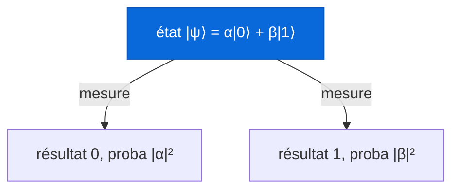
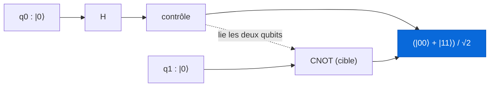

Avertissement d'entrée de jeu : je suis étudiant, pas chercheur en physique quantique. Ce post, c'est ma tentative d'expliquer proprement ce que j'ai réussi à comprendre du calcul quantique, avec le vocabulaire et les intuitions que j'aurais aimé qu'on me donne au début. Donc on va rester au niveau de l'exposition. On ne va pas dériver le théorème de seuil de la correction d'erreurs, on ne va pas faire de la théorie de la complexité rigoureuse. On va comprendre ce qu'est un ordinateur quantique, les maths minimales qui le font tourner, et par où commencer si l'envie te prend de creuser.

Le post est long, parce que le sujet est bourré de fausses intuitions qu'il faut désamorcer une par une. Prends un café, on y va doucement.

Un dernier mot avant de commencer. Tu as sûrement déjà entendu la phrase "un ordinateur quantique teste toutes les réponses en même temps". Retiens juste qu'elle est fausse, ou au mieux très trompeuse. Si tu la crois, tu vas te planter sur à peu près tout le reste. On va voir pourquoi, et surtout ce qui se passe vraiment.

## I. Le bit, le qubit, et la différence qui change tout

Un ordinateur classique, celui sur lequel tu lis ce texte, manipule des **bits**. Un bit, c'est une petite boîte qui contient soit 0, soit 1. À tout instant, si tu regardes dedans, tu trouves une valeur nette. Toute l'informatique classique, des chats sur ton écran aux modèles de langage, se ramène à des milliards de ces boîtes qu'on bascule très vite entre 0 et 1.

Un ordinateur quantique manipule des **qubits** (quantum bits). Et un qubit, avant qu'on le regarde, n'est pas obligé d'être soit 0 soit 1. Il peut être dans un état de **superposition** : une combinaison des deux à la fois. 

Attention, et c'est le premier piège : superposition ne veut pas dire "le qubit vaut 0 et 1 en même temps comme s'il vivait dans deux réalités". Ça veut dire que l'état du qubit est décrit par une combinaison des possibilités 0 et 1, chacune pondérée par un nombre qu'on appelle une **amplitude**. Ces amplitudes ne sont pas des probabilités classiques. Elles peuvent être négatives, voire complexes (au sens des nombres complexes). Et cette bizarrerie, on va le voir, c'est exactement là que se cache toute la puissance.

Quand tu **mesures** un qubit, la superposition s'effondre : tu obtiens 0 ou 1, un point, avec une probabilité qui dépend des amplitudes. Tu ne vois jamais l'amplitude directement. Tu vois toujours un résultat classique net. C'est frustrant, et c'est fondamental.

## II. Les maths minimales (promis, ça pique pas trop)

Pour parler proprement, on a besoin d'un tout petit peu de notation. Les physiciens écrivent l'état d'un qubit avec la **notation de Dirac**, dite "bra-ket". Un état se note entre une barre et un chevron, comme ça : $|0\rangle$ et $|1\rangle$. Ce sont juste des noms pour les deux états de base, l'équivalent quantique du 0 et du 1 classiques.

Un qubit quelconque s'écrit alors comme une combinaison de ces deux états de base :

$$|\psi\rangle = \alpha\,|0\rangle + \beta\,|1\rangle$$

Ici $\alpha$ et $\beta$ sont les fameuses amplitudes, deux nombres complexes. L'état $|\psi\rangle$ (prononcé "psi") est littéralement un **vecteur** dans un espace à deux dimensions. Si ça t'aide, tu peux voir $|0\rangle$ et $|1\rangle$ comme les deux axes d'un repère, et $|\psi\rangle$ comme une flèche pointant quelque part entre les deux.

La règle qui relie les amplitudes à ce que tu observes s'appelle la **règle de Born**. Elle dit que si tu mesures $|\psi\rangle$, tu obtiens le résultat 0 avec une probabilité $|\alpha|^2$, et le résultat 1 avec une probabilité $|\beta|^2$. Comme ce sont des probabilités et qu'il faut bien qu'un résultat sorte, elles doivent sommer à 1 :

$$|\alpha|^2 + |\beta|^2 = 1$$

C'est la **condition de normalisation**. Un état quantique est toujours un vecteur de longueur 1. Retiens cette image, elle revient partout : un qubit, c'est un vecteur unitaire dans un espace à deux dimensions complexe.



Prenons un exemple concret. L'état

$$|\psi\rangle = \frac{1}{\sqrt{2}}\,|0\rangle + \frac{1}{\sqrt{2}}\,|1\rangle$$

a une amplitude $\frac{1}{\sqrt{2}}$ sur chaque possibilité. Donc $|\alpha|^2 = \frac{1}{2}$ et $|\beta|^2 = \frac{1}{2}$ : à la mesure, c'est 50 pour cent 0, 50 pour cent 1. Une pièce quantique parfaitement équilibrée. On va voir dans une minute comment fabriquer cet état.

### La sphère de Bloch : voir un qubit

Un qubit vit dans un espace complexe, difficile à dessiner. Mais en tenant compte de la normalisation et du fait qu'une phase globale ne change rien d'observable, on peut représenter n'importe quel état d'un qubit comme un **point sur la surface d'une sphère**. C'est la **sphère de Bloch**, et c'est l'image mentale la plus utile du domaine.


*Le pôle nord, c'est $|0\rangle$. Le pôle sud, c'est $|1\rangle$. Tout le reste de la surface, ce sont les superpositions. L'équateur, par exemple, contient les états 50/50 comme celui d'au-dessus.*

Deux angles suffisent à repérer le point, un peu comme la latitude et la longitude sur Terre :

$$|\psi\rangle = \cos\!\frac{\theta}{2}\,|0\rangle + e^{i\varphi}\sin\!\frac{\theta}{2}\,|1\rangle$$

L'angle $\theta$ te dit à quelle hauteur tu es entre le nord et le sud (donc le dosage 0 contre 1), et l'angle $\varphi$ te dit où tu es autour de l'équateur (la fameuse **phase**). Cette phase ne change rien à la probabilité de mesure toute seule, mais elle devient cruciale dès qu'on combine des qubits. On y revient.

## III. Faire bouger un qubit : les portes quantiques

En informatique classique, on transforme des bits avec des portes logiques (AND, OR, NOT). En quantique, on transforme des qubits avec des **portes quantiques**. Et comme un état est un vecteur, une porte est simplement une **matrice** qui agit dessus. Pas n'importe quelle matrice : une matrice **unitaire**, ce qui veut dire qu'elle préserve la longueur des vecteurs (logique, puisque nos vecteurs doivent rester de longueur 1). Une conséquence importante : toute porte quantique est **réversible**. On peut toujours revenir en arrière, ce qui n'est pas le cas du AND classique.

Voici les trois portes à connaître pour un seul qubit.

La porte **X**, c'est le NOT quantique. Elle échange $|0\rangle$ et $|1\rangle$ :

$$X = \begin{pmatrix} 0 & 1 \\ 1 & 0 \end{pmatrix}$$

La porte **Z** laisse $|0\rangle$ tranquille mais change le signe de l'amplitude de $|1\rangle$. Elle agit sur la phase :

$$Z = \begin{pmatrix} 1 & 0 \\ 0 & -1 \end{pmatrix}$$

Et la star du spectacle, la porte de **Hadamard** $H$, celle qui fabrique la superposition à partir d'un état net :

$$H = \frac{1}{\sqrt{2}}\begin{pmatrix} 1 & 1 \\ 1 & -1 \end{pmatrix}$$

Applique $H$ à $|0\rangle$ et tu obtiens exactement notre pièce équilibrée :

$$H\,|0\rangle = \frac{1}{\sqrt{2}}\,|0\rangle + \frac{1}{\sqrt{2}}\,|1\rangle$$

Voilà comment on met un qubit en superposition. Une seule porte.

### L'interférence, ou pourquoi les amplitudes négatives sont géniales

Maintenant le moment que je trouve le plus beau du domaine. Repars de $H|0\rangle$, la superposition 50/50. Applique $H$ une deuxième fois. Naïvement, on pourrait penser qu'appliquer une transformation "aléatoire" deux fois nous laisse dans le flou. Faux. On retombe **exactement** sur $|0\rangle$. Toujours. Avec certitude.

$$H\,(H\,|0\rangle) = |0\rangle$$

Comment ? Parce que $H$ envoie $|1\rangle$ sur $\frac{1}{\sqrt{2}}|0\rangle - \frac{1}{\sqrt{2}}|1\rangle$, avec un signe **moins**. Quand on recombine les deux branches, les amplitudes sur $|1\rangle$ sont l'une positive, l'autre négative : elles s'annulent. Les amplitudes sur $|0\rangle$ s'additionnent. C'est l'**interférence**, exactement comme deux vagues qui se rencontrent : là où une crête croise un creux, ça s'annule ; là où deux crêtes se rencontrent, ça se renforce.

Retiens ce mot, **interférence**, parce que c'est lui, et pas la superposition toute seule, qui fait la puissance du quantique. Un algorithme quantique bien conçu, c'est une chorégraphie d'amplitudes arrangée pour que les mauvaises réponses s'annulent entre elles et que la bonne réponse se renforce, de sorte qu'à la mesure elle sorte avec une forte probabilité. C'est ça, l'art. Pas "tout tester", mais "faire s'annuler tout ce qui est faux".

## IV. Plusieurs qubits : l'espace explose, et l'intrication apparaît

Un seul qubit, c'est joli mais limité. La vraie histoire commence avec plusieurs qubits. Et là, un truc énorme se produit.

Avec $n$ bits classiques, tu peux représenter un nombre parmi $2^n$. Avec $n$ qubits, ton état est une superposition sur les $2^n$ combinaisons possibles **en même temps**, chacune avec sa propre amplitude. Deux qubits, ce sont quatre états de base : $|00\rangle$, $|01\rangle$, $|10\rangle$, $|11\rangle$. Trois qubits, huit. Cinquante qubits, c'est déjà plus d'un million de milliards d'amplitudes. Trois cents qubits, et le nombre d'amplitudes dépasse le nombre d'atomes dans l'univers observable.

C'est ce qui rend un ordinateur quantique impossible à simuler efficacement sur une machine classique quand le nombre de qubits grimpe : rien que stocker le vecteur d'état demanderait une mémoire qui explose exponentiellement. Formellement, l'état de plusieurs qubits vit dans le **produit tensoriel** des espaces individuels, ce qui est la manière chic de dire "toutes les combinaisons, avec une amplitude chacune".

Mais attention encore : cet espace immense ne se traduit pas directement en puissance de calcul, parce qu'à la fin tu mesures et tu n'obtiens qu'**une seule** de ces combinaisons, tirée au hasard selon les amplitudes. Toute la difficulté, encore une fois, c'est d'orchestrer l'interférence pour que la mesure te donne quelque chose d'utile.

### L'intrication

Voici l'autre ingrédient magique. Fabriquons l'état suivant sur deux qubits :

$$|\Phi^+\rangle = \frac{1}{\sqrt{2}}\,|00\rangle + \frac{1}{\sqrt{2}}\,|11\rangle$$

C'est un **état de Bell**, l'exemple canonique d'**intrication**. Regarde ce qu'il dit : soit les deux qubits valent 0, soit les deux valent 1, jamais un mélange. Ils sont parfaitement corrélés. Si tu mesures le premier et que tu trouves 0, tu sais instantanément que le second donnera 0, sans même le regarder. Et ça reste vrai même si tu sépares physiquement les deux qubits de plusieurs kilomètres.

C'est ce qu'Einstein appelait, un peu agacé, "action fantôme à distance". Le point subtil, et souvent mal raconté : ça ne permet **pas** de communiquer plus vite que la lumière, parce que le résultat de ta mesure est aléatoire et que tu ne le contrôles pas. Tu ne peux pas envoyer de message avec ça. Mais l'intrication est une ressource réelle qu'on exploite dans la téléportation quantique, la cryptographie quantique, et au cœur de la plupart des algorithmes.

Comment fabrique-t-on un état de Bell ? Une porte de Hadamard sur le premier qubit pour créer la superposition, puis une porte **CNOT** (un NOT contrôlé : elle inverse le second qubit si et seulement si le premier vaut 1). Voilà le circuit le plus célèbre du domaine :



## V. Pourquoi ça pourrait être puissant (sans être de la magie)

Reprenons la fausse phrase du début : "l'ordinateur quantique teste toutes les réponses à la fois". Ce qui est vrai, c'est qu'on peut mettre le registre dans une superposition de toutes les entrées possibles et appliquer un calcul à tout ce paquet d'un coup. Ce qui est faux, c'est d'en conclure qu'on récupère toutes les réponses. À la mesure, une seule sort, au hasard. Un tirage aléatoire sur $2^n$ possibilités, c'est nul, autant lancer des dés.

Le vrai jeu, c'est l'interférence dont on a parlé. Un bon algorithme quantique arrange les amplitudes pour que les réponses fausses s'annulent et que la bonne se renforce. Deux exemples historiques rendent ça concret.

L'**algorithme de Grover** (1996) cherche un élément dans une liste non triée de $N$ éléments. Classiquement, dans le pire cas, tu dois en regarder $N$. Grover y arrive en environ $\sqrt{N}$ étapes. Ce n'est "que" quadratique, mais c'est prouvé optimal pour ce problème, et ça s'applique à énormément de situations de recherche. L'idée : partir de la superposition uniforme, puis, à chaque tour, "marquer" la bonne réponse d'un signe moins et faire une réflexion qui amplifie petit à petit son amplitude. De l'interférence, encore.

L'**algorithme de Shor** (1994) est le plus spectaculaire. Il factorise un grand nombre entier en un temps qui croît de façon polynomiale, là où les meilleurs algorithmes classiques connus explosent de façon quasi exponentielle. Pourquoi c'est énorme ? Parce que la sécurité de RSA, le chiffrement qui protège une bonne partie d'internet, repose précisément sur le fait que factoriser est trop lent classiquement. Un ordinateur quantique assez gros et assez fiable casserait RSA. Le cœur de Shor, c'est une recherche de période via la **transformée de Fourier quantique**, où là encore les amplitudes interfèrent pour faire ressortir la périodicité cherchée.

Le message à garder : un ordinateur quantique n'est pas un CPU classique en plus rapide. Il est plus rapide pour **certains** problèmes très structurés (factorisation, simulation de systèmes quantiques comme des molécules, certaines recherches et optimisations), et complètement inutile ou plus lent pour la plupart des tâches courantes. Ce n'est pas un remplaçant, c'est un accélérateur spécialisé.

## VI. Comment s'y mettre concrètement

La bonne nouvelle : tu n'as besoin d'aucun matériel quantique pour commencer. Tu écris ton circuit dans une librairie, tu le fais tourner sur un **simulateur** classique (parfait jusqu'à une vingtaine de qubits sur un laptop), et le jour où tu veux, tu l'envoies sur du vrai hardware via le cloud.

La porte d'entrée la plus courante, c'est **Qiskit**, la librairie Python d'IBM. Voici notre état de Bell, en vrai code, avec la mesure :

```python
from qiskit import QuantumCircuit
from qiskit_aer import AerSimulator

# 2 qubits, 2 bits classiques pour stocker les mesures
qc = QuantumCircuit(2, 2)
qc.h(0)               # superposition sur le qubit 0
qc.cx(0, 1)           # CNOT : intrique q0 et q1
qc.measure([0, 1], [0, 1])

sim = AerSimulator()
counts = sim.run(qc, shots=1000).result().get_counts()
print(counts)         # environ {'00': ~500, '11': ~500}
```

Tu lances ça, tu obtiens à peu près 500 fois "00" et 500 fois "11", et jamais (ou presque, à cause du bruit sur vrai hardware) de "01" ni "10". Tu viens de voir l'intrication de tes propres yeux. C'est le "hello world" du quantique, et honnêtement, le voir tourner la première fois fait quelque chose.

À côté de Qiskit, il existe d'autres écosystèmes selon tes affinités : **Cirq** (Google), **PennyLane** (orienté quantum machine learning, très agréable), et **Q#** (Microsoft). Ils partent tous des mêmes briques : qubits, portes, mesures, simulateur. Apprends-en un, les autres suivront.

Mon conseil d'ordre de marche, si je devais recommencer : ne te jette pas sur les algorithmes avancés tout de suite. Passe du temps à manipuler un, deux, puis trois qubits à la main, à prédire ce qui sort avant de lancer la simulation, à jouer avec H, X, Z et CNOT jusqu'à ce que la superposition et l'interférence deviennent une intuition et plus une formule. Le reste se construit là-dessus.

## VII. Le mur : décohérence, bruit, et l'ère NISQ

Si tout ça marchait parfaitement, on aurait déjà cassé RSA et simulé toute la chimie. Ce n'est pas le cas, et il faut être honnête sur pourquoi.

Un qubit physique est d'une fragilité extrême. La moindre interaction avec son environnement (un photon parasite, une vibration thermique, un champ magnétique qui traîne) détruit sa superposition. Ce phénomène s'appelle la **décohérence**, et il se produit en quelques microsecondes à quelques millisecondes sur le matériel actuel. Les portes elles-mêmes sont **bruitées** : chaque opération a un petit taux d'erreur, et ces erreurs s'accumulent. Plus ton circuit est profond, plus le résultat se noie dans le bruit.

C'est ce que John Preskill a baptisé en 2018 l'ère **NISQ** (Noisy Intermediate-Scale Quantum) : on a des machines de quelques dizaines à quelques centaines de qubits, bruités, sans correction d'erreurs complète. Utiles pour explorer et expérimenter, pas encore pour casser de la crypto.

La sortie de ce mur, c'est la **correction d'erreurs quantique** : encoder un qubit "logique" fiable dans plusieurs qubits physiques (potentiellement des milliers), de façon à détecter et corriger les erreurs au vol. C'est théoriquement solide, mais ça coûte une quantité énorme de qubits physiques, et c'est là que se joue la vraie course en ce moment.

Enfin, tu as peut-être entendu parler de la "**suprématie quantique**" annoncée par Google en 2019 : leur processeur Sycamore de 53 qubits aurait fait en environ 200 secondes un calcul qui prendrait des milliers d'années à un supercalculateur classique. C'est une étape réelle et impressionnante, mais à nuancer : la tâche choisie était très artificielle (échantillonner la sortie d'un circuit aléatoire), sans utilité pratique, et l'écart avec le classique a été contesté depuis. C'est une preuve de principe, pas un ordinateur quantique utile. On n'y est pas encore, et c'est très bien de le dire clairement.

## VIII. Pour aller plus loin (ressources vérifiées)

Tout ce qui suit, je l'ai vérifié : ce sont des sources réelles et sérieuses, du plus doux au plus costaud.

- [Quantum computing for the very curious](https://quantum.country/qcvc), par Andy Matuschak et Michael Nielsen. Une introduction interactive, exigeante mais accessible, avec un système de révision intégré pour retenir. Le meilleur point de départ si tu veux comprendre en profondeur sans prérequis lourds.
- [IBM Quantum Learning](https://learning.quantum.ibm.com/), les cours officiels autour de Qiskit, avec du code que tu peux lancer tout de suite. Parfait pour la partie pratique.
- **Quantum Computation and Quantum Information**, de Michael Nielsen et Isaac Chuang. C'est LE manuel de référence du domaine, surnommé "Mike and Ike". Costaud, complet, c'est la bible une fois que tu veux du sérieux.
- [Quantum Computing in the NISQ era and beyond](https://arxiv.org/abs/1801.00862), de John Preskill (arXiv:1801.00862, publié dans Quantum, 2018). L'article qui a nommé l'ère actuelle et qui explique honnêtement où on en est.
- [A fast quantum mechanical algorithm for database search](https://arxiv.org/abs/quant-ph/9605043), de Lov Grover (arXiv:quant-ph/9605043). L'article original de l'algorithme de Grover.
- [Polynomial-Time Algorithms for Prime Factorization and Discrete Logarithms on a Quantum Computer](https://arxiv.org/abs/quant-ph/9508027), de Peter Shor (arXiv:quant-ph/9508027). L'article fondateur de l'algorithme de Shor.
- [Quantum supremacy using a programmable superconducting processor](https://www.nature.com/articles/s41586-019-1666-5), Arute et al., Nature (2019). L'expérience Sycamore de Google, à lire avec l'esprit critique de la section précédente.

Voilà. Tu ne sais pas encore construire un ordinateur quantique, moi non plus, mais tu as maintenant de quoi ne plus te faire avoir par les gros titres, et de quoi lancer ton premier état de Bell ce soir. Le reste, c'est de la pratique et de la patience. Et beaucoup de café.
