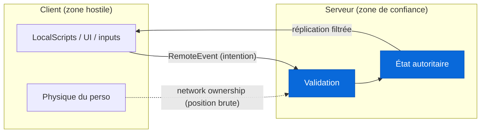
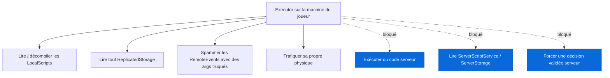
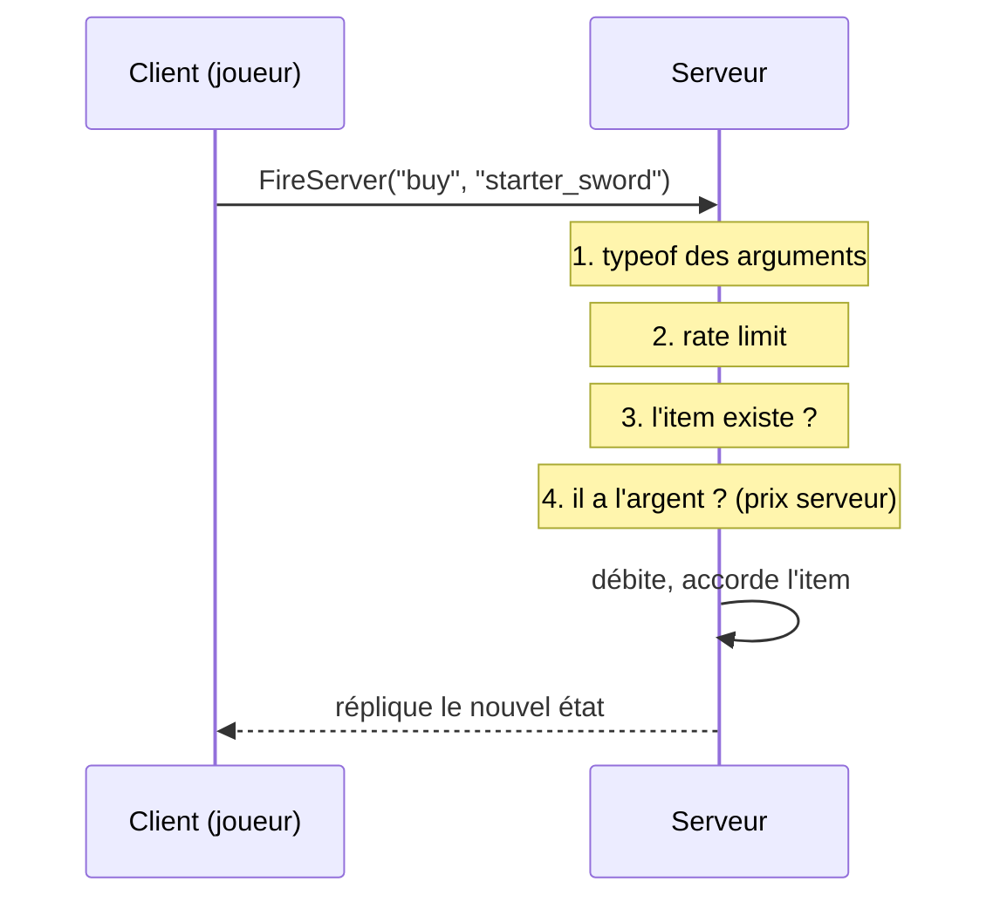
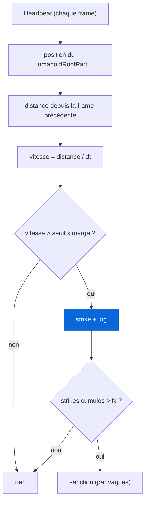
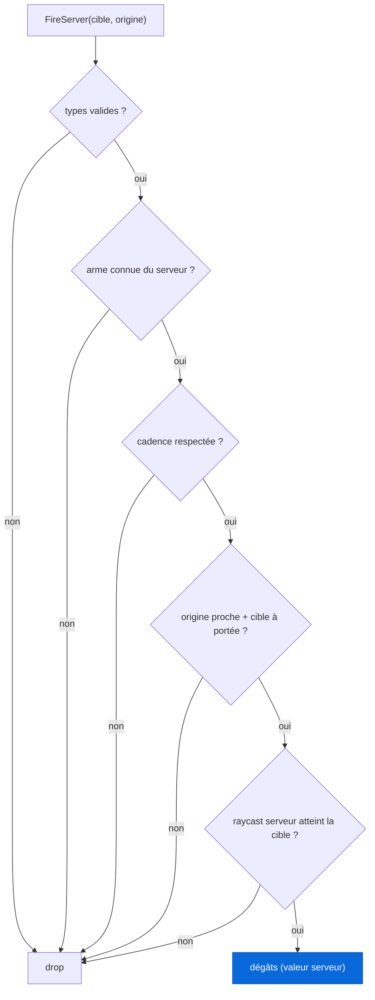
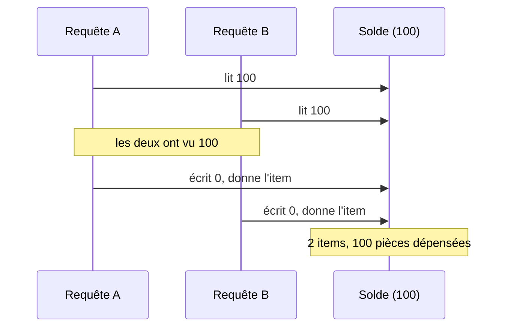
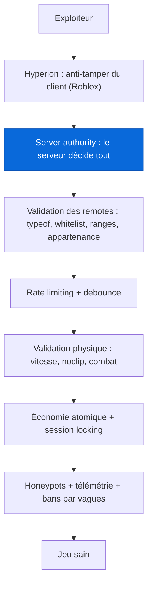

Tu passes des mois sur ton jeu. Tu peaufines l'économie, tu équilibres le combat, tu polis chaque animation. Le jour du lancement arrive, les joueurs affluent, ton Discord s'illumine. Pendant deux jours, c'est magique.

Et puis un clip apparaît. Un type qui vole à travers toute la map. Un autre qui a dix millions de pièces alors que le maximum atteignable en une semaine est de mille. Un troisième qui one-shot ton boss de fin. En vingt-quatre heures, ton économie soigneusement calibrée est morte, tes classements sont trustés par des scores impossibles, et tes joueurs légitimes commencent à partir parce que "de toute façon tout le monde triche".

Bienvenue. Tu viens de rencontrer l'exploiteur. C'est un rite de passage, tous les devs Roblox y passent, et la première fois ça fait mal parce qu'on réalise d'un coup une chose qu'on aurait dû comprendre depuis le début : la moitié de ton jeu tourne sur une machine que tu ne contrôles pas, et cette machine ment.

Ce post parle de comment on répond à ça. Pas avec une formule magique, il n'y en a pas, mais avec une manière de penser et une série de techniques concrètes qui transforment la triche d'un jeu d'enfant en un travail assez pénible pour que la plupart des exploiteurs aillent embêter quelqu'un d'autre.

## Un mot avant de commencer

Ce post est long. C'est de loin le truc le plus long et le plus complet que j'aie écrit ici, et c'est complètement assumé. Je voulais un seul endroit où tout est posé, depuis les fondations jusqu'aux cas tordus, pour ne plus avoir à répéter les mêmes réponses en boucle sur Discord.

Ce n'est pas un tutoriel "ton premier jeu Roblox", et je vais supposer que tu as déjà touché un peu à Luau, que tu sais ce qu'est un `Script` et un `LocalScript`, et que tu as déjà déployé quelque chose, même un truc modeste. Si ce n'est pas le cas, garde-le sous le coude et reviens plus tard, il ne va nulle part.

Cela dit, je ne vais pas te lâcher dans le grand bain sans explications. La sécurité sur Roblox, ce n'est pas une liste de recettes à copier-coller, c'est une conséquence directe de la façon dont la plateforme est construite. Si tu comprends l'architecture, les bonnes pratiques deviennent évidentes, presque déductibles. Si tu ne la comprends pas, tu vas empiler des protections au hasard sans jamais savoir lesquelles servent vraiment. Donc on va commencer par le pourquoi. On va poser calmement ce qu'est Roblox du point de vue d'un dev, comment le client et le serveur se parlent, et ce qu'un exploiteur peut réellement faire. Ensuite seulement on écrira du code, et on en écrira beaucoup.

Une dernière chose, et c'est la plus importante de tout le post, alors autant la dire tout de suite : **il n'existe pas d'anti-cheat à 100%**. Aucun. Ni sur Roblox, ni ailleurs. Quiconque te vend un système "incrackable" te ment ou ne comprend pas le problème. L'objectif n'est pas l'invulnérabilité, c'est de rendre la triche suffisamment coûteuse, en temps et en compétence, pour qu'elle ne vaille plus le coup. On ne construit pas un mur infranchissable. On construit une porte assez lourde pour que 99% des gens renoncent à la pousser.

Prends un café. Un grand. On y va.

## I. Roblox, vu par un dev

Quand un joueur lance ton expérience, il ne lance pas "ton jeu" comme un exécutable monolithique. Roblox est une plateforme, et ton jeu est une simulation distribuée qui tourne à deux endroits en même temps.


*La plateforme sur laquelle on construit. Tout le sujet de ce post, c'est que ton jeu vit des deux cotés à la fois. (Logo : Wikimedia Commons.)*

D'un coté, il y a le **serveur**. C'est une machine dans un datacenter Roblox, que tu ne vois jamais mais que tu contrôles entièrement à travers ton code. C'est là que vivent tes `Script` classiques, rangés dans `ServerScriptService`. Le serveur héberge la partie, décide de ce qui est vrai, et synchronise tout le monde.

De l'autre coté, il y a le **client**. C'est la machine du joueur, son PC, sa console, son téléphone. Chaque joueur a son propre client. C'est là que tournent les `LocalScript`, l'interface, les inputs, les effets visuels, la caméra. Le client, c'est ce qui rend l'expérience fluide et réactive, parce que réagir à un clic n'a pas besoin de faire l'aller-retour jusqu'au datacenter.

Les deux exécutent du **Luau**, le dialecte de Lua créé par Roblox (Lua avec un système de types graduel, des optimisations, et pas mal de garde-fous). Les deux manipulent le même arbre d'objets, le **DataModel**, cet arbre que tu vois dans l'Explorer avec `Workspace`, `Players`, `ReplicatedStorage` et compagnie. Mais, et c'est tout le sujet, ils n'en voient pas la même version et n'ont pas les mêmes droits dessus.

La règle mentale de base, celle qui doit se graver maintenant :

> Le serveur est chez toi. Le client est chez l'ennemi.

Tout ce qui tourne sur le serveur, tu peux lui faire confiance. Tu as écrit le code, il tourne dans un environnement que Roblox protège, personne ne peut le lire ni le modifier de l'extérieur. Tout ce qui tourne sur le client, tu ne peux lui faire confiance sur rien. Absolument rien. On va voir pourquoi dans un instant, mais retiens déjà que cette asymétrie est le fondement de toute la sécurité sur Roblox.

## II. La frontière de confiance et la réplication

Comment ces deux mondes se parlent-ils ? Par un mécanisme qu'on appelle la **réplication**, et il faut absolument comprendre ce qui traverse la frontière et ce qui ne la traverse pas.

Historiquement, Roblox a connu une époque sombre où le client pouvait modifier le monde et voir ses changements se propager à tout le monde. Un client bricolé pouvait littéralement se donner une arme, et l'arme apparaissait pour tous. Cette époque est finie depuis longtemps. Aujourd'hui, le modèle qu'on appelait "FilteringEnabled" est le seul qui existe, il n'est même plus optionnel. En pratique, ça veut dire une chose simple et magnifique : **les modifications que le client fait au DataModel ne se répliquent pas vers le serveur**. Si un exploiteur change son `WalkSpeed` à 500 dans son propre client, le serveur ne le voit pas de lui-même, et les autres joueurs non plus, sauf mécanisme explicite.

Alors qu'est-ce qui traverse réellement la frontière ? Essentiellement trois choses.

D'abord, la **réplication descendante** : le serveur décide de ce que chaque client a le droit de voir et le lui envoie. Les positions des autres joueurs, l'état du monde, tout ce qui est dans `Workspace` ou `ReplicatedStorage`. C'est à sens unique et sous contrôle serveur.


*Les conteneurs surlignés se répliquent vers le client. `ServerScriptService` et `ServerStorage`, eux, ne quittent jamais le serveur : c'est là que vivent tes vrais secrets. La frontière de confiance, en une capture. (Source : Roblox Creator Docs.)*

Ensuite, les **RemoteEvents et RemoteFunctions**. Ce sont les seuls canaux par lesquels le client peut demander quelque chose au serveur. C'est le téléphone entre les deux mondes. Le client décroche et dit "j'aimerais acheter cette épée", et le serveur, au bout du fil, décide quoi faire. On y reviendra longuement, parce que c'est là que 90% des exploits passent.

Enfin, cas particulier et sournois, la **physique du personnage** via le **network ownership**. Pour que ton personnage bouge de façon fluide, Roblox confie par défaut la simulation physique de ton propre corps à ton propre client. C'est ce qui rend le déplacement réactif. Mais ça veut dire que la position de ton personnage est calculée chez l'ennemi, puis envoyée au serveur. On reviendra là-dessus aussi, c'est la source des speed hacks, du fly et du noclip.

Voilà la carte du territoire :



Regarde bien la forme. Tout ce qui vient de la gauche, de la zone hostile, doit passer par la boîte "Validation" avant de toucher à l'état. Cette boîte, c'est tout ton anti-cheat. Le reste de ce post, c'est juste apprendre à la remplir correctement.

## III. Ce que l'exploiteur peut vraiment faire

Pour se défendre, il faut connaître l'attaquant. Et beaucoup de devs se font une idée fausse de ce qu'un exploiteur peut faire, soit en le sous-estimant, soit en le surestimant au point de baisser les bras. Soyons précis.

Un exploiteur utilise un **executor**, un logiciel qui s'injecte dans le process Roblox tournant sur sa machine et lui donne un environnement d'exécution Luau avec des super-pouvoirs. Depuis cet environnement, il a un contrôle quasi total sur son propre client.

Concrètement, voici ce qu'il **peut** faire :

- **Lire et décompiler tous tes `LocalScript`.** Tout ce que tu envoies au client, il peut le lire. Ton code client n'a aucun secret pour lui.
- **Lire tout le contenu de `ReplicatedStorage`.** C'est un dossier partagé, visible du client. Tout ce que tu y ranges, values, modules, configs, l'exploiteur le voit.
- **Appeler n'importe quel RemoteEvent avec n'importe quels arguments.** C'est le point crucial. Il peut prendre ton remote `BuyItem` et l'appeler mille fois par seconde avec les paramètres de son choix.
- **Manipuler la physique de son propre personnage.** Puisque son client possède cette physique (network ownership), il peut se téléporter, traverser les murs, voler, courir à des vitesses absurdes.
- **Hooker les métaméthodes** (`__namecall` et compagnie) pour intercepter et modifier les appels, lire la mémoire de son client via `getgc`, extraire des valeurs, etc.

Et voici ce qu'il **ne peut pas** faire, et c'est tout aussi important :

- **Exécuter du code sur ton serveur.** Jamais. Son executor tourne sur sa machine, pas dans le datacenter. Ton `ServerScriptService` est hors de sa portée.
- **Lire `ServerScriptService` ou `ServerStorage`.** Ces conteneurs ne sont jamais envoyés au client. Ce que tu y mets est réellement secret.
- **Contredire une décision que le serveur a vraiment prise.** Si ton serveur vérifie qu'un joueur a l'argent avant de lui donner un objet, l'exploiteur peut appeler le remote autant qu'il veut, il n'obtiendra rien.



Tu vois où je veux en venir. La colonne de gauche, ce que l'exploiteur peut faire, tu ne peux pas l'empêcher. La colonne de droite, ce qu'il ne peut pas faire, c'est là que ta sécurité vit. Toute ta stratégie consiste à faire en sorte que chaque chose qui compte tombe dans la colonne de droite.

### Et Hyperion dans tout ça ?

Depuis 2023, Roblox déploie sur le client un système anti-tamper appelé **Hyperion** (la communauté dit souvent "Byfron", du nom de la boîte que Roblox a rachetée en 2022). Il est arrivé avec le client 64-bit et il a changé le paysage. Hyperion tourne sur la machine du joueur, vérifie l'intégrité du process Roblox en mémoire, et bloque l'injection de code non autorisé avant même qu'un executor puisse s'attacher.


*Le petit écran Byfron que tu vois au lancement de Roblox depuis 2023 : Hyperion vérifie l'intégrité du client en mémoire avant de laisser le jeu démarrer. (Illustration.)*

L'effet a été réel. Exploiter est devenu nettement plus dur et moins fiable qu'avant. Les executors qui marchent encore cassent à chaque patch du client, passent presque tous par des abonnements payants, et le risque de ban permanent est bien plus élevé qu'à l'époque des téléchargements gratuits. En 2026, il n'y a pas de méthode publique connue pour contourner Hyperion de façon triviale.

Mais, et c'est la nuance que je veux que tu retiennes absolument, **Hyperion ne protège pas ta logique de jeu**. Il protège le process client contre le tampering. Il rend l'injection plus difficile. Il ne regarde pas si ton remote `BuyItem` accepte un prix envoyé par le client. Si ton architecture serveur est naïve, un exploiteur qui arrive quand même à exécuter du code, et il y en aura toujours, passera à travers ton jeu comme dans du beurre, Hyperion ou pas.

Autrement dit : Roblox s'occupe de rendre l'arme plus difficile à fabriquer. Toi, tu dois faire en sorte que même armé, l'attaquant ne puisse rien casser d'important. Les deux couches sont complémentaires, aucune ne remplace l'autre. C'est pour ça qu'on ne peut jamais se reposer sur "de toute façon Hyperion protège".

## IV. Comment un attaquant démonte ton jeu

Avant d'écrire une seule ligne de défense, il faut voir le monde par les yeux de l'attaquant. Parce que sa démarche est méthodique, et une fois que tu la connais, tu comprends exactement quelles informations tu lui offres sans t'en rendre compte.

La première chose qu'il fait, c'est **lister tes remotes**. Il existe des outils tout faits pour ça, les "remote spies", dont les plus connus s'appellent SimpleSpy ou Hydroxide. Injectés dans le client, ils affichent en temps réel chaque appel de RemoteEvent que ton propre code légitime déclenche, avec les arguments exacts. Quand ton `LocalScript` d'achat fait `BuyItem:FireServer("starter_sword")`, l'attaquant le voit passer, en clair. Il connaît maintenant le nom de ton remote, le nombre d'arguments, et leur forme.

La deuxième chose, c'est **rejouer et muter**. Il copie l'appel qu'il a observé, puis il change les valeurs. Il remplace `"starter_sword"` par `"legendary_sword"`. Il rajoute un argument. Il envoie un nombre négatif. Il appelle le remote mille fois d'affilée. Il ne devine rien, il part de ton propre trafic légitime et le tord.

La troisième, c'est **lire ton code client**. Avec un décompilateur, il récupère une version lisible de tes `LocalScript`. Il y cherche la logique, les noms de remotes que tu n'as pas encore déclenchés, les valeurs de configuration, et surtout tout ce que tu aurais eu la mauvaise idée de laisser traîner coté client en pensant que "personne n'ira regarder". Des fonctions comme `getgc` (parcourir le ramasse-miettes) ou la lecture des upvalues lui permettent même d'extraire des valeurs vivantes en mémoire.

La leçon est directe : **tout ce que le client connaît, l'attaquant le connaît**. Le nom de tes remotes n'est pas un secret. La structure de tes arguments n'est pas un secret. Ta logique client n'est pas un secret. Ta seule zone de secret réel, c'est le serveur. Donc l'obscurité n'est jamais une défense. Renommer ton remote `x7fQ2` au lieu de `BuyItem` ne ralentira l'attaquant que de quelques secondes, le temps qu'il le voie passer dans son spy. Ce qui l'arrête, ce n'est pas de cacher la porte, c'est de la verrouiller.

## V. Le principe fondateur : la server authority

On arrive au coeur. Si tu ne devais retenir qu'une idée de tout ce post, ce serait celle-ci, et la doc officielle de Roblox la formule presque mot pour mot : le serveur doit être la source de vérité pour tout état, toute règle, toute progression, toute décision critique. Et son corollaire : suppose que chaque donnée envoyée par le client a été manipulée, fabriquée, ou envoyée avec une intention malveillante.

En pratique, ça se traduit par un renversement mental. Le client ne **décide** de rien. Le client **demande**. Il envoie une intention, jamais un résultat.

Prenons l'exemple le plus classique du monde, l'achat d'un objet. Voici comment un dev débutant l'écrit, et pourquoi c'est une catastrophe :

```lua
-- ANTI-PATTERN : le client envoie le prix.
-- Un exploiteur enverra tout simplement 0.
buyRemote.OnServerEvent:Connect(function(player, itemId, price)
    if getWallet(player).coins >= price then
        getWallet(player).coins -= price
        grant(player, itemId)
    end
end)
```

Le problème saute aux yeux une fois qu'on pense comme un attaquant. Le `price`, c'est le client qui l'envoie. L'exploiteur appelle `buyRemote:FireServer("legendary_sword", 0)` et il repart avec l'épée légendaire pour zéro pièce. Pire, il peut envoyer un prix négatif et **gagner** de l'argent en achetant. Le serveur a fait confiance à une donnée qui venait de la zone hostile.

Voici la même fonctionnalité, écrite correctement. Le serveur ne fait confiance qu'à une chose : l'identité du joueur, que Roblox lui garantit. Tout le reste, il le décide lui-même.

```lua
-- CORRECT : le serveur possède le catalogue et les prix.
-- Le client n'envoie qu'un identifiant d'intention.
local CATALOG = {
    starter_sword = { price = 150 },
    iron_shield   = { price = 90 },
    -- ... la vérité vit ici, sur le serveur, hors de portée du client
}

buyRemote.OnServerEvent:Connect(function(player: Player, itemId: any)
    -- 1. l'argument est-il seulement du bon type ?
    if typeof(itemId) ~= "string" then return end

    -- 2. l'item existe-t-il vraiment ?
    local item = CATALOG[itemId]
    if not item then return end

    -- 3. le joueur a-t-il les moyens ? (le prix vient du serveur, pas du client)
    local wallet = getWallet(player)
    if wallet.coins < item.price then return end

    -- 4. seulement maintenant, on agit
    wallet.coins -= item.price
    grant(player, itemId)
end)
```

Remarque bien le flux. Le client dit juste "je veux `starter_sword`". Le serveur regarde son propre catalogue pour le prix, vérifie son propre registre pour le solde, et décide. À aucun moment il ne fait confiance à un chiffre venu du client. C'est ça, la server authority. Ce n'est pas une technique, c'est une posture, et tout le reste en découle.



Applique cette grille à tout ce qui compte. La santé dans un jeu compétitif ? Le serveur la gère. Les dégâts ? Le serveur les calcule, à partir de l'arme que le serveur sait que le joueur possède. La position d'arrivée d'un téléporteur ? Le serveur la décide. Le score dans un classement ? Le serveur le mesure. Chaque fois que tu es tenté de laisser le client "juste calculer vite fait", demande-toi ce qui se passe si ce calcul ment. La réponse te dira si tu peux te le permettre.

## VI. Sécuriser les RemoteEvents

Puisque les remotes sont la porte d'entrée, blindons-la. Chaque `OnServerEvent` est un point où de la donnée hostile entre dans ton serveur, et tu dois la traiter comme un videur traite une file d'entrée : personne ne passe sans être vérifié.

Le premier réflexe, c'est la **validation de type**. Sur Roblox, on utilise `typeof()` plutôt que `type()`, parce qu'il connaît les types Roblox comme `Instance`, `Vector3`, `Color3`. Un exploiteur peut t'envoyer n'importe quoi à la place de ce que tu attends : une table là où tu veux un nombre, un `Instance` là où tu veux une string, `nil` partout. Si ton code suppose le type sans vérifier, il crashera ou, pire, se comportera de travers.

Voici un petit helper de sanitisation pour les chaînes, une version robuste de ce qu'on croise partout :

```lua
--!strict

-- Renvoie la chaîne si elle est valide, sinon nil.
-- On valide le type, la longueur, et on n'autorise qu'une whitelist de caractères.
local function sanitizeString(input: any, maxLen: number): string?
    if typeof(input) ~= "string" then
        return nil
    end
    if #input == 0 or #input > maxLen then
        return nil
    end
    -- Whitelist : lettres, chiffres, espaces, et une poignée de ponctuation sûre.
    -- Tout caractère hors de cette liste fait échouer la validation.
    if input:match("[^%w%s%-_%.]") then
        return nil
    end
    return input
end
```

Note la philosophie : on **whiteliste**, on ne blackliste pas. On ne cherche pas à lister les caractères interdits, ce qui est un jeu perdu d'avance parce qu'on en oubliera toujours un. On liste les caractères autorisés, et tout le reste dégage. C'est un principe général en sécurité : autorise explicitement, refuse par défaut.

Maintenant un handler de commande complet, qui combine whitelist d'actions, sanitisation, et échec silencieux :

```lua
local ReplicatedStorage = game:GetService("ReplicatedStorage")
local remote = ReplicatedStorage:WaitForChild("CommandRemote")

-- Seules ces commandes existent. Le reste n'a pas de sens.
local ALLOWED = {
    report = true,
    help = true,
    stats = true,
}

remote.OnServerEvent:Connect(function(player: Player, command: any, payload: any)
    command = sanitizeString(command, 32)
    if not command or not ALLOWED[command] then
        return -- drop silencieux : on ne dit rien à l'attaquant
    end
    handleCommand(player, command, payload)
end)
```

Deux détails valent leur pesant d'or. Le premier argument, `player`, est le seul en qui tu peux avoir confiance : Roblox l'injecte lui-même, l'exploiteur ne peut pas usurper l'identité d'un autre joueur par ce biais. Tout ce qui suit, `command` et `payload`, vient de la zone hostile et passe par la moulinette.

Et l'**échec silencieux**, ce `return` tout nu, n'est pas un détail. Ne renvoie jamais à l'attaquant un message qui explique pourquoi il a été rejeté. Chaque "tu n'as pas la permission" ou "argument invalide" est une information qui l'aide à cartographier tes défenses. Tu log l'anomalie de ton coté, sur le serveur, et tu ne réponds rien.

### Le piège des arguments Instance

Il y a un type d'argument particulièrement traître : l'`Instance`. Beaucoup de remotes en prennent un, par exemple un remote de vente ou d'équipement qui reçoit l'outil concerné. Le réflexe naïf est de vérifier que c'est bien un `Tool` et de le traiter. Erreur. L'attaquant peut passer **n'importe quel Instance qui lui est répliqué**, y compris un outil qui ne lui appartient pas, ou un objet d'un autre joueur.

La règle : quand un remote prend un `Instance`, tu ne valides pas seulement sa classe, tu valides son **appartenance**. Est-il vraiment dans le backpack ou le personnage de ce joueur ? Est-il vraiment sous un conteneur que ce joueur a le droit de manipuler ?

```lua
sellRemote.OnServerEvent:Connect(function(player: Player, tool: any)
    -- 1. est-ce seulement un Instance, et de la bonne classe ?
    if typeof(tool) ~= "Instance" or not tool:IsA("Tool") then
        return
    end
    -- 2. appartient-il VRAIMENT à ce joueur ?
    local backpack = player:FindFirstChildOfClass("Backpack")
    local char = player.Character
    if tool.Parent ~= backpack and tool.Parent ~= char then
        return -- l'outil n'est pas à lui, il tente sa chance
    end
    -- seulement maintenant, on le traite
    processSale(player, tool)
end)
```

Sans le point 2, un exploiteur pourrait vendre l'outil d'un autre joueur, ou un outil qu'il a repéré ailleurs dans l'arbre. Le type ne suffit jamais pour un `Instance`. L'appartenance, si.

### Le cas des RemoteFunctions

Une RemoteFunction, contrairement à un RemoteEvent, attend une valeur de retour. Quand c'est le serveur qui invoque le client (`InvokeClient`), ça ouvre une porte que la doc officielle signale explicitement, et qui est un vrai piège :

- si le client lève une erreur, le serveur lève l'erreur aussi ;
- si le client se déconnecte pendant l'invocation, `InvokeClient` lève une erreur ;
- si le client ne renvoie jamais rien, **le serveur attend pour toujours**.

Un exploiteur, à qui tu tends un `InvokeClient`, peut donc geler ou faire planter ta logique serveur juste en ne répondant pas. La règle est simple : évite d'invoquer le client depuis le serveur. Pour une communication descendante sans réponse, utilise un RemoteEvent. Et quand tu exposes un `OnServerInvoke`, valide ses arguments exactement comme un `OnServerEvent`, avec en plus la discipline de toujours renvoyer une valeur propre.

## VII. Le rate limiting

Valider le contenu d'un appel ne suffit pas s'il peut arriver un million de fois par seconde. Un exploiteur qui spamme un remote parfaitement valide peut quand même te faire mal : surcharge, duplication d'objets par course de conditions, farm accéléré. Il faut donc limiter la fréquence.

La bonne structure pour ça, c'est le **token bucket** (seau à jetons). L'idée est jolie : chaque joueur a un seau qui se remplit de jetons à un rythme constant, jusqu'à un maximum. Chaque action consomme un jeton. Si le seau est vide, l'action est refusée. Ça autorise des petites rafales légitimes tout en plafonnant le débit moyen.

```lua
local Bucket = {}
Bucket.__index = Bucket

function Bucket.new(rate: number, capacity: number)
    return setmetatable({
        rate = rate,          -- jetons régénérés par seconde
        capacity = capacity,  -- taille du seau
        tokens = capacity,
        last = os.clock(),
    }, Bucket)
end

function Bucket:consume(cost: number): boolean
    local now = os.clock()
    -- on recharge le seau au prorata du temps écoulé
    self.tokens = math.min(self.capacity, self.tokens + (now - self.last) * self.rate)
    self.last = now
    if self.tokens >= cost then
        self.tokens -= cost
        return true
    end
    return false
end
```

Et l'usage, avec un seau par joueur, nettoyé quand il part :

```lua
local Players = game:GetService("Players")
local buckets: { [Player]: any } = {}

Players.PlayerAdded:Connect(function(player)
    -- 5 actions/seconde en régime, rafales jusqu'à 10
    buckets[player] = Bucket.new(5, 10)
end)

Players.PlayerRemoving:Connect(function(player)
    buckets[player] = nil
end)

remote.OnServerEvent:Connect(function(player: Player, ...)
    local bucket = buckets[player]
    if not bucket or not bucket:consume(1) then
        return -- trop d'appels, on ignore en silence
    end
    -- ... validation + logique
end)
```

J'utilise `os.clock()` parce qu'il donne un temps monotone haute résolution, parfait pour mesurer des intervalles. Calibre `rate` et `capacity` selon l'action : un remote de tir dans un shooter tolère plus de fréquence qu'un remote d'achat. Et n'oublie pas le nettoyage sur `PlayerRemoving`, sinon ta table de seaux fuit à chaque joueur qui part.

### Débounce ou rate limit ?

On confond souvent deux choses. Un **debounce** empêche une action de se relancer tant que la précédente n'est pas finie : c'est un verrou booléen, "occupé / libre", typiquement pour éviter le double-clic sur un bouton de craft. Un **rate limit** plafonne la fréquence sur la durée : "pas plus de cinq par seconde". Le debounce protège une opération contre le chevauchement d'elle-même. Le rate limit protège le serveur contre le volume. Tu veux souvent les deux, et sur des remotes différents, pas au même endroit. Un remote d'achat mérite un debounce (pas deux achats simultanés qui lisent le même solde) et un rate limit (pas de spam). Un remote de mouvement mérite surtout un rate limit.

## VIII. Un module SecureRemote réutilisable

Répéter la validation de type, le rate limit et le log à la main dans chaque handler, c'est le meilleur moyen d'en oublier un jour. Une bien meilleure approche consiste à centraliser tout ça dans un petit module qui enveloppe un remote et impose la discipline une fois pour toutes. On déclare un **schéma** (la liste des validateurs, un par argument), un rate, et un handler. Le module s'occupe du reste.

```lua
--!strict
-- SecureRemote : enveloppe un RemoteEvent avec validation de schéma,
-- rate limiting et logging centralisés. On branche la logique métier
-- seulement une fois que tout est propre.

local SecureRemote = {}
SecureRemote.__index = SecureRemote

type Validator = (value: any) -> (boolean, any)

function SecureRemote.new(remote: RemoteEvent, config: {
    validators: { Validator },
    rate: number?,
    capacity: number?,
    handler: (player: Player, ...any) -> (),
})
    local self = setmetatable({
        validators = config.validators,
        rate = config.rate or 5,
        capacity = config.capacity or 10,
        handler = config.handler,
        buckets = {},
    }, SecureRemote)

    remote.OnServerEvent:Connect(function(player, ...)
        self:_onEvent(player, ...)
    end)
    return self
end

function SecureRemote:_onEvent(player: Player, ...)
    -- 1. rate limit
    local bucket = self.buckets[player]
    if not bucket then
        bucket = Bucket.new(self.rate, self.capacity)
        self.buckets[player] = bucket
    end
    if not bucket:consume(1) then
        warn(`[SecureRemote] rate limit: {player.Name}`)
        return
    end

    -- 2. validation de schéma : chaque argument passe son validateur
    local args = { ... }
    for i, validate in self.validators do
        local ok, clean = validate(args[i])
        if not ok then
            warn(`[SecureRemote] arg {i} invalide: {player.Name}`)
            return -- drop silencieux coté client, log coté serveur
        end
        args[i] = clean
    end

    -- 3. seulement maintenant, la logique métier
    self.handler(player, table.unpack(args))
end
```

On se donne quelques validateurs réutilisables :

```lua
local V = {}

function V.string(maxLen: number): Validator
    return function(value)
        local clean = sanitizeString(value, maxLen)
        return clean ~= nil, clean
    end
end

function V.numberRange(min: number, max: number): Validator
    return function(value)
        if typeof(value) ~= "number" then return false end
        if value ~= value then return false end -- rejette NaN
        return value >= min and value <= max, value
    end
end

function V.ownedTool(): Validator
    return function(value)
        -- validation d'appartenance branchée par le handler via le player,
        -- ici on ne vérifie que la forme ; l'appartenance se refait dans le handler
        return typeof(value) == "Instance" and value:IsA("Tool"), value
    end
end
```

Et l'usage devient déclaratif, lisible, et impossible à oublier :

```lua
SecureRemote.new(buyRemote, {
    validators = { V.string(32) },       -- un seul argument : l'itemId
    rate = 4, capacity = 6,
    handler = function(player, itemId)
        local item = CATALOG[itemId]
        if not item then return end
        local wallet = getWallet(player)
        if wallet.coins < item.price then return end
        wallet.coins -= item.price
        grant(player, itemId)
    end,
})
```

Le gain n'est pas seulement cosmétique. En forçant chaque remote à passer par le même chemin, tu obtiens un point unique où tu peux ajouter une protection globale, brancher ta télémétrie, ou durcir une règle, sans repasser sur cinquante handlers. La sécurité qui tient dans le temps, c'est celle qui est difficile à contourner par accident, y compris par toi-même un soir de fatigue.

## IX. La validation du mouvement, le gros morceau

On arrive à la partie la plus délicate, celle qui fait transpirer tout le monde : empêcher le speed, le fly, le noclip et le teleport. Délicate parce qu'elle se heurte de plein fouet au network ownership dont je parlais au début.

Rappelons le mécanisme, avec les mots de la doc officielle cette fois. Roblox distribue les calculs physiques entre serveur et clients. Par défaut, le serveur possède chaque `BasePart`, mais le moteur assigne automatiquement la propriété à un client en fonction de sa machine et de la proximité de son personnage. Les parts ancrées, elles, restent toujours au serveur. Et voici la phrase qui compte : Roblox ne peut pas vérifier les calculs physiques quand un client possède une part. Le client peut alors envoyer de mauvaises données au serveur, comme téléporter la part, la faire traverser les murs, ou voler.

Traduction : la position de ton personnage arrive au serveur depuis la machine du joueur, et le serveur l'accepte plus ou moins telle quelle, parce que c'est le joueur qui simule sa propre physique. C'est exactement pour ça que ces exploits existent. Ce n'est pas un bug, c'est une conséquence directe du design qui rend le jeu fluide.

Face à ça, deux stratégies, et il faut choisir en connaissance de cause.

**Stratégie 1 : accepter et valider.** On laisse le client garder sa physique (donc la fluidité), mais le serveur surveille et sanctionne l'impossible. Le serveur garde en mémoire la dernière position et le dernier instant pour chaque joueur, et à chaque frame il calcule la vitesse implicite. Si elle dépasse un seuil physiquement plausible, avec une marge pour le lag, il lève un drapeau.

```lua
local Players = game:GetService("Players")
local RunService = game:GetService("RunService")

local MAX_SPEED = 32       -- studs/s, au-dessus du WalkSpeed légitime (16 par défaut)
local TOLERANCE = 1.5      -- 50% de marge pour absorber le lag et les à-coups
local lastState: { [Player]: { pos: Vector3, t: number } } = {}

RunService.Heartbeat:Connect(function()
    local now = os.clock()
    for _, player in Players:GetPlayers() do
        local char = player.Character
        local root = char and char:FindFirstChild("HumanoidRootPart") :: BasePart?
        if not root then continue end

        local prev = lastState[player]
        if prev then
            local dt = now - prev.t
            if dt > 0 then
                -- distance horizontale : on ignore l'axe Y pour tolérer les chutes
                local delta = root.Position - prev.pos
                local horizontal = Vector3.new(delta.X, 0, delta.Z).Magnitude
                local speed = horizontal / dt
                if speed > MAX_SPEED * TOLERANCE then
                    flagPlayer(player, "speed", speed) -- on log, on ne kick pas tout de suite
                end
            end
        end
        lastState[player] = { pos = root.Position, t = now }
    end
end)
```

Cette stratégie est légère et n'ajoute pas de latence, mais elle est pleine de pièges à faux positifs, et je préfère être honnête avec toi là-dessus plutôt que de te vendre un code parfait qui bannira tes meilleurs joueurs. Un téléporteur légitime va produire un saut de position énorme. Un dash ou un knockback aussi. Un pic de lag va condenser plusieurs frames de mouvement en une seule mesure et gonfler la vitesse apparente. Une chute verticale peut tromper une mesure naïve, d'où le fait que j'ignore l'axe Y ici. C'est pour ça que le code **log et accumule des strikes** au lieu de kicker au premier dépassement. On sanctionne un joueur qui accumule des dizaines d'anomalies sur la durée, pas un pic isolé. Et on maintient une liste des téléporteurs et effets légitimes pour accorder une immunité temporaire au bon moment.



**Stratégie 2 : retirer la propriété au client.** Pour les objets vraiment sensibles, une part qui porte un pouvoir, une plateforme dont la position ne doit jamais mentir, tu peux forcer le serveur à en garder la simulation avec `BasePart:SetNetworkOwner(nil)`. Le `nil` signifie "personne, c'est le serveur qui simule". À partir de là, Roblox peut de nouveau vérifier la physique, et le client ne peut plus la trafiquer. Le prix, c'est la latence : le joueur ressent un léger retard sur cet objet, parce que chaque interaction fait l'aller-retour jusqu'au serveur. On ne fait donc pas ça pour le personnage lui-même dans la plupart des jeux, ce serait injouable, mais c'est l'outil idéal pour un sous-ensemble de parts critiques.

Un dernier piège lié au network ownership, souvent oublié : les faux évènements `Touched`. Parce qu'un client contrôle sa physique, il peut déclencher de fausses collisions, un `BasePart.Touched` qui prétend qu'il a touché quelque chose de loin, pour infliger des dégâts à distance par exemple. Ne fais jamais confiance à un `Touched` seul pour une mécanique qui compte. Vérifie coté serveur que la distance entre les deux objets est cohérente au moment du contact.

## X. La validation du combat coté serveur

Si ton jeu a du combat, c'est probablement là que se concentrera l'essentiel des tricheurs, parce que c'est là que la triche se voit et se ressent le plus. Aimbot, triggerbot, hitbox étendue, tir à travers les murs, cadence de feu impossible, dégâts gonflés, "instakill". Tous ces exploits ont une racine commune : un jeu qui laisse le client dire "j'ai touché untel pour tant de dégâts", et un serveur qui le croit.

La règle est la même que partout, mais elle mérite d'être appliquée avec une rigueur particulière ici : **le client rapporte une intention de tir, le serveur décide du résultat**. Le client dit "j'ai tiré vers ce point" ou "je vise cette cible". Le serveur, lui, vérifie tout : le joueur a-t-il vraiment cette arme, la cadence est-elle respectée, la cible est-elle à portée, y a-t-il une ligne de vue dégagée, et seulement alors il calcule les dégâts à partir de **ses** chiffres.

```lua
local Players = game:GetService("Players")

local WEAPONS = {
    pistol = { damage = 25, range = 120, cooldown = 0.4 },
}
local lastShot: { [Player]: number } = {}

shootRemote.OnServerEvent:Connect(function(player: Player, target: any, origin: any)
    -- 1. types
    if typeof(target) ~= "Instance" or not target:IsA("BasePart") then return end
    if typeof(origin) ~= "Vector3" then return end

    -- 2. l'arme est lue depuis l'état serveur, jamais depuis le client
    local weaponName = getEquippedWeapon(player)
    local weapon = weaponName and WEAPONS[weaponName]
    if not weapon then return end

    -- 3. cadence de feu imposée par le serveur
    local now = os.clock()
    if lastShot[player] and now - lastShot[player] < weapon.cooldown then return end
    lastShot[player] = now

    -- 4. la cible est-elle bien un autre joueur ?
    local targetModel = target:FindFirstAncestorOfClass("Model")
    local targetPlayer = targetModel and Players:GetPlayerFromCharacter(targetModel)
    if not targetPlayer or targetPlayer == player then return end

    -- 5. l'origine annoncée est-elle proche du joueur réel ? (anti "tir depuis ailleurs")
    local myRoot = player.Character and player.Character:FindFirstChild("HumanoidRootPart")
    if not myRoot or (origin - myRoot.Position).Magnitude > 8 then return end

    -- 6. la cible est-elle à portée de l'arme ?
    if (target.Position - origin).Magnitude > weapon.range then return end

    -- 7. ligne de vue : un raycast serveur doit atteindre la cible sans mur entre les deux
    local params = RaycastParams.new()
    params.FilterType = Enum.RaycastFilterType.Exclude
    params.FilterDescendantsInstances = { player.Character }
    local hit = workspace:Raycast(origin, target.Position - origin, params)
    if not hit or hit.Instance:FindFirstAncestorOfClass("Model") ~= targetModel then
        return -- pas de ligne de vue franche
    end

    -- 8. seulement maintenant, dégâts calculés par le serveur
    applyDamage(targetPlayer, weapon.damage)
end)
```

Regarde tout ce qu'on a fermé en huit étapes. On a tué le tir à travers les murs (étape 7), les dégâts gonflés (étape 8, la valeur vient de `WEAPONS`), la cadence impossible (étape 3), l'arme qu'on n'a pas (étape 2), le tir depuis une position téléportée (étape 5), et la cible hors de portée (étape 6).

Sois honnête sur ce qui reste, par contre. Cette validation n'arrête pas un aimbot qui vise une cible réellement visible et à portée : de son point de vue, le tir est légitime, il est juste parfaitement précis. Détecter ça demande de l'analyse comportementale (précision surhumaine, snaps de visée), c'est un autre métier, statistique et jamais certain. Ce que la validation serveur t'offre, c'est d'éliminer d'un coup toute la triche "impossible", celle qui viole les règles physiques du jeu. C'est déjà l'écrasante majorité, et c'est la seule que tu peux bloquer avec certitude plutôt qu'avec des probabilités.



## XI. Protéger l'économie et les sauvegardes

Les exploits les plus destructeurs pour un jeu ne sont pas toujours les plus spectaculaires. Un joueur qui vole est agaçant. Un joueur qui **duplique** de la monnaie ou des objets rares tue l'économie de tout le serveur, définitivement, et souvent en silence jusqu'à ce qu'il soit trop tard.

Le dupe le plus courant n'est même pas un exploit de remote au sens strict, c'est une **course de conditions**. Imagine un remote d'achat qui lit le solde, vérifie, puis débite. Si l'attaquant l'appelle deux fois quasi simultanément, les deux appels peuvent lire le même solde avant que l'un ait eu le temps d'écrire. Résultat : deux objets pour le prix d'un.



La parade, c'est de rendre l'opération **atomique**, indivisible. Deux outils pour ça. D'abord, un verrou par joueur (un simple debounce serveur) pour qu'un même joueur ne puisse pas avoir deux transactions en vol en même temps. Ensuite, pour la persistance, l'`UpdateAsync` des DataStores, qui lit et écrit en une seule opération que Roblox sérialise pour toi, au lieu du couple `GetAsync` puis `SetAsync` qui laisse une fenêtre béante entre les deux.

```lua
local DataStoreService = game:GetService("DataStoreService")
local store = DataStoreService:GetDataStore("PlayerData")

-- Sauvegarde autoritaire : on n'écrit JAMAIS une valeur rapportée par le client.
-- UpdateAsync lit-modifie-écrit de façon atomique.
local function addCoins(userId: number, amount: number)
    store:UpdateAsync("player_" .. userId, function(old)
        old = old or { coins = 0 }
        old.coins += amount
        return old
    end)
end
```

Deux principes encadrent tout ça. Le premier : **on ne sauvegarde jamais une valeur que le client a rapportée**. Le serveur calcule le nouveau solde à partir de son propre état et l'écrit lui-même. Si tu sauvegardes ce que le client t'envoie, tu offres la persistance de la triche, ce qui est encore pire que la triche éphémère.

Le second : le **session locking**. Un dupe classique consiste à charger ses données, agir, puis quitter brutalement avant la sauvegarde et rejoindre pour "annuler" la dépense, ou à jouer sur deux serveurs à la fois pour dédoubler un profil. Le session locking empêche qu'un même profil soit ouvert à deux endroits en même temps. L'écrire soi-même correctement est délicat, et c'est un des rares cas où je te recommande une brique communautaire éprouvée plutôt que de réinventer : des modules comme ProfileStore (successeur de ProfileService) gèrent le session locking et les sauvegardes robustes depuis des années, et sont devenus un standard de fait pour une bonne raison.

## XII. Les pièges classiques à éviter

Au-delà des grandes techniques, il y a une série d'erreurs récurrentes qui ruinent des anti-cheats par ailleurs corrects. Passons-les en revue.

**Ne jamais faire un `loadstring` sur de l'input joueur.** `loadstring` compile et exécute une chaîne comme du code. Sur Roblox il est désactivé par défaut (`LoadStringEnabled` est à `false`), et c'est très bien, laisse-le comme ça. Même activé, exécuter du texte venu du client reviendrait à donner à l'attaquant un interpréteur sur ton serveur. C'est la faille ultime. La règle est absolue : on n'évalue jamais de l'input utilisateur, jamais.

**Ne jamais planquer un secret dans le client ou dans `ReplicatedStorage`.** Je le répète parce que je vois l'erreur en permanence. La liste de tes admins, une clé, un mot de passe de commande, une config sensible : si c'est dans un `LocalScript` ou dans `ReplicatedStorage`, l'exploiteur le lit en trente secondes. Les secrets vivent dans `ServerScriptService` ou `ServerStorage`, point. Un contrôle d'admin doit comparer un `UserId` à une liste stockée sur le serveur, jamais s'appuyer sur une valeur présente coté client.

**Ne jamais compter sur la détection coté client comme sécurité.** C'est le piège le plus séduisant. On se dit "je vais mettre un `LocalScript` qui détecte les executors et kicke le tricheur". Le problème : ce `LocalScript` tourne dans la zone hostile. L'exploiteur peut le lire, le désactiver, le supprimer, ou lui faire dire ce qu'il veut. Une détection client, c'est un dos-d'âne, pas un mur. Ça peut servir à ajouter de la friction ou à collecter de la télémétrie, mais ça ne doit jamais être la barrière qui protège quelque chose d'important. La vraie barrière est toujours coté serveur.

**Whitelister plutôt que blacklister.** On l'a vu pour les caractères, ça vaut pour tout. Une liste d'actions autorisées, d'items existants, de valeurs acceptables. Les blacklists laissent toujours passer le cas que tu n'as pas anticipé.

**Se méfier du code qu'on importe.** Un free model de la Toolbox, un module copié sur un forum, peut contenir un backdoor : un bout de code qui écoute un remote caché et donne les pleins pouvoirs à son auteur. Lis ce que tu insères, surtout si ça touche à `ServerScriptService`, et méfie-toi de `require` sur des identifiants d'assets que tu ne contrôles pas.

## XIII. La défense en profondeur

Aucune de ces techniques n'est suffisante seule. La sécurité sérieuse, c'est un empilement de couches, chacune rattrapant ce que les autres laissent passer. On appelle ça la défense en profondeur, et voici à quoi ressemble la pile complète pour un jeu Roblox.



Les couches du haut, on les a couvertes. Attardons-nous sur celle du bas, parce qu'elle est sous-estimée.

Les **honeypots** sont mes préférés, parce qu'ils retournent la curiosité de l'attaquant contre lui. L'idée : tu places un remote qu'aucun client légitime ne déclenche jamais, parce qu'il n'est référencé nulle part dans ton code client. Il n'a l'air de rien, tu peux même l'appeler `AdminPanelRemote` pour le rendre alléchant. Le seul moyen que quelqu'un l'appelle, c'est qu'il ait fouillé tes remotes avec un spy et tenté sa chance. Donc quiconque le déclenche est, par définition, un exploiteur.

```lua
-- Un remote appât. Aucun LocalScript ne l'appelle jamais.
-- S'il est déclenché, c'est forcément quelqu'un qui fouine.
local honeypot = ReplicatedStorage:WaitForChild("AdminPanelRemote")
honeypot.OnServerEvent:Connect(function(player: Player)
    flagPlayer(player, "honeypot", 100) -- signal quasi certain, poids maximal
end)
```

La **télémétrie** et les **bans par vagues** vont ensemble. Plutôt que de kicker un tricheur à la première anomalie, tu logges tout coté serveur, tu construis un dossier, et tu sanctionnes en lot, à intervalles espacés. Deux raisons. D'abord, ça réduit les faux positifs, parce que tu décides sur un faisceau d'indices et pas sur un pic isolé. Ensuite, et c'est subtil, ça brouille la piste pour l'attaquant. Si tu bannis instantanément à chaque triche, l'exploiteur comprend tout de suite ce qui l'a fait repérer et ajuste. Si tu bannis par vagues, plusieurs jours après, il ne sait pas laquelle de ses dix bidouilles l'a grillé. Tu transformes son debug en enquête.

Ce qui mène à une idée plus fine que le simple drapeau binaire : le **score d'anomalie**. Plutôt que "coupable / innocent", chaque joueur accumule un score pondéré. Un dépassement de vitesse léger vaut peu. Un honeypot déclenché vaut énormément. Un remote appelé cent fois trop vite vaut moyennement. Quand le score franchit un seuil, sur la durée, on agit. Ça capture l'intuition réelle : un tricheur ne fait pas une seule chose anormale, il en accumule plusieurs, et c'est la convergence des signaux qui le trahit, pas un évènement isolé toujours faillible.

```lua
local score: { [Player]: number } = {}

function flagPlayer(player: Player, reason: string, weight: number)
    score[player] = (score[player] or 0) + weight
    warn(`[anticheat] {player.Name} +{weight} ({reason}) => {score[player]}`)
    if score[player] >= 100 then
        queueForBanWave(player) -- on n'agit pas dans l'instant, on met en file
    end
end
```

Un mot d'honnêteté pour finir cette section, parce que c'est le genre de nuance qui sépare un vrai guide d'un guide générique. Réinitialiser les propriétés du `Humanoid` coté serveur (remettre `WalkSpeed`, `JumpPower` à leurs valeurs) est souvent cité comme protection. Ça a une utilité limitée, mais souviens-toi que la physique du personnage est simulée chez le client : forcer `WalkSpeed = 16` sur le serveur ne garantit pas que le client bouge vraiment à cette vitesse, puisque c'est lui qui calcule son déplacement. C'est une couche de plus, utile contre les bricolages paresseux, pas une solution. La vraie défense contre le speed reste la validation de la position que le serveur observe, celle de la stratégie 1.

## XIV. Anti-cheat par genre de jeu

Les priorités ne sont pas les mêmes selon ce que tu construis. La même méthode s'applique partout, mais la surface d'attaque qui compte change. Voici une boussole rapide.

**Simulateur ou jeu de farm.** L'ennemi numéro un, c'est la validation des gains. Chaque remote qui accorde de la monnaie ou de l'XP doit être server-authoritative et rate-limité, sinon un exploiteur appelle "collecte" mille fois par seconde. Toute la valeur du jeu étant dans les nombres qui montent, ce sont ces nombres qu'il faut garder sous clé serveur.

**Shooter ou jeu de combat.** La partie IX (mouvement) et la partie X (combat) sont ton pain quotidien. Hit registration coté serveur, cadence imposée, ligne de vue vérifiée. C'est le genre le plus exigeant, parce que la triche s'y ressent immédiatement et détruit le plaisir des autres en une partie.

**Obby ou jeu de parcours.** Le coeur, c'est la validation des checkpoints et des téléportations. Un joueur ne devrait pas pouvoir valider le checkpoint 10 sans être passé par les précédents, ni se téléporter à l'arrivée. Le serveur doit connaître la progression légitime et refuser les sauts impossibles, ce qui recoupe la validation du mouvement.

**Tycoon ou jeu de construction.** Validation des achats et des placements. Le joueur a-t-il les moyens de ce qu'il pose, a-t-il le droit de le poser là, l'objet existe-t-il dans ton catalogue. Et attention aux remotes de "réclamer un revenu" qui se spamment.

**Jeu d'échange ou de trade.** La surface la plus dangereuse pour les dupes. Chaque échange doit être atomique, les deux objets doivent appartenir à leurs propriétaires respectifs (le piège Instance de la partie VI), et la persistance doit passer par du session locking. C'est ici qu'une course de conditions coûte le plus cher.

Le fil rouge : identifie ce qui a de la valeur dans **ton** jeu, puis remonte le chemin par lequel un joueur l'obtient, et blinde chaque étape de ce chemin coté serveur. Le reste, le cosmétique, l'effet visuel, tu peux le laisser au client sans stress.

## XV. Ce que Roblox fait pour toi en 2026

Terminons le panorama par le partage des responsabilités, parce que la plateforme a beaucoup évolué et qu'il faut savoir sur quoi on peut compter.

**Hyperion**, on en a parlé : l'anti-tamper client qui rend l'injection difficile. Couche de Roblox, gratuite, que tu n'as rien à faire pour activer. Elle protège le process, pas ta logique.

**Script Capabilities et le sandboxing**, plus récent (arrivé en beta expérimentale fin 2024, avec des extensions prévues courant 2026). Le principe : tu peux désigner un conteneur du DataModel comme "sandboxé" via la propriété `Sandboxed`, et restreindre finement ce que les scripts à l'intérieur ont le droit de faire via la propriété `Capabilities`. Ça se règle avec `SandboxedInstanceMode`. Attention à bien cadrer à quoi ça sert : ce n'est pas une réponse à l'executor injecté, c'est une protection contre le **code tiers que tu importes**, un modèle de la Toolbox ou du Creator Store qui contiendrait un backdoor, ou du code écrit par des joueurs dans une expérience qui le permet. Roblox a d'ailleurs commencé à sandboxer automatiquement les assets insérés depuis le Creator Store. C'est une vraie avancée pour un angle d'attaque réel et souvent ignoré, les backdoors planqués dans des free models, mais ça ne remplace pas ta validation serveur.

**Le filtrage de texte** avec `TextService:FilterStringAsync`. Dès que tu affiches du texte écrit par un joueur, un nom, un message, une pancarte, tu es censé le passer par ce filtre, qui renvoie un objet `TextFilterResult` dont tu extrais la version filtrée avec `GetNonChatStringForUserAsync`. Ce n'est pas de l'anti-cheat au sens strict, mais c'est de la sécurité et de la modération, et c'est une obligation de la plateforme pour tout texte affiché.

La bonne façon de voir le partage : Roblox blinde la couche basse, l'intégrité du client et l'isolation du code non fiable. Toi, tu blindes la couche haute, la logique de ton jeu, à travers la server authority. Ni l'une ni l'autre n'est optionnelle, et aucune ne couvre le trou de l'autre.

## XVI. La checklist

Si tu ne devais garder qu'une page de tout ce post pour la relire avant de publier, ce serait celle-ci.

- **Server authority.** Tout ce qui a de la valeur (monnaie, stats, inventaire, dégâts, progression) est décidé et stocké sur le serveur. Le client envoie des intentions, jamais des résultats.
- **Le client n'a qu'un seul argument de confiance :** son identité (`player`), garantie par Roblox. Tout le reste est hostile.
- **Chaque remote valide ses arguments :** type via `typeof`, longueur, plage de valeurs, whitelist. Pour un `Instance`, on valide aussi l'appartenance.
- **Chaque remote est rate-limité,** et debounce là où deux appels simultanés seraient dangereux.
- **Échec silencieux.** On refuse sans expliquer. On log coté serveur, on ne répond rien à l'attaquant.
- **Le mouvement est surveillé** (vitesse, positions impossibles) ou retiré au client pour les parts critiques via `SetNetworkOwner(nil)`.
- **Le combat est validé coté serveur :** arme possédée, cadence, portée, ligne de vue par raycast, dégâts calculés serveur.
- **L'économie est atomique** (`UpdateAsync`, verrous) et les sauvegardes protégées par du session locking. On ne sauvegarde jamais une valeur du client.
- **Aucun secret coté client** ni dans `ReplicatedStorage`. Jamais de `loadstring` sur de l'input.
- **Défense en profondeur :** honeypots, score d'anomalie, télémétrie, bans par vagues.
- **On garde en tête** qu'aucune de ces couches n'est parfaite, et que c'est leur superposition qui protège.

## XVII. Conclusion : une architecture mentale qui tient

Si tu as suivi jusqu'ici, tu as tout ce qu'il faut, et surtout tu as le modèle mental qui rend le reste déductible. Reprenons-le une dernière fois, parce que c'est lui qui reste quand on a oublié les détails d'API.

Ton jeu tourne à deux endroits. Le serveur est chez toi, le client est chez l'ennemi. La seule donnée du client en laquelle tu peux avoir confiance est son identité, que Roblox te garantit. Tout le reste est une intention à vérifier, jamais un résultat à croire. Le serveur possède la vérité, décide de tout ce qui compte, et ne dit à l'attaquant rien de ses raisons quand il refuse. Autour de ce coeur, tu empiles des couches : validation de type et whitelists sur chaque remote, rate limiting pour le débit, surveillance de la physique pour le mouvement, validation serveur pour le combat, atomicité pour l'économie, honeypots et télémétrie pour attraper ce qui reste, bans par vagues pour ne pas donner ta recette.

Et tu gardes en tête, sans jamais l'oublier, qu'il n'y a pas de perfection au bout. Un attaquant assez motivé, assez compétent, trouvera toujours une faille que tu n'avais pas vue. Ce n'est pas grave. Ton but n'a jamais été de gagner à tous les coups. Ton but, c'est de rendre la triche tellement pénible, tellement ingrate, tellement vite bannie, que l'immense majorité des gens qui voudraient gâcher ton jeu abandonnent avant d'avoir commencé, et que les rares qui persistent te coûtent moins cher à nettoyer que ce qu'ils t'apportent en te forçant à mieux construire.

Un jeu bien protégé, ce n'est pas un jeu où personne ne peut tricher. C'est un jeu où tricher ne vaut pas le coup. Et ça, contrairement à la perfection, c'est parfaitement atteignable.

## Références et lectures

- [Roblox Creator Docs, Security Tactics](https://create.roblox.com/docs/scripting/security/security-tactics) : la doc officielle sur la server authority et la méfiance envers le client.
- [Roblox Creator Docs, Network Ownership](https://create.roblox.com/docs/physics/network-ownership) : le mécanisme derrière speed, fly, noclip et les faux `Touched`, avec `SetNetworkOwner`.
- [Roblox Creator Docs, Remote Events and Functions](https://create.roblox.com/docs/scripting/events/remote) : les canaux client-serveur et les pièges de `InvokeClient`.
- [Roblox Creator Docs, Script Capabilities](https://create.roblox.com/docs/scripting/capabilities) et l'[annonce sur le sandboxing](https://devforum.roblox.com/t/protect-your-games-with-script-capabilities-sandboxing/4634642) : l'isolation du code tiers.
- [Roblox Creator Docs, Third-party Vulnerabilities](https://create.roblox.com/docs/scripting/security/third-party-vulnerabilities) : les backdoors dans les free models.
- [Roblox Creator Docs, Data Stores](https://create.roblox.com/docs/cloud-services/data-stores) : la persistance, `UpdateAsync` et les bonnes pratiques de sauvegarde.
- [ProfileStore](https://devforum.roblox.com/t/profilestore-save-your-player-data-easy-datastore-module/3190543) : le module communautaire de référence pour le session locking.
- [TextService](https://create.roblox.com/docs/reference/engine/classes/TextService) : le filtrage du texte joueur avec `FilterStringAsync`.
- [Hyperion, Roblox Wiki](https://roblox.fandom.com/wiki/Hyperion) : contexte sur l'anti-tamper client et son historique.
