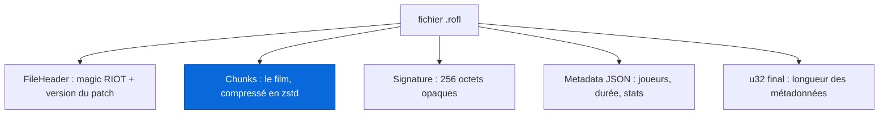
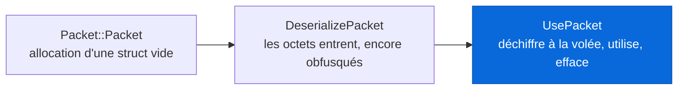
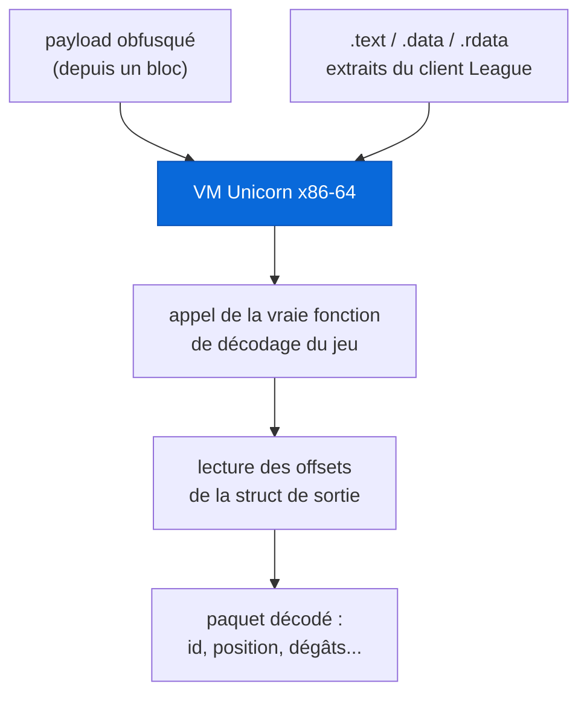
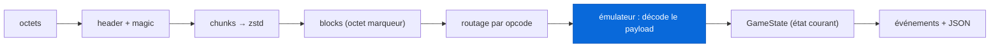

Tu finis une partie de League of Legends. L'écran de fin t'affiche un KDA, de l'or, quelques graphes. Trois chiffres et deux courbes. Mais pendant ces trente minutes, le jeu a enregistré infiniment plus que ça : la position de chaque champion à chaque instant, chaque sort lancé avec son temps d'animation, chaque point de dégât, chaque ward posée, chaque camp de jungle qui meurt. Milliseconde par milliseconde. Et tout ça, il l'a écrit dans un petit fichier `.rofl` posé sur ton disque dur, sans te demander ton avis.

Ce fichier, c'est une boîte noire. Riot n'en publie aucune documentation, obfusque volontairement son contenu, et change la serrure à peu près à chaque patch, donc tous les quinze jours. Ouvrir cette boîte, c'est un petit monde de rétro-ingénierie tenace, peuplé de quelques personnes qui ont fait un travail extraordinaire, souvent seules, souvent gratuitement, avant de publier ce qu'elles avaient trouvé pour que les suivants n'aient pas à tout recommencer.

Ce post raconte cette histoire, et il raconte **ROFL-X**, mon projet. ROFL-X n'invente pas grand-chose de neuf sur le crochetage lui-même. Sa contribution, c'est autre chose : prendre tout ce savoir dispersé, le lire ligne à ligne, le vérifier octet par octet, et l'**écrire proprement**, avec une règle d'honnêteté stricte. Un parser qui rate des paquets en silence après un patch est pire que pas de parser du tout. Alors on documente aussi, et surtout, ce qu'on ne sait **pas** encore.

C'est long. C'est volontaire. Et ça commence par rendre à César ce qui est à César, parce que sans deux personnes en particulier, il n'y aurait même pas de ligne de départ. Prends un café.

## I. Un fichier .rofl, ou la boîte noire que ton propre PC fabrique

Reprenons depuis le début. Un `.rofl`, c'est l'enregistrement binaire d'**une** partie, écrit par le client quand le match se termine, et rejouable dans le client. C'est un format interne à Riot : pas de spec publique, pas d'ABI stable d'un patch à l'autre, et une obfuscation délibérée des données de chaque paquet.

Pourquoi vouloir l'ouvrir ? Parce qu'il y a un gouffre entre ce que les API officielles te donnent (des stats agrégées : total de kills, or gagné, wards posées) et ce que le fichier contient vraiment (le film complet, image par image). Henry Zhu, dont on va beaucoup parler, résume la motivation mieux que moi : dans d'autres jeux, l'accès à des données haute fidélité a permis des percées en reinforcement learning, OpenAI Five sur Dota, AlphaStar sur StarCraft. En League, ces données existent, elles sont juste enfermées dans un format que personne n'a le droit de lire. Le titre de son article de 2025 dit tout de l'état d'esprit : "League of Legends data scraping the hard and tedious way for fun". La manière dure et pénible, pour le plaisir.

Structurellement, un `.rofl` est une poignée de choses emboîtées les unes dans les autres. Un en-tête, une zone de "chunks" compressés qui contiennent le vrai film, une signature, et un bloc de métadonnées en JSON. On va tout décortiquer, mais garde d'abord cette carte en tête :



Il y a en réalité **deux mondes** dans ce fichier, et les garder séparés dans le code est la décision d'architecture la plus importante du projet. Le premier monde est le **transport** : les en-têtes, les longueurs, la compression, le JSON. Tout ça est entièrement spécifié par sa mise en page, il n'y a rien à rétro-concevoir, juste à lire au bon endroit. Le second monde est le **sens** : ce que chaque paquet, à l'intérieur des chunks, veut dire. Et c'est là que vit toute la difficulté, là où tous les parsers, sans exception, ont fini par sortir un émulateur. On commence par le facile.

## II. Ouvrir le colis, ou lire un format en partant de la fin

La première surprise du format ROFL, c'est qu'on le lit **à l'envers**. L'en-tête ne contient aucun pointeur vers les métadonnées, et les métadonnées ne pointent pas vers la signature. La seule façon déterministe de trouver quoi que ce soit, c'est de partir de la fin du fichier.

Concrètement : les 4 derniers octets sont un `u32` qui te donne la longueur du bloc de métadonnées. Tu remontes de cette longueur pour lire le JSON. Tu remontes encore de 256 octets pour trouver la signature. Et seulement là, tu reviens au début lire l'en-tête et parcourir les chunks entre les deux. C'est contre-intuitif, mais c'est le seul chemin fiable.

L'en-tête, lui, est sobre. Il commence par quatre octets, `52 49 4F 54`, soit `"RIOT"` en ASCII. Tout parser qui se respecte rejette un fichier qui ne commence pas par ce magic. Suivent une version de format, quelques octets dont on ne connaît pas encore la fonction (un `u16` qui vaut 217 dans notre échantillon, six octets à haute entropie qui ressemblent à un identifiant de partie ou un timestamp, personne n'a tranché), puis une longueur et la **chaîne de version** : `"16.8.766.8562"` pour le replay que j'ai audité en détail. Les deux premiers nombres, `16.8`, c'est le patch public, et c'est cette clé-là qui décidera quelle configuration d'émulateur charger plus tard. Note ce détail, il revient.

Vient ensuite la zone des chunks, le cœur du fichier. C'est une suite d'enregistrements, chacun avec un en-tête de **17 octets exactement** :

```
chunk_id          u32   compteur par flux
chunk_type        u8    index de créneau temporel
chunk_id_2        u32   tag de flux, rangé en (tag << 24)
uncompressed_len  u32
compressed_len    u32
```

Puis le corps : `compressed_len` octets d'une trame **zstd** (l'algorithme de compression de Facebook, reconnaissable à son magic `28 B5 2F FD`), qui se décompresse en exactement `uncompressed_len` octets. Sur mon échantillon, un chunk de 5852 octets compressés se déplie en 18 173 octets, pile. Ces enregistrements se répartissent en quatre flux logiques, distingués par le tag `chunk_id_2` : les **game chunks** (le tag `0x01`, des deltas, les mises à jour incrémentales de l'état), les **keyframes** (`0x02`, des instantanés complets périodiques), et deux singletons de démarrage. Les deux flux principaux sont entrelacés dans le fichier par ordre de créneau temporel, et le parser les re-sépare après coup.

À l'intérieur d'un chunk décompressé, on trouve un flux serré de **blocs** de longueur variable. Chaque bloc commence par un octet **marqueur** dont quatre bits décident comment lire la suite : est-ce que le timestamp est un delta d'un octet ou un `f32` absolu, est-ce que l'identifiant de paquet est réutilisé du bloc précédent ou frais, est-ce que le paramètre est un delta ou complet, est-ce que la longueur tient sur un octet ou quatre :

```
bit 0x80  timestamp = delta u8 (× 0.001 s)   sinon f32 absolu
bit 0x40  packet_id réutilisé du bloc d'avant  sinon u16 frais
bit 0x20  param = delta u8                      sinon u32 frais
bit 0x10  length = u8                           sinon u32
```

C'est une compression delta artisanale, élégante, et c'est du pur Mowokuma (on y arrive). Un bloc minimal fait 4 octets, un en-tête maximal 15. Et pour te donner l'échelle : j'ai déroulé mon replay en entier, **1,9 million de blocs**, avec zéro erreur de parsing. Quand un format se laisse dérouler proprement sur presque deux millions de blocs, c'est que quelqu'un a fait un travail sérieux avant toi.

Un mot sur la méthode, parce qu'elle est au centre de ROFL-X. Chaque affirmation ci-dessus porte, dans ma doc, une **étiquette d'évidence** : `VERIFIED` (observé à un offset précis, reproductible), `UPSTREAM` (présent dans le code d'un prédécesseur et cohérent avec mes octets), `ZHU` (cité de Henry Zhu, non reproduit par moi), `INFERRED` (cohérent avec un seul échantillon), `UNKNOWN` (le champ est là, son sens m'échappe). Ce `u16` qui vaut 217 dans l'en-tête ? `UNKNOWN`, assumé. Je préfère écrire "je ne sais pas ce que fait cet octet" que de raconter une histoire jolie et fausse.

## III. Le mur, ou pourquoi on ne peut pas juste "décoder" les paquets

Jusqu'ici, tout était lisible. On a un flux de blocs, et chaque bloc porte un `packet_id`, un timestamp, et une charge utile, le **payload**. Il ne reste "plus qu'à" décoder ces payloads. Sauf que.

Sauf que cette couche est conçue, exprès, pour être hostile à quiconque essaie de la réimplémenter. Et c'est fait avec goût. Il n'y a **pas** de chiffrement à nom connu : ni AES, ni Blowfish, ni ChaCha. À la place, chaque classe de paquet a son propre décodeur dans le binaire du jeu, construit à partir de XOR par octet, de rotations, et de recherches dans une petite table d'environ 255 octets, le tout ponctué d'opérations arithmétiques (des motifs de bits comme `0x22110`, `0x88440`, des multiplications, des additions). Bref, une obfuscation maison, différente d'une classe de paquet à l'autre.

Et le pire, le vraiment vicieux, c'est le motif que Henry Zhu a nommé le **decrypt-access-release**. Le jeu ne garde jamais un champ en clair dans sa mémoire. Il le déchiffre uniquement au moment précis où il en a besoin, l'utilise, le re-chiffre aussitôt, et efface le clair avant que la fonction ne se termine. C'est de l'anti-rétro-ingénierie pur : ça sert à ruiner la vie de quelqu'un qui scannerait la mémoire avec Cheat Engine à la recherche d'une valeur stable. Comme le dit Zhu, en supprimant la valeur, on rend beaucoup plus dur de trouver les valeurs importantes, et donc les sections de code importantes.

Il a aussi cartographié le **cycle de vie en trois temps** que chaque paquet traverse dans le client, et c'est une grille de lecture précieuse :



Ajoute à ça que les tables de lookup, les constantes, et les offsets de champs **changent à chaque patch**. Un décodeur que tu réimplémenterais en dur à la main pour le patch 15.5 serait déjà cassé au 15.6. Réimplémenter statiquement les fonctions de décodage n'est pas une stratégie viable. Point. Deux personnes sont arrivées à cette conclusion indépendamment, et elles ont eu la même idée, magnifique de flemme assumée.

## IV. Le coup de génie, ou ne pas porter le décodeur mais appeler le jeu

Voici l'idée qui rend tout le reste possible, et elle appartient à **Mowokuma**.

Si le jeu sait déchiffrer ses propres paquets, et qu'il change de méthode à chaque patch, alors ne réimplémente pas le déchiffreur. **Appelle celui du jeu.** Prends le binaire `League of Legends.exe`, découpe ses sections `.text` (le code), `.data` et `.rdata` (les données), charge-les dans une machine virtuelle x86-64 avec [Unicorn](https://www.unicorn-engine.org/), pose ton payload obfusqué en mémoire, et **exécute la fonction de décodage du jeu elle-même** dessus. Le jeu déchiffre pour toi. Les tables changent tous les quinze jours ? Aucune importance : tu ne portes pas le décodeur, tu portes un **site d'appel**.



Dit comme ça, ça a l'air simple. Ça ne l'est pas. Pour que la fonction du jeu tourne isolée dans une VM, il faut lui mentir sur son environnement. Le décodeur appelle l'allocateur mémoire du client ? Mowokuma le remplace par son **propre shellcode x86-64 écrit à la main**, un allocateur "bump" de 91 octets qui ne fait que rendre un pointeur et avancer. Le décodeur appelle une fonction de sécurité qui refuserait de continuer ? Elle la stub avec un `mov rax, 1; ret`, "oui oui tout va bien, continue". Elle a rétro-conçu, pour un patch donné, les adresses exactes de ces fonctions (les RVA), les offsets des champs dans la struct de sortie, et l'identifiant de chaque paquet. Le tout tient dans une petite archive de config par patch : les trois sections binaires du jeu, plus un `result.json` avec toutes ces adresses.

Son parser fait environ 500 lignes de Rust. Il est archivé, discret, et brillant. Et elle a fait la chose élégante : quand il marchait, elle l'a épinglé, archivé proprement, et laissé disponible pour qu'on construise dessus. Tout `src/emulator/` de ROFL-X est un portage direct de son travail, avec des en-têtes de fichier qui pointent vers les siens. Son dépôt n'a pas de licence, ce qui en fait par défaut "tous droits réservés", et elle a confirmé début 2026 qu'elle était heureuse qu'on porte et étende son travail à la seule condition d'être créditée clairement. Ce post en fait partie. **Merci, Mowokuma.**

Henry Zhu a pris la même idée de base (laisser le jeu se décoder lui-même) et l'a poussée dans une direction différente. Plutôt qu'émuler la fonction entière dans Unicorn, il a construit un **émulateur d'exceptions** : il pose des points d'arrêt logiciels `INT3` à des endroits stratégiques du code, et quand le processeur les rencontre, un gestionnaire d'exception lit directement les valeurs **dans les registres du CPU** au moment exact où le jeu les calcule. Pour un paquet de dégâts, par exemple, il intercepte le registre `RSI` (l'identifiant réseau, avant la création de l'objet) et le registre `RAX` (la valeur de dégât en flottant, avant son application). Il ne rétro-conçoit jamais le déchiffrement obfusqué, il le regarde s'exécuter et lit le résultat au vol.

L'avantage ? La vitesse. L'émulation complète façon Unicorn, c'était environ cinq minutes par replay. Sa version en Rust avec hooks d'exception : environ **trois secondes** pour une partie de quinze minutes. Un facteur cent. Sur des millions de replays, ce n'est pas un détail, c'est la différence entre faisable et pas faisable.

## V. De l'octet au sens, ou peupler un monde à partir d'un flux

Une fois qu'on sait décoder les paquets, il faut reconstruire ce qu'ils **veulent dire**. C'est le deuxième monde du fichier, le monde sémantique, et c'est là que le modèle de domaine de ROFL-X vit.

Un `packet_id` tout seul ne veut rien dire. C'est une étiquette, `WARD_SPAWN`, `TAKE_DAMAGE`, `CAST_SPELL`, dans un catalogue. Sur mon échantillon, j'observe **249 opcodes distincts** répartis sur les 1,9 million de blocs. Et attention, piège classique : la **valeur numérique** d'un opcode n'est pas stable entre patchs, seul le nom sémantique l'est. Le numéro qui veut dire "un champion s'est déplacé" en 15.5 peut vouloir dire autre chose en 16.8. On indexe donc sur le sens, jamais sur le chiffre.

À partir de ces paquets décodés, on peuple un petit monde : des **entités** (champions, sbires, monstres de jungle, tours, wards, projectiles, pets comme le Tibbers d'Annie, plantes de jungle), des **joueurs** (les dix humains, chacun contrôlant un champion, avec son Riot ID, son PUUID, son équipe, son rôle, tirés du JSON de métadonnées), un **état de jeu** (un accumulateur qui, en rejouant les paquets dans l'ordre du temps, sait répondre à "où était Sett à t=17,5 s"), et enfin des **événements**, l'abstraction qui intéresse vraiment les gens en aval : un kill, une ward posée, un objectif pris, un objet acheté.

Le pipeline complet ressemble à ça, chaque étage étant une fonction pure de son entrée :



Un exemple concret, celui des **wards**, parce qu'il illustre une subtilité jolie du format. Quand une ward apparaît, un paquet de spawn arrive avec son nom (`YellowTrinket`), son id, l'id de son propriétaire, et ses coordonnées. Quatre-vingt-dix secondes plus tard, un autre paquet arrive, **avec le même opcode**, mais un nom différent : `YellowTrinketCorpse`, aux mêmes coordonnées. C'est la destruction de la ward. Un seul opcode peut donc porter plusieurs événements sémantiques différents, distingués par une simple chaîne de caractères. Le catalogue doit exprimer ça, pas l'écraser. En reliant le spawn et le corpse par coordonnées, on reconstruit un événement propre : ward posée à tel endroit, par tel joueur, pendant 90,2 secondes. Les positions des champions, elles, ne sont même pas stockées à chaque tick : on garde le dernier paquet de déplacement de chaque entité (une liste de points de passage plus une vitesse) et on **interpole** à la demande. Pas de position par tick, juste de quoi la recalculer.

## VI. L'honnêteté comme fonctionnalité, ou ce que ROFL-X ajoute vraiment

Arrivé ici, une question légitime : si Mowokuma a écrit le parser et si Zhu a documenté la rétro-ingénierie, qu'est-ce que ROFL-X apporte ?

Une chose, et j'y tiens : la **rigueur documentaire**, transformée en fonctionnalité testée. Le savoir sur le format ROFL était réel mais éparpillé, dans le code d'une personne, dans le blog d'une autre, dans quelques dépôts à moitié abandonnés. La phase 1 de ROFL-X a consisté à tout lire, tout résumer, et tout **recouper octet par octet** contre un vrai replay du patch 16.8. La spec de format que j'en ai tirée cite, pour chaque affirmation, sa source ou son offset. C'est fastidieux. C'est le but.

Le catalogue de paquets suit la même règle. Chaque opcode a un statut : `DOCUMENTED`, `PARTIAL`, `OBSERVED-ONLY`, ou `UNKNOWN`. Et le harnais de test traite l'apparition d'un opcode **absent du catalogue comme une erreur bloquante**. Autrement dit, le jour où un patch introduit un nouveau paquet, ROFL-X ne l'avale pas en silence : il s'arrête et crie "je vois l'opcode `0x0278` et je ne sais pas ce qu'il fait". Un parser qui rate des paquets sans le dire donne une fausse confiance, et une fausse confiance sur des données, c'est pire que rien. Ici, "on ne sait pas encore" est un citoyen de première classe, quelque chose que le projet est conçu pour **faire remonter**, pas pour cacher.

Et il reste beaucoup d'inconnu, que j'assume volontiers. Le plus gros blocage, aujourd'hui, c'est la **table qui associe un opcode à sa classe de décodeur**. On connaît la forme de la table des descripteurs de classe dans le binaire (une structure de 48 octets qui se répète, avec cinq pointeurs de fonction et une sentinelle magique), on connaît deux décodeurs (mouvement et ward), mais il n'y a aucun champ `netid` **dans** un descripteur. Le lien entre "opcode N" et "quel décodeur l'exécute" vit dans une autre structure qu'on n'a pas encore localisée. Tant qu'on ne l'a pas, ajouter chaque nouveau décodeur demande une session de désassembleur (Ghidra, IDA). J'ai écrit un outil, `trace-decoder`, qui automatise la moitié du travail : donne-lui l'adresse de début et de fin d'une fonction de décodage, il hooke toutes les écritures dans la struct de sortie pendant qu'elle tourne sur de vrais octets, et te sort la carte des offsets. Ça résout la partie "offsets de champs". Ça ne résout pas encore la partie "trouver la fonction".

Un mot sur ce que ROFL-X ne fera **pas**, parce que le périmètre compte. On ne publiera pas de dataset de replays décodés : celui de Henry Zhu existe déjà à une échelle qu'aucun fork ne rattrapera. On ne livrera aucun contournement d'anti-triche : le parser travaille strictement sur des fichiers que l'utilisateur a déjà sur son propre disque, et si une piste se met à ressembler à du déchiffrement de partie en direct, on s'arrête et on le signale. Et on ne réimplémentera pas statiquement les décodeurs : Mowokuma et Zhu ont conclu tous les deux, indépendamment, que l'émulation était la bonne réponse. On est d'accord.

## VII. Sur les épaules de qui c'est bâti

Je l'ai dit en filigrane tout du long, mais ça mérite une section à soi, parce que c'est le vrai sujet.

**Mowokuma** ([@Mowokuma](https://github.com/Mowokuma), dépôt [Mowokuma/ROFL](https://github.com/Mowokuma/ROFL)) a écrit le parser sur lequel ROFL-X est bâti. C'est elle qui a trouvé la disposition du conteneur, le framing des blocs par octet marqueur, l'idée d'appeler le décodeur du jeu dans Unicorn plutôt que de le porter, le shellcode allocateur de 91 octets, les handlers de wards et de déplacements, la reconstruction du cycle de vie des wards par correspondance de coordonnées. Son approche, son code, et sa volonté de les publier sont la raison pour laquelle ROFL-X a une ligne de départ.

**Henry Zhu** ([@maknee](https://github.com/maknee), article ["League of Legends data scraping the hard and tedious way for fun"](https://maknee.github.io/blog/2025/League-Data-Scraping/)) a écrit l'explication publique la plus détaillée qui existe de ce genre de rétro-ingénierie. C'est lui qui a nommé le pattern decrypt-access-release, cartographié le cycle de vie en trois temps, tracé neuf classes de paquets de bout en bout, et proposé la stratégie alternative des breakpoints qui lisent les registres. Et surtout, il a fait la chose extraordinaire : faire tourner son parser sur **plus de 1,4 million de replays** et publier le résultat décodé en deux [datasets Hugging Face](https://huggingface.co/datasets/maknee/league-of-legends-decoded-replay-packets) publics. C'est un cadeau à la communauté d'une échelle générationnelle. Si tu veux comprendre *pourquoi* c'est dur, lis son article. Le mien n'aurait pas de catalogue de paquets sans le sien.

Et il y a les autres, à qui on doit aussi un coup de chapeau : [@fraxiinus](https://github.com/fraxiinus) et son [roflxd](https://github.com/fraxiinus/roflxd), un parapluie de parsers ROFL dans plein de langages, utile pour vérifier que l'obfuscation de Riot dérive bien à chaque patch ; et [@robertabcd](https://github.com/robertabcd) et son `lol-ob`, un travail plus ancien en Ruby sur le déchiffrement Blowfish d'une époque révolue du format. Le format a changé depuis, mais la trace compte.

## Conclusion : la boîte est encore à moitié fermée, et c'est écrit

On est parti d'un petit fichier `.rofl` posé sur ton disque, une boîte noire que ton propre ordinateur fabrique à chaque partie sans te la donner vraiment. On l'a ouverte : un en-tête qui commence par `RIOT`, des chunks zstd qu'on lit en partant de la fin, un flux de blocs delta-encodés, et sous tout ça, une couche de paquets obfusqués, conçue pour résister, et qu'on ne bat qu'en laissant le jeu se décoder lui-même dans une machine virtuelle.

Et on a vu que ce n'est pas mon idée. C'est celle de Mowokuma, affinée par Henry Zhu, cross-vérifiée par quelques autres. Ma part à moi, c'est d'avoir tout lu, tout recoupé, et tout écrit avec une règle simple : l'honnêteté prime sur la complétude. ROFL-X sait faire moins de choses que je le voudrais. Le lien opcode-vers-décodeur reste introuvable, la plupart des classes de paquets sont encore `UNKNOWN`, et chaque patch de League est une menace pour l'édifice. Mais tout ça est écrit noir sur blanc, avec des étiquettes d'évidence, pour que le prochain qui passe sache exactement où en est le crochetage, et n'ait pas à redécouvrir ce qui est déjà connu.

C'est, au fond, ce que je trouve beau dans ce petit coin de rétro-ingénierie : personne ne le fait pour de l'argent, tout le monde publie ce qu'il trouve, et chaque projet est un étage posé sur le précédent. ROFL-X n'est qu'un étage de plus. Merci à ceux d'en dessous.

Le code, la doc complète (spec de format, guide de reverse, catalogue, feuille de route), et le walkthrough octet par octet sont ici :

<a class="repo-embed" href="https://github.com/Toastaspiring/ROFL-X" target="_blank" rel="noopener">
  <span class="repo-embed__top">
    <svg class="repo-embed__icon" viewBox="0 0 24 24" fill="currentColor" aria-hidden="true"><path d="M12 0C5.37 0 0 5.37 0 12c0 5.31 3.435 9.795 8.205 11.385.6.105.825-.255.825-.57 0-.285-.015-1.23-.015-2.235-3.015.555-3.795-.735-4.035-1.41-.135-.345-.72-1.41-1.23-1.695-.42-.225-1.02-.78-.015-.795.945-.015 1.62.87 1.845 1.23 1.08 1.815 2.805 1.305 3.495.99.105-.78.42-1.305.765-1.605-2.67-.3-5.46-1.335-5.46-5.925 0-1.305.465-2.385 1.23-3.225-.12-.3-.54-1.53.12-3.18 0 0 1.005-.315 3.3 1.23.96-.27 1.98-.405 3-.405s2.04.135 3 .405c2.295-1.56 3.3-1.23 3.3-1.23.66 1.65.24 2.88.12 3.18.765.84 1.23 1.905 1.23 3.225 0 4.605-2.805 5.625-5.475 5.925.435.375.81 1.095.81 2.22 0 1.605-.015 2.895-.015 3.3 0 .315.225.69.825.57A12.02 12.02 0 0 0 24 12c0-6.63-5.37-12-12-12z"/></svg>
    <span class="repo-embed__name">Toastaspiring / <strong>ROFL-X</strong></span>
    <span class="repo-embed__lang">Rust</span>
  </span>
  <span class="repo-embed__desc">Un parser documenté des replays .rofl de League of Legends. Sur les épaules de Mowokuma et de Henry Zhu, avec une règle : l'honnêteté prime sur la complétude.</span>
  <span class="repo-embed__cta">Voir le dépôt sur GitHub &rarr;</span>
</a>
